# High Level System Design (HLD)
# Temple Registry & Management Portal

**Version:** 1.0  
**Date:** June 2026  
**Classification:** Internal Architecture Document  
**Audience:** CTO, Architecture Review Board, Lead Engineers, System Integrators

---

## Table of Contents

1. [Functional Requirements](#1-functional-requirements)
2. [Non-Functional Requirements](#2-non-functional-requirements)
3. [System Architecture Diagram](#3-system-architecture-diagram)
4. [Major Components / Services](#4-major-components--services)
5. [User Flow / Business Flow](#5-user-flow--business-flow)
6. [Database Selection](#6-database-selection)
7. [External Integrations](#7-external-integrations)
8. [API Communication Strategy](#8-api-communication-strategy)
9. [Scalability Strategy](#9-scalability-strategy)
10. [Security Overview](#10-security-overview)
11. [Deployment Architecture](#11-deployment-architecture)
12. [Caching Strategy](#12-caching-strategy)
13. [Monitoring & Logging Overview](#13-monitoring--logging-overview)
14. [High-Level Data Flow](#14-high-level-data-flow)

---

## 1. Functional Requirements

### Overview

The Temple Registry & Management Portal (TRM) is a Government ERP system that digitizes the complete lifecycle of temple administration in the state of Karnataka. It replaces paper-based processes for temple registration, asset disclosure, trust governance, and regulatory compliance under the state's Hindu Religious Institutions and Charitable Endowments Department.

---

### 1.1 Authentication

**Purpose:** Secure, stateless identity verification for all portal users.

**Business Value:** Prevents unauthorized access to sensitive temple and government data. Enforces accountability through comprehensive auth event logging.

**Inputs:**
- Username and password
- Optional MFA code (TOTP or phone OTP)
- MFA recovery codes

**Outputs:**
- RS256-signed JWT access token (stored in `httpOnly` cookie)
- Refresh token (hashed, stored server-side; delivered as `httpOnly` cookie)
- Auth event audit trail

**Implementation:**
- Access token: RS256 JWT, 2-hour expiry, contains `userId`, `role`, `districtId`, `templeId`, `username`, `accessType` claims
- Refresh token: SHA-256 hashed token stored in `refresh_tokens` table; TTL managed server-side
- Password: BCrypt-hashed with 10 rounds
- MFA: TOTP (Google Authenticator-compatible) or SMS OTP
- Account lockout after repeated failed attempts (`failed_login_count`, `locked_until`)
- Password reset via time-limited token hash
- All auth events logged in `audit_auth_events`

**Interaction with other modules:** Every module depends on authentication. Token revocation propagates to all subsequent requests via `TokenRevocationGuard`.

---

### 1.2 User Management

**Purpose:** Lifecycle management of all portal users by SUPER_ADMIN.

**Business Value:** Centralized user provisioning ensures only authorized individuals can access the system. Temple Authorities are provisioned by the government, not self-registered.

**Inputs:**
- Full name, email, mobile, username, role, district, Aadhaar number
- Temple name (auto-created) or existing temple selection for TEMPLE_AUTHORITY role

**Outputs:**
- Created user with assigned role and linked temple/district
- Auto-generated temple skeleton (Grade C, placeholder data) for TEMPLE_AUTHORITY on creation

**Key Rules:**
- Public self-registration is disabled. Only `SUPER_ADMIN` creates users.
- When a TEMPLE_AUTHORITY user is created, a Temple record is automatically provisioned in the same transaction.
- Aadhaar number is stored for identity verification (12-digit numeric).
- Users can be enabled/disabled (`is_active`), soft-deleted.

**Interaction with other modules:** All modules consume `userId` and `role` for authorization. User-to-temple FK (`users.temple_id`) is the anchor for temple ownership.

---

### 1.3 Role & Permission Management

**Purpose:** Controls who can see and do what across the entire system.

**Business Value:** Enforces the principle of least privilege. Mandatory for a government application that handles sensitive financial and personal data.

**Roles Defined:**

| Role | Description | Scope |
|---|---|---|
| `SUPER_ADMIN` | Full system access, user management, all reports | System-wide |
| `DISTRICT_COLLECTOR` | Governance actions for their district: approve/reject trust, declarations, profiles | District-scoped |
| `DC_STAFF` | Read/write access to DC portal; cannot approve governance items | District-scoped |
| `TEMPLE_AUTHORITY` | Manages their assigned temple's data; submits for DC review | Temple-scoped |
| `AUDITOR` | Read-only access to all data; can raise observations | District-scoped |
| `VIEWER` | Read-only access to published temple data | System-wide |

**Dynamic Access Control (DACVM):**
- Beyond RBAC, a Dynamic Access Control via Visit Model (DACVM) layer allows `SUPER_ADMIN` to define fine-grained `ALLOW`/`DENY` policies on specific UI targets or API actions.
- Policies are evaluated: USER-level DENY > ROLE-level DENY > ROLE-level ALLOW.
- `SUPER_ADMIN` is exempt from all DENY policies.
- Policies cached in-process (Caffeine, 5 min TTL) for performance.

**Interaction with other modules:** All service methods are guarded by `@PreAuthorize` annotations using role constants. `OwnershipGuard` and `JurisdictionGuard` enforce temple-level and district-level scope checks.

---

### 1.4 Temple Management

**Purpose:** Master registry of all temples in the state.

**Business Value:** Single authoritative source of truth for temple identity, location, and classification. Enables government to track and manage thousands of temples systematically.

**Temple Master Data:**

| Attribute | Description |
|---|---|
| Registration Number | Unique state-assigned identifier (e.g., `KA-TMP-XXXXXX`) |
| Name / Alias | Official and alternate names |
| Grade | Temple classification (A, B, C) |
| Primary Deity | Main deity worshipped |
| Religious Tradition | Shaiva, Vaishnava, Shakta, Jain, Buddhist, etc. |
| Geo Location | State → City → District → Taluk → Hobli hierarchy; GPS coordinates; Google Maps Place ID |
| Contact Details | Contact person, designation, mobile, email |
| Status | ACTIVE, INACTIVE, ARCHIVED |
| Verification Status | UNVERIFIED, VERIFIED, FLAGGED |

**Temple Search Summary:** A denormalized `temple_search_summary` table maintains a pre-computed, FULLTEXT-indexed snapshot for fast search. Updated asynchronously via `TransactionSynchronizationManager.afterCommit()` to avoid race conditions.

**Interaction with other modules:** Temple is the root aggregate. Every module (Trust, Declaration, Employee, Contractor, Documents, Profile) references `temple_id`. The `temple_search_summary` feeds the public search page.

---

### 1.5 Temple Profile Management

**Purpose:** Manages the detailed public-facing profile of each temple through a formal edit-approve workflow.

**Business Value:** Ensures all published temple data is verified by the District Collector before public visibility. Prevents incorrect information from being presented to the public.

**Profile Fields Managed:**
- Contact details (phone, email, website, contact person)
- Banking details (account number AES-GCM encrypted, IFSC, bank name)
- Media (primary photo)
- Content (description, historical significance, annual festivals, landmark, linked institutions, languages of worship)
- Identity fields (alias name, primary deity, grade, tradition, address, coordinates, year established)

**Workflow States:**

```
DRAFT → SUBMITTED → UNDER_REVIEW → APPROVED
                               ↓
                      CLARIFICATION_REQUESTED → CLARIFICATION_RESPONDED → UNDER_REVIEW
                               ↓
                            REJECTED
```

**Tables Involved:**
- `temple_profile_staging` — Draft and pending records
- `temple_profile_current` — Single approved live profile per temple
- `temple_profile_history` — Append-only archive of superseded profiles

**Interaction with other modules:** Workflow Engine tracks state. Notification Service triggers alerts at each transition. DC Profile Controller exposes review endpoints.

---

### 1.6 Temple Authority Management

**Purpose:** Manages the operational lifecycle of Temple Authority users and their primary temple record.

**Business Value:** Enables government officials to onboard temples efficiently and track completion status.

**Key Capabilities:**
- Admin provisions TA user and temple together in a single transaction
- TA completes temple profile in stages (save draft → submit for review)
- TA can edit a previously approved profile, creating a new version in staging
- TA dashboard shows profile completion status, pending tasks, and activity history

---

### 1.7 District Commissioner Workflow

**Purpose:** Provides the District Collector and DC Staff with a unified review console for all pending governance items in their district.

**Business Value:** Replaces paper files and physical visits with a digital, time-stamped, auditable review process.

**DC Capabilities:**

| Action | Applicable Entities |
|---|---|
| Review & Approve | Temple Profile, Asset Declaration, Trust Registration |
| Reject (Terminal) | Temple Profile, Asset Declaration, Trust |
| Send Back with Reason | Trust, Asset Declaration |
| Request Clarification | Asset Declaration |
| Order Physical Verification | Asset Declaration |
| Update Physical Verification Status | Asset Declaration |
| Flag Contractors / Board Members | Contractors, Board Members |
| Export District Reports | CSV/Excel export of temples, declarations |

**DC Dashboard KPIs:**
- Pending profiles for review
- Overdue declarations
- Active trusts, unverified board members
- District-wide compliance metrics

---

### 1.8 Dashboard

**Purpose:** Role-specific landing pages showing actionable KPIs and pending tasks.

**Business Value:** Reduces cognitive load by surfacing only relevant information per role.

**Dashboard Types:**

| Role | Key Widgets |
|---|---|
| SUPER_ADMIN | Total temples, total users, system-wide compliance stats, statewide metrics |
| DISTRICT_COLLECTOR | Pending reviews, overdue declarations, active trusts, flagged items |
| TEMPLE_AUTHORITY | Profile completion %, pending submissions, approval history, activity feed |
| AUDITOR | Observations raised/resolved, compliance gaps |
| VIEWER | Read-only published temple statistics |

---

### 1.9 Asset Management (Asset Declarations)

**Purpose:** Digitizes the annual mandatory asset disclosure that each temple must file with the government.

**Business Value:** Ensures transparency and accountability over temple assets. Enables government to detect discrepancies and order physical verification.

**Asset Categories Tracked:**
- **Immovable:** Agricultural land (acres + value), buildings (sqft + value), leased properties, other land
- **Movable:** Gold (grams), silver (grams), idols count, vehicles count, financial assets, other movable
- **Financial:** Annual income, annual expenditure

**Workflow:**
```
TA Creates DRAFT → Submits → DC Reviews → UNDER_REVIEW
    ↓ DC can:
    Approve (generates acknowledgement number) → APPROVED
    Request Clarification → CLARIFICATION_REQUESTED → TA Responds → CLARIFICATION_RESPONDED → DC continues
    Send Back → TA edits → RESUBMITTED
    Reject → REJECTED (terminal)
    Order Physical Verification → Physical verification officer visits
```

**Acknowledgement Number:** Auto-generated sequential number per financial year (`acknowledgement_sequences` insert-only sequence table for idempotent generation).

**Versioning:** Each edit creates a snapshot in `asset_declaration_versions`. Full JSON snapshot stored alongside PDF path.

---

### 1.10 Festival Management

**Purpose:** Tracks annual festivals as a content field within the temple profile.

**Business Value:** Provides a searchable registry of festivals across temples for public information and government planning.

**Implementation:** `annual_festivals` (TEXT) field in both `temple_profile_staging` and `temples` tables. Managed via the Temple Profile workflow. No separate festival entity — festivals are modeled as structured text content within the profile.

---

### 1.11 Document Management

**Purpose:** Centralized storage and access logging for all documents associated with temples, trusts, employees, contractors, and declarations.

**Business Value:** Eliminates paper files. Provides traceable document trail for government auditors.

**Document Metadata:**
- `owner_type` (TEMPLE, TRUST, EMPLOYEE, CONTRACTOR, DECLARATION) + `owner_id`
- `original_filename`, `s3_key` (file storage path), `mime_type`, `file_size_bytes`
- `document_label` (free-text classification)

**Access Logging:** Every document download is logged in `document_access_logs` with `accessor_id`, `accessor_role`, `access_type`, and timestamp.

**File Storage:** Local filesystem in development (`app.storage.base-dir`). Architecture is S3-compatible — `AwsConfig` is a placeholder; swap `LocalFileStorageServiceImpl` with S3 implementation for production.

---

### 1.12 Approval Workflow

**Purpose:** Universal, entity-agnostic workflow engine that manages state transitions for all governable entities.

**Business Value:** Single consistent governance process across Temple Profile, Asset Declaration, Trust Registration, and Board Member verification. No duplication of workflow logic.

**Workflow Engine Design:**
- `workflow_instances` — One per governed entity instance; tracks current status, actor role, timestamps
- `workflow_transitions` — Append-only event log of every status change with actor, action, comment, timestamp, and idempotency key
- Optimistic locking via `@Version` on `workflow_instances.lock_version` prevents concurrent conflicting transitions

**Governed Entity Types:**
- `TEMPLE_PROFILE` — TempleProfileStaging record
- `DECLARATION` — AssetDeclaration record
- `TRUST` — Trust record (Trust + Board Members as unit)
- `BOARD_MEMBER` — Individual board member verification
- `EMPLOYEE`, `CONTRACTOR`, `DOCUMENT` — Notification routing only

**Status State Machine (13 states):**

| Status | Meaning |
|---|---|
| `DRAFT` | TA created, not submitted |
| `SUBMITTED` | TA submitted; DC notified |
| `UNDER_REVIEW` | DC actively reviewing |
| `CLARIFICATION_REQUESTED` | DC asked TA for clarification |
| `CLARIFICATION_RESPONDED` | TA responded; DC notified |
| `RESUBMITTED` | TA resubmitted after send-back or rejection |
| `APPROVED` | DC approved; data promoted to live |
| `RE_APPROVED` | DC re-approved after TA edit |
| `REJECTED` | Terminal rejection; TA must create new version |
| `UPDATED_AFTER_APPROVAL` | TA edited approved record; awaits re-review |
| `SEND_BACK` | DC sent back with reason (non-terminal) |
| `PENDING_PHYSICAL_VERIFICATION` | Physical inspection ordered |
| `PHYSICAL_VERIFICATION_COMPLETE` | Physical inspection done |

**Idempotency:** DC workflow actions (approve, reject) carry an `Idempotency-Key` header. The `idempotency_records` table prevents duplicate processing of the same action.

---

### 1.13 Notifications

**Purpose:** Multi-channel notification system that keeps all stakeholders informed of workflow events.

**Business Value:** Eliminates need for manual phone calls or emails. Provides audit trail of all communications.

**Channels:**
- **In-App:** Stored in `in_app_notifications`, surfaced in the notification inbox UI with read/unread state
- **Email:** Async dispatch via outbox pattern (`notification_outbox` → `email_delivery_logs`)

**Notification Architecture:**
- `notification_rules` table — Configurable rules mapping event type + action to recipient type, channel, and template key
- `notification_outbox` — Outbox pattern: event payload JSON written in same transaction as business action; background processor dispatches
- User preferences via `user_notification_preferences` (per module, per channel toggle)
- Priority levels: LOW, MEDIUM, HIGH, URGENT
- Category types: WORKFLOW, SUBMISSION, APPROVAL, REJECTION, SYSTEM

**Notice Board:** Separate from notifications. `notices` table supports DISTRICT-scoped and SYSTEM-wide notices with pinning, expiry, attachments, and read tracking (`notice_reads`).

---

### 1.14 Reports & Export

**Purpose:** Enables DC and SUPER_ADMIN to export structured data for offline analysis and government reporting.

**Business Value:** Supports annual compliance reporting requirements and enables integration with legacy government reporting systems.

**Export Capabilities:**
- Temple list (district-filtered, with compliance status)
- Asset declarations (by financial year, by status)
- Export jobs tracked in `export_job_records` with expiry
- Rate limiting on export endpoints
- All exports logged in `audit_export_events`

---

### 1.15 Audit Logs

**Purpose:** Immutable append-only audit trail of every significant action in the system.

**Business Value:** Mandatory for government applications. Provides accountability, supports investigation, and satisfies RTI (Right to Information) queries.

**Audit Tables:**

| Table | Content |
|---|---|
| `audit_auth_events` | Login attempts, logouts, MFA events, password resets |
| `audit_data_events` | CRUD operations on sensitive entities |
| `audit_export_events` | All data exports with filter summary and record count |
| `governance_action_history` | All DC governance actions (approve, reject, flag, verify) |
| `document_access_logs` | Every document download |
| `workflow_transitions` | Complete workflow history per entity |
| `temple_timeline_events` | Temple-centric event log spanning all modules |

---

### 1.16 Master Data Management

**Purpose:** Manages reference data used across the application.

**Business Value:** Centralized master data ensures consistency and eliminates duplication.

**Master Data Sets:**

| Data Type | Tables | Management |
|---|---|---|
| Geographic Hierarchy | `states`, `cities`, `districts`, `taluks`, `hoblis` | SUPER_ADMIN via GeoManagementPage |
| System Configuration | `system_config` (key-value, typed) | SUPER_ADMIN via SystemConfigPage |
| Notification Rules | `notification_rules` | SUPER_ADMIN via NotificationRulesPage |
| Access Control Policies | `access_control_policies` | SUPER_ADMIN via AccessControlPage |

---

## 2. Non-Functional Requirements

### 2.1 Performance Requirements

| Requirement | Target | Rationale |
|---|---|---|
| API response time (p95) | < 500ms for read operations | Government portals are used in low-bandwidth environments |
| Search response time | < 300ms for FULLTEXT temple search | Public search page must feel instant |
| Dashboard load time | < 2 seconds total (all RTK Query calls) | DC and TA users check dashboards daily |
| File upload | < 30 seconds for 10MB files | Temple photos and documents are uploaded over government broadband |
| Notification delivery | < 5 seconds for in-app; < 5 minutes for email | Near-real-time awareness of workflow events |

**Measures Implemented:**
- FULLTEXT index on `temple_search_summary.name` for fast search
- `temple_search_summary` denormalized table eliminates complex joins on search hot path
- HikariCP connection pool (min 2, max 8) tuned for stable TiDB Cloud connectivity
- `@Transactional(readOnly = true)` on all read service methods enables connection pool optimizations
- `@EntityGraph` and `JOIN FETCH` to prevent N+1 query patterns

---

### 2.2 Scalability Requirements

| Concern | Current State | Future Path |
|---|---|---|
| Concurrent users | 100-500 (district-level rollout) | Horizontal scaling behind load balancer |
| Temple records | ~50,000 statewide | Indexed queries; search summary refresh scales linearly |
| Declaration volume | ~50,000/year | Partitioned by financial year if needed |
| Notification volume | ~200,000/year | Outbox pattern decouples dispatch from transactions |

**Stateless design** enables horizontal scaling — JWT tokens contain all required claims; no server-side session state.

---

### 2.3 Availability

- **Target SLA:** 99.5% uptime during business hours (9 AM – 6 PM IST, Mon–Sat)
- **Planned maintenance:** Off-hours, announced via notice board
- **Health endpoint:** `GET /actuator/health` for load balancer health checks
- **Startup resilience:** Flyway migrations run idempotently on each startup (`validate-on-migrate: false`, `repair-on-migrate: true`)

---

### 2.4 Reliability

- **Optimistic locking:** `@Version` on all workflow instances and critical entities prevents lost updates in concurrent scenarios
- **Idempotency:** DC workflow actions protected by `idempotency_records` table — submitting the same `Idempotency-Key` twice returns the cached response rather than double-processing
- **Soft deletes:** `is_deleted` + `@SQLRestriction("is_deleted = false")` on every entity prevents accidental data loss; hard deletes require explicit DB intervention
- **Transaction atomicity:** User creation + temple auto-creation done in a single `@Transactional` method. Workflow state changes are transactional with their audit log entries

---

### 2.5 Security

Refer to Section 10 for full security architecture. Summary:
- **Authentication:** RS256 JWT with `httpOnly` cookie delivery
- **Authorization:** RBAC enforced at service layer with `@PreAuthorize`; ownership and jurisdiction checks at runtime
- **Data protection:** AES-GCM encryption of PAN, bank account number, and Aadhaar numbers at rest
- **Audit trail:** Every sensitive operation logged immutably

---

### 2.6 Maintainability

- **Migration-based schema management:** All DB changes via numbered Flyway migrations. No hand-applied SQL changes.
- **Single responsibility:** Controller → Service → Repository layer strict separation
- **MapStruct mappers:** Zero reflection mapping; compile-time verified DTO ↔ Entity conversions
- **Lombok:** Reduces boilerplate on entities and service implementations
- **Test coverage:** 535 backend unit tests (JUnit 5 + Mockito); 241+ frontend tests (Vitest + RTL)

---

### 2.7 Extensibility

- **Workflow Engine:** Adding a new governable entity type requires only adding an entry to `WorkflowEntityType` enum and seeding a `workflow_instance`. No new tables or services.
- **Notification Rules:** New event → notification mappings added via DB rows in `notification_rules` without code changes.
- **Cache layer:** `CacheConfig` is designed to swap `CaffeineCacheManager` for `RedisCacheManager` without any annotation changes.
- **File Storage:** `LocalFileStorageServiceImpl` is behind an interface; swap for S3 implementation without changing callers.

---

### 2.8 Auditability

Every user action in the system produces at minimum one audit record. Key audit anchors:

- Login/logout/MFA → `audit_auth_events`
- Data changes → `audit_data_events`
- Workflow transitions → `workflow_transitions` (append-only)
- Document access → `document_access_logs`
- Governance decisions → `governance_action_history`
- Temple lifecycle events → `temple_timeline_events`
- Data exports → `audit_export_events`

All audit tables are **insert-only** — no UPDATE or DELETE operations. This satisfies government audit requirements and RTI obligations.

---

### 2.9 Data Consistency

- **ACID transactions:** MySQL InnoDB engine ensures full ACID compliance
- **Referential integrity:** Foreign key constraints enforced on all major relationships
- **Optimistic concurrency:** `@Version` fields on entities prevent concurrent conflicting writes
- **Enum validation:** Status transitions validated by `GovernanceEditGuard` before persistence; invalid transitions throw `IllegalStateException`
- **Search summary consistency:** `TempleSearchSummaryService.scheduleRefresh()` uses `TransactionSynchronizationManager.afterCommit()` to ensure the summary is only refreshed after the parent transaction commits — eliminating stale-read race conditions

---

### 2.10 Disaster Recovery

| Component | Recovery Strategy |
|---|---|
| Database (TiDB Cloud) | Managed cloud DB with automatic backups, point-in-time recovery |
| File uploads | Local storage backed up nightly; migration path to S3 with 99.999% durability |
| Application state | Stateless backend; re-deployable from Docker image in minutes |
| Configuration | Environment variables and `dev-secrets.properties` externalized from codebase |

**RTO (Recovery Time Objective):** < 2 hours  
**RPO (Recovery Point Objective):** < 24 hours (daily backup); < 5 minutes with TiDB Cloud PITR

---

### 2.11 Backup Strategy

- **Database:** TiDB Cloud managed backups (daily full + transaction log for PITR)
- **File uploads:** Nightly rsync or S3 versioning (production)
- **Configuration:** Git-managed (secrets excluded via `.gitignore`)
- **Audit logs:** Separate backup schedule; never deleted

---

### 2.12 Compliance Considerations

| Requirement | Implementation |
|---|---|
| Personal Data Protection | Aadhaar encrypted at rest (AES-GCM); masked in API responses |
| Financial Data | Bank account and PAN numbers AES-GCM encrypted in DB |
| Government Data Integrity | Immutable audit trail; workflow history never deleted |
| Right to Information (RTI) | Audit logs retained; exportable by SUPER_ADMIN |
| Mandatory Annual Filing | Asset declaration overdue detection + notification system |

---

## 3. System Architecture Diagram

### 3.1 High-Level Component Architecture

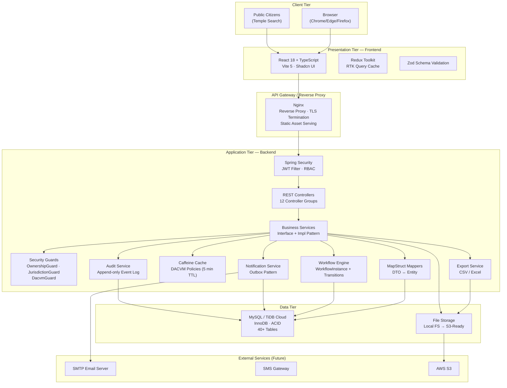

---

### 3.2 Layered Architecture

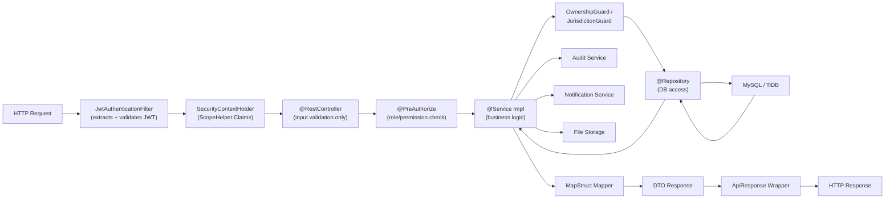

---

### 3.3 Draw.io Compatible XML

```xml
<mxGraphModel>
  <root>
    <mxCell id="0"/>
    <mxCell id="1" parent="0"/>
    <!-- Browser -->
    <mxCell id="2" value="Browser" style="rounded=1;whiteSpace=wrap;html=1;fillColor=#dae8fc;strokeColor=#6c8ebf;" vertex="1" parent="1">
      <mxGeometry x="300" y="20" width="120" height="40" as="geometry"/>
    </mxCell>
    <!-- React Frontend -->
    <mxCell id="3" value="React 18 + TypeScript&#xa;RTK Query | Shadcn UI" style="rounded=1;whiteSpace=wrap;html=1;fillColor=#d5e8d4;strokeColor=#82b366;" vertex="1" parent="1">
      <mxGeometry x="260" y="100" width="200" height="50" as="geometry"/>
    </mxCell>
    <!-- Nginx -->
    <mxCell id="4" value="Nginx Reverse Proxy&#xa;TLS Termination" style="rounded=1;whiteSpace=wrap;html=1;fillColor=#fff2cc;strokeColor=#d6b656;" vertex="1" parent="1">
      <mxGeometry x="260" y="190" width="200" height="50" as="geometry"/>
    </mxCell>
    <!-- Spring Boot -->
    <mxCell id="5" value="Spring Boot 3.4.4 (Java 21)&#xa;REST API — 60+ Endpoints" style="rounded=1;whiteSpace=wrap;html=1;fillColor=#f8cecc;strokeColor=#b85450;" vertex="1" parent="1">
      <mxGeometry x="240" y="280" width="240" height="50" as="geometry"/>
    </mxCell>
    <!-- Security -->
    <mxCell id="6" value="Spring Security&#xa;JWT (RS256) | RBAC | DACVM" style="rounded=1;whiteSpace=wrap;html=1;fillColor=#e1d5e7;strokeColor=#9673a6;" vertex="1" parent="1">
      <mxGeometry x="520" y="280" width="180" height="50" as="geometry"/>
    </mxCell>
    <!-- Business Services -->
    <mxCell id="7" value="Business Services&#xa;Temple | Trust | Declaration&#xa;Notification | Audit | Workflow" style="rounded=1;whiteSpace=wrap;html=1;fillColor=#f8cecc;strokeColor=#b85450;" vertex="1" parent="1">
      <mxGeometry x="240" y="370" width="240" height="60" as="geometry"/>
    </mxCell>
    <!-- Repository Layer -->
    <mxCell id="8" value="Spring Data JPA Repositories&#xa;40+ Repositories" style="rounded=1;whiteSpace=wrap;html=1;fillColor=#fff2cc;strokeColor=#d6b656;" vertex="1" parent="1">
      <mxGeometry x="240" y="470" width="240" height="50" as="geometry"/>
    </mxCell>
    <!-- MySQL -->
    <mxCell id="9" value="MySQL / TiDB Cloud&#xa;InnoDB | 40+ Tables | FULLTEXT" style="rounded=1;whiteSpace=wrap;html=1;fillColor=#dae8fc;strokeColor=#6c8ebf;" vertex="1" parent="1">
      <mxGeometry x="240" y="560" width="240" height="50" as="geometry"/>
    </mxCell>
    <!-- File Storage -->
    <mxCell id="10" value="File Storage&#xa;Local FS → S3-Ready" style="rounded=1;whiteSpace=wrap;html=1;fillColor=#d5e8d4;strokeColor=#82b366;" vertex="1" parent="1">
      <mxGeometry x="520" y="470" width="160" height="50" as="geometry"/>
    </mxCell>
    <!-- Edges -->
    <mxCell id="11" edge="1" source="2" target="3" parent="1"><mxGeometry relative="1" as="geometry"/></mxCell>
    <mxCell id="12" edge="1" source="3" target="4" parent="1"><mxGeometry relative="1" as="geometry"/></mxCell>
    <mxCell id="13" edge="1" source="4" target="5" parent="1"><mxGeometry relative="1" as="geometry"/></mxCell>
    <mxCell id="14" edge="1" source="5" target="6" parent="1"><mxGeometry relative="1" as="geometry"/></mxCell>
    <mxCell id="15" edge="1" source="5" target="7" parent="1"><mxGeometry relative="1" as="geometry"/></mxCell>
    <mxCell id="16" edge="1" source="7" target="8" parent="1"><mxGeometry relative="1" as="geometry"/></mxCell>
    <mxCell id="17" edge="1" source="8" target="9" parent="1"><mxGeometry relative="1" as="geometry"/></mxCell>
    <mxCell id="18" edge="1" source="7" target="10" parent="1"><mxGeometry relative="1" as="geometry"/></mxCell>
  </root>
</mxGraphModel>
```

---

## 4. Major Components / Services

### 4.1 Authentication Service (`AuthService` / `JwtService`)

**Responsibility:** Issues, validates, and revokes RS256 JWTs. Manages refresh token lifecycle.

**Dependencies:** `UserRepository`, `RefreshTokenRepository`, `PasswordEncoder`, `JwtService`

**Input:** Login credentials (username + password), optional MFA code, refresh token cookie

**Output:** Access token JWT (httpOnly cookie), refresh token (httpOnly cookie)

**Internal Processing:**
1. Validates username/password via `DaoAuthenticationProvider` + BCrypt
2. Checks account lock status (`locked_until`)
3. Validates MFA if enrolled
4. Generates RS256 JWT with claims: `userId`, `role`, `districtId`, `templeId`, `username`, `accessType`
5. Stores hashed refresh token in `refresh_tokens` table
6. Logs auth event in `audit_auth_events`
7. On token refresh: validates refresh token hash, issues new access token
8. On logout: revokes refresh token by setting `revoked_at`

**Communication:** All services communicate through `ScopeHelper.Claims` extracted from JWT by `JwtAuthenticationFilter`.

---

### 4.2 User Service (`AdminService`)

**Responsibility:** User lifecycle management (create, update, deactivate, search).

**Dependencies:** `UserRepository`, `TempleRepository`, `DistrictRepository`, `PasswordEncoder`, `TempleSearchSummaryService`

**Input:** `CreateUserRequest` (name, email, role, district, Aadhaar, temple info)

**Output:** `UserAdminResponse` (masked Aadhaar, full user details)

**Internal Processing:**
1. Validates unique email and username
2. For TEMPLE_AUTHORITY: creates Temple skeleton in same transaction (`@Transactional`)
3. Hashes temporary password
4. Schedules temple search summary refresh via `afterCommit()`

**Communication:** Used exclusively by `AdminController` under `ADMIN_ONLY` authorization.

---

### 4.3 Temple Service (`TempleService`)

**Responsibility:** Temple CRUD, photo management, profile staging submission, public search.

**Dependencies:** `TempleRepository`, `TempleSearchSummaryRepository`, `TemplePhotoRepository`, `FileStorageService`, `TempleProfileStagingService`

**Input:** Temple search filters (grade, district, keyword, tradition), temple create/update requests, photo multipart file

**Output:** `TempleResponse`, `TempleSearchResultResponse`, `PaginatedResponse<TempleSearchResultResponse>`

**Internal Processing:**
1. Search uses `temple_search_summary` FULLTEXT index for keyword search; additional filters applied via JPA Specification
2. Photo upload: validates MIME type and file size; stores in local FS; updates `temple_photos` table
3. Direct temple CRUD restricted to SUPER_ADMIN; TAs use staging workflow

**Communication:** Template for all other modules to resolve temple context.

---

### 4.4 Temple Profile Staging Service (`TempleProfileStagingService`)

**Responsibility:** Manages the edit-and-approve cycle for temple profile data.

**Dependencies:** `TempleProfileStagingRepository`, `WorkflowEngineAdaptor`, `TempleRepository`, `NotificationService`, `TempleSearchSummaryService`

**Input:** Draft profile data from TA, submit/approve/reject commands from DC

**Output:** `ProfileStagingResponse`, `WorkflowActionResponse`

**Internal Processing:**
1. TA saves draft → creates/updates `temple_profile_staging` row with status `DRAFT`
2. TA submits → validates completeness → sets status `SUBMITTED` → calls `WorkflowEngineAdaptor.adaptSubmit()` → promotes core fields to `temples` table → schedules search summary refresh
3. DC approves → promotes all staging fields to `temple_profile_current` → supersedes previous approved record into `temple_profile_history` → updates workflow instance to `APPROVED`
4. Bank account number encrypted via `AesEncryptionConverter` before persistence

**Communication:** Directly coupled to `GovernanceWorkflowService` for state machine; publishes notification events via `NotificationService`.

---

### 4.5 DC Temple Profile Service (`DcTempleProfileService`)

**Responsibility:** DC-side aggregated view of a temple (profile, trust, declarations, employees, contractors).

**Dependencies:** `TempleRepository`, `TempleProfileStagingRepository`, `TrustRepository`, `AssetDeclarationRepository`, `EmployeeRepository`, `ContractorRepository`, `TempleVisibilityPolicy`

**Input:** Temple ID + DC claims (districtId for scope enforcement)

**Output:** `TempleFullProfileResponse` (aggregated view of all temple data)

**Internal Processing:**
1. Validates DC is in same district as temple (`JurisdictionGuard`)
2. Loads temple + current profile + pending staging + active trust + latest declaration
3. Aggregates board members, contractors, employees

**Communication:** Feeds the `DcTempleProfilePage` frontend component.

---

### 4.6 Governance Workflow Service (`GovernanceWorkflowService`)

**Responsibility:** Canonical implementation of all DC governance actions for Trust and Declaration.

**Dependencies:** `WorkflowEngine`, `WorkflowInstanceRepository`, `TrustRepository`, `AssetDeclarationRepository`, `GovernanceAuditService`, `NotificationService`, `IdempotencyService`

**Input:** Entity ID + action payload (approve request, reject request, send-back reason)

**Output:** `WorkflowActionResponse` (new status, acknowledgement number if applicable)

**Internal Processing:**
1. Loads `WorkflowInstance` by entity type + ID
2. Validates `GovernanceEditGuard.assertCanTransition()` for legal transitions
3. Applies business rules (e.g., physical verification must not be FAILED before approval)
4. Persists entity status change
5. Creates `WorkflowTransition` record
6. Triggers `GovernanceAuditService.logWorkflowTransition()`
7. Dispatches notification event to outbox

**Idempotency:** Approval/reject actions accept optional `Idempotency-Key` header; response cached in `idempotency_records` for 24 hours.

---

### 4.7 Dashboard Services (`TaDashboardService`, `DcDashboardService`, `AdminDashboardService`)

**Responsibility:** Aggregates KPI metrics for each role's landing dashboard.

**TA Dashboard:** Profile completion %, pending workflow items, last submission date, approval/rejection history.

**DC Dashboard:** Pending reviews count, overdue declarations, active trusts, flagged contractors/board members, compliance rate per district.

**Admin Dashboard:** Statewide metrics — total temples by grade, total users by role, state-level compliance stats.

**Communication:** All dashboard services are `@Transactional(readOnly = true)` to enable connection pool read optimization.

---

### 4.8 Notification Service (`NotificationService`)

**Responsibility:** Publishes notification events to the outbox for async dispatch.

**Dependencies:** `InAppNotificationRepository`, `NotificationOutboxRepository`, `NotificationRuleService`, `UserNotificationPreferenceRepository`

**Input:** `NotificationEventPayload` (event type, entity type, entity ID, temple ID, actor info)

**Output:** `in_app_notifications` row (immediate for in-app); `notification_outbox` row (for email dispatch)

**Internal Processing:**
1. Looks up applicable `notification_rules` for event type + action
2. Resolves recipient users based on recipient type and scope
3. Checks user's `notification_preferences` to determine channels
4. Writes in-app notification directly to `in_app_notifications`
5. Writes email payload JSON to `notification_outbox` (processed by `@Scheduled` dispatcher)
6. Uses idempotency key (`idempotency_key`) on `in_app_notifications` to prevent duplicates

---

### 4.9 Audit Service (`AuditService`, `GovernanceAuditService`)

**Responsibility:** Provides programmatic API to write to all audit log tables.

**Dependencies:** `AuditDataEventRepository`, `AuditAuthEventRepository`, `GovernanceActionRepository`

**Input:** Actor ID, actor role, action, entity type, entity ID, detail text

**Output:** Appended rows in audit tables

**Internal Processing:** All writes are `@Transactional(propagation = REQUIRES_NEW)` — audit records are committed even if the parent transaction rolls back.

**Communication:** Called by services at key business moments (not via aspect — explicit calls ensure audit entries are meaningful and contextual).

---

### 4.10 Reporting / Export Service (`ExportService`)

**Responsibility:** Generates downloadable reports for DC and SUPER_ADMIN.

**Dependencies:** `TempleRepository`, `AssetDeclarationRepository`, `ExportJobRepository`, `AuditExportEventRepository`

**Input:** Export request with filters (district, status, financial year)

**Output:** CSV/Excel file stream; `export_job_records` row for audit

**Rate Limiting:** Export endpoint checks `rate_request_log` to prevent abuse.

---

### 4.11 Access Control Service (`PolicyEvaluationService`)

**Responsibility:** Evaluates DACVM fine-grained access policies beyond RBAC.

**Dependencies:** `AccessControlPolicyRepository`, `CaffeineCacheManager`

**Input:** Subject (user ID or role), target key (UI element or API path)

**Output:** `ALLOW` or `DENY` decision

**Caching:** Policies cached under `dacvmPolicies` cache with 5-minute TTL. `@CacheEvict(allEntries=true)` called on every policy write to ensure immediate propagation.

---

### 4.12 Geo Service (`GeoService`)

**Responsibility:** Exposes the geographic hierarchy for use in forms and filters.

**Input:** Parent ID (state/city/district/taluk)

**Output:** Typed lists of child geo entities

**Access:** All geo endpoints are public (no authentication required). Used by registration forms, profile editors, and search filters.

---

## 5. User Flow / Business Flow

### 5.1 Super Admin Flow

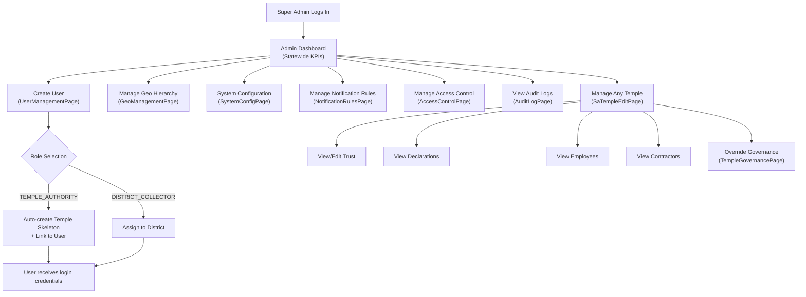

---

### 5.2 Temple Authority Flow

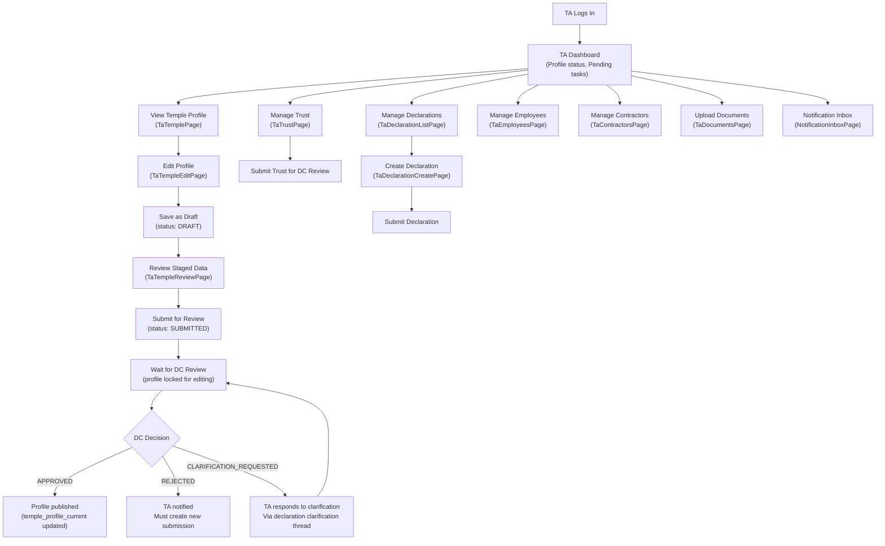

---

### 5.3 District Collector Flow

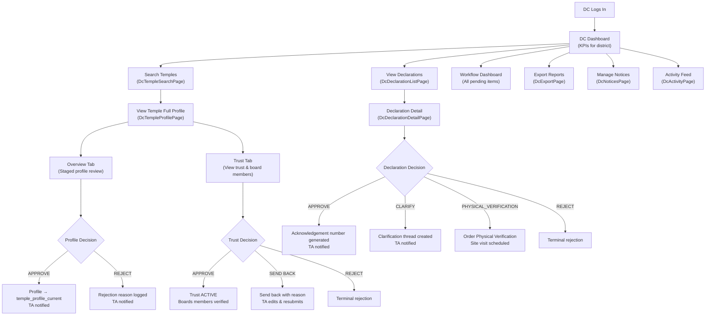

---

### 5.4 Auditor Flow

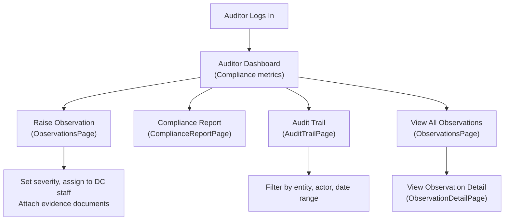

---

### 5.5 Asset Declaration Lifecycle (Detailed)

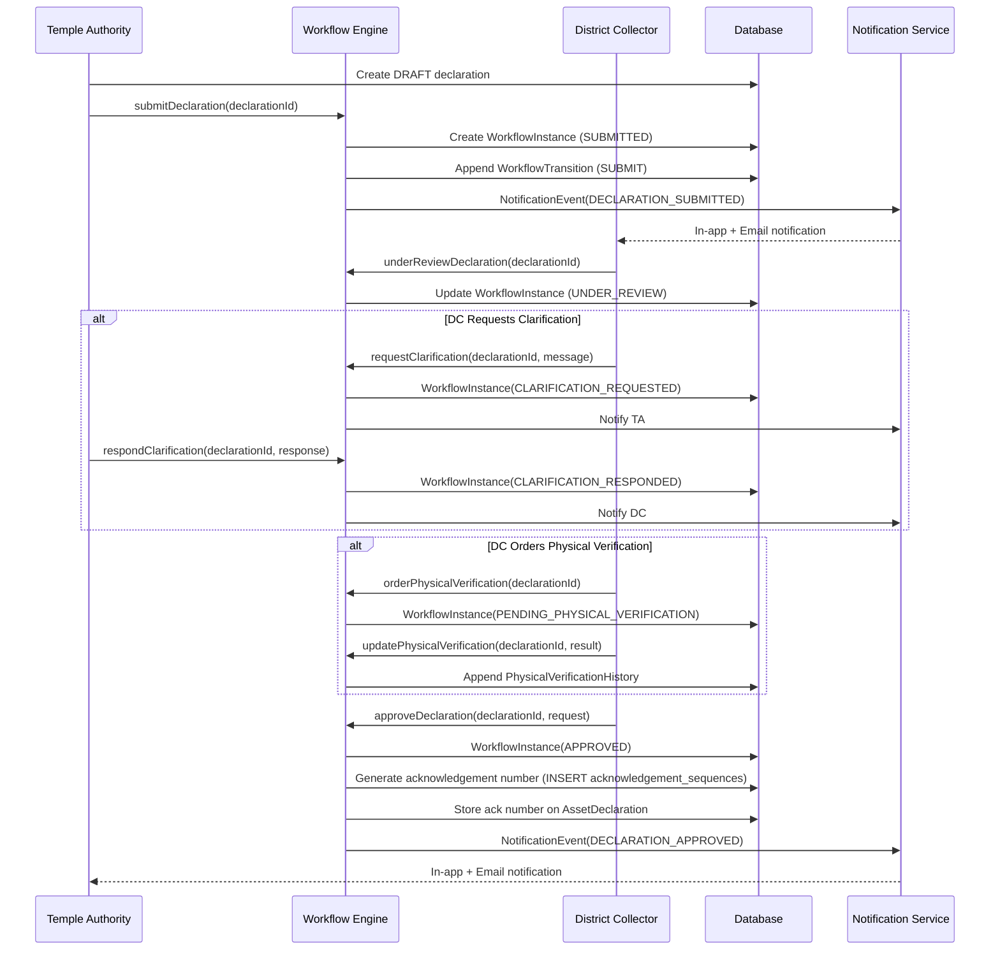

---

## 6. Database Selection

### 6.1 Why MySQL (Relational SQL)

MySQL with InnoDB storage engine was selected as the primary database for the Temple Registry & Management Portal based on the following technical and business rationale.

#### 6.1.1 ACID Compliance

Government data must be 100% consistent at all times. ACID (Atomicity, Consistency, Isolation, Durability) properties of MySQL InnoDB are essential:

| Property | Application in TRM |
|---|---|
| **Atomicity** | User creation + temple skeleton creation happen in a single transaction — either both succeed or neither persists |
| **Consistency** | Workflow state machine transitions are validated before commit; no partial state is observable |
| **Isolation** | Optimistic locking (`@Version`) prevents dirty reads/writes in concurrent DC approval scenarios |
| **Durability** | Committed records survive server restarts; critical for government audit trail |

#### 6.1.2 Referential Integrity

The TRM domain has deep relationships:
- Temple → Trust → Board Members → Documents
- Temple → Asset Declaration → Clarifications → Versions
- Temple → Employees → Documents
- User → District → Temple

Foreign key constraints enforce referential integrity at the database level, not just application level. This prevents orphaned records even if bugs exist in application code.

```sql
-- Example: Declaration cannot exist without a Temple
CONSTRAINT fk_ad_temple FOREIGN KEY (temple_id) REFERENCES temples (id)

-- Example: Workflow transition cannot exist without a workflow instance
CONSTRAINT fk_wt_workflow_instance FOREIGN KEY (workflow_instance_id)
    REFERENCES workflow_instances (id) ON DELETE CASCADE
```

#### 6.1.3 Complex Joins and Queries

The DC dashboard aggregates data from:
- `temple_search_summary` (pre-computed)
- `workflow_instances` (current state per entity)
- `asset_declarations` (overdue flags)
- `trusts` (active/inactive)
- `board_members` (verified status)

Relational JOINs make this natural and performant with proper indexing. A NoSQL document store would require multiple round trips or denormalization of the entire domain.

#### 6.1.4 Transaction Support for Workflow Engine

The workflow engine relies critically on:
1. Optimistic locking (`SELECT ... WHERE lock_version = ?`, then `UPDATE ... SET lock_version = lock_version + 1`) — native in MySQL
2. Single-row atomic idempotency: `INSERT IGNORE INTO idempotency_records` — idiomatic SQL
3. Acknowledgement sequence generation: `INSERT INTO acknowledgement_sequences(financial_year)` then `LAST_INSERT_ID()` — atomic and gap-free

#### 6.1.5 Full-Text Search

`FULLTEXT INDEX ft_tss_name (name)` on `temple_search_summary` provides fast, relevance-ranked search across 50,000+ temple names. This is a built-in MySQL feature with no additional infrastructure.

#### 6.1.6 Data Normalization and Integrity

The geo hierarchy (State → City → District → Taluk → Hobli) is properly normalized across 5 tables. This prevents denormalization anomalies: a district name change propagates automatically to all referencing records.

#### 6.1.7 Why Not NoSQL

| Concern | Why NoSQL is Not Suitable Here |
|---|---|
| **Complex relationships** | MongoDB document nesting makes Temple → Trust → BoardMember → Document relationships unnatural to query |
| **ACID transactions** | Cassandra and DynamoDB offer limited multi-row ACID; government records cannot tolerate eventual consistency |
| **Referential integrity** | NoSQL databases do not enforce FK constraints — orphaned records risk in complex multi-entity workflows |
| **Complex aggregation queries** | DC dashboard with JOINs across 5+ tables is trivial in SQL; requires MapReduce or aggregation pipelines in MongoDB |
| **Schema migrations** | NoSQL's schemaless nature makes controlled government data migrations harder to audit and verify |
| **Compliance** | Government data must have a verifiable, consistent schema; SQL migrations (Flyway) provide exactly that |

#### 6.1.8 TiDB Cloud (Production Hosting)

The production DB is hosted on **TiDB Cloud** (a MySQL-compatible distributed SQL database):
- Compatible with all MySQL JDBC drivers and Spring Data JPA
- Managed backups, auto-scaling read replicas
- TLS enforced (`useSSL=true`)
- Connection pool tuned with `SET tidb_enable_noop_functions=1` for TiDB compatibility

---

## 7. External Integrations

### 7.1 Email Service (SMTP)

| Attribute | Details |
|---|---|
| **Current Status** | Implemented (disabled in dev, enabled via `spring.mail.enabled: true` in production) |
| **Purpose** | Workflow event notifications, password reset emails |
| **Communication** | SMTP over TLS (port 587, STARTTLS) via JavaMailSender |
| **Architecture** | Outbox pattern: email payloads written to `notification_outbox`; `@Scheduled` processor dispatches and logs to `email_delivery_logs` |
| **Template Engine** | Thymeleaf HTML email templates in `src/main/resources/templates/` |
| **Future** | Move to SendGrid or AWS SES for production deliverability and bounce management |

---

### 7.2 SMS Gateway

| Attribute | Details |
|---|---|
| **Current Status** | Architecture ready (MFA phone field, notification channel enum includes SMS) |
| **Purpose** | MFA OTP delivery, critical workflow alerts for TAs without email access |
| **Communication** | REST API to SMS gateway provider (Twilio / MSG91 recommended) |
| **Future** | Implement `SmsNotificationDispatcher` implementing `NotificationDispatcher` interface; register as bean |

---

### 7.3 Aadhaar Verification

| Attribute | Details |
|---|---|
| **Current Status** | Storage ready (`aadhaar_number` in users, `aadhaar_encrypted` + `aadhaar_hash` + `aadhaar_last4` in board_members) |
| **Purpose** | Verify identity of Temple Authorities and Trust Board Members |
| **Communication** | UIDAI Aadhaar Authentication API (Government of India) via REST |
| **Security** | Aadhaar number stored AES-GCM encrypted; HMAC-SHA256 hash for duplicate detection; only last 4 digits displayed |
| **Future** | Integrate UIDAI Auth API; display verified badge (`aadhaar_verified` flag on User entity) |

---

### 7.4 File Storage (Local → S3)

| Attribute | Details |
|---|---|
| **Current Status** | `LocalFileStorageServiceImpl` active; `AwsConfig` placeholder ready |
| **Purpose** | Store temple photos, documents, export files, declaration snapshots |
| **Communication** | Local filesystem; AWS S3 SDK for production via interface swap |
| **Migration Path** | Replace `LocalFileStorageServiceImpl` bean with `S3FileStorageServiceImpl`; no service layer changes |
| **Document Keys** | `documents.s3_key` stores the path/key; independent of storage backend |

---

### 7.5 Google Maps / GIS

| Attribute | Details |
|---|---|
| **Current Status** | `place_id` and `formatted_address` columns in `temples` and `temple_profile_staging`; GPS lat/lng stored |
| **Purpose** | Geolocation of temples; visual map display on temple profile page |
| **Communication** | Google Maps Embed API (frontend) for display; Places API for address autocomplete |
| **Future** | GIS layer for district-wise temple density heat maps; route planning for physical verification |

---

### 7.6 Payment Gateway

| Attribute | Details |
|---|---|
| **Current Status** | Not implemented |
| **Purpose** | Future: Online fee payment for temple registration, certificate issuance |
| **Communication** | REST API (Razorpay / PayGov recommended for government applications) |
| **Future** | Add `payment_transactions` table; integrate PayGov (NIC Government Payment Gateway) |

---

### 7.7 Digital Signature (DSC/eSign)

| Attribute | Details |
|---|---|
| **Current Status** | Not implemented; acknowledgement PDF generation as groundwork |
| **Purpose** | Digitally sign approved declarations and certificates |
| **Communication** | NIC eSign API or USB DSC integration |
| **Future** | `acknowledgement_doc_file_path` on AssetDeclaration stores signed PDF path |

---

### 7.8 OCR Service

| Attribute | Details |
|---|---|
| **Current Status** | Not implemented |
| **Purpose** | Extract data from uploaded documents (registration certificates, financial statements) |
| **Communication** | Google Vision API or Tesseract (on-premise) |
| **Future** | Pre-fill declaration forms from uploaded financial statement PDFs |

---

### 7.9 Government Data Bus / APIs

| Attribute | Details |
|---|---|
| **Current Status** | Not implemented |
| **Purpose** | Integration with State Government data hub, land records, registrar of societies |
| **Communication** | REST or SOAP via API gateway per Government Interoperability Framework |
| **Future** | Cross-validate trust registration number with Registrar of Societies API; land record verification |

---

## 8. API Communication Strategy

### 8.1 REST Architecture

The TRM backend exposes a RESTful API over HTTPS. All endpoints follow resource-based URL conventions.

**Base Path:** `/api/v1/`

**HTTP Method Semantics:**

| Method | Usage | Example |
|---|---|---|
| `GET` | Read, search, list | `GET /api/v1/temples?district=5&grade=A` |
| `POST` | Create resource or trigger action | `POST /api/v1/admin/users` |
| `PUT` | Full update of resource | `PUT /api/v1/temples/{id}` |
| `PATCH` | Partial update | `PATCH /api/v1/governance/declarations/{id}/under-review` |
| `DELETE` | Soft-delete resource | `DELETE /api/v1/temples/{id}/photos/{photoId}` |

---

### 8.2 Request Lifecycle

```
Browser → JWT Cookie Extraction → JwtAuthenticationFilter
       → SecurityContextHolder.Claims set
       → Spring MVC DispatcherServlet
       → @RestController method
       → @Valid bean validation (JSR-380)
       → @PreAuthorize (role check)
       → Service method
       → OwnershipGuard / JurisdictionGuard (scope check)
       → Repository (JPA query)
       → MapStruct mapping (Entity → DTO)
       → ApiResponse<T> wrapper
       → ResponseEntity<ApiResponse<T>>
```

---

### 8.3 Response Structure

**Success:**
```json
{
  "success": true,
  "message": "Temple retrieved.",
  "data": {
    "id": 1,
    "name": "Sri Venkateswara Temple",
    "grade": "A"
  }
}
```

**Paginated List:**
```json
{
  "success": true,
  "message": "Temples retrieved.",
  "data": {
    "content": [...],
    "page": 0,
    "size": 10,
    "totalElements": 250,
    "totalPages": 25,
    "first": true,
    "last": false
  }
}
```

**Error:**
```json
{
  "success": false,
  "message": "Temple not found.",
  "errorCode": "TEMPLE_NOT_FOUND",
  "errors": []
}
```

---

### 8.4 DTO Mapping

MapStruct is used for all Entity ↔ DTO conversions:
- **Zero reflection** — all mapping code generated at compile time
- **Compile-time safety** — unmapped fields cause build warnings/errors
- **Custom converters** — `AesEncryptionConverter` for encrypted fields; masking for Aadhaar/bank account display
- **No entity exposure** — entities are never serialized to JSON responses

---

### 8.5 Validation Flow

1. **Frontend:** Zod schema validation before API call (prevents invalid requests)
2. **Controller:** `@Valid` on request body triggers Jakarta Bean Validation (JSR-380)
3. **Service:** Business rule validation (e.g., temple status must be ACTIVE to submit)
4. **Guard:** Scope validation (e.g., DC can only act on temples in their district)
5. **Database:** Column constraints, FK constraints, unique keys as last line of defense

Validation errors from Jakarta BV are caught by `@RestControllerAdvice` and returned as structured `errors[]` array.

---

### 8.6 Error Handling

A single `@RestControllerAdvice` class handles all exceptions:

| Exception | HTTP Status | Error Code |
|---|---|---|
| `EntityNotFoundException` | 404 | `{ENTITY}_NOT_FOUND` |
| `AccessDeniedException` | 403 | `ACCESS_DENIED` |
| `MethodArgumentNotValidException` | 400 | `VALIDATION_ERROR` |
| `OptimisticLockException` | 409 | `CONCURRENT_MODIFICATION` |
| `IllegalStateException` (workflow) | 409 | `WORKFLOW_STATE_CONFLICT` |
| `RuntimeException` (unexpected) | 500 | `INTERNAL_SERVER_ERROR` |

No try-catch blocks in controllers. No business logic in exception handlers.

---

### 8.7 Authentication in API

- JWT delivered via `httpOnly`, `SameSite=Lax` cookie named `access_token`
- Fallback: `Authorization: Bearer <token>` header for non-browser clients
- Access token expiry: 2 hours
- Refresh via `POST /api/v1/auth/refresh` (uses httpOnly refresh token cookie)
- Frontend `baseQueryWithReauth` middleware intercepts 401 → auto-refresh → retry original request

---

### 8.8 Why REST Instead of GraphQL

| Concern | REST (Chosen) | GraphQL |
|---|---|---|
| **Simplicity** | Simple, well-understood by government contractors | Learning curve; requires GraphQL expertise |
| **Tooling** | Swagger/OpenAPI auto-generated from annotations | Requires separate schema definition |
| **Caching** | HTTP-level caching by path works | Query-dependent; harder to cache |
| **Authorization** | `@PreAuthorize` per endpoint is clear | Field-level authorization is complex in GraphQL |
| **Auditing** | Each endpoint maps to one audit event | Queries can cross multiple domains |
| **Government standards** | REST is mandated in most Government Interoperability Frameworks | GraphQL not yet accepted in GOI standards |

### 8.9 Why REST Instead of gRPC

| Concern | REST (Chosen) | gRPC |
|---|---|---|
| **Browser support** | Native fetch/XHR | Requires gRPC-Web proxy |
| **Debugging** | Human-readable JSON, Postman/curl compatible | Binary Protobuf; harder to debug |
| **Frontend integration** | RTK Query works natively | Requires code generation toolchain |
| **Government contractor familiarity** | Universal | Niche expertise |

---

### 8.10 API Versioning Strategy

- Current version: `/api/v1/`
- Breaking changes require `/api/v2/` (no modification of v1 contracts)
- Non-breaking additions (new fields, new endpoints) are backward-compatible within v1
- API documentation auto-generated via SpringDoc OpenAPI 3.0 at `/v3/api-docs` and served at `/swagger-ui.html`
- All endpoints documented with `@Operation(summary = "...")` and `@Tag(name = "...")`

---

## 9. Scalability Strategy

### 9.1 Current Architecture (Monolith)

The TRM is architected as a **well-structured Spring Boot monolith** with clear module boundaries. This is the right choice for the current scale (district-level rollout, ~500 concurrent users) and ensures:

- Simple deployment and operations
- Consistent transactions across all business operations
- No network overhead between modules
- Easier debugging and testing

**Current Deployment Unit:**

```
[Nginx] → [Single Spring Boot JAR : 8080] → [TiDB Cloud MySQL]
                                          ↗ [Local File Storage]
```

---

### 9.2 Stateless Backend (Horizontal Scaling Ready)

The backend is **fully stateless**:
- No `HttpSession` — `SessionCreationPolicy.STATELESS` enforced in Spring Security
- No in-memory state between requests
- JWT contains all required claims (userId, role, districtId, templeId)
- Caffeine cache is process-local but swap-compatible with distributed Redis

**Horizontal scaling steps:**
1. Deploy 2+ instances of the Spring Boot JAR
2. Place Nginx (or AWS ALB) as load balancer in front
3. Sessions automatically distributed since there are none
4. Replace Caffeine cache with Redis for distributed caching

---

### 9.3 Database Scaling Strategy

| Technique | Current | Future |
|---|---|---|
| **Connection Pooling** | HikariCP (min 2, max 8) | Increase pool size; add PgBouncer if needed |
| **Read Replicas** | TiDB Cloud (auto-managed) | Route `@Transactional(readOnly=true)` calls to read replica |
| **Indexing** | 30+ indexes on FK columns, status, grade | Monitor slow query log; add composite indexes as needed |
| **FULLTEXT Search** | In-DB FULLTEXT on `temple_search_summary.name` | Migrate to Elasticsearch if search volume grows to millions |
| **Partitioning** | Not needed currently | Partition `asset_declarations` by `financial_year` if table grows to 10M+ rows |
| **Caching** | In-process Caffeine (DACVM policies) | Redis for search results, dashboard KPIs, geo data |

---

### 9.4 Caching for Scalability

| Cache | Data | TTL | Benefit |
|---|---|---|---|
| DACVM Policies | Access control policy decisions | 5 min | Eliminates DB lookup on every API call |
| District List | Flat list of all districts | 30 min | Used on every form; rarely changes |
| Temple Search Summary | Pre-computed search rows | Refreshed on write | Eliminates complex JOIN on search |
| Dashboard KPIs (future) | Aggregated counts | 5 min | Dashboard refresh without heavy aggregation |

---

### 9.5 Future Microservices Migration

The current monolith has clear bounded contexts that map directly to microservices:

| Microservice | Current Module | Migration Trigger |
|---|---|---|
| `auth-service` | `service/auth` | Token volume > 10,000/hour |
| `temple-service` | `service/temple` | Temple count > 500,000 |
| `workflow-service` | `service/governance` | Workflow volume > 1M transitions/year |
| `notification-service` | `service/notification` | Email volume > 100,000/day |
| `export-service` | `service/export` | Export jobs blocking main thread |

The current outbox pattern for notifications is already a microservice-readiness step — the dispatch processor can be extracted without touching business code.

---

### 9.6 Load Balancer Configuration

For production horizontal scaling:

```
Internet
    ↓
AWS ALB (or Nginx)
    ├── Instance 1: Spring Boot :8080
    ├── Instance 2: Spring Boot :8080
    └── Instance 3: Spring Boot :8080
              ↓
        TiDB Cloud (managed, scales independently)
              ↓
     Shared File Storage (NFS or S3)
```

Health check: `GET /actuator/health` → must return `{"status":"UP"}` for instance to receive traffic.

---

## 10. Security Overview

### 10.1 Authentication Architecture

```
Client Request
    ↓
[JwtAuthenticationFilter] — extracts token from:
    1. Authorization: Bearer <token> header
    2. access_token httpOnly cookie (preferred)
    ↓
[ScopeHelper.parse(token)] — RSA public key verification (RS256)
    ↓
Extracts: userId, role, districtId, templeId, username, accessType
    ↓
SecurityContextHolder.setAuthentication(UsernamePasswordAuthenticationToken)
    ↓
Downstream services read ScopeHelper.Claims.fromContext()
```

**Token Security:**
- Signed with RSA 2048-bit private key (`jwt-private.pem`); verified with corresponding public key (`jwt-public.pem`)
- RS256 (asymmetric) chosen over HS256 (symmetric) — public key can be safely shared with read-only verifiers
- Access token expiry: 2 hours
- Refresh token: SHA-256 hashed before storage; revoked on logout; enforced TTL

---

### 10.2 Role-Based Access Control (RBAC)

Authorization is enforced at the **service layer** (not controller) using Spring Security `@PreAuthorize`:

```java
// Service method — only DC/SA can approve
@PreAuthorize(RoleConstants.CAN_ACT_DC)
public WorkflowActionResponse approveDeclaration(Long declarationId, ...) { ... }

// Service method — only TA/SA can submit
@PreAuthorize(RoleConstants.CAN_SUBMIT)
public void submitForReview(Long templeId) { ... }
```

**Deny by default:** All endpoints require authentication unless explicitly `permitAll()`. New endpoints are automatically protected.

---

### 10.3 Ownership and Jurisdiction Guards

Beyond RBAC, runtime scope checks prevent cross-tenant data access:

| Guard | Check | Throws |
|---|---|---|
| `OwnershipGuard.assertOwnsTemple()` | `claims.templeId() == temple.getId()` | 403 if TA accesses another temple |
| `JurisdictionGuard.assertDistrictScope()` | `claims.districtId() == temple.getDistrictId()` | 403 if DC accesses out-of-district temple |
| `DacvmGuard.assertPolicy()` | Policy evaluation service lookup | 403 if DENY policy found |

---

### 10.4 Password Security

- BCrypt with 10 rounds (`new BCryptPasswordEncoder(10)`)
- Passwords never stored in plaintext
- Password reset via time-limited token: `SHA-256(secureRandom(32))` stored as `password_reset_token_hash`; expires in 1 hour (`password_reset_expires_at`)
- Account lockout: `failed_login_count` incremented on each failed attempt; account locked via `locked_until` timestamp after configurable threshold

---

### 10.5 Data Encryption at Rest

Sensitive fields encrypted using **AES-256-GCM** before persistence:

| Field | Entity | Reason |
|---|---|---|
| `bank_account_number_encrypted` | TempleProfileStaging, TempleProfileCurrent, TempleProfileHistory | Financial account data |
| `trust_pan_number` | Trust | PAN card — tax identifier |
| `bank_account_number` | Trust | Financial account data |
| `aadhaar_encrypted` | BoardMember | National identity number |

`AesEncryptionConverter` implements `AttributeConverter<String, String>` — transparent encrypt on write, decrypt on read.

---

### 10.6 API Security

| Threat | Mitigation |
|---|---|
| **SQL Injection** | Spring Data JPA parameterized queries; no raw SQL in application code (only Flyway migrations) |
| **XSS** | React escapes all rendered values by default; no `dangerouslySetInnerHTML` usage |
| **CSRF** | Disabled (`csrf.disable()`) because API is stateless with JWT; SameSite=Lax on cookies provides additional CSRF protection |
| **Unauthorized Access** | Deny-by-default security filter; `@PreAuthorize` on every service method |
| **Mass Assignment** | DTOs explicitly define accepted fields; entities never deserialized from request body |
| **Path Traversal** | File paths validated; `s3_key` stored as opaque reference, never user-controlled |
| **Rate Limiting** | `rate_request_log` table enforces per-user per-endpoint rate limits on export endpoints |
| **Clickjacking** | X-Frame-Options header via Nginx |
| **Information Leakage** | No sensitive data in logs; MDC logs only userId and role |

---

### 10.7 Session Management

- **No server-side sessions** — `SessionCreationPolicy.STATELESS`
- Access token delivered as `httpOnly`, `SameSite=Lax` cookie — inaccessible to JavaScript
- `accessToken` also stored in Redux memory (volatile) for `Authorization: Bearer` header use in non-cookie scenarios
- Refresh token is httpOnly cookie only — never in localStorage or Redux
- Token revocation: refresh token revoked on logout; access tokens are self-expiring (2 hours)

---

### 10.8 Security Headers (Nginx)

Production Nginx configuration should include:

```nginx
add_header Strict-Transport-Security "max-age=63072000; includeSubDomains" always;
add_header X-Content-Type-Options "nosniff" always;
add_header X-Frame-Options "SAMEORIGIN" always;
add_header X-XSS-Protection "1; mode=block" always;
add_header Content-Security-Policy "default-src 'self'; ..." always;
```

---

### 10.9 OWASP Top 10 Coverage

| OWASP Risk | TRM Mitigation |
|---|---|
| A01 — Broken Access Control | `@PreAuthorize` + OwnershipGuard + JurisdictionGuard + DACVM |
| A02 — Cryptographic Failures | AES-GCM for PII at rest; TLS in transit; BCrypt for passwords; RSA for JWT signing |
| A03 — Injection | JPA parameterized queries; Bean Validation on inputs |
| A04 — Insecure Design | Staged approval workflow; immutable audit logs; defense in depth |
| A05 — Security Misconfiguration | Environment-specific config; secrets in env vars; keys git-ignored |
| A06 — Vulnerable Components | Spring Boot 3.4.4 + Java 21 on current LTS; regular dependency updates |
| A07 — Authentication Failures | Account lockout; MFA; httpOnly cookies; refresh token rotation |
| A08 — Software Integrity | Maven checksums; signed dependencies |
| A09 — Logging Failures | Structured audit logging for all sensitive operations |
| A10 — SSRF | No user-controlled URL fetching in backend |

---

## 11. Deployment Architecture

### 11.1 Current Development Deployment

```
Developer Machine
    └── Frontend: Vite Dev Server :5173
    └── Backend: Spring Boot :8080 (TiDB Cloud DB)
    └── File Storage: ./uploads/ (local)
```

---

### 11.2 Production Deployment Architecture

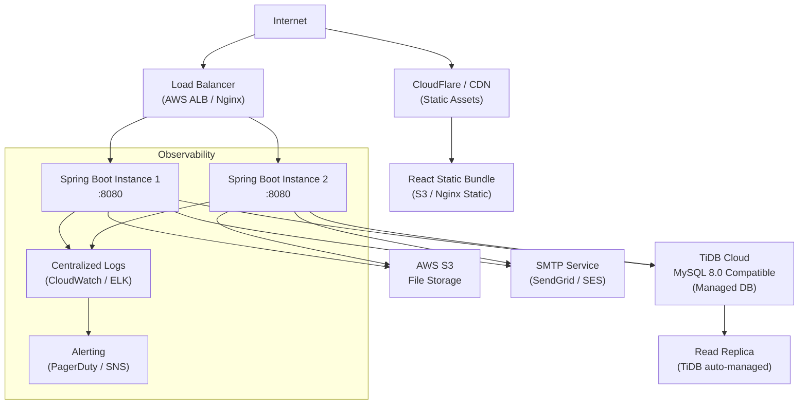

---

### 11.3 Docker Support

The backend includes a production-grade multi-stage Dockerfile:

```
Stage 1: eclipse-temurin:21-jdk-alpine (builder)
    → Maven build: mvn package -DskipTests
    → Extracts Spring Boot layered JAR

Stage 2: eclipse-temurin:21-jre-alpine (runtime)
    → Non-root user (UID 1001)
    → Copies only application layers
    → EXPOSE 8080
    → ENTRYPOINT ["java", "-jar", "app.jar"]
```

**Security hardening in Dockerfile:**
- Non-root user prevents privilege escalation
- JRE-only runtime (no JDK) reduces attack surface
- Alpine base image minimizes OS vulnerabilities

---

### 11.4 Docker Compose (Development)

```yaml
services:
  backend:
    build: ./backend
    ports: ["8080:8080"]
    environment:
      DB_PASSWORD: ${DB_PASSWORD}
      DB_USERNAME: ${DB_USERNAME}
    volumes:
      - ./uploads:/app/uploads

  frontend:
    build: ./frontend
    ports: ["80:80"]
    depends_on: [backend]
```

---

### 11.5 CI/CD Readiness

The project is CI/CD ready with the following characteristics:
- **Maven** build tool with `mvn test` running 535 tests
- **Vitest** for frontend with `npm run test`
- **Flyway** migrations run automatically on startup
- **Docker** image builds from single Dockerfile
- **Environment variables** for all secrets (no hardcoded credentials in code)
- **Health endpoint** at `GET /actuator/health` for deployment verification

**Recommended CI Pipeline:**
```
Code Push → Build (mvn package) → Test (mvn test) → Docker Build
→ Docker Push (ECR) → Deploy (ECS/K8s) → Health Check → Smoke Test
```

---

### 11.6 Cloud Deployment Readiness

| Cloud Provider | Recommended Services |
|---|---|
| **AWS** | ECS Fargate (containers), RDS/TiDB Cloud (DB), S3 (files), SES (email), ALB (load balancer), CloudWatch (logs), ACM (TLS) |
| **Azure** | Container Apps, Azure Database for MySQL, Azure Blob Storage, Azure Monitor |
| **GCP** | Cloud Run, Cloud SQL, Cloud Storage, Cloud Logging |
| **NIC Cloud (Government)** | Meghraj Cloud — deploy Docker containers; use managed MySQL; TLS via HTTPS gateway |

---

## 12. Caching Strategy

### 12.1 Current Cache Implementation

The system uses **Caffeine** (in-process, high-performance cache) configured in `CacheConfig.java`.

**Active Cache:**

| Cache Name | Data Cached | TTL | Max Entries | Eviction |
|---|---|---|---|---|
| `dacvmPolicies` | DACVM access control policy decisions | 5 minutes | 10,000 | On every policy write via `@CacheEvict(allEntries=true)` |

**How it works:**
```java
@Cacheable(value = "dacvmPolicies", key = "#targetKey + ':' + #subjectType + ':' + #subjectValue")
public PolicyEffect evaluate(String targetKey, SubjectType subjectType, String subjectValue) { ... }

@CacheEvict(value = "dacvmPolicies", allEntries = true)
public void invalidateCache() { ... }
```

---

### 12.2 Implicit Caching via Temple Search Summary

The `temple_search_summary` table is effectively a **materialized view cache**:

- **Why:** Temple search requires data from `temples`, `trusts`, `asset_declarations`, `workflow_instances` — a complex multi-table join
- **How:** Denormalized snapshot maintained by `TempleSearchSummaryService.scheduleRefresh()` after each relevant mutation
- **TTL:** Always up-to-date (refreshed transactionally via `afterCommit()`)
- **Performance:** FULLTEXT index enables sub-100ms keyword search across 50,000 records

---

### 12.3 RTK Query Client-Side Cache

On the frontend, **RTK Query** provides automatic client-side caching:

| API Slice | Cache Behavior |
|---|---|
| `geoApi` | Districts, taluks, cities cached for the session (rarely change) |
| `dcApi` | Dashboard data refetched every 60 seconds |
| `notificationApi` | Inbox refetched every 30 seconds |
| `templeApi` | Profile data cached; invalidated on mutation |
| `declarationApi` | Declaration list cached; invalidated after submit/approve/reject |

---

### 12.4 Future Redis Integration

`CacheConfig` is designed for zero-code-change Redis migration:

```java
// Current: Caffeine (single instance)
CaffeineCacheManager manager = new CaffeineCacheManager(DACVM_CACHE);

// Future: Redis (distributed, multi-instance)
RedisCacheManager manager = RedisCacheManager.builder(connectionFactory)
    .withCacheConfiguration(DACVM_CACHE, RedisCacheConfiguration.defaultCacheConfig()
        .entryTtl(Duration.ofMinutes(5)))
    .build();
```

All `@Cacheable` and `@CacheEvict` annotations on `PolicyEvaluationServiceImpl` continue working unchanged.

**Planned Redis Caches:**

| Cache | Data | TTL | Benefit |
|---|---|---|---|
| `dacvmPolicies` | Policy decisions | 5 min | Multi-instance shared cache |
| `geoHierarchy` | Districts, taluks, hoblis | 30 min | Eliminate per-request DB round trips |
| `dashboardMetrics` | Aggregated KPI counts | 5 min | DC dashboard without heavy DB queries |
| `templeSearch` | Search result pages | 2 min | Repeated search queries served from memory |
| `userProfile` | Logged-in user preferences | 15 min | Notification preferences per request |

---

### 12.5 Cache Invalidation Strategy

| Cache | Invalidation Trigger |
|---|---|
| DACVM policies | Any `AccessControlPolicy` write → `@CacheEvict(allEntries=true)` |
| Temple search summary | Any mutation to temple, trust, declaration, workflow → `scheduleRefresh(templeId)` |
| Dashboard KPIs (future) | Scheduled refresh every 5 min OR on key events (declaration approved, profile submitted) |
| Geo data (future) | Admin makes geo changes → targeted `@CacheEvict(key=districtId)` |

---

## 13. Monitoring & Logging Overview

### 13.1 Application Logging

Framework: **Logback** (configured in `logback-spring.xml`)

**Log Levels:**
- `ERROR` — Unexpected exceptions, infrastructure failures
- `WARN` — JWT validation failures, deprecated API usage, payment warnings
- `INFO` — Service method entry/exit for key business operations
- `DEBUG` — Detailed flow tracing (disabled in production)

**MDC (Mapped Diagnostic Context):**
Every request sets `userId` and `role` in MDC:
```java
MDC.put("userId", String.valueOf(claims.userId()));
MDC.put("role", claims.role());
```
All log lines automatically include user context without explicit parameter passing.

**Log Pattern:**
```
[%d{ISO8601}] [%X{userId}] [%X{role}] [%p] [%c{1}] - %m%n
```

---

### 13.2 Audit Logs

Audit logging is the primary compliance mechanism. All audit tables are insert-only:

| Audit Table | Trigger | Retention |
|---|---|---|
| `audit_auth_events` | Login, logout, MFA, password reset | 7 years |
| `audit_data_events` | CRUD on temples, users, declarations | 7 years |
| `audit_export_events` | Every data export | 7 years |
| `governance_action_history` | Every DC governance decision | Permanent |
| `document_access_logs` | Every document download | 5 years |
| `workflow_transitions` | Every workflow state change | Permanent |
| `temple_timeline_events` | Temple lifecycle (all modules) | Permanent |

---

### 13.3 Health Checks

Spring Boot Actuator exposes:
- `GET /actuator/health` — DB connectivity check, disk space, application status
- `GET /actuator/info` — Application version, build info

Used by:
- Load balancer health probes (route traffic only to healthy instances)
- Docker/Kubernetes liveness and readiness probes
- Monitoring dashboards

---

### 13.4 Metrics

Spring Boot Actuator + Micrometer (future integration):
- Request count and latency per endpoint
- Active database connections (HikariCP metrics)
- Cache hit/miss ratio (Caffeine `recordStats()` enabled)
- JVM heap and GC metrics
- Custom business metrics: declarations submitted/day, profiles pending review

**Recommended Stack:** Prometheus scrapes `/actuator/prometheus` → Grafana dashboard.

---

### 13.5 Error Tracking

- All unhandled exceptions are logged at `ERROR` level with full stack trace
- `@RestControllerAdvice` catches all exceptions and returns structured error responses
- Future: Integrate Sentry or AWS CloudWatch Alarms for real-time alerting on error rate spikes

---

### 13.6 Monitoring Dashboard (Recommended)

```
Grafana Dashboard
    ├── API Health: Request rate, p95 latency, error rate per endpoint
    ├── DB Health: Query time, connection pool utilization, slow queries
    ├── Business KPIs: Declarations submitted today, profiles pending review
    ├── Security Events: Failed login attempts, 403 responses
    └── Cache Performance: Caffeine/Redis hit rate, eviction count
```

---

### 13.7 Production Issue Resolution Workflow

```
Alert fires (error rate spike)
    ↓
Check /actuator/health — is application UP?
    ↓
Check Grafana — which endpoint is failing?
    ↓
Check centralized logs (CloudWatch/ELK) — filter by userId, error level
    ↓
Check audit_auth_events / audit_data_events — what was the user doing?
    ↓
Check workflow_transitions — what state was the workflow in?
    ↓
Reproduce → Fix → Deploy → Verify health endpoint → Close alert
```

---

## 14. High-Level Data Flow

### 14.1 Complete Request Data Flow

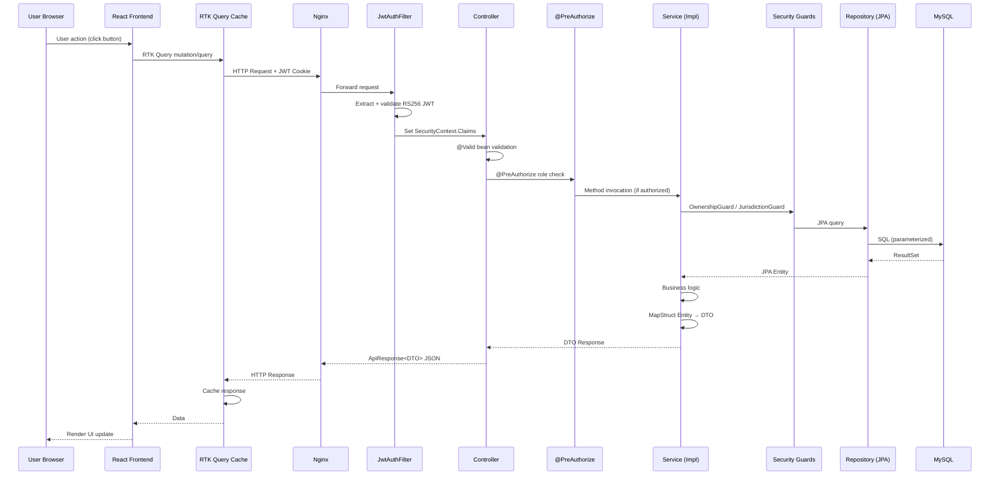

---

### 14.2 Validation Flow

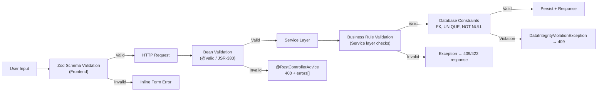

---

### 14.3 Authorization Flow

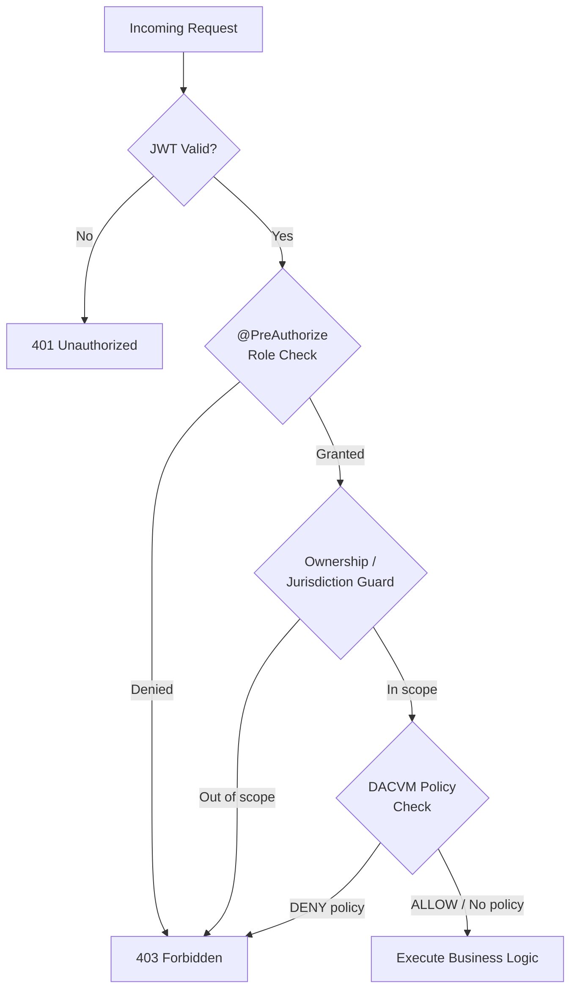

---

### 14.4 Transaction Flow (Declaration Approval)

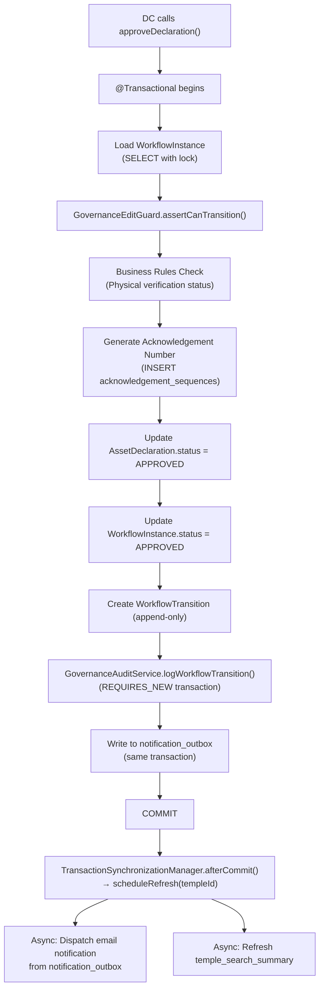

---

### 14.5 Audit Logging Flow

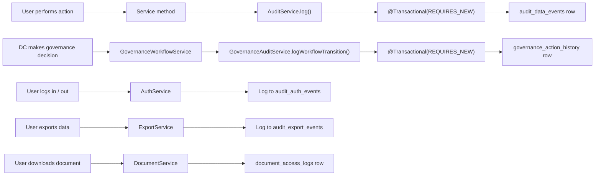

---

## Appendix A — Database Entity Relationship Summary

### Core Entity Groups

```
GEO HIERARCHY
    states (1) ──< cities (1) ──< districts (1) ──< taluks (1) ──< hoblis

AUTH
    users >── districts (FK district_id)
    users >── temples (FK temple_id)
    refresh_tokens >── users
    mfa_recovery_codes >── users

TEMPLE
    temples >── hoblis (FK hobli_id)
    temples >── districts (FK district_id)
    temple_photos >── temples
    temple_search_summary (1:1) ── temples
    temple_profile_staging >── temples
    temple_profile_current (1:1) ── temples
    temple_profile_history >── temples
    temple_timeline_events >── temples

TRUST
    trusts >── temples
    board_members >── trusts
    trust_financials >── trusts
    board_meetings >── trusts

EMPLOYEES & CONTRACTORS
    employees >── temples
    contractors >── temples

DECLARATIONS
    asset_declarations >── temples
    asset_declaration_versions >── asset_declarations
    declaration_clarifications >── asset_declarations
    physical_verification_history >── asset_declarations

DOCUMENTS
    documents (owner_type + owner_id polymorphic)
    document_access_logs >── documents

WORKFLOW ENGINE
    workflow_instances (entity_type + entity_id polymorphic)
    workflow_transitions >── workflow_instances
    idempotency_records >── users

NOTIFICATIONS
    in_app_notifications >── users (implicit via user_id)
    notification_outbox
    notification_events >── users (recipient_id)
    notification_rules
    user_notification_preferences >── users
    email_delivery_logs >── notification_events

ACCESS CONTROL
    access_control_policies

AUDIT
    audit_auth_events
    audit_data_events
    audit_export_events
    governance_action_history

NOTICES
    notices >── districts (optional scope)
    notice_attachments >── notices
    notice_reads >── notices

SYSTEM
    system_config
    export_job_records >── users
    rate_request_log >── users
```

---

## Appendix B — Technology Stack Summary

| Layer | Technology | Version |
|---|---|---|
| Backend Language | Java | 21 (LTS) |
| Backend Framework | Spring Boot | 3.4.4 |
| ORM | Spring Data JPA + Hibernate | 6.x |
| Security | Spring Security | 6.x |
| JWT | jjwt (JJWT) | Latest |
| DTO Mapping | MapStruct | 1.5.x |
| Boilerplate | Lombok | Latest |
| DB Migration | Flyway | 10.x |
| API Documentation | SpringDoc OpenAPI 3 | Latest |
| Build Tool | Maven | 3.x |
| Container | Docker (eclipse-temurin:21) | — |
| Database | MySQL 8 / TiDB Cloud | MySQL 8.0 compatible |
| In-Process Cache | Caffeine | 3.x |
| Frontend Language | TypeScript | 5.x |
| Frontend Framework | React | 18.x |
| Frontend Build | Vite | 5.x |
| State Management | Redux Toolkit + RTK Query | Latest |
| UI Components | Shadcn UI (Radix + Tailwind) | Latest |
| Form Validation | Zod | Latest |
| Frontend Testing | Vitest + React Testing Library | Latest |
| Backend Testing | JUnit 5 + Mockito | Latest |

---

## Appendix C — API Endpoint Groups Summary

| Group | Base Path | Auth Required | Primary Roles |
|---|---|---|---|
| Authentication | `/api/v1/auth/` | Public / Authenticated | All |
| Geographic Data | `/api/v1/geo/` | Public | All |
| Temple Search | `GET /api/v1/temples` | Public | All |
| Temple Management | `/api/v1/temples/` | Required | SA, DC, TA |
| Profile Staging | `/api/v1/temples/{id}/profile/` | Required | TA, DC |
| DC Dashboard | `/api/v1/dc/dashboard` | Required | DC, DC_STAFF, SA |
| DC Temple Search | `/api/v1/dc/temples/` | Required | DC, DC_STAFF, SA |
| DC Profile Review | `/api/v1/dc/profile/` | Required | DC, SA |
| DC Declarations | `/api/v1/dc/declarations/` | Required | DC, DC_STAFF, SA |
| DC Export | `/api/v1/dc/export/` | Required | DC, SA |
| TA Dashboard | `/api/v1/ta/dashboard` | Required | TA, SA |
| Trust Management | `/api/v1/temples/{id}/trust/` | Required | TA, DC, SA |
| Employee Management | `/api/v1/temples/{id}/employees/` | Required | TA, DC, SA |
| Contractor Management | `/api/v1/temples/{id}/contractors/` | Required | TA, DC, SA |
| Document Management | `/api/v1/documents/` | Required | TA, DC, SA, AUDITOR |
| Declaration Management | `/api/v1/temples/{id}/declarations/` | Required | TA, DC, SA |
| Governance Workflow | `/api/v1/governance/` | Required | DC, SA |
| Admin — Users | `/api/v1/admin/users/` | Required | SA only |
| Admin — Audit | `/api/v1/admin/audit/` | Required | SA only |
| Admin — Config | `/api/v1/admin/config/` | Required | SA only |
| Notifications | `/api/v1/notifications/` | Required | All |
| Notice Board | `/api/v1/notices/` | Required | DC, SA |
| Auditor | `/api/v1/auditor/` | Required | AUDITOR, SA |
| Viewer | `/api/v1/viewer/` | Required | VIEWER, SA |
| Access Control | `/api/v1/admin/access-control/` | Required | SA only |
| Timeline | `/api/v1/temples/{id}/timeline` | Required | DC, SA, TA |
| Export | `/api/v1/export/` | Required | DC, SA |

---

*This document was generated from direct analysis of the Temple Registry & Management Portal source code, database schema, security configuration, and business workflow implementation. It reflects the system state as of June 2026.*

*Document prepared for Architecture Review Board presentation.*
