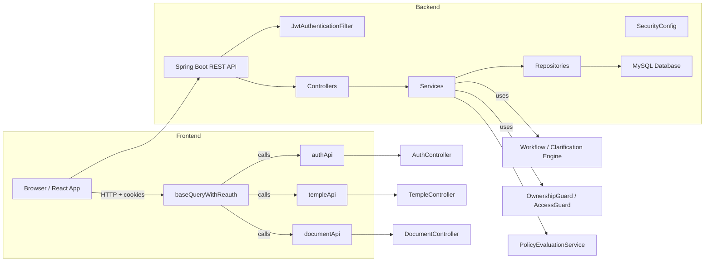
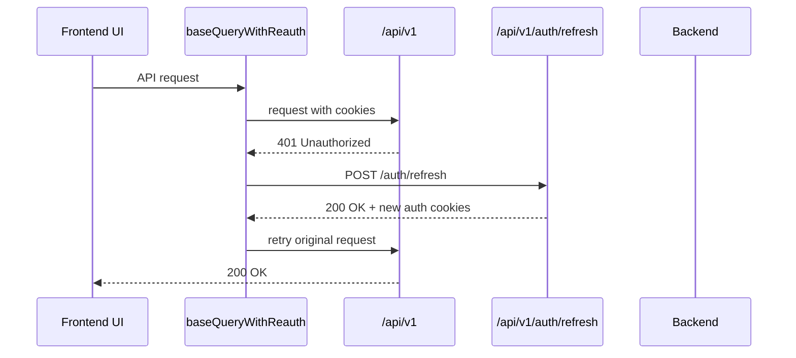
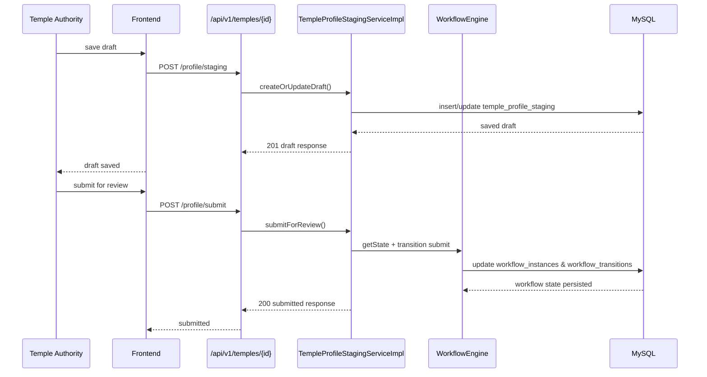
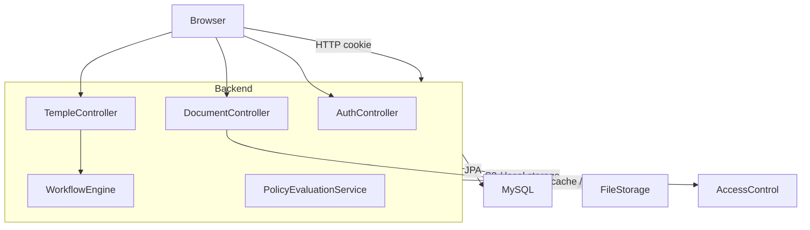

# Low-Level Design (LLD)
# Temple Registry & Management Portal

**Version:** 1.0
**Date:** June 2026
**Classification:** Implementation Reference
**Audience:** Backend Engineers, Frontend Engineers, Architects, Reviewers

---

## Table of Contents

1. [Scope](#scope)
2. [High-Level Architecture](#high-level-architecture)
3. [Backend Architecture](#backend-architecture)
4. [Frontend Architecture](#frontend-architecture)
5. [Authentication & Security](#authentication--security)
6. [Temple Profile Workflow](#temple-profile-workflow)
7. [Document Management](#document-management)
8. [Database Schema](#database-schema)
9. [API Contract Summary](#api-contract-summary)
10. [Diagrams](#diagrams)
11. [Implementation Notes](#implementation-notes)

---

## Scope

This document describes the implemented architecture of the Temple Registry & Management Portal using the actual repository codebase.
It is based on source inspection of backend controllers, services, security, frontend routes, RTK Query modules, and Flyway schema migrations.

It does not introduce assumptions beyond the code. It documents the concrete implementation, behavior, and data flows currently present in the repository.

---

## High-Level Architecture

The system uses a two-tier web architecture:

- Frontend: React + TypeScript + Redux Toolkit + RTK Query
- Backend: Spring Boot 3.x + Spring Security + Spring Data JPA + MySQL

Backend services expose a REST API at `/api/v1/*`.
Frontend communicates via HTTP with `credentials: include` and uses httpOnly cookies for auth.

### Component groups

- Authentication & Authorization
- Temple Registry & Search
- Temple Profile Staging Workflow
- Document Storage & Audit
- Geo / Master Data
- Access Control / Permissions
- Notifications / Audit events

---

## Backend Architecture

### Layered pattern

The backend strictly follows Controller → Service → Repository layers.

- Controllers: request validation, response wrapping, no business logic
- Services: business rules, security guards, workflow orchestration
- Repositories: data access, JPA queries

A shared `ApiResponse<T>` wrapper is returned for all API payloads.

### Key packages

- `com.templeregistry.controller`
- `com.templeregistry.service`
- `com.templeregistry.repository`
- `com.templeregistry.entity`
- `com.templeregistry.security`
- `com.templeregistry.exception`
- `com.templeregistry.dto`

### Request handling

1. HTTP request enters Spring Security filter chain
2. `JwtAuthenticationFilter` extracts JWT from Authorization header, cookie, or SSE query param
3. Security context is set with `ScopeHelper.Claims`
4. Controller receives request and delegates to service
5. Service methods are guarded by `@PreAuthorize` and explicit guard objects
6. Exceptions are mapped by `GlobalExceptionHandler`

---

## Frontend Architecture

### State management

The frontend uses Redux Toolkit with RTK Query as the primary API state layer.

- `src/app/store.ts` configures all feature API slices and adds global RTK Query error logging
- `resetAllApiCaches()` clears every API cache on logout
- UI state is minimal; server state is fetched via RTK Query

### API layer

`src/services/baseQueryWithReauth.ts` defines the base query behavior:

- `baseUrl` set to `/api/v1`
- `credentials: 'include'`
- No Authorization header; auth is cookie-based
- On 401, it automatically calls `/auth/refresh`
- It retries the original request once after refresh
- On repeated failure, clears auth and redirects to `/login`

### Authentication state

- `authSlice` stores only `currentUser` and `isAuthenticated`
- Tokens are intentionally not stored in Redux or local storage
- `PrivateRoute` uses `useGetCurrentUserQuery()` to hydrate auth from cookies
- `RoleRoute` restricts route access by role

### Routing

Routes are defined in `src/routes/index.tsx`.
The router includes:

- public routes: login, public temple search
- protected routes behind `PrivateRoute`
- role-specific groups for DC, TA, SA, Auditor, Viewer
- notification routes available to all authenticated users

### Temple profile frontend

`frontend/src/features/temple-profile/hooks/templeApi.ts` defines temple-related queries and mutations such as:

- `getActiveStaging`
- `createOrUpdateDraft`
- `submitForReview`
- `getStagingHistory`
- `getTempleCurrentProfile`
- photo upload and delete

This module is the frontend integration point for temple profile staging workflow.

---

## Authentication & Security

### Auth endpoints

Implemented in `AuthController`.

- `POST /api/v1/auth/login`
- `POST /api/v1/auth/mfa-verify`
- `POST /api/v1/auth/refresh`
- `POST /api/v1/auth/logout`
- `GET /api/v1/auth/me`
- `GET /api/v1/auth/me/permissions`
- `POST /api/v1/auth/password-reset-req`
- `POST /api/v1/auth/password-reset`

### Cookie policy

- `access_token`: path `/api`, max age 2h, httpOnly, SameSite=Strict
- `refresh_token`: path `/api/v1/auth/refresh`, max age 7d, httpOnly, SameSite=Strict
- Legacy cookie paths are cleared on every login/refresh/logout for compatibility and hygiene

### JWT validation

- Access token parsed by `JwtAuthenticationFilter`
- Supports Authorization header, cookie, SSE token parameter
- Populates `SecurityContext` with a grant type authority of `ROLE_<role>`

### Role-based security

`RoleConstants` defines role expressions for method-level guards.

- `ADMIN_ONLY`
- `CAN_READ_ALL`
- `CAN_ACT_DC`
- `CAN_SUBMIT`
- `TEMPLE_AUTHORITY_ONLY`
- `AUDITOR_ONLY`
- `CAN_RAISE_OBSERVATION`

### Guards

- `OwnershipGuard.assertOwnsTemple()` enforces that TEMPLE_AUTHORITY can only access their own temple
- `TokenRevocationGuard` protects refresh token reuse and revocation flows
- `GlobalExceptionHandler` returns consistent HTTP status + structured API errors

### Public access rules

Configured in `SecurityConfig`:

- `/api/v1/auth/**` and `/api/v1/geo/**` are public
- Public temple search: `GET /api/v1/temples`
- Public temple photo serve endpoints are open
- All other requests require authentication

---

## Temple Profile Workflow

### Workflow design

Temple profile updates are implemented as a staged review flow:

- TAs create/update a draft in `temple_profile_staging`
- TAs submit drafts for DC review
- DC/Super Admin approve, reject, or request clarification
- Approved profile data is published to `temple_profile_current`
- The current approved profile is separate from draft staging data

### Backend endpoints

Exposed by `TempleController`:

- `POST /api/v1/temples/{templeId}/profile/staging`
- `POST /api/v1/temples/{templeId}/profile/submit`
- `DELETE /api/v1/temples/{templeId}/profile/staging/{stagingId}`
- `GET /api/v1/temples/{templeId}/profile/staging/active`
- `GET /api/v1/temples/{templeId}/profile/history`
- `GET /api/v1/temples/{templeId}/profile/current`

### Service implementation

`TempleProfileStagingServiceImpl` implements:

- `createOrUpdateDraft`
- `submitForReview`
- `getActiveStagingOrNull`
- `getById`
- `getHistory`
- `requestClarification`
- `respondToClarification`
- `deleteDraftStaging`

This service uses unique business logic to enforce:

- DRAFT can only be deleted by TA
- workflow state is authoritative via `WorkflowEngine`
- bank account fields are encrypted at rest
- review metadata and status are derived from workflow instance state

### Workflow engine tables

- `workflow_instances`
- `workflow_transitions`
- `workflow_idempotency_records`

### Clarification engine tables

- `clarification_threads`
- `clarification_messages`

These tables provide the state machine and audit trail for profile reviews.

---

## Document Management

### Document contract

`DocumentController` supports:

- Upload: `POST /api/v1/documents/upload`
- Metadata: `GET /api/v1/documents/{id}`
- Pre-signed URL: `GET /api/v1/documents/{id}/url`
- Download: `GET /api/v1/documents/{id}/download`
- Preview: `GET /api/v1/documents/{id}/preview`
- Download by key: `GET /api/v1/documents/download?key={key}`
- List: `GET /api/v1/documents?ownerType=...&ownerId=...`
- Soft delete: `DELETE /api/v1/documents/{id}`

### Ownership model

Documents use a generic owner model:

- `owner_type` (e.g. TEMPLE, TRUST, EMPLOYEE, CONTRACTOR, DECLARATION)
- `owner_id`
- optional `reference_id`

### Audit

- `document_access_logs` records who accessed a document, when, and by what role
- Soft delete retains the object for audit even after record removal

### Storage

The application stores the object key in `documents.s3_key`.
The implementation includes support for multipart upload and external direct upload registration.

---

## Database Schema

### Key tables

#### Auth / User

- `users`
- `refresh_tokens`
- `mfa_recovery_codes`

#### Temple

- `temples`
- `temple_profile_staging`
- `temple_profile_current`
- `temple_profile_history`
- `temple_photos`

#### Documents

- `documents`
- `document_access_logs`

#### Workflow / Clarification

- `workflow_instances`
- `workflow_transitions`
- `workflow_idempotency_records`
- `clarification_threads`
- `clarification_messages`

#### Geo hierarchy

- `states`
- `cities`
- `districts`
- `taluks`
- `hoblis`

#### Audit / Notifications

- `audit_data_events`
- `audit_auth_events`
- `audit_export_events`
- `notification_events`
- `in_app_notifications`

### Schema conventions

- Soft delete via `is_deleted` flag on major tables
- Audit fields: `created_at`, `updated_at`, `created_by`, `updated_by`
- Unique indexes for entity identity and workflow constraints
- Foreign keys enforce referential integrity

### Temple staging data model

`temple_profile_staging` stores:

- temple identity and workflow status
- contact and identity fields
- photo path and bank details
- profile description, festivals, linked institutions
- location metadata (`hobli_id`, `place_id`, `latitude`, `longitude`)
- review comment and reviewer metadata

`temple_profile_current` is the approved profile version.
`temple_profile_history` archives older published profiles.

---

## API Contract Summary

### Auth API

- `POST /api/v1/auth/login`
- `POST /api/v1/auth/mfa-verify`
- `POST /api/v1/auth/refresh`
- `POST /api/v1/auth/logout`
- `GET /api/v1/auth/me`
- `GET /api/v1/auth/me/permissions`
- `POST /api/v1/auth/password-reset-req`
- `POST /api/v1/auth/password-reset`

### Temple API

- `GET /api/v1/temples` — public temple search
- `POST /api/v1/temples` — create temple (SUPER_ADMIN only)
- `GET /api/v1/temples/{id}` — view temple detail
- `PUT /api/v1/temples/{id}` — update temple (SUPER_ADMIN only)
- `POST /api/v1/temples/{id}/photo`
- `POST /api/v1/temples/{id}/photos`
- `GET /api/v1/temples/{id}/photos`
- `DELETE /api/v1/temples/{templeId}/photos/{photoId}`
- `GET /api/v1/temples/{templeId}/profile-photo/serve`
- `GET /api/v1/temples/{templeId}/photos/{photoId}/serve`

#### Temple profile workflow

- `POST /api/v1/temples/{templeId}/profile/staging`
- `POST /api/v1/temples/{templeId}/profile/submit`
- `DELETE /api/v1/temples/{templeId}/profile/staging/{stagingId}`
- `GET /api/v1/temples/{templeId}/profile/staging/active`
- `GET /api/v1/temples/{templeId}/profile/history`
- `GET /api/v1/temples/{templeId}/profile/current`

### Document API

- `POST /api/v1/documents/upload`
- `GET /api/v1/documents/{id}`
- `GET /api/v1/documents/{id}/url`
- `GET /api/v1/documents/{id}/download`
- `GET /api/v1/documents/{id}/preview`
- `GET /api/v1/documents/download?key={key}`
- `GET /api/v1/documents?ownerType=...&ownerId=...`
- `DELETE /api/v1/documents/{id}`

---

## Diagrams

### Component diagram

### Sequence diagram: Auth refresh flow

### Sequence diagram: TA profile staging

### Data flow diagram

---

## Implementation Notes

### Public temple search

- `GET /api/v1/temples` is intentionally public.
- It is exposed without auth in `SecurityConfig` for `/api/v1/temples` GET only.
- Backend search still requires authentication in service code, so the public path is the primary gating control.

### Frontend auth state

- `PrivateRoute` uses `useGetCurrentUserQuery()` to hydrate the user from cookies.
- `role` and `templeId` are stored in `CurrentUser` and used for route gating.
- The frontend never stores JWTs in Redux or browser storage.

### Rate of change

This document is accurate to the current repository implementation as of June 2026.
If code changes add new endpoints, workflow states, or storage layers, this document must be updated accordingly.
