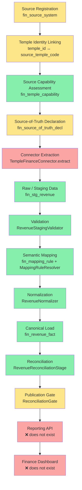
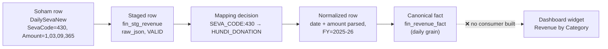
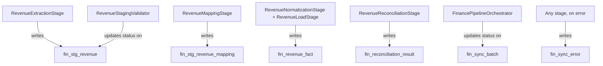

# Temple Registry ↔ Soham Database Integration Guide

**A complete, beginner-friendly explanation of how Kollur temple's financial data reaches the Temple Registry — what exists today, and what is still only a plan.**

> **How to read the status tags used throughout this document**
>
> | Tag | Meaning |
> |---|---|
> | ✅ IMPLEMENTED & TESTED | Code exists, is exercised by automated tests, and the tests pass |
> | 🟡 PARTIALLY IMPLEMENTED | Some of the capability exists in code; a meaningful part is missing, stubbed, or disconnected |
> | 📋 PLANNED / DESIGN ONLY | A document describes it in detail; no corresponding code exists |
> | ❌ NOT IMPLEMENTED | Neither code nor a firm design exists |
> | ❓ UNKNOWN / REQUIRES DECISION | The repository does not say, or two documents disagree |
>
> Every claim in this guide is traceable to a file. Where a claim comes from a design document rather than working code, that is stated explicitly — this document never presents a plan as if it were already running software.

---

## Table of Contents

1. [Executive Summary](#1-executive-summary)
2. [Business Problem](#2-business-problem)
3. [Systems Involved](#3-systems-involved)
4. [Complete End-to-End Data Flow](#4-complete-end-to-end-data-flow)
5. [Roles and Responsibilities](#5-roles-and-responsibilities)
6. [Temple and Source System Registration](#6-temple-and-source-system-registration)
7. [Source Capability Configuration](#7-source-capability-configuration)
8. [Source-of-Truth Declaration](#8-source-of-truth-declaration)
9. [Structural Mapping vs Semantic Mapping](#9-structural-mapping-vs-semantic-mapping)
10. [Source Mapper UI — Complete Screen Specification](#10-source-mapper-ui--complete-screen-specification)
11. [Detailed Example: Mapping One Source Record](#11-detailed-example-mapping-one-source-record)
12. [Staging and Validation](#12-staging-and-validation)
13. [Mapping Engine](#13-mapping-engine)
14. [Normalization and Canonical Model](#14-normalization-and-canonical-model)
15. [Canonical Database Model](#15-canonical-database-model)
16. [Reconciliation](#16-reconciliation)
17. [Publication Gate](#17-publication-gate)
18. [Finance Dashboard UI](#18-finance-dashboard-ui)
19. [Complete Screen-to-Backend-to-Database Mapping](#19-complete-screen-to-backend-to-database-mapping)
20. [End-to-End User Journeys](#20-end-to-end-user-journeys)
21. [Error Handling and Operational Scenarios](#21-error-handling-and-operational-scenarios)
22. [Security and Audit](#22-security-and-audit)
23. [Current Implementation Status](#23-current-implementation-status)
24. [Gaps, Risks, and Open Decisions](#24-gaps-risks-and-open-decisions)
25. [Glossary](#25-glossary)
26. [Beginner-Friendly Final Summary](#26-beginner-friendly-final-summary)
27. [Appendix: How This Guide Was Produced](#27-appendix-how-this-guide-was-produced)

---

## 1. Executive Summary

Kollur Sri Mookambika Devi Temple already runs its own day-to-day computer system — a SQL Server database called **`KOLSOHAM_LOCAL`** (internally referred to as "Soham"). Every seva booking, donation, prasadam sale, and gold/silver offering at the temple counter is recorded there, and has been since 2015. Temple Registry (this project) is a separate, government-facing platform that needs to *show* that financial picture to Deputy Commissioners, auditors, and the public — without becoming a second copy of the temple's operational system.

**Why we do not just copy the Soham database into Temple Registry:**

1. **The two systems answer different questions.** Everything else in Temple Registry (trust details, board members, declarations) is *authored* inside the registry — a person fills a form and it gets approved. Financial transaction data is different: it is *authored* at the temple counter, in the temple's own system. Temple Registry does not own that data; it needs a faithful, periodically-refreshed *reflection* of it (`docs/finance/MULTI_TEMPLE_FINANCE_ARCHITECTURE.md:56-59`).
2. **Raw copying doesn't scale or generalize.** Kollur alone has ~22.3 million individual receipt rows. A future 100-temple rollout would mean the registry holding and querying billions of raw transactional rows from a hundred differently-built systems. The design instead collapses each temple's daily activity into a much smaller **canonical** (source-agnostic) shape — for Kollur, 22,348,125 raw rows collapse to 121,242 canonical rows, a measured **184× reduction** (`docs/finance/adr/ADR-003-canonical-grain.md:11-20`).
3. **Raw copying leaks things it shouldn't.** The Soham database stores devotee names, addresses, and mobile numbers on every receipt. The canonical model deliberately stores none of that — described in the architecture as "a privacy benefit in its own right, not merely an acceptable loss" (ADR-003:35-36).
4. **Source vocabulary must not leak upward.** Soham's own naming (`SevaCode`, `ssv_code`, `BillCancled`, `Finyear=20252026`) is specific to one 20-year-old system. If that vocabulary leaked into the dashboard or API, every future temple with a different system would need special-case code. A **canonical taxonomy** (SEVA, DONATION, HUNDI_DONATION, etc.) is the one vocabulary every screen, report, and API speaks, regardless of which temple or source system produced the number.
5. **The registry must never be able to reach a temple's live database at runtime.** This is a hard architectural rule (`docs/finance/adr/ADR-001-no-runtime-source-access.md`), partly for security (one server holding live credentials to 100 temple databases is "a concentration of risk no government platform should accept") and partly because Kollur's own database is already ~7 weeks stale by the time anyone looks at it — real-time access would buy nothing.

**What this means in practice:** data is *extracted* from Soham on a schedule, landed as-is in a staging area, checked for basic sanity, translated from Soham's vocabulary into the canonical vocabulary, reshaped into daily aggregates, checked against Soham's own totals (reconciliation), and only then made visible on a dashboard.

**Where things actually stand today (see [Section 23](#23-current-implementation-status) for the full matrix):** the staging → validation → mapping → normalization → canonical-load → reconciliation → publication-decision pipeline is **built and heavily tested** in the backend. However, **no code anywhere in this repository actually talks to the real Soham SQL Server database** — every test uses a fake, in-memory stand-in connector. There is also **no finance dashboard and no finished Source Mapper screen** in the real Temple Registry web application yet; what exists in the frontend today is a hand-built, hardcoded HTML mockup, not a live page. This guide draws a hard line between what runs today and what is still a plan.

---

## 2. Business Problem

Soham (`KOLSOHAM_LOCAL`, SQL Server, restored from a `.bak` file, `docs/database/KOLSOHAM_DATABASE_ANALYSIS.md`) was built as a temple point-of-sale/back-office system, not as a reporting data warehouse. It differs from what a canonical registry model needs in every one of the ways this section is meant to cover.

### 2.1 Different table names, same concept

| Concept | Soham's name(s) | Canonical name |
|---|---|---|
| A seva/donation receipt | `DailySevaNew` (+ 6 per-financial-year archive tables with year numbers baked into the table name, e.g. `DailySevaNew20192020`) | `fin_revenue_fact` |
| Receipt line items | `DailySevaNewDetails` (+ matching per-year archives) | (not separately modeled — line-item detail is out of scope; see ADR-003) |
| Seva master list | `seva_seva` | `fin_service_dim` |
| Seva category bucket | `seva_sannidhi` | `fin_revenue_category` |
| Precious metal offerings | `HKanikeItems` / `HItemMaster` | `fin_precious_metal_fact` (documented; not yet built in code — see [Section 15](#15-canonical-database-model)) |

**Trap already found in the data:** `DailySevaNewOld` and `DailySevaNewDetailsOld` are **byte-exact duplicates** of the six per-year archive tables combined (16,982,270 rows each). Any query that doesn't know to exclude them would silently double every historical revenue figure (`docs/database/KOLSOHAM_DATABASE_ANALYSIS.md` §10.1).

### 2.2 Different column names for the same fact

| Meaning | Soham column | Canonical column |
|---|---|---|
| Money amount | `Amount` (type `money`) | `gross_amount` (`DECIMAL(18,2)`) |
| Was this receipt cancelled | `BillCancled` (misspelled; also seen as `billcancled`, `BillCancel`, `BillCancle` in other tables) | `cancelled_amount` / `cancelled_count` |
| Financial year | `Finyear`, an `int` shaped like `20252026` | `financial_year`, a string like `"2025-26"` |
| Which seva | `SevaCode` (a `smallint` code) | `category_id` / `service_id` (after translation) |

### 2.3 Different data formats

- Soham stores money as SQL Server's `money` type; the canonical model uses exact `DECIMAL(18,2)` and never a floating-point type anywhere in the pipeline (verified by test coverage — see [Section 12](#12-staging-and-validation)).
- Soham's financial year is an 8-digit integer (`20252026`); canonical financial year is the string `"2025-26"`, computed from the transaction date with an April 1 boundary (`FinancialYear.of()`).
- The same logical field is typed 3–5 different ways across Soham tables — e.g. `ReceiptNo` appears as `varchar(12)`, `varchar(50)`, `varchar(7)`, `int`, and `numeric(9)` depending on the table (`docs/database/KOLSOHAM_DATABASE_ANALYSIS.md` §10.8).

### 2.4 Extra fields Soham has that mean nothing to the registry

Soham carries dozens of columns that exist purely for the temple's own printing/operational needs and have no reporting meaning: thermal-printer layout positions on `seva_seva` (~48 columns), five `nvarchar(max)` image columns, `ModifiedBy char(10)` (an operator initials field baked into the primary key of every `DailySevaNew*` table), and hand-rolled sequence tables like `IdentityValue`.

### 2.5 Missing fields Soham simply does not have

- **No expenditure at all.** `FN_VOUCHERPAYEMENT` (note the source system's own typo — "PAYEMENT") exists as a table but has **0 rows**. The general ledger table `FN_TRANSACTION` looks like it should carry expenses but in FY2025-26 posts only 2 accounts — both sides of saree-auction sales — against ₹90.62 Cr of actual revenue.
- **No gold/silver valuation.** `HKanikeItems.Rate` and `.Amount` are zero on every row after FY2015-16; `Purity` is empty on all rows. Weight is real and available; value is not, and must never be estimated (`docs/finance/KOLLUR_FINANCE_DATA_ANALYSIS.md` §18, Gap C5).
- **No Nirantara (perpetual seva) execution record.** Booking and payment exist; whether the ritual was actually *performed* cannot be verified from any Soham table (see the dedicated discussion in [Section 14](#14-normalization-and-canonical-model)).
- **No government grants or ongoing-works data anywhere in Soham.**

### 2.6 Different business meanings hiding behind similar-looking data

- `DailySevaNewDetails.TotalAmount`, summed for FY2025-26, gives **₹53.78 Cr** — 41% short of the correct **₹90.62 Cr** from `DailySevaNew.Amount`. A third candidate, `Details.Amount × Qty`, gives yet a different number (₹56.31 Cr) that disagrees with the detail table's own stored total. All three "amount" columns exist; only one is correct, and the reason is documented, not guessed (see [Section 8](#8-source-of-truth-declaration)).
- Seva code `430` ("HUNDIALS") looks like a seva in the seva master table, but is actually hundi (donation box) collection counted as 13 large receipts. Prasadam retail items (Laddu, Cloth Bag, Panchakajjaya — together ₹27.7 Cr in FY2025-26) are also filed under "seva" codes but are retail sales, not ritual services. A naive "top sevas" report would misrepresent all of this unless it uses the canonical category split (SEVA vs PRASADAM_SALE vs HUNDI_DONATION).
- `seva_List.seva_Prepared = 1` exists on 17,808 rows dated **into the future (2027)** — proving this flag means "the schedule row was generated," not "the ritual was performed." A single-table status model would have invited exactly this misreading (`docs/finance/adr/ADR-009-nirantara-lifecycle-separation.md`).

### 2.7 Different temple identifiers

| Identifier | Owned by | Kollur's value |
|---|---|---|
| `temples.id` (Temple Registry's own primary key) | Temple Registry | `300001` |
| `temples.temple_code` (human-facing registry code) | Temple Registry | `KA-TMP-29D0887C` |
| `fin_source_system.id` (which integration record) | Temple Registry (finance module) | e.g. `1` |
| `source_temple_code` (Soham's own internal discriminator) | Soham | `"43"` (from `TempleMaster.TempleCode`) |

The mapping `300001 ↔ 43` **exists nowhere as a stored, explicit fact in either database** — it is currently only implicit in whoever writes a query. The finance module's `fin_source_system` table is exactly what is meant to make this explicit and queryable (`docs/finance/FINANCE_DATA_MODEL.md:83`, `MULTI_TEMPLE_FINANCE_ARCHITECTURE.md:572`). No document in this repository explicitly discusses *temple-name* matching as a rejected option in those words, but the closest and most relevant stated principle is that devotee names are unreliable keys ("`PersonName` is free text with no stable key," ADR-003:49) — the same reasoning applies to matching temples by name rather than by a stable code: names can collide, be transliterated differently, or be renamed, while a registered code or numeric ID cannot. **This specific justification for temples is inferred from the general design principle, not a verbatim quote — flagged here as an inference, not a documented fact.**

---

## 3. Systems Involved

| Layer | Component | Responsibility | Knows Soham's schema? | Status |
|---|---|---|---|---|
| 1 | **Soham source database** (`KOLSOHAM_LOCAL`, SQL Server) | Temple's own operational system; read-only from the registry's point of view; never modified by the registry | — | Exists independently of this project; not reachable from any code in this repo today |
| 2 | **Connector** (`TempleFinanceConnector` implementation) | The *only* code allowed to know Soham's table/column names; extracts raw rows | Yes | ❌ No real implementation exists — interface only (`backend/src/main/java/com/templeregistry/connector/finance/TempleFinanceConnector.java`) |
| 3 | **Staging tables** (`fin_stg_*`) | Immutable landing zone for raw extracted rows, tagged with a batch id | Partially (raw JSON, source field names, but no interpretation) | ✅ Implemented & tested (`fin_stg_revenue`, V113) |
| 4 | **Mapping configuration** (`fin_mapping_rule`) | Translates a source value into a canonical value, as data, not code | No (only stores namespaced strings) | ✅ Implemented & tested for `REVENUE_CATEGORY` only |
| 5 | **Canonical reporting tables** (`fin_revenue_fact`, `fin_revenue_category`, `fin_service_dim`, etc.) | Source-agnostic finance facts, the "central reporting store" | No | ✅ Implemented & tested (V112) for revenue only |
| 6 | **Reconciliation & publication gate** | Confirms canonical totals agree with the source before anything is shown | No | ✅ Implemented & tested, but **not yet called by anything** (no consumer wired) |
| 7 | **Reporting APIs** | Would expose canonical/aggregate data to the frontend, in canonical vocabulary only | No | 🟡 Partial — only a mapping-*administration* API exists (`FinanceMappingController`); no report/dashboard API exists |
| 8 | **Frontend UI** (Finance Dashboard, Source Mapper) | Displays finance data and lets staff manage mapping rules | No | ❌ Not implemented in the real app — only static HTML mockups exist |

The connector layer is deliberately the only place allowed to know Soham exists; everything above staging speaks only the canonical vocabulary (ADR-004). This boundary is enforced in the codebase by an actual test (`ConnectorContractPurityTest`) that scans source files for forbidden vocabulary and framework dependencies.

A separate but related boundary: the finance **pipeline** (extraction through reconciliation) is designed to run only inside a dedicated **sync-worker** process/profile, never inside the same runtime that serves the public API — see [Section 22](#22-security-and-audit).

---

## 4. Complete End-to-End Data Flow

Legend: 🟢 green = implemented & tested · 🟡 amber = data/config exists (seeded) but the surrounding workflow/UI is not built · 🔴 red = no working code exists.

### Stage-by-stage detail

#### 4.1 Source Registration
- **Purpose:** Record that a temple has an external system that feeds it financial data.
- **Who performs it:** A Finance/Data Configuration Administrator (documented role expectation; no UI exists yet — done today only via a Flyway seed migration).
- **Input:** Temple id, source system name/technology, connector type, connector bean name, schedule, credential alias.
- **Screen/backend component:** ❌ No registration screen exists. Today this is a **SQL seed migration**: `backend/src/main/resources/db/migration/V111__kollur_finance_configuration.sql`, guarded to run only if temple `300001` already exists in the registry.
- **Database table:** `fin_source_system`.
- **Output:** One row: Kollur, system code `KOLSOHAM`, `source_temple_code='43'`, `connector_type='PULL_JDBC'`, `connector_bean='kollurFinanceConnector'`, **`sync_enabled=0`** (off by default).
- **Failure cases:** None observable today — it's a migration, not a live workflow. If run against a database with no temple `300001`, it silently seeds nothing (documented, intentional guard).
- **Status:** 🟡 Data model and one seeded row exist (✅ tested via `KollurFinanceConfigurationMigrationTest`); the **registration workflow/UI is not implemented (📋 planned only)**.

#### 4.2 Temple Identity Linking
- **Purpose:** Tie the registry's `temples.id` to the source system's own temple discriminator, so a query never has to guess which Soham rows belong to which registry temple.
- **Who performs it:** Same administrator as registration — it's the same table (`fin_source_system.source_temple_code`).
- **Input/Output/Table:** Same as 4.1 — `fin_source_system.temple_id` and `.source_temple_code`.
- **Status:** 🟡 Data exists for Kollur; no dedicated linking UI; see [Section 6](#6-temple-and-source-system-registration) for why name-based matching is avoided.

#### 4.3 Source Capability Assessment
- **Purpose:** Record, per temple and per financial metric, whether the source can answer it at all (see [Section 7](#7-source-capability-configuration)).
- **Who performs it:** Data Configuration Administrator / Analyst, based on manual analysis of the source (as documented in `docs/finance/KOLLUR_FINANCE_DATA_ANALYSIS.md`).
- **Input:** Capability name, availability (AVAILABLE/PARTIALLY_AVAILABLE/NOT_AVAILABLE/NOT_APPLICABLE), a human-readable reason, coverage date range, known gaps.
- **Screen/backend component:** ❌ No configuration screen. Seeded by the same V111 migration: 19 capability rows for Kollur (10 AVAILABLE, 2 PARTIALLY_AVAILABLE, 7 NOT_AVAILABLE).
- **Database table:** `fin_temple_capability`.
- **Output:** A queryable per-temple capability matrix.
- **Failure cases:** A capability with no row is implicitly unknown to any consumer — there is no "default" capability behavior documented.
- **Status:** ✅ Table/entity implemented and tested; ✅ Kollur's 19 rows seeded and verified against the documented analysis; ❌ no configuration UI exists.

#### 4.4 Source-of-Truth Declaration
- **Purpose:** Formally record which exact source table/column is authoritative for a given financial metric, with the rejected alternatives and why (see [Section 8](#8-source-of-truth-declaration)).
- **Who performs it:** An Analyst proposes it; business sign-off is required before it is considered approved (`approved_by`/`approved_at` columns) — **for Kollur, these are currently NULL: nothing has actually been signed off yet**, despite the values already being used by the pipeline.
- **Input:** Metric name, source object/field, filter predicate, rejected alternatives with reasons, rationale.
- **Screen/backend component:** ❌ No screen. Seeded via V111 (revenue amount) and V115 (transaction date).
- **Database table:** `fin_source_of_truth_decl`.
- **Status:** 🟡 Table/entity implemented; two rows exist for Kollur but **unapproved**; ❌ no approval workflow/UI exists.

#### 4.5 Connector Extraction
- **Purpose:** Pull raw rows out of the source system for a given capability and time window.
- **Who performs it:** An automated sync-worker process (no human involvement in a working system) — but there is no real connector to run.
- **Input:** A `SyncContext` (date range / change window) from a `fin_sync_batch`.
- **Screen/backend component:** `RevenueExtractionStage` (✅ implemented, generic, temple-agnostic) calling `TempleFinanceConnector.extract()` via `ConnectorRegistry`. **The Kollur-specific connector class (`kollurFinanceConnector`) referenced by the seed data does not exist anywhere in the codebase.** Every test uses an in-memory fake (`StubConnector`, `FakeConnector`, `SyntheticConnector`).
- **Database table written:** `fin_stg_revenue`.
- **Output:** Raw rows landed verbatim (as JSON) in staging.
- **Failure cases:** An unregistered connector name fails loudly (`ConnectorConfigurationException`), never silently returns zero rows — this is tested.
- **Status:** ❌ **NOT IMPLEMENTED for real data.** The extraction *mechanism* is ✅ implemented and tested against a synthetic connector; attempting to sync Kollur today would fail immediately because no real connector is registered.

#### 4.6 Raw/Staging Data
- **Purpose:** An immutable, auditable landing zone that preserves exactly what the source sent, before any interpretation.
- **Database table:** `fin_stg_revenue` (V113) — `raw_json`, `sync_batch_id`, `source_record_ref`, `validation_status`.
- **Status:** ✅ Implemented & tested.

#### 4.7 Validation
- **Purpose:** Check the *shape* of a staged row (not its business correctness) — is the payload a well-formed object, does it have a non-blank record reference, does its provenance match its batch.
- **Screen/backend component:** `RevenueStagingValidator` (✅ implemented, FIN-053).
- **Output:** `validation_status` moves `RECEIVED → VALID` or `RECEIVED → REJECTED` with a reason.
- **Status:** ✅ Implemented & tested — **with a documented history of once being wrongly marked complete** (see [Section 23](#23-current-implementation-status) for the full FIN-053 incident, an important transparency note for this README).

#### 4.8 Semantic Mapping
- **Purpose:** Translate a source value (e.g. seva code `430`) into a canonical value (e.g. `HUNDI_DONATION`), using configuration, not code.
- **Screen/backend component:** `RevenueMappingStage` + `MappingRuleResolver`, driven by `fin_mapping_rule` rows.
- **Status:** ✅ Implemented & tested, but **only for the `REVENUE_CATEGORY` mapping dimension.** `SERVICE`, `PAYMENT_MODE`, `STATUS`, `FINANCIAL_YEAR`, and `METAL_TYPE` are defined as possible mapping types but are not read by any pipeline code today.

#### 4.9 Normalization
- **Purpose:** Turn a mapped, validated staged row into a canonical-shaped record: parse the date, parse the amount, determine the financial year, collapse same-day/same-category rows into one daily aggregate.
- **Screen/backend component:** `RevenueNormalizer` + `RevenueNormalizationStage` (✅ implemented, FIN-055).
- **Status:** ✅ Implemented & tested, extensively (see [Section 12](#12-staging-and-validation)).

#### 4.10 Canonical Load
- **Purpose:** Write the normalized, aggregated record into the canonical fact table, replacing (never accumulating) any prior figure for the same grain.
- **Screen/backend component:** `RevenueLoadStage` (✅ implemented, FIN-056), writing to `fin_revenue_fact`.
- **Status:** ✅ Implemented & tested, idempotent (re-running never double-counts).

#### 4.11 Reconciliation
- **Purpose:** Confirm the canonical totals agree with the source's own totals, and confirm nothing was silently lost inside the pipeline itself.
- **Screen/backend component:** `RevenueReconciliationStage` (✅ implemented, FIN-060), writing to `fin_reconciliation_result`.
- **Status:** 🟡 Two of four checks (`STAGE_COMPLETENESS`, `REJECTION_ACCOUNTING`) are fully authoritative today. The other two (`SOURCE_VS_CENTRAL`, `SUSPECTED_SOURCE_DELETION`) always report `NOT_AVAILABLE` in production because no connector implements `sourceTotals()`.

#### 4.12 Publication Gate
- **Purpose:** Decide, per temple/source/financial-year, whether canonical figures are safe to publish.
- **Screen/backend component:** `ReconciliationGate` (✅ implemented & tested, FIN-061).
- **Status:** ✅ Implemented & tested as a standalone decision, but **nothing in the codebase calls it yet.** No aggregate rebuild job and no reporting API exist to be gated.

#### 4.13 Reporting API
- **Purpose:** Expose canonical/aggregate data to the frontend in canonical vocabulary, with an explicit availability/reconciliation envelope on every figure.
- **Status:** ❌ **Does not exist.** A full contract is written (`docs/finance/API_CONTRACT.md`) and explicitly marked "agreed, not yet implemented." The only real finance HTTP endpoint that exists is the **mapping-rule administration API** (`FinanceMappingController`), which is a configuration API, not a reporting API.

#### 4.14 Finance Dashboard
- **Purpose:** Show DC-office staff and the public the temple's financial picture.
- **Status:** ❌ **Does not exist as a live page.** `frontend/public/dc/temple-300001-dashboard.html` and `docs/TempleDashboardForDCOffice_v2.html` are static, hand-built HTML files with hardcoded literal data and Chart.js — confirmed to make **zero network calls**. None of the real React dashboard pages (Admin/TA/DC/DC-Workflow/Auditor/Viewer) reference finance data at all.

---

## 5. Roles and Responsibilities

The repository defines six concrete user roles in `backend/src/main/java/com/templeregistry/security/RoleConstants.java`: **SUPER_ADMIN, DISTRICT_COLLECTOR, DC_STAFF, TEMPLE_AUTHORITY, AUDITOR, VIEWER**. Finance-specific permission groups built from these roles:

- `CAN_READ_FINANCE_CONFIG` = SUPER_ADMIN, DISTRICT_COLLECTOR, DC_STAFF, AUDITOR (i.e. everyone except VIEWER and TEMPLE_AUTHORITY)
- `CAN_ACT_DC` = SUPER_ADMIN, DISTRICT_COLLECTOR (governs all finance mapping *writes*)

The table below maps the requested activities onto documented or code-enforced permissions. Where no document or code assigns a role, it is marked REQUIRES DECISION rather than invented.

| Activity | SUPER_ADMIN | DISTRICT_COLLECTOR | DC_STAFF | AUDITOR | TEMPLE_AUTHORITY | VIEWER | Basis |
|---|:--:|:--:|:--:|:--:|:--:|:--:|---|
| View mapping rules / unmapped / ambiguous values | ✅ | ✅ | ✅ | ✅ | ❌ | ❌ | Enforced in code: `FinanceMappingController` GET endpoints require `CAN_READ_FINANCE_CONFIG`; verified by `MappingAdminSecurityTest` |
| Create / edit / activate-deactivate a mapping rule | ✅ | ✅ | ❌ | ❌ | ❌ | ❌ | Enforced in code: write endpoints require `CAN_ACT_DC`; TEMPLE_AUTHORITY deliberately excluded — "letting the regulated party reclassify its own revenue is a control failure" (`FIN-054A_SOURCE_MAPPER_SCREEN_PLAN.md` §11) |
| Soft-delete a mapping rule | ✅ (proposed) | ❌ (proposed) | ❌ | ❌ | ❌ | ❌ | 📋 Proposed only (§11 of the screen plan) — no delete endpoint exists in code today |
| Register a source system / link a temple to it | ❓ REQUIRES DECISION | ❓ | ❓ | — | — | — | No role is documented or enforced for this — it is currently done only via a SQL migration, with no human-facing workflow at all |
| Configure source capabilities | ❓ REQUIRES DECISION | ❓ | ❓ | — | — | — | Same as above — seeded via migration, no workflow/role exists |
| Approve a source-of-truth declaration | ❓ REQUIRES DECISION (documented as needing "business sign-off," role unnamed) | — | — | — | — | — | ADR-008 requires sign-off but names no role; Kollur's two declarations are currently unapproved (`approved_by` is NULL) |
| Review reconciliation results | ❓ REQUIRES DECISION | ❓ | — | ❓ (plausible, given AUDITOR's read access to finance config) | — | — | No reconciliation-review workflow or screen exists; `FINANCE_RECONCILIATION.md` describes an alerting/review process that is explicitly documented as **not built** |
| Publish / approve financial figures for display | ❓ REQUIRES DECISION | ❓ | — | — | — | — | No publication trigger exists in code; `ReconciliationGate` has no caller, and FIN-061's design decision (FIN-D-060) explicitly states no override/approval mechanism exists "because there is no authenticated caller to authorize" |
| View the finance dashboard | (design intent: DC-office and public, per `docs/finance/API_CONTRACT.md` route guard `IS_DC_ROLE`) | | | | | | 📋 Planned; no dashboard exists to view |
| Developer/Integration Engineer: build/maintain connectors, pipeline, migrations | N/A (not an application role — an engineering function) | | | | | | Ownership described architecturally in `docs/finance/IMPLEMENTATION_OWNERSHIP.md`, not as an app role |
| Background job: run the sync pipeline | N/A (runs unattended in the `sync-worker` Spring profile) | | | | | | `SyncWorkerConfig`, scheduled via a dedicated `TaskScheduler`, not yet triggered by anything in production since no connector exists |

**Explicit gap:** the repository has never assigned a specific role to "who approves a source-of-truth declaration," "who reviews a reconciliation failure," or "who is allowed to trigger/approve publication." These are flagged in the project's own docs as open — e.g. `HANDOFF.md` calls out that "capability rows carry `last_reviewed_at` set at migration time and no reviewer" and recommends "a named business sign-off before the dashboard renders them" (limitation 5). Do not assume DISTRICT_COLLECTOR or SUPER_ADMIN cover these simply because they hold `CAN_ACT_DC` for mapping — no document extends that group's authority to sign-off or publication decisions.

---

## 6. Temple and Source System Registration

**Screen name:** ❌ None exists. There is no UI for this activity anywhere in the frontend. Today, "registration" means running the Flyway migration `V111__kollur_finance_configuration.sql` by hand as part of a deployment.

**How linking actually works today (table `fin_source_system`):**

| Field | Type | Required? | Example | Who enters it | Notes |
|---|---|---|---|---|---|
| `temple_id` | BIGINT | Required | `300001` | Whoever wrote the seed migration | Must reference an existing `temples.id` row — the migration is guarded to no-op otherwise |
| `system_code` | VARCHAR(50) | Required | `KOLSOHAM` | same | A short internal code for the source system |
| `system_name` | VARCHAR(200) | Required | `Kollur Sri Mookambika Devi Temple — Soham` | same | Human-readable name |
| `source_technology` | enum | Required | `SQL_SERVER` | same | One of SQL_SERVER, MYSQL, POSTGRESQL, ORACLE, FILE, API |
| `connector_type` | enum | Required | `PULL_JDBC` | same | One of PULL_JDBC, PUSH_AGENT, SOURCE_API, FILE_DROP — for Kollur this is explicitly documented as *provisional*, since no network path to the source has been agreed (open decision Q4) |
| `connector_bean` | VARCHAR(150) | Required | `kollurFinanceConnector` | same | Names a Spring bean that **does not exist in the codebase** — resolving it today throws `ConnectorConfigurationException` |
| `source_temple_code` | VARCHAR(50) | Optional but essential in practice | `"43"` | same | The identifier used *inside* Soham (`TempleMaster.TempleCode`) |
| `credential_ref` | VARCHAR(200) | Optional | `kollur-readonly` | same | An **alias only** — never a real host/port/username/password. The schema has no column for any of those, enforced by a reflection test that fails the build if one is ever added |
| `sync_enabled` | BOOLEAN | Defaults to `false` | `0` | same | The platform never contacts a source system just because it was registered — sync must be explicitly turned on, and for Kollur it never has been |

**Why the exact identifier matters:** `temples.id` is the only identity used inside every `fin_*` table — never a name, never Soham's own temple table. This is deliberate: source data (and, by the general design principle applied to devotees, likely temple names too) is treated as an unreliable join key, since names can be spelled differently, transliterated differently, or reused. The stable numeric `temples.id` plus an explicit `source_temple_code` string is the only accepted way to link a registry temple to a Soham temple.

**What happens after "saving" (i.e., after the migration runs):** a `fin_source_system` row exists, but `sync_enabled=0` means nothing is contacted. Nineteen `fin_temple_capability` rows, one `fin_source_of_truth_decl` row, and nine `fin_mapping_rule` rows are seeded in the same and subsequent migrations specifically for Kollur, as a working example of a fully-configured (but not yet live) source.

---

## 7. Source Capability Configuration

**Concept:** for every possible financial metric, the platform records not just a number but *whether a number can even be produced* — and if not, why.

**The four availability states** (`FinanceCapability` enum has 19 values; `DataAvailability` enum defines the states), as designed in ADR-007 and implemented in `fin_temple_capability`:

| State | Meaning |
|---|---|
| `AVAILABLE` | Complete and (once reconciliation is wired up) reconciled |
| `PARTIALLY_AVAILABLE` | Present but with a stated limitation (e.g. only through a certain financial year) |
| `NOT_AVAILABLE` | The source genuinely cannot provide it |
| `NOT_APPLICABLE` | The concept does not exist for this temple at all |

*(Two further states appear in `API_CONTRACT.md`'s response envelope design — `STALE` and `SYNC_FAILED` — describing freshness/health rather than the underlying capability itself; these are part of the planned API response shape, not the `fin_temple_capability` table's own enum.)*

**Critical rule, stated repeatedly across the documentation and enforced in the API contract design:** an unavailable metric must render as `NULL` with a stated reason — **never as `0`.** Zero is a real, measured answer ("we checked, and it is zero"); `NOT_AVAILABLE` is a different kind of statement ("we could not check"). Every amount column in the canonical and aggregate tables is nullable specifically to make this distinction possible in the database itself, not just in display logic.

**Kollur's actual capability matrix (seeded, `V111`):**

| Capability | Availability | Example reason (paraphrased from the seed data) |
|---|---|---|
| REVENUE, SEVA, DONATION, PRASADAM_SALE, CANCELLATION, PRECIOUS_METAL_COUNT, PRECIOUS_METAL_WEIGHT, IN_KIND_DONATION, NIRANTARA_SUBSCRIPTION, NIRANTARA_SCHEDULE | AVAILABLE | Recorded consistently in Soham with a reliable source-of-truth field |
| NIRANTARA_PAYMENT, PAYMENT_MODE | PARTIALLY_AVAILABLE | Nirantara payment records stop after FY2023-24; payment mode is 99.99997% blank in Kollur and can only be *inferred*, not recorded |
| PRECIOUS_METAL_VALUE, NIRANTARA_EXECUTION, EXPENSE, EXPENSE_CATEGORY, GRANT, GRANT_UTILISATION, WORKS | NOT_AVAILABLE | No valuation/purity data exists; execution cannot be distinguished from scheduling; no expense/grant tables have any data |

**Screen for configuring this:** ❌ None exists. All 19 rows were written directly by a SQL migration, not entered through any UI. There is no documented responsible role for reviewing or updating these values going forward (flagged in [Section 5](#5-roles-and-responsibilities) and [Section 24](#24-gaps-risks-and-open-decisions)).

**Resulting dashboard behavior:** designed (not yet built) so that a widget backed by a `NOT_AVAILABLE` capability renders an explicit `<AvailabilityNotice>` component instead of a chart, a zero, or an empty state that could be mistaken for zero.

---

## 8. Source-of-Truth Declaration

**In simple words:** when more than one column in the source system *could* plausibly be "the revenue figure," someone has to decide — on the record, with a reason — which one actually is, and write that decision down so nobody accidentally switches to a worse column later because it "looks more detailed."

**Real Kollur example:** three different Soham columns could be read as "seva revenue" for FY2025-26:

| Candidate | FY2025-26 total | Verdict |
|---|---:|---|
| `DailySevaNew.Amount` | ₹90,61,62,936 | ✅ **Chosen source of truth** |
| `DailySevaNewDetails.TotalAmount` | ₹53,77,53,226 | ❌ Rejected — 41% short. Header-to-detail rows are 1:1 with zero orphans, so it isn't a missing-rows problem; the detail table is internally inconsistent (example found: Qty=2, per-unit Amount=20, but stored TotalAmount=20, when it should be 40) |
| `DailySevaNewDetails.Amount × Qty` | ₹56,31,07,228 | ❌ Rejected — disagrees even with the detail table's own stored total |

This is recorded in `fin_source_of_truth_decl`: `metric='REVENUE_AMOUNT'`, `source_object='DailySevaNew'`, `source_field='Amount'`, with the two rejected alternatives and their measured (wrong) totals stored in `rejected_alternatives_json`, and a filter predicate excluding cancelled/deleted rows. A second declaration exists for the **transaction date** metric (`source_field='ReceiptDate'`), added later (V115) because nothing had originally declared which field to use for placing a revenue figure in time.

**Important honesty note for this README:** both of Kollur's declarations exist as *rows*, and the pipeline already reads and depends on them — but **neither has actually been signed off**. `approved_by` and `approved_at` are `NULL` on both. They represent an engineer's documented, well-reasoned inference from analyzing the data, not a business-approved decision. This is called out explicitly in the project's own handoff notes.

**Fields captured per declaration** (`fin_source_of_truth_decl`): `metric`, `version` (incremented, never overwritten — so a later correction is a *new* version, and every canonical fact stamps which version produced it), `source_object`, `source_field`, `filter_predicate`, `rejected_alternatives_json`, `rationale`, `approved_by`, `approved_at`, `effective_from`/`effective_to`.

**Where it is entered/stored:** the `fin_source_of_truth_decl` table. **No UI exists to create, edit, or approve one** — both of Kollur's rows were written by SQL migrations (V111, V115).

**Source-of-truth declaration vs. semantic mapping — do not confuse these two:**

| | Source-of-truth declaration | Semantic mapping |
|---|---|---|
| Question it answers | *Which column, among several plausible candidates, is correct?* | *What does this already-chosen column's value mean, in canonical terms?* |
| Example | "Use `DailySevaNew.Amount`, not `DailySevaNewDetails.TotalAmount`" | "Seva code `430` means `HUNDI_DONATION`" |
| Governance | Versioned, requires business sign-off (per design; not yet exercised for Kollur) | Ordinary configuration, maintained without special sign-off beyond routing unmapped values to a visible `UNMAPPED` bucket |
| Table | `fin_source_of_truth_decl` | `fin_mapping_rule` |
| Who normally maintains it | An analyst, with business sign-off | A Data/Mapping Administrator (`CAN_ACT_DC` role) |

---

## 9. Structural Mapping vs Semantic Mapping

This distinction is used precisely and consistently throughout the codebase and documentation — do not merge the two.

### A. Structural mapping — *which rows and which columns*

Structural mapping means: which Soham **table** to read, which **column** holds the value, how to write the SQL to combine multiple tables (e.g. Kollur's live table plus six year-archive tables, excluding the duplicate `...Old` tables), and how to guard against invalid rows at the source level.

- **Where it lives:** inside a `TempleFinanceConnector` implementation — **code**, not configuration. ADR-004's boundary rule states it plainly: *"anything that determines which rows and which columns is code."*
- **Who performs it:** a developer/integration engineer, writing one connector class per source system.
- **Configured in the UI, or inside the connector?** Inside the connector. There is no UI for structural mapping and none is planned — a declarative screen could not safely express "union these 7 tables but exclude this one duplicate, and treat an all-zero valuation column as absent" (ADR-004:11-17).
- **Status:** ❌ **No structural mapping code exists for Kollur.** The connector interface (`TempleFinanceConnector`) is fully specified and tested against fakes; the real Kollur implementation (which would contain this SQL) has never been written.

### B. Semantic mapping — *what a value means*

Semantic mapping means: given a value that structural extraction already pulled out of a chosen column, what canonical business meaning does it have?

- **Where it lives:** `fin_mapping_rule` — a database table, editable data.
- **How values are converted:** `MappingRuleResolver` looks up active rules for a source system and a mapping dimension, matches the staged value exactly (no trimming or case-folding — `"Cash"`, `"CASH"`, and `"CSH"` are three separate values needing three separate rules), and returns the highest-priority matching rule's canonical value.
- **Namespaces:** a stored value is always `<FIELD_NAMESPACE>:<RAW_VALUE>`, e.g. `SEVA_CODE:430`, `SANNIDHI:KN`, `METAL_TYPE:2`. The namespace identifies *which staged field* the rule reads, so the same raw text in two different fields is never confused.
- **Priority:** every rule carries an integer priority (default 100); the highest-priority matching rule wins. **Two active rules matching the same value at the same priority produce an `AMBIGUOUS` result — never an arbitrary pick.**
- **Unmapped values:** a value matching no rule becomes `UNMAPPED` — a real, visible canonical category, never silently dropped and never folded into a generic "other" bucket.
- **Real Kollur examples (seeded in `fin_mapping_rule`):**

  | Namespace:Value | Canonical value |
  |---|---|
  | `SANNIDHI:DS` | `SEVA` |
  | `SANNIDHI:SS` | `SPECIAL_SEVA` |
  | `SANNIDHI:KN` | `DONATION` |
  | `SANNIDHI:PS` | `PRASADAM_SALE` |
  | `SEVA_CODE:430` | `HUNDI_DONATION` (this rule has a higher priority than the SANNIDHI rules, so hundi collections are correctly separated even though they also carry a SANNIDHI bucket) |
  | `STREAM:SAREE_DONATION` | `IN_KIND_DONATION` |
  | `STREAM:SAREE_AUCTION` | `ASSET_REALISATION` |
  | `METAL_TYPE:2` / `METAL_TYPE:1` | `GOLD` / `SILVER` (seeded, but **currently unusable** — no pipeline code reads `METAL_TYPE` mappings yet) |

- **Who creates/reviews/approves/maintains it:** designed for a Data/Mapping Administrator with the `CAN_ACT_DC` role (SUPER_ADMIN or DISTRICT_COLLECTOR) to create and edit; `DC_STAFF`, `AUDITOR` can view but not write; `TEMPLE_AUTHORITY` and `VIEWER` cannot even view. Every create/edit is enforced (in code, tested) and writes an audit event in the same transaction as the change.
- **Status:** ✅ **Implemented and tested — for the `REVENUE_CATEGORY` mapping dimension only.** The `MappingType` enum defines six dimensions (REVENUE_CATEGORY, SERVICE, PAYMENT_MODE, STATUS, FINANCIAL_YEAR, METAL_TYPE); only `REVENUE_CATEGORY` is read by `RevenueMappingStage`. The other five exist as an enum and (for METAL_TYPE) even have seeded rows, but nothing in the pipeline consumes them.

---

## 10. Source Mapper UI — Complete Screen Specification

**Overall status: the UI itself does not exist in the frontend.** `docs/finance/FIN-054A_SOURCE_MAPPER_SCREEN_PLAN.md` is explicitly headed *"ANALYSIS AND PLANNING ONLY. Nothing here is implemented"* and its closing verification section states outright: *"FIN-054A is not implemented. This document is analysis and planning only."* A repository-wide search of `frontend/src` for `mapping`, `MappingRule`, `Soham`, or `SourceMapper` found no matches at all.

**However — and this is an important update this guide surfaces — the plan document is now stale in one respect.** Since that plan was written, a real backend **mapping-rule administration API and service** have been built (uncommitted in the working tree at the time of writing): `FinanceMappingController`, `MappingAdminService`/`MappingAdminServiceImpl`, the request/response DTOs, and the `V117` migration adding an optimistic-locking `version` column — exactly the backend groundwork the plan document said was missing ("there is no finance API. At all."). **The frontend screen described below is still entirely unbuilt, but the backend it would call now exists and is tested.**

### 10.1–10.19: Screen behavior (source: `FIN-054A_SOURCE_MAPPER_SCREEN_PLAN.md` §9–§10 — a design document; cross-checked against the backend API that now actually exists)

1. **How the user opens the screen:** 📋 Planned — no route exists in the frontend router.
2. **Who has permission:** By backend enforcement (already real): reading requires `CAN_READ_FINANCE_CONFIG` (SUPER_ADMIN, DISTRICT_COLLECTOR, DC_STAFF, AUDITOR); writing requires `CAN_ACT_DC` (SUPER_ADMIN, DISTRICT_COLLECTOR).
3. **Landing page:** 📋 Planned — an overview bar with a required source-system selector and summary cards (active rules, inactive rules, unmapped values in the latest batch, ambiguous decisions in the latest batch), naming the batch and its time rather than presenting a live figure.
4. **Source system selector:** 📋 Planned — backed by the real `GET /api/v1/finance/source-systems` equivalent (`FinanceMappingController` exposes `GET /source-systems`, ✅ implemented).
5. **Summary cards:** 📋 Planned.
6. **Search and filters:** 📋 Planned on the frontend; the backend query (`GET /mapping-rules`) already supports `mappingType`, `active`, `canonicalValue`, and free-text `q` filters, ✅ implemented and tested.
7. **Mapping rules table:** 📋 Planned columns: mapping type, namespace, source value, source label, canonical value, priority, status badge, updated by, updated at, actions. Server-side paging via the real, tested `GET /mapping-rules` endpoint.
8. **Unmapped values screen:** 📋 Planned frontend; backed by the real, tested `GET /mapping-rules/unresolved` endpoint, which reports the *latest batch's* unmapped/ambiguous values with occurrence counts, worst-first.
9. **Ambiguous mappings screen:** 📋 Planned frontend; same backend endpoint, filtered to the `AMBIGUOUS` outcome.
10. **Create mapping rule drawer/form:** 📋 Planned frontend; the real, tested `POST /mapping-rules` endpoint already validates every field described in the plan (see table below).
11. **Edit mapping rule flow:** 📋 Planned frontend; the real, tested `PUT /mapping-rules/{id}` endpoint requires the current `version` and rejects a stale edit with an optimistic-locking error.
12. **Enable/disable a rule:** 📋 Planned frontend; the real, tested `PATCH /mapping-rules/{id}/status` endpoint exists.
13. **Priority handling:** Documented rule, enforced in code today: highest priority wins; a tie between two active, matching rules produces `AMBIGUOUS`, never an arbitrary choice.
14. **Notes and audit information:** `notes` is a stored field on every rule; `createdBy`/`createdAt`/`updatedBy`/`updatedAt` exist and are returned by the real API; every write also creates an `AuditDataEvent` row in the same transaction (✅ implemented, tested — including a test proving the rule write rolls back if the audit write fails).
15. **Save/cancel/validation/error behavior:** The real service enforces (✅ tested): namespace must be non-empty and free of the `:` separator; canonical value must be an active revenue category; a duplicate source value is rejected (`409`-style `DuplicateResourceException`, naming the conflicting rule); a stale edit is rejected with an optimistic-locking error naming that the rule changed since it was loaded.
16. **Pagination and sorting:** The real API enforces a sort-column allow list (7 permitted properties) and rejects anything else — this exists specifically to prevent SQL-injection-style sort manipulation.
17. **What happens after a mapping is saved:** The mutation response carries a fixed, mandatory sentence (already implemented in the DTO): mutating a rule **does not re-process or correct historical data** — it only changes how *future* pipeline runs classify that value.
18. **Is existing historical data automatically changed?** **No.** Verified by test: editing or creating a rule leaves every existing `fin_revenue_fact` row completely untouched.
19. **How does reprocessing use the new mapping?** Only by manually re-running the mapping/normalization/load stages for a batch — there is **no "re-run this batch" button or endpoint**; this was a deliberate design decision (documented as "D4: recommend not in this feature").
20. **Two rules with the same priority:** Produces `AMBIGUOUS` for that value — no canonical value is written until a human raises one rule's priority or deactivates the other.

### Field-level specification (from the design plan; backend columns/validation are already real and tested)

| Screen | Field/Control | Purpose | Data type | Required? | Example | Who enters it | Validation | Backend API | DB column | Success behavior | Failure behavior | Status |
|---|---|---|---|---|---|---|---|---|---|---|---|---|
| Create/Edit drawer | Mapping type | Which dimension this rule classifies | Enum select | Required | `REVENUE_CATEGORY` | Data/Mapping Admin | Only `REVENUE_CATEGORY` is currently usable; others should be disabled with a tooltip per the plan | `POST/PUT /mapping-rules` | `fin_mapping_rule.mapping_type` | Rule created/updated | `IllegalStateException` if a non-REVENUE_CATEGORY type is submitted for write, per the real service | 🟡 Backend real & tested; frontend field ❌ not built |
| Create/Edit drawer | Namespace | Which staged field this rule reads | Text/select | Required | `SEVA_CODE` | Data/Mapping Admin | Non-empty; must not contain `:` | same | Composed into `fin_mapping_rule.source_value` | Rule usable by the resolver | `IllegalStateException` naming the staged field, if missing | 🟡 Backend real & tested; frontend ❌ not built |
| Create/Edit drawer | Source value | The raw value to match | Text | Required | `430` | Data/Mapping Admin | Exact match only, case-sensitive | same | `fin_mapping_rule.source_value` (namespaced) | — | Duplicate → `DuplicateResourceException` naming the conflicting rule | 🟡 / ❌ |
| Create/Edit drawer | Source label | Human-readable label for the raw value | Text | Optional | `HUNDIALS` | Data/Mapping Admin | ≤400 chars | same | `fin_mapping_rule.source_label` | — | — | 🟡 / ❌ |
| Create/Edit drawer | Canonical value | The resulting canonical category | Select | Required | `HUNDI_DONATION` | Data/Mapping Admin | Must be an active `fin_revenue_category.category_code` | same | `fin_mapping_rule.canonical_value` | — | Rejected if the category doesn't exist or is inactive | 🟡 / ❌ |
| Create/Edit drawer | Priority | Tie-break order when multiple rules match | Integer | Optional (default 100) | `200` | Data/Mapping Admin | 0–1000 | same | `fin_mapping_rule.priority` | — | — | 🟡 / ❌ |
| Create/Edit drawer | Active | Whether the rule currently applies | Boolean | Required on status change | `true` | Data/Mapping Admin | — | `PATCH /mapping-rules/{id}/status` | `fin_mapping_rule.is_active` | Rule stops/starts matching future runs | — | 🟡 / ❌ |
| Create/Edit drawer | Notes | Free-text context for the decision | Text | Optional | "Hundi counted as receipt 430, not a real seva" | Data/Mapping Admin | ≤2000 chars | `POST/PUT` | `fin_mapping_rule.notes` | — | — | 🟡 / ❌ |
| Edit drawer | Version (hidden/system field) | Optimistic-locking check | Integer | Required on edit | `3` | System (from the last-loaded record) | Must match the current stored version | `PUT/PATCH` | `fin_mapping_rule.version` | Edit applied, version incremented | `OptimisticLockingFailureException` if stale | 🟡 / ❌ |
| History tab | (n/a) | Show prior values of a rule | — | — | — | — | — | — | — | — | **Explicitly not available** — the schema keeps only the current row; the plan instructs: "Do not build a history tab against data that does not exist." | ❌ (deliberately not planned) |

---

## 11. Detailed Example: Mapping One Source Record

Using the actual documented seva-revenue flow for Kollur (`docs/finance/KOLLUR_FINANCE_DATA_ANALYSIS.md`, `docs/TempleDashboard_Soham_Field_Mapping.xlsx` "Seva Revenue Split" sheet):

**1. Original Soham table:** `DailySevaNew` (joined for context to `seva_seva` and `seva_sannidhi`)

**2. Original columns (relevant subset):** `ReceiptNo`, `ReceiptDate`, `Amount`, `SevaCode`, `TempleCode`, `Finyear`, `BillCancled`, `Deleteflag`

**3. Original row (illustrative, shaped like real HUNDIALS receipts):**

| ReceiptNo | ReceiptDate | Amount | SevaCode | TempleCode | Finyear | BillCancled | Deleteflag |
|---|---|---|---|---|---|---|---|
| `KOL-000123` | `2025-06-14` | `1,03,09,365.00` | `430` | `43` | `20252026` | `0` | `0` |

**4. Structural extraction** *(would happen inside the not-yet-written Kollur connector)*: SQL reads this row from the live `DailySevaNew` table (plus the equivalent for the six per-year archives, explicitly excluding `DailySevaNewOld`), applying the standard filter `Deleteflag=0 AND BillCancled=0 AND TempleCode=43 AND ReceiptDate >= '2015-01-01'`, and emits a `RawRow` with `sourceRecordRef = "KOL-000123"` and a flat string map of every column.

**5. Staging record** (`fin_stg_revenue`, ✅ real, tested behavior): a row is inserted with `raw_json` holding the extracted fields *as strings, unmodified* (e.g. `"Amount": "10309365.00"`, `"SevaCode": "430"`, `"ReceiptDate": "2025-06-14"`), `source_record_ref = "KOL-000123"`, `validation_status = 'RECEIVED'`.

**6. Validation result:** `RevenueStagingValidator` checks structure only — non-blank record ref ✅, payload is a valid JSON object ✅, provenance matches the batch ✅ → `validation_status` becomes `'VALID'`.

**7. Semantic mapping result:** `MappingRuleResolver` looks at the staged `SevaCode` field, matches namespace `SEVA_CODE:430`, finds the seeded rule with `priority=200` (higher than any conflicting `SANNIDHI` rule) → outcome `MAPPED`, canonical value `HUNDI_DONATION`. This decision is recorded in `fin_stg_revenue_mapping`.

**8. Normalized record:** `RevenueNormalizer` reads the transaction date field (`ReceiptDate`, per the source-of-truth declaration) and parses it to `2025-06-14`; reads the amount field (`Amount`, per its own declaration) and parses it to the exact decimal `10309365.00`; computes `financial_year = "2025-26"` (April 1 boundary); resolves `category_id` for `HUNDI_DONATION`; leaves `service_id` null (no `SERVICE` mapping is wired); sets `payment_mode = UNRECORDED`.

**9. Canonical database record** (`fin_revenue_fact`, one row per day+category+... grain — this receipt would be summed together with every other `HUNDI_DONATION` receipt on 2025-06-14):

| temple_id | transaction_date | category_id (→ HUNDI_DONATION) | financial_year | gross_amount | net_amount (generated) | payment_mode | source_of_truth_version |
|---|---|---|---|---|---|---|---|
| `300001` | `2025-06-14` | *(id for HUNDI_DONATION)* | `2025-26` | `10309365.00` (+ any other same-day HUNDI_DONATION receipts) | `= gross_amount − cancelled_amount` (NULL if cancellation unknown for the day) | `UNRECORDED` | `1` |

**10. Dashboard output:** ❌ **Not produced today — no dashboard exists to render this.** If the planned dashboard existed, this would surface as one data point in the "Revenue by Category" widget (R4) and contribute to the FY2025-26 "Total Money Collected" KPI, both explicitly documented in `docs/finance/FINANCE_REPORT_CATALOG.md`.

---

## 12. Staging and Validation

**Why staging exists:** it is the only place the platform keeps an unmodified copy of what the source actually sent, tagged with the batch that fetched it — necessary so a later mapping correction or a reconciliation investigation can be replayed **without going back to the source** (whose retention policy the platform doesn't control, and whose network access may not even be available, as it isn't for Kollur today).

**Staging table structure (`fin_stg_revenue`, V113):** `id`, `temple_id`, `source_system_id`, `sync_batch_id`, `source_record_ref` (unique per batch), `raw_json`, `source_business_date` (advisory only), `validation_status` (`RECEIVED`/`VALID`/`REJECTED`/`LOADED`), `rejection_reason`, `extracted_at`.

**Batch identification:** every row is tagged with `sync_batch_id`, referencing `fin_sync_batch` — the audit spine for a single extraction attempt (batch reference UUID, status, row counts, retry count, trigger source).

**Processing status:** a state machine — `RECEIVED → VALID → LOADED`, or `RECEIVED → REJECTED` (terminal). A `LOADED` row is never revalidated; a `REJECTED` row is never reprocessed on a re-run of the same stage.

**Validation errors — checks actually implemented (`RevenueStagingValidator`, FIN-053, ✅ tested):**

| Check | Error code |
|---|---|
| Blank `source_record_ref` | `BLANK_RECORD_REF` |
| Staged row's temple/source id disagrees with its batch | `PROVENANCE_MISMATCH` |
| Payload missing | `MISSING_PAYLOAD` |
| Payload not parseable as JSON | `MALFORMED_PAYLOAD` (defensive only — the database column type already prevents this from occurring in practice) |
| Payload is not a JSON object (e.g. an array) | `PAYLOAD_NOT_OBJECT` |
| Payload is an empty object | `EMPTY_PAYLOAD` |
| A field holds a nested/array value instead of a scalar | `NON_SCALAR_FIELD` |

**Deliberately deferred to later stages:** date parsing, amount parsing, mapping correctness, and financial-year computation are **not** checked at the validation stage — they belong to normalization, which is the only stage that knows the source-of-truth declaration. A malformed date like `"1955-00-00"` or a non-numeric amount like `"Rs 1500"` passes *through* staging and validation untouched, and is only caught (with specific error codes such as `UNPARSEABLE_TRANSACTION_DATE` or `UNPARSEABLE_GROSS_AMOUNT`) during normalization ([Section 14](#14-normalization-and-canonical-model)).

**Retry behavior:** rows are claimed via a conditional database update, so two validator instances running concurrently on the same batch process each row exactly once (proven by a genuine multi-threaded test) rather than double-processing or hanging.

**Duplicate records:** the same `source_record_ref` twice **within one batch** is rejected by a database unique constraint (`uk_fsr_batch_record`); the same record arriving again in a **new** batch (a legitimate restatement) is explicitly allowed and produces a second row.

**Missing identity / missing payload:** both are hard failures at validation (`PROVENANCE_MISMATCH`, `MISSING_PAYLOAD`), never silently defaulted.

**Important honesty note (see [Section 23](#23-current-implementation-status)):** the project's own documentation states this exact validator (FIN-053) was **once wrongly marked "complete"** while it actually contained a hang-prone bug and several fabricated test-result claims. It has since been corrected and is now genuinely tested (180 tests, 0 failures at the time of the last audit) — but this history is documented as a real, disclosed incident, not invented here.

**Staging retention:** explicitly unresolved (open question "Q7," 30–90 days proposed) — no time-to-live, purge job, or partitioning exists, so `fin_stg_revenue` "grows without bound" today.

---

## 13. Mapping Engine

**Mapping rule lookup:** `MappingRuleResolver` (a pure, framework-free class — no Spring, no database access inside it) is given the *active* rules for one source system and one mapping dimension, plus a staged record's flat field map.

**Namespace matching:** the resolver first derives the set of "readable" fields purely from the namespaces present in the configured rules (e.g. if rules exist for `SEVA_CODE:*` and `SANNIDHI:*`, it reads exactly those two fields from the record — nothing else).

**Source value matching:** exact string match only. No trimming, no case-folding, no locale-aware comparison. `" DS"`, `"ds"`, and `"DS"` are three distinct values and will not accidentally match the same rule.

**Priority selection:** among all rules matching the record's field values, the rule with the highest `priority` wins.

**Unmapped result:** a value present in the record but matching no rule → outcome `UNMAPPED`, canonical value forced to the literal string `"UNMAPPED"` (never silently defaulted to a generic bucket like `OTHER_INCOME`).

**Ambiguous result:** two or more rules match the same record at the *same* highest priority → outcome `AMBIGUOUS`, no canonical value is produced at all, and the reason text names both conflicting values and their priority, suggesting the fix (raise one rule's priority).

**Two further, distinct outcomes the resolver produces** (important nuance beyond "mapped/unmapped/ambiguous"):
- `NOT_APPLICABLE` — the record simply doesn't carry any of the fields the configured rules read (or the field is blank/null). This is different from `UNMAPPED`, which means "the field had a value, but no rule recognized it."
- `INVALID_CONFIGURATION` — the winning rule names a canonical category that doesn't actually exist in `fin_revenue_category` (a configuration mistake, not a data problem).

**Deterministic behavior:** the resolver's result for a given record and rule set is always the same regardless of the order the rules happen to be loaded in — proven by a dedicated order-independence test.

**Loop protection / termination:** the *resolver* itself is a pure function with no loop risk; the *pipeline stage* around it (`RevenueMappingStage`) processes staged rows in bounded chunks with cursor-based (not offset-based) pagination specifically to guarantee termination even if rows are being concurrently claimed by another process — a past bug where offset-based paging could hang forever under contention is explicitly documented and fixed.

**Error handling:** a source system with zero usable rules (e.g. every rule malformed) causes the whole mapping stage to refuse the batch loudly (`IllegalStateException`) rather than mark every record `NOT_APPLICABLE`, which "would look like clean data."

**Auditability:** every mapping decision — mapped, unmapped, ambiguous, or otherwise — is recorded as its own row in `fin_stg_revenue_mapping`, carrying its own provenance (temple, source, batch, record ref) independent of any join back to staging, and re-running the stage replaces (never duplicates) the decision for a given record+mapping-type (enforced by a database unique constraint as a backstop).

**Mapping rule vs. transformation rule:** the codebase and docs only use "mapping rule" for the value-translation concept described here (`fin_mapping_rule`). There is no separate "transformation rule" concept documented or implemented in this repository — normalization logic (date parsing, amount parsing, aggregation) is fixed code (`RevenueNormalizer`), not configurable transformation rules. If the term "transformation rule" is used elsewhere, it should be treated as referring informally to this fixed normalization logic, not to a distinct configurable artifact.

---

## 14. Normalization and Canonical Model

**Date normalization:** the transaction date is read from whichever field the source-of-truth declaration names (for Kollur, `ReceiptDate`), parsed strictly as an unambiguous format. Ambiguous or locale-dependent formats (`"03/04/2025"`, `"04-03-2025"`, `"June 15 2025"`) are **explicitly refused rather than guessed** — verified by a dedicated parameterized test covering exactly these cases.

**Financial year normalization:** computed from the parsed transaction date using an April 1 boundary (`FinancialYear.of()`), never trusted from a source-supplied field, and rendered as the canonical string form `"2025-26"` (not Soham's `20252026`).

**Amount normalization:** parsed as an exact `BigDecimal`, never a floating-point type anywhere in the pipeline (0.10 + 0.20 sums to exactly 0.30 in the aggregation logic, verified by test). An amount with more decimal precision than the canonical column supports is **rejected**, never silently rounded — described in the tests as avoiding "silent write-down." A negative amount (a legitimate reversal) is explicitly accepted and carried through, not treated as an error.

**Currency and precision:** `fin_revenue_fact.currency` defaults to `INR`; all money columns are `DECIMAL(18,2)`.

**Daily/monthly aggregation grain:** the canonical grain is (temple, transaction date, service, category, payment mode, counter, operator) — **daily**, not per-receipt. Multiple staged receipts sharing that exact combination on the same day are summed into one canonical row. This is a deliberate design choice (ADR-003): it gives a 184× volume reduction for Kollur and removes devotee-identifying detail, at the cost of no receipt-level drill-down (except cancellations, which are kept at full detail separately).

**Category normalization:** Soham's `SevaCode`/`SANNIDHI` values are translated via the mapping engine ([Section 13](#13-mapping-engine)) into one of the 12 platform-wide canonical categories (`SEVA`, `SPECIAL_SEVA`, `DONATION`, `HUNDI_DONATION`, `PRASADAM_SALE`, `ENTRY_FEE`, `IN_KIND_DONATION`, `ASSET_REALISATION`, `RENT_LEASE`, `HALL_BOOKING`, `OTHER_INCOME`, `UNMAPPED`).

**Temple identity normalization:** every canonical row carries the registry's `temple_id`, never Soham's `TempleCode` — the translation happens once, at the connector/registration boundary ([Section 6](#6-temple-and-source-system-registration)), never repeated downstream.

**Cancellation and reversal handling:** `BillCancled` + the `ReceiptCanceldetails` table (465 rows total for Kollur, spanning 2018–2026) is the *only* reversal mechanism Soham has — **there is no refund concept and no negative-amount convention** in the source data. The canonical model represents this with three distinguishable states, not two: cancellation genuinely known-zero (a real 0), cancellation genuinely known-nonzero (a real amount), and cancellation *not recorded at all* (NULL) — "unknown plus known is unknown," so a group with even one contributing record lacking cancellation data has a NULL, not a partial sum, for that measure. `net_amount` is a database-generated column (`gross_amount − cancelled_amount`), staying NULL whenever cancellation status is unknown for that day/category.

**Before/after example (Nirantara "execution" — the most important normalization judgment call in the project):** Soham's `seva_List.seva_Prepared` flag looks, at a glance, like "was this perpetual seva performed?" It is not — it is set on rows dated **into 2027**, proving it only means "a schedule row was generated." The canonical model deliberately keeps **booking, payment, schedule, and execution as four separate tables** (`fin_nirantara_subscription`, `fin_nirantara_payment`, `fin_nirantara_schedule`, `fin_nirantara_execution` — the last one designed to stay empty for Kollur, by design, rather than be filled with a fabricated status), so that no future engineer can accidentally treat "scheduled" as "performed."

---

## 15. Canonical Database Model

All tables below are in the registry's own database (TiDB-compatible schema, MySQL-compatible SQL), under the `fin_` prefix. No foreign key constraints are used anywhere in the finance schema (a deliberate, documented decision — enforced only in application code, appropriate for the target database).

### Configuration tables (human-authored, soft-deletable, audited)

| Table | Purpose | Key columns | Primary key | Unique constraints | Status |
|---|---|---|---|---|---|
| `fin_source_system` | Registers one external source per temple | `temple_id`, `system_code`, `source_technology`, `connector_type`, `connector_bean`, `source_temple_code`, `credential_ref` (alias only), `sync_enabled` (default false) | `id` (BIGINT, auto) | `(temple_id, system_code)` | ✅ implemented & tested |
| `fin_temple_capability` | What a temple can answer, and why | `temple_id`, `capability`, `availability`, `availability_reason`, `coverage_from/to`, `known_gaps_json` | `id` | `(temple_id, capability)` | ✅ implemented & tested |
| `fin_source_of_truth_decl` | Which source field is authoritative for a metric, versioned | `source_system_id`, `metric`, `version`, `source_object`, `source_field`, `filter_predicate`, `rejected_alternatives_json`, `approved_by/at`, `effective_from/to` | `id` | `(source_system_id, metric, version)` | ✅ implemented & tested |
| `fin_mapping_rule` | Source value → canonical value | `source_system_id`, `mapping_type`, `source_value`, `canonical_value`, `priority` (default 100), `is_active`, `version` (optimistic lock, added V117) | `id` | `(source_system_id, mapping_type, source_value)` | ✅ implemented & tested (writable for `REVENUE_CATEGORY` only) |

### Operational log tables (append-mostly, not soft-deletable — preserving the audit trail is more important than editability)

| Table | Purpose | Key columns | Primary key | Unique constraints | Written by |
|---|---|---|---|---|---|
| `fin_sync_batch` | One row per extraction attempt | `batch_ref` (UUID), `status` (state machine: PENDING→RUNNING→SUCCESS/FAILED/RECONCILE_FAILED/DEAD_LETTER/CANCELLED), `rows_extracted/rejected/loaded`, `retry_count/max_retries`, `triggered_by` | `id` | `batch_ref` | Pipeline orchestrator |
| `fin_sync_error` | Row-level rejection record | `sync_batch_id`, `source_record_ref`, `error_stage`, `error_code`, `error_message`, `raw_payload_json` | `id` | none | Every pipeline stage |
| `fin_reconciliation_result` | Per-batch/period source-vs-canonical comparison | `sync_batch_id`, `check_type` (STAGE_COMPLETENESS/REJECTION_ACCOUNTING/SOURCE_VS_CENTRAL/SUSPECTED_SOURCE_DELETION), `source_total/central_total`, `difference`, `tolerance_pct` (default 0), `status` (PASSED/FAILED/NOT_AVAILABLE) | `id` | `(sync_batch_id, capability, check_type, metric, period_type, period_key)` | Reconciliation stage |

### Staging table

| Table | Purpose | Key columns | Primary key | Unique constraints | Status |
|---|---|---|---|---|---|
| `fin_stg_revenue` | Immutable landing zone for raw extracted revenue rows | `source_record_ref`, `raw_json`, `validation_status` (RECEIVED/VALID/REJECTED/LOADED) | `id` | `(sync_batch_id, source_record_ref)` | ✅ implemented & tested |
| `fin_stg_revenue_mapping` | One recorded mapping decision per staged row per mapping type | `stg_revenue_id`, `mapping_type`, `outcome` (MAPPED/UNMAPPED/AMBIGUOUS/NOT_APPLICABLE/INVALID_CONFIGURATION), `canonical_value`, `mapping_rule_id`, `rule_priority` | `id` | `(stg_revenue_id, mapping_type)` | ✅ implemented & tested |

### Canonical / dimension tables

| Table | Purpose | Key columns | Primary key | Unique constraints | Idempotency mechanism | Status |
|---|---|---|---|---|---|---|
| `fin_revenue_category` | Platform-wide canonical taxonomy (not per-temple) | `category_code`, `category_name`, `display_order` | `id` | `category_code` | — | ✅ 12 rows seeded, tested |
| `fin_service_dim` | Per-temple service identity | `temple_id`, `service_code`, `category_id`, `rate_card_amount` (never revenue) | `id` | `(temple_id, service_code)` | — | ✅ implemented; not yet populated/consumed by any mapping type |
| `fin_revenue_fact` | **The** canonical reporting fact table — one row per (temple, date, service, category, payment mode, counter, operator) | `transaction_date`, `financial_year`, `category_id`, `gross_amount`, `net_amount` (generated column), `source_of_truth_version` | `id` | `uk_frf_grain` on the full grain (using generated `IFNULL(...)`-based key columns to correctly handle NULLs) | Upsert on the grain key — a later batch **replaces**, never adds to, an existing figure | ✅ implemented & tested, including a real deliberate concurrency/duplicate-prevention test |

**Deferred/never-built tables** (documented as needed but explicitly not yet created because no source data exists to populate them): `fin_expense_fact`, `fin_grant`, `fin_grant_utilisation`, `fin_work_project`, `fin_precious_metal_fact`, `fin_nirantara_subscription/payment/schedule/execution`, `fin_agg_revenue_period`, `fin_agg_revenue_service`. **A devotee-level fact table is explicitly never planned**, for privacy reasons and because no stable devotee identity key exists in the source.

**Which pipeline stage writes to which table:**

---

## 16. Reconciliation

**What is being reconciled:** a total computed independently by the source system (via `TempleFinanceConnector.sourceTotals()`) against the same total computed from the canonical facts the pipeline itself loaded — for the same capability, same period, on every batch. The stated principle: *"Publish aggregates only when they agree."*

**Design vs. reality — an important discrepancy this guide must surface clearly:** `docs/finance/FINANCE_RECONCILIATION.md` originally designed a rich six-status vocabulary (`MATCHED`, `WITHIN_TOLERANCE`, `VARIANCE_DETECTED`, `FAILED`, `NOT_RECONCILABLE`, `PENDING`). **That is not what was built.** The document itself has since been annotated to say plainly: *"Trust the code."* The actual, implemented `ReconciliationStatus` enum has only **three** values: `PASSED`, `FAILED`, `NOT_AVAILABLE` (with `PENDING` appearing only as a fourth, *derived* value produced by the separate publication-gate layer described in [Section 17](#17-publication-gate), never persisted in this table).

**Four actual check types** (`ReconciliationCheckType`, ✅ implemented and tested):

| Check | What it verifies | Status today |
|---|---|---|
| `STAGE_COMPLETENESS` | Every staged row ended up in a fact, was rejected, or failed normalization — none left "stuck" | ✅ Fully authoritative |
| `REJECTION_ACCOUNTING` | Every rejected row has a matching, explained validation error | ✅ Fully authoritative |
| `SOURCE_VS_CENTRAL` | Source's own totals (record count, gross amount) match canonical totals for a financial year | 🟡 Only as authoritative as the connector's `sourceTotals()` — and **no production connector implements it**, so this check reports `NOT_AVAILABLE` for every real batch today |
| `SUSPECTED_SOURCE_DELETION` | A *closed* financial year's record count shrank compared to an earlier check, hinting a source-side deletion | 🟡 Same limitation — depends on `sourceTotals()`; when it does have data, it only ever reports a *suspicion*, and is designed to **never delete or modify canonical data automatically** |

**How differences are calculated:** exact `BigDecimal` comparison (scale differences like `"350.00"` vs `"350.0"` are treated as equal; an actual one-paisa difference still fails). `tolerance_pct` defaults to exactly zero across the board — deliberate, because Kollur's own source-of-truth investigation found a real 41% discrepancy between two candidate columns, and "no sane tolerance would have caught but a habit of tolerating small gaps would have normalised" (documented rationale, FIN-D-006). No test anywhere exercises a *non-zero* tolerance, so while the column exists in the schema, the concept of "close enough" is currently untested behavior, not a working feature.

**NOT_AVAILABLE vs. zero:** `NOT_AVAILABLE` means the check itself could not be performed (e.g., no connector to ask) — it always carries a `status_reason` and is fundamentally different from "the difference was calculated and happened to be zero."

**Failed reconciliation and publication:** a `STAGE_COMPLETENESS` failure blocks publication of a period **even when the money totals happen to agree** — a partially-extracted period is never treated as clean just because what did arrive matched. A `SUSPECTED_SOURCE_DELETION` failure blocks publication and is verified (by test) to change nothing in the canonical facts.

**Who reviews reconciliation results:** ❓ REQUIRES DECISION. The design document describes an alerting/investigation workflow (raise an alert, reproduce against source, fix, replay, re-reconcile, record `investigated_by`/`resolved_at`), but this workflow is explicitly **not built** — no alerting exists, and there is no scheduled re-verification job.

**Whether production reconciliation is "complete":** **No.** Two of four checks are real and authoritative; the other two are structurally present but return `NOT_AVAILABLE` for every real source today because there is no real connector to ask. The Kollur "baseline" totals documented in `FINANCE_RECONCILIATION.md` are explicitly labeled a *target*, not a verified result — *"no real row of temple data has ever been read."*

---

## 17. Publication Gate

**Possible statuses** (`ReconciliationGate`, ✅ implemented & tested): **PASSED, FAILED, NOT_AVAILABLE, PENDING.**

| Status | When it occurs | Publication allowed? |
|---|---|---|
| `PASSED` | Every relevant reconciliation check for the period is `PASSED` | ✅ Yes |
| `NOT_AVAILABLE` | Relevant checks report `NOT_AVAILABLE` (e.g. no connector implements `sourceTotals()`) and nothing has actually *failed* | ✅ Yes, but flagged — otherwise nothing would ever publish given today's connector state |
| `FAILED` | Any period-scoped check genuinely failed (e.g. `STAGE_COMPLETENESS` or `SOURCE_VS_CENTRAL` failed) | ❌ No |
| `PENDING` | Facts were loaded for the period, but **no batch contributing to it was ever reconciled at all** — e.g. a batch that loaded data and then crashed before reconciliation ran | ❌ No |

The `PENDING` case is called out in the code's own documentation as the single most production-relevant scenario the gate protects against: *"the state a batch leaves when it loads facts and then dies... the one an 'everything that ran agreed' gate would wave through"* — i.e., a naive gate that only checks "did anything fail?" would incorrectly publish data that was simply never checked.

**Who can review it:** ❓ REQUIRES DECISION. There is no override mechanism at all today, by deliberate design (documented decision FIN-D-060): *"no requirement documents one... there is no authenticated caller to authorize... nothing is blocked yet that needs releasing."* If an override is ever needed, `CAN_ACT_DC` (SUPER_ADMIN, DISTRICT_COLLECTOR) is the role named as the *future* requirement — but it is not wired to anything today.

**How it affects dashboard visibility:** by design, only `PASSED`/`NOT_AVAILABLE` periods would have their aggregates rebuilt and shown; `FAILED`/`PENDING` periods would keep showing the last good aggregate, marked stale.

**Is the gate currently enforced by the reporting APIs?** **No — there are no reporting APIs to enforce it.** `ReconciliationGate.requirePublishable()` is fully implemented and tested in isolation (it is purely a derived, read-only computation — evaluating it never writes anything and is safe to call repeatedly or concurrently), but **nothing in the codebase calls it.** No aggregate-rebuild job and no report/dashboard endpoint exist yet to be gated.

---

## 18. Finance Dashboard UI

### 18.1 The existing (static) dashboard

Two files exist that look like a finance dashboard: `docs/TempleDashboardForDCOffice_v2.html` and `frontend/public/dc/temple-300001-dashboard.html`. Both are **confirmed static mockups**: they load only Google Fonts, Tabler icons, and Chart.js from a CDN, and contain a single inline `<script>` block with **hardcoded literal JavaScript data** (invoice numbers, project descriptions, fixed financial-year strings). A grep for `fetch(`, `axios`, or any API call in either file found **zero matches**. These are prototypes for visualizing what a dashboard *could* look like — not a working screen, and not reachable through the real application's navigation.

### 18.2 The real application's dashboard pages

Six live, backend-connected React pages exist in the real app: `AdminDashboardPage`, `TaDashboardPage`, `DcDashboardPage`, `DcWorkflowDashboardPage`, `AuditorDashboardPage`, `ViewerDashboardPage`. **All six were checked, and none of them reference finance, revenue, Soham, precious metal, reconciliation, publication status, or financial year in any form** — a combined keyword search across all six files returned zero matches. They show temple counts, declaration/compliance status, and workflow instance counts — governance data, not finance data.

### 18.3 Planned dynamic dashboard (design only)

`docs/finance/FINANCE_REPORT_CATALOG.md` specifies 29 reports (R1–R29) the dashboard is meant to eventually show, each tied to a canonical source table and an availability verdict for Kollur:

| Widget (design) | Kollur support (design intent) | Canonical source | Status |
|---|:--:|---|---|
| Total Money Collected / Revenue Trend / Monthly Revenue / Revenue by Category | ✅ full | `fin_agg_revenue_period` (does not exist yet) | 📋 Planned — aggregate table not built |
| Seva Revenue Split | ✅ full | `fin_agg_revenue_service` (does not exist yet) | 📋 Planned |
| Payment Mode | 🟡 partial (inferred, not recorded — 99.99997% of Kollur receipts have no digital-payment trace) | `fin_revenue_fact` | 📋 Planned |
| Precious Metal Weight (gold/silver count & weight) | ✅ full | `fin_precious_metal_fact` (does not exist yet) | 📋 Planned |
| Precious Metal **Value** | ❌ NOT_AVAILABLE (no valuation data exists — must render an explicit notice, never an assumed rate) | — | 📋 Planned, and even once built, correctly designed to show "unavailable," not a number |
| Expenses / Expense Categories / Net Income | ❌ NOT_AVAILABLE (no source data; canonical table deferred) | `fin_expense_fact` (deferred) | 📋 Planned, blocked on missing source data |
| Government Grants / Fund Utilization / Ongoing Works | ❌ NOT_AVAILABLE (no source data; canonical tables deferred) | `fin_grant`, `fin_grant_utilisation`, `fin_work_project` (deferred) | 📋 Planned, blocked |
| Reconciliation Status / Sync Status | ✅ full (design intent) | `fin_reconciliation_result`, `fin_sync_batch` | 📋 Planned — real backend data exists, but no widget/API surfaces it |

**Design-time summary for Kollur specifically:** *"14 reports live, 3 partial with stated bounds, 11 rendering explicit NOT_AVAILABLE notices. No zeros standing in for absent data; no assumed constants."* **This is the design target, not a description of anything running today.**

**Empty/loading/error states, `NOT_AVAILABLE` display behavior:** the design mandates that any metric without data renders a distinct `<AvailabilityNotice>` component — never a zero, never an empty chart. None of this exists in working code, since no dashboard consumes any finance API yet.

---

## 19. Complete Screen-to-Backend-to-Database Mapping

| Screen | User action | API | Service | Database table | Pipeline stage | Output | Error cases | Status |
|---|---|---|---|---|---|---|---|---|
| *(none — seed migration only)* | Register a source system | — | — | `fin_source_system` | — | Row created | Migration no-ops if temple doesn't exist | ❌ No UI; 🟡 data model real |
| *(none — seed migration only)* | Configure capabilities | — | — | `fin_temple_capability` | — | 19 rows for Kollur | — | ❌ No UI; ✅ data real & tested |
| *(none — seed migration only)* | Declare source of truth | — | — | `fin_source_of_truth_decl` | — | Row created, unapproved | — | ❌ No UI; ✅ data real & tested |
| Source Mapper — Rule list/Create/Edit (📋 planned) | View/create/edit/activate a mapping rule | `GET/POST/PUT/PATCH /api/v1/finance/mapping-rules[...]` | `MappingAdminService` | `fin_mapping_rule` | (configuration, read by Mapping stage) | Rule persisted; audit event written | Duplicate (409-style), invalid namespace, unknown canonical value, stale version (optimistic lock), out-of-scope temple (404-style, non-enumerable) | ✅ Backend real & tested; ❌ frontend not built |
| Source Mapper — Unmapped values (📋 planned) | View unmapped/ambiguous values | `GET /mapping-rules/unresolved` | `MappingAdminService` | `fin_stg_revenue_mapping` | (reads Mapping stage output) | List with occurrence counts | — | ✅ Backend real & tested; ❌ frontend not built |
| *(none — automated)* | Extract from source | — | `RevenueExtractionStage` via `ConnectorRegistry` | `fin_stg_revenue` | EXTRACT | Staged rows | Unregistered connector fails loudly | ❌ No real connector exists |
| *(none — automated)* | Validate staged rows | — | `RevenueStagingValidator` | `fin_stg_revenue` | VALIDATE | `VALID`/`REJECTED` | Malformed/missing payload, blank ref, provenance mismatch | ✅ Implemented & tested |
| *(none — automated)* | Map staged rows | — | `RevenueMappingStage` + `MappingRuleResolver` | `fin_stg_revenue_mapping` | MAP | Mapping decision per row | Unmapped, ambiguous, invalid configuration | ✅ Implemented & tested |
| *(none — automated)* | Normalize + load | — | `RevenueNormalizationStage`, `RevenueLoadStage` | `fin_revenue_fact` | NORMALIZE/LOAD | Canonical fact rows (upserted) | Unparseable date/amount, precision loss, undecided mapping, amount overflow | ✅ Implemented & tested |
| *(none — automated)* | Reconcile a batch | — | `RevenueReconciliationStage` | `fin_reconciliation_result` | RECONCILE | Pass/fail/not-available per check | No connector `sourceTotals()` → `NOT_AVAILABLE` | 🟡 Two of four checks authoritative |
| *(none — no caller)* | Decide publishability | — | `ReconciliationGate` | (computed, not persisted) | Publication | PASSED/FAILED/NOT_AVAILABLE/PENDING | — | ✅ Implemented & tested, **but never called** |
| Finance Dashboard (❌ not built) | View revenue/report | (📋 planned, `docs/finance/API_CONTRACT.md`) | (none exist) | `fin_agg_*` (don't exist) | Reporting | — | — | ❌ Not implemented |

---

## 20. End-to-End User Journeys

Each journey states clearly whether it can actually be carried out today.

**A. Registering a new source temple** — ❌ Cannot be done through any UI today. Actor: none (would-be Finance/Data Configuration Administrator). Today: an engineer writes a SQL migration inserting a `fin_source_system` row. Database change: one row, `sync_enabled=false`. Expected result if a UI existed: the source appears in the Source Mapper's source-system selector.

**B. Configuring capabilities** — ❌ No UI. Today: seeded by the same kind of migration. Database change: rows in `fin_temple_capability`.

**C. Selecting a source of truth** — ❌ No UI, no approval workflow. Today: an analyst documents the decision in a markdown file and an engineer encodes it in a migration. Database change: a row in `fin_source_of_truth_decl` with `approved_by` left NULL.

**D. Creating a semantic mapping rule** — 🟡 Backend real; no frontend. Actor: Data/Mapping Administrator (SUPER_ADMIN or DISTRICT_COLLECTOR). Action: would call `POST /api/v1/finance/mapping-rules` with namespace, source value, canonical value, priority. Backend behavior: validates namespace/canonical value, checks for a duplicate, writes the rule and an audit event in one transaction. Database change: new `fin_mapping_rule` row. Expected result: future pipeline runs classify this value correctly; **past figures are untouched**.

**E. Resolving an unmapped value** — 🟡 Backend real (`GET /mapping-rules/unresolved` finds it, `POST /mapping-rules` fixes it); no frontend to drive this without calling the API directly.

**F. Resolving an ambiguous mapping** — 🟡 Backend real (the resolver reports which rules tie; an admin would raise one rule's `priority` via `PUT /mapping-rules/{id}`); no frontend.

**G. Running a dry run** — 🟡 `SyncType.DRY_RUN` exists as an enum value and `fin_sync_batch.sync_type` supports it, but ❓ no documented or observed behavioral difference for a dry-run batch was found in the pipeline code reviewed — treat as **REQUIRES DECISION / not confirmed implemented**.

**H. Running historical data loading** — ❌ Cannot be done for Kollur. Blocked on: no real connector, and separately, normalization is documented to hold a whole batch's groups in memory, "bounded by the batch and not by history," and is explicitly stated to not fit a first historical load at scale without further work.

**I. Reviewing reconciliation** — 🟡 The underlying check results exist and are correct (`fin_reconciliation_result`), but there is no review screen and no alerting — a person would have to query the database directly today.

**J. Publishing financial figures** — ❌ Cannot happen. `ReconciliationGate` exists but has no caller; there is no aggregate table to publish into and no publish action anywhere in the code.

**K. Viewing the finance dashboard** — ❌ Cannot happen through the real application. Only the static HTML mockups exist, and they are not wired into app navigation or backed by any API.

**L. Handling a failed data load** — 🟡 Well-defined in the pipeline (a failing stage marks the batch `FAILED`, records the failing stage and root cause, and — depending on the stage — either discards all work or keeps earlier-stage work for cheap retry), but there is **no scheduler or retry-driver** that would actually re-attempt a failed batch automatically; someone would need to trigger a re-run manually (and there is no UI to do that either).

---

## 21. Error Handling and Operational Scenarios

| Scenario | What happens today |
|---|---|
| Source database is unavailable | ❓ Not applicable in practice — there is no real connector to attempt a connection. If one existed, `probe()` is designed to never throw, only report unusable with a detail message. |
| Network connection fails | Same as above — no real network call exists yet to fail. |
| Credentials are invalid | `SourceCredentialProvider` throws `CredentialNotConfiguredException` rather than falling back to any default, and only ever reads from worker-process environment variables — never a committed file. |
| Table or column does not exist / source schema changes | `fingerprintSchema()` exists on the connector contract for this purpose, and `fin_source_system.schema_fingerprint` / `fin_sync_batch.schema_fingerprint` exist to detect drift — but with no real connector, this is untested against a real schema change. |
| Temple identity is missing | A staged row whose temple/source id disagrees with its batch is rejected at validation (`PROVENANCE_MISMATCH`). |
| Source value is unmapped | Routed to the visible `UNMAPPED` canonical category — never dropped, never defaulted to a plausible-looking category. |
| Two mapping rules conflict | `AMBIGUOUS` outcome — no canonical value is produced until a human resolves the tie. |
| Payload is malformed | Rejected at validation with a specific error code (`PAYLOAD_NOT_OBJECT`, `NON_SCALAR_FIELD`, etc.), never guessed at. |
| Data is duplicated | Rejected by a database unique constraint within a batch (`DUPLICATE_SOURCE_RECORD_REF`); a legitimate restatement in a new batch is allowed and replaces the earlier figure. |
| Amount or date is invalid | Rejected during normalization with a specific error code (e.g. `UNPARSEABLE_GROSS_AMOUNT`, `UNPARSEABLE_TRANSACTION_DATE`) — never coerced to zero or a guessed date. |
| Reconciliation fails | The batch is marked `RECONCILE_FAILED` (distinct from a hard `FAILED`) — data stays loaded and inspectable, but publication is blocked. |
| Data is unavailable | Represented structurally as `NOT_AVAILABLE` with a stated reason — never as zero. |
| A job is retried | `fin_sync_batch.retry_count`/`max_retries`/`next_retry_at` exist, but ❌ **no scheduler currently drives an automatic retry** — this is schema support for a feature that isn't wired up yet. |
| A partial batch fails | Depends on the stage: a failing LOAD keeps facts already written (per-fact transactions), but a failing EXTRACT or VALIDATE stops the batch with nothing downstream having run — the whole batch is marked `FAILED`, never reported as a false partial success. |

---

## 22. Security and Audit

**Role-based access:** enforced in code (not just documented) for the one finance API that exists today. `FinanceMappingController` requires `CAN_READ_FINANCE_CONFIG` (SUPER_ADMIN, DISTRICT_COLLECTOR, DC_STAFF, AUDITOR) to read, and `CAN_ACT_DC` (SUPER_ADMIN, DISTRICT_COLLECTOR) to write — verified by a dedicated, parameterized security test covering every role, including cross-district isolation (a District Collector cannot see or edit another district's mapping rules — this returns a 404-style "not found," not a 403, specifically to avoid confirming that another district's resource exists).

**Who can configure mappings:** SUPER_ADMIN and DISTRICT_COLLECTOR only, enforced in code.

**Who can approve source-of-truth decisions:** ❓ REQUIRES DECISION — no role is named anywhere in the codebase or docs; the two existing Kollur declarations are unapproved.

**Sensitive database credentials:** the schema physically cannot store a real credential — `fin_source_system.credential_ref` is documented and reflection-tested to be an alias only, never a host/port/username/password. Real secrets, when a connector exists, would come from worker-process environment variables (`EnvironmentSourceCredentialProvider`), validated against a strict reference format specifically to prevent a malicious or malformed `credential_ref` from reading an unrelated property (such as the registry's own database password).

**A hard architectural boundary (ADR-001), enforced by tests, not just convention:** the finance pipeline (connectors, sync services, all pipeline stages) can only be loaded as Spring beans under a dedicated `sync-worker` profile, registered via explicit `@Bean` methods rather than component-scanning (so a missing `@Profile` annotation can't accidentally leak a bean into the public-facing runtime). A real, full-application-context test confirms the ordinary registry runtime has **zero** finance-pipeline beans, zero credential-provider beans, and zero connector beans. A separate guard fails worker startup outright if it ever came up able to serve HTTP — the one process holding temple credentials must never also be a reachable web server.

**Audit logs / change history:** every mapping-rule create/update writes an `AuditDataEvent` in the *same database transaction* as the change — verified by a test that an audit-write failure rolls back the rule change too, so an unaudited change can never persist. `created_by`/`updated_by`/`is_deleted` exist on every configuration table (though currently populated as `0` by seed migrations, since there is no authenticated user driving them yet). Operational logs (`fin_sync_batch`, `fin_sync_error`, `fin_reconciliation_result`) are deliberately append-mostly and not soft-deletable, specifically to preserve the audit trail.

**Preventing unauthorized financial changes:** enforced today only at the mapping-rule layer (role checks + audit + optimistic locking to prevent one admin silently overwriting another's concurrent edit). There is **no** enforcement yet around publication (since nothing publishes), no enforcement around source-of-truth approval (since no approval workflow exists), and no enforcement around triggering a sync (since no trigger exists).

**Separation of configuration and publication responsibilities:** by design, `TEMPLE_AUTHORITY` is deliberately excluded from all mapping-rule writes — the regulated party must not be able to reclassify its own revenue. Beyond that one documented separation, ❓ no broader configuration-vs-publication separation policy is documented, because publication itself doesn't exist as a workflow yet.

---

## 23. Current Implementation Status

This matrix synthesizes the actual code, migrations, and 470+ backend tests reviewed for this guide, cross-checked against — and in places correcting — the project's own status documents.

| Component / Task | Status | Evidence |
|---|---|---|
| **FIN-010…016** Finance foundation (7 tables, entities, repos, sync-worker/registry runtime split) | ✅ Implemented & tested | `V110`, `43` tests; `RegistryRuntimeContextTest`, `SyncWorkerRuntimeContextTest` |
| **FIN-020** Credential provider abstraction | 🟡 Implemented; blocked on a business decision (permanent credential store, "Q5") | `EnvironmentSourceCredentialProviderTest` |
| **FIN-021…024** Kollur configuration seed (source system, capabilities, source-of-truth, mapping rules) | ✅ Data implemented & tested; ❌ no configuration UI | `V111`, `KollurFinanceConfigurationMigrationTest` |
| **FIN-030/031** Connector contract + registry | ✅ Implemented & tested (contract only — no real connector) | `ConnectorContractPurityTest`, `ConnectorRegistryTest`, `TempleFinanceConnectorContractTest` |
| **FIN-032** Probe/capability wiring into onboarding | ❌ Not started | `IMPLEMENTATION_TASKS.md` |
| **FIN-040…044** Real Kollur/SQL Server connector | ❌ Not started / blocked (no agreed network path — "Q4") | Confirmed by code search: zero non-test implementations of `TempleFinanceConnector` exist |
| **FIN-050** Staging table | ✅ Implemented & tested | `V113`, `FinanceRevenueStagingMigrationTest` |
| **FIN-051/052** Canonical revenue dimensions + fact table | ✅ Implemented & tested | `V112`, `FinanceCanonicalRevenueMigrationTest` |
| **FIN-053** Validation stage | ✅ Implemented & tested **today** — but see note below | `RevenueStagingValidatorTest` (25+ tests, concurrency-tested) |
| **FIN-054** Mapping stage (REVENUE_CATEGORY only) | ✅ Implemented & tested | `RevenueMappingStageTest`, `MappingRuleResolverTest` |
| **FIN-054A** Mapping-rule administration API + Source Mapper UI | 🟡 **Backend now implemented & tested** (uncommitted at time of writing: `FinanceMappingController`, `MappingAdminService`, DTOs, `V117`); ❌ frontend screen not built | `MappingAdminServiceTest`, `MappingAdminSecurityTest`; frontend search found zero matches |
| **FIN-055** Normalization | ✅ Implemented & tested | `RevenueNormalizerTest`, `RevenueNormalizationStageTest` |
| **FIN-056** Idempotent canonical load | ✅ Implemented & tested | `RevenueLoadStageTest` |
| **FIN-057** Pipeline orchestrator | ✅ Implemented & tested (incl. real concurrency/batch-claiming tests) | `FinancePipelineOrchestratorTest` |
| **FIN-060** Reconciliation | 🟡 2 of 4 checks fully authoritative; 2 depend on a connector that doesn't exist | `RevenueReconciliationStageTest` |
| **FIN-061** Publication gate | ✅ Implemented & tested as a standalone decision; ❌ no caller anywhere | `ReconciliationGateTest` |
| **FIN-070…072** Aggregation tables/jobs | ❌ Not started | `IMPLEMENTATION_TASKS.md` |
| **FIN-080…084** Finance reporting API | ❌ Not started (only the mapping-*admin* API exists) | `docs/finance/API_CONTRACT.md` header: "not yet implemented" |
| **FIN-090…093** Dynamic dashboard | ❌ Not started (static mockups only) | Frontend search, dashboard-page search |
| Seva/precious-metal/Nirantara canonical tables, multi-temple onboarding, incremental sync, monitoring, production hardening | ❌ Not started | `IMPLEMENTATION_TASKS.md` |

**⚠️ Transparency note worth carrying into any status conversation about this project:** the project's own tracking documents record that **FIN-053 (validation) was once marked "COMPLETE" with false supporting evidence** — a claimed-passing termination test was actually failing, most of a claimed "4 mutations verified" had never run (a stale/leftover test report was being read as fresh), and a claimed "155 passing, 0 failures" run did not match reality. This was caught, the underlying bug (a real hang-on-contention defect) was fixed, and the corrected baseline (180 tests, 0 failures) is what exists today — but it is documented here because it is a real, disclosed data point about how much to trust a status label without checking the code, which is exactly the discipline this guide has tried to apply throughout.

**Two internal contradictions found in the project's own status documents** (noted for completeness, not because they affect what's actually true in code): `IMPLEMENTATION_STATUS.md` states the Connector Framework phase is both "70%" (summary table) and "40%" (phase detail) complete in two places in the same file; and its header date claims to be current only through FIN-054 while its own body documents work through FIN-061.

---

## 24. Gaps, Risks, and Open Decisions

| Gap | Impact | Owner (if documented) | Dependency | Recommended next decision |
|---|---|---|---|---|
| No real Soham/Kollur connector exists | The entire pipeline has never processed one row of real temple data; `fin_revenue_fact` is empty outside tests | ❓ Not documented | Network path to Kollur's SQL Server ("Q4," unresolved) | Decide and document the actual network path (VPN, exposed read replica, file export, etc.) before any connector code is written |
| No agreed network access to Kollur ("Q4") | Blocks the connector implementation entirely | ❓ Not documented | — | A business/infra decision, not a coding task |
| No permanent credential store decision ("Q5") | Credential handling works for local/dev use (env vars) but has no production-grade secret-management story | ❓ Not documented | — | Decide whether to adopt a secrets manager before go-live |
| `sourceTotals()` unimplemented everywhere | Two of four reconciliation checks are permanently `NOT_AVAILABLE` until a real connector exists | Same as connector gap | Connector implementation | Build `sourceTotals()` alongside the first real connector, not after |
| No aggregation layer (`fin_agg_*`) | No report can be served efficiently even if a reporting API existed | ❓ Not documented | — | Design and build FIN-070…072 before FIN-080 (reporting API) |
| No reporting API | Nothing can currently show finance data to any user | ❓ Not documented | Aggregation layer | Implement per the already-agreed `docs/finance/API_CONTRACT.md` |
| No dynamic dashboard | DC-office staff have no working finance view | ❓ Not documented | Reporting API | Build after the API exists; do not wire the static mockup's data into production |
| Source Mapper UI has no frontend | Mapping-rule maintenance can only be done by calling the API directly | ❓ Not documented | None — the backend is ready | Build the frontend against the now-real `FinanceMappingController` |
| No documented role for source registration, capability configuration, or source-of-truth approval | Nobody is accountable for keeping this configuration correct as more temples are added | ❓ REQUIRES DECISION | — | Assign explicit roles/permissions before onboarding a second temple |
| Both Kollur source-of-truth declarations are unapproved | Figures are already being computed from an inference that was never formally signed off | ❓ REQUIRES DECISION | — | Get formal business sign-off, or explicitly accept the current inference as sufficient |
| No historical/full reprocessing capability | A first historical load for Kollur (8+ years, ~22M raw rows) is explicitly stated not to fit the current in-memory batch design | ❓ Not documented | — | Design date-windowed/chunked historical loading before attempting Kollur's first real load |
| Canonical grain lacks `source_system_id` | If a temple ever has two sources, they would silently overwrite each other's figures for the same day/category | ❓ Not documented | — | Decide before onboarding any temple with more than one source system |
| Staging retention unresolved ("Q7") | `fin_stg_revenue` grows without bound; no purge job exists | ❓ Not documented | — | Decide and implement a retention policy (30–90 days proposed) |
| No scheduler/retry driver for sync batches | A failed batch is recorded correctly but nothing automatically retries it | ❓ Not documented | — | Build a scheduler once a real connector exists to actually schedule |
| No permission matrix approved for the Source Mapper screen (D1–D7 in the FIN-054A plan) | Frontend work is blocked on unresolved product decisions, not just engineering | ❓ Not documented | — | Approve D1–D7 before frontend work begins |
| Only `REVENUE_CATEGORY` mapping is wired into the pipeline | `SERVICE`, `PAYMENT_MODE`, `STATUS`, `FINANCIAL_YEAR`, `METAL_TYPE` mappings are defined but inert | ❓ Not documented | — | Prioritize which mapping dimension to wire next based on which report needs it first |
| Precious metal, expense, grant, and works canonical tables don't exist | Corresponding dashboard widgets can never be `AVAILABLE` for Kollur regardless of UI work | ❓ Not documented (expenses/grants explicitly noted as having no Kollur source data at all) | Source data availability | Track separately as "no source data exists," not as an engineering backlog item |

---

## 25. Glossary

- **Source system** — an external system (here, Soham/`KOLSOHAM_LOCAL`) that originates financial data the registry needs to reflect, not own.
- **Canonical model** — the registry's own, source-agnostic set of tables and vocabulary (e.g. `fin_revenue_fact`, categories like `SEVA`/`DONATION`) that every report and API speaks, regardless of which temple's data it came from.
- **Connector** — the one piece of code per source system that is allowed to know that source's table and column names; everything downstream only ever sees canonical vocabulary.
- **Staging** — an immutable landing area (`fin_stg_revenue`) holding exactly what a connector extracted, before any correctness checking or translation.
- **Structural mapping** — deciding *which table and column* to read from the source; this is code, written by a developer, not configuration.
- **Semantic mapping** — deciding *what a value means* once it's already been extracted (e.g. seva code 430 means "hundi donation"); this is configuration, stored in `fin_mapping_rule`.
- **Transformation / normalization** — the fixed logic that parses a raw value into a canonical shape (parsing a date, parsing an amount, computing a financial year, aggregating same-day rows). Not user-configurable in this project.
- **Source of truth** — a formally recorded, versioned decision about which exact source field is authoritative for a metric, used when more than one plausible candidate exists.
- **Reconciliation** — comparing a total computed independently by the source against the same total computed from canonical data, to catch errors anywhere in the pipeline.
- **Publication gate** — the final decision of whether a period's figures are safe to show, based on reconciliation results.
- **Unmapped** — a source value that appeared in the data but matched no configured mapping rule; shown as its own visible category, never hidden or guessed.
- **Ambiguous** — two or more mapping rules matched the same value at the same priority, so no single canonical meaning could be chosen automatically.
- **Idempotency** — the property that running the same operation twice (e.g. re-running a batch) produces the same result as running it once, never double-counting.
- **Financial year** — the temple/government accounting year, running April 1 to March 31 in this project, written as `"2025-26"`.
- **Capability** — a specific kind of financial fact a temple's source might or might not be able to provide (e.g. `REVENUE`, `PRECIOUS_METAL_VALUE`), tracked per temple with an explicit availability state.
- **Batch** — one attempt to extract and process a window of data from a source, tracked end-to-end in `fin_sync_batch` with its own status and row counts.

---

## 26. Beginner-Friendly Final Summary

**Analogy:** imagine the temple's own counter ledger (Soham) is written in the temple's own shorthand, kept by the temple's own staff, in the temple's own notebook style — full of abbreviations, local terms, and quirks only someone who works there would understand. The Deputy Commissioner's office doesn't want to learn every temple's shorthand, and it definitely shouldn't be handed the notebook itself (it might get damaged, lost, or read incorrectly). What it wants is a **trustworthy summary, translated into one common language**, that it can compare across every temple in the district — with an honest "I don't know" wherever the original notebook simply doesn't say.

**The workflow, in plain steps:**

1. **Someone tells the registry a temple has its own system** (Source Registration) and **which internal code identifies that temple inside it** (Identity Linking) — today, this step is done by hand, not through a screen.
2. **Someone figures out what that system can and can't tell us** (Capability Assessment) — for Kollur: strong on revenue and precious-metal counts, silent on expenses and grants.
3. **Someone decides, in writing, exactly which column is the real number** when more than one column looks plausible (Source-of-Truth Declaration) — because picking the wrong one can be wrong by 41%.
4. **A translator (the connector) copies the raw entries out**, unchanged (Extraction → Staging) — this step doesn't exist for Kollur yet; nothing has actually been copied out of the real system.
5. **The entries are checked for basic sense** (Validation) — is this even a real, complete entry?
6. **Local shorthand is translated into the common language** (Semantic Mapping) — "seva 430" becomes "hundi donation."
7. **The entries are tidied into daily totals in the common format** (Normalization) and **written into the shared ledger** (Canonical Load) — never overwriting history, always replacing a figure cleanly if corrected.
8. **The shared ledger's totals are checked against the temple's own totals** (Reconciliation) to catch mistakes.
9. **Only once that check passes does the number get a green light to be shown** (Publication Gate).
10. **Only then would it appear on a dashboard** for a Deputy Commissioner, auditor, or the public to see.

**What's true today, in one sentence each:** steps 5 through 9 are real, working, and tested software. Steps 1 through 4 exist only as data seeded for a demonstration, not as a running connection to the real temple system. Step 10 — the part everyone will actually look at — does not exist yet at all.

---

## 27. Appendix: How This Guide Was Produced

**Method:** seven parallel research passes were run directly against this repository's own files — no functionality was assumed or invented. Passes covered: (1) all 11 finance ADRs plus the core architecture/data-model/onboarding documents; (2) the implementation-status, task-tracking, ownership, decisions, and handoff documents (FIN-010 through FIN-061); (3) the reconciliation design, the FIN-054A Source Mapper screen plan, the finance API contract, and the finance report catalog; (4) the actual backend source code — every finance migration (V110–V117), entity, enum, controller, DTO, service, pipeline stage, and connector class; (5) all 25+ backend finance test files, to establish what is genuinely proven by a passing test versus merely present in source; (6) the Soham/`KOLSOHAM_LOCAL` database analysis document, the Kollur finance data analysis document, and a full extraction of every sheet in `docs/TempleDashboard_Soham_Field_Mapping.xlsx`; (7) the real frontend dashboard pages, the static HTML mockups, `RoleConstants.java`, and a repository-wide search for any Source Mapper or finance-API frontend code.

**Files the user mentioned that could not be found and were confirmed absent from the repository (current tree and full git history):**
- `Kollur_Source_To_Target_Mapping 2.xlsx`
- `Cross_Database_Field_Correspondence.xlsx`

Only `docs/TempleDashboard_Soham_Field_Mapping.xlsx` exists; it was read in full (all 9 sheets) and is the source for every Excel-derived claim in this guide.

**What could not be verified and is explicitly flagged as such throughout this document (summarized here):**
- Who, specifically (by role), approves a source-of-truth declaration, reviews a reconciliation failure, or authorizes publication — no role is named in code or documentation for any of these three activities.
- Whether "why temple-name matching is unsafe" is a documented project rationale for *temples* specifically — the closest documented statement addresses devotee identity, not temple identity; this guide treats the temple case as a reasonable inference, not a quoted fact.
- Whether a `DRY_RUN` sync actually behaves differently from a normal sync in the pipeline code — the enum value exists, but no distinguishing behavior was found during this review.
- The live SQL Server instance behind `KOLSOHAM_LOCAL` was not reachable during the analysis that produced the Excel mapping file or the Kollur finance data analysis — every figure quoted from those sources (e.g. FY2025-26 revenue of ₹90.62 Cr) is itself a documented analysis result, not a number this guide independently re-queried.
- One backend research pass noted that role-based security on the mapping-admin *service* is tested directly, but no test at the HTTP/controller layer (verifying the `@PreAuthorize` annotations are actually enforced end-to-end through a real request) was found among the files reviewed — this is a narrower claim than "the API is secure," and is noted as a gap in test coverage rather than a confirmed vulnerability.
