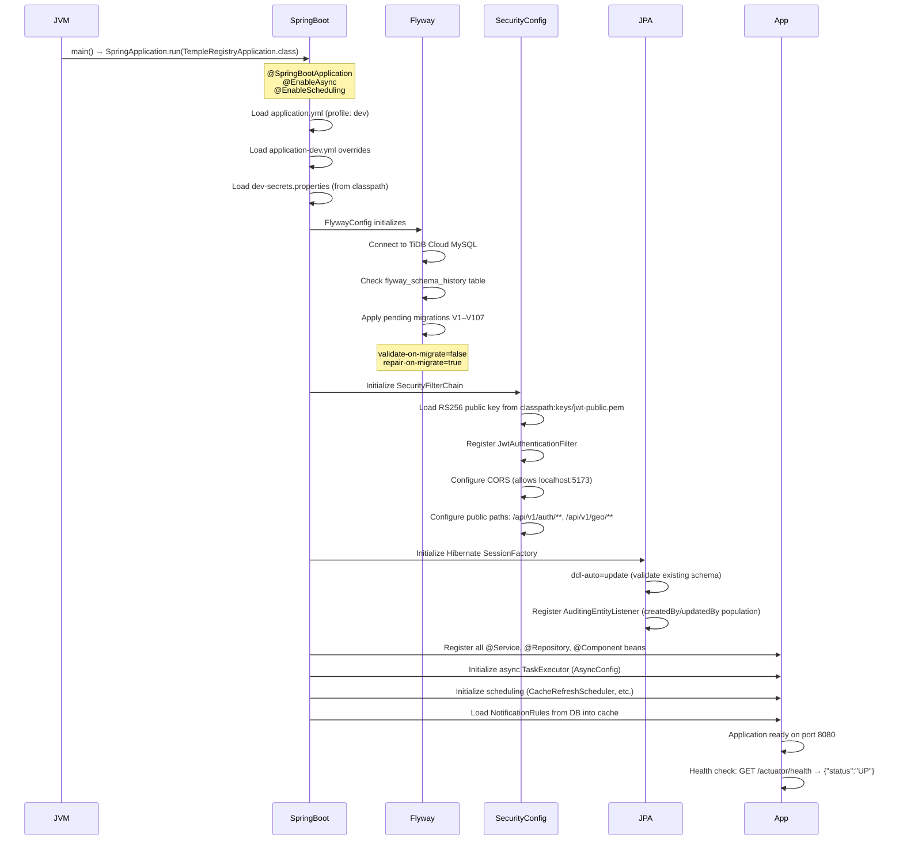
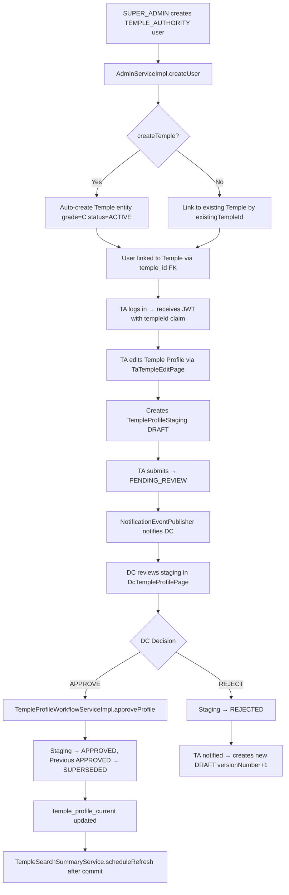
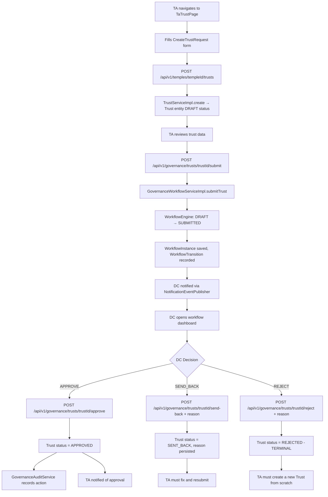
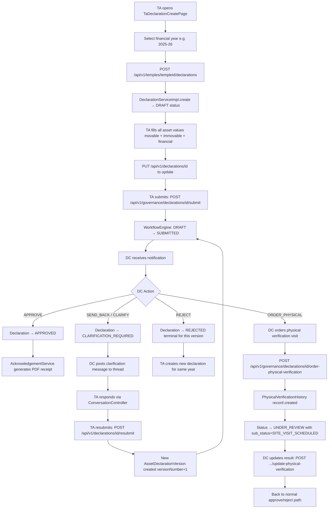
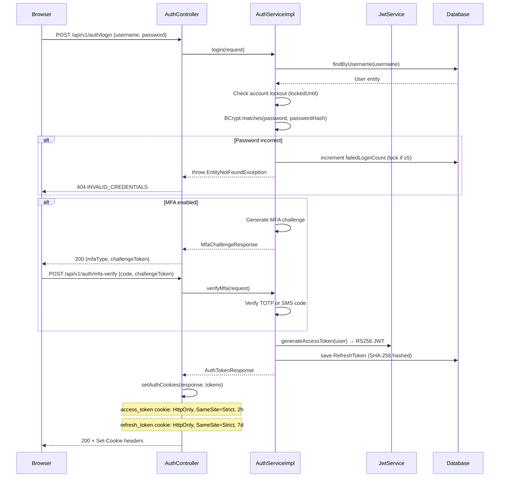
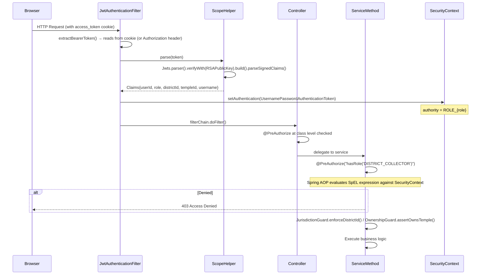
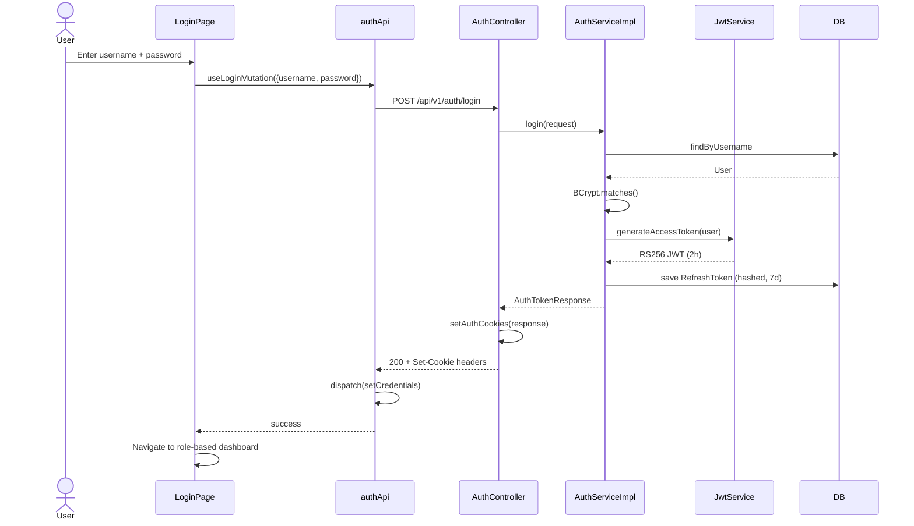
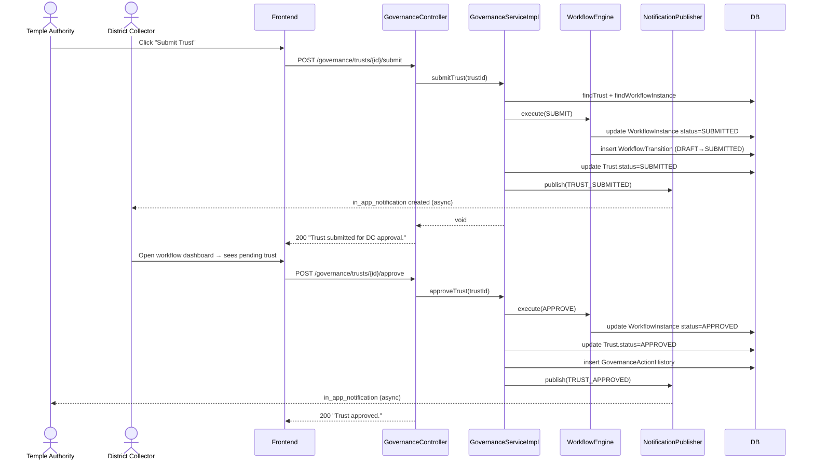
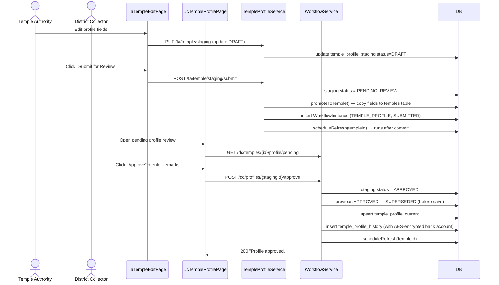
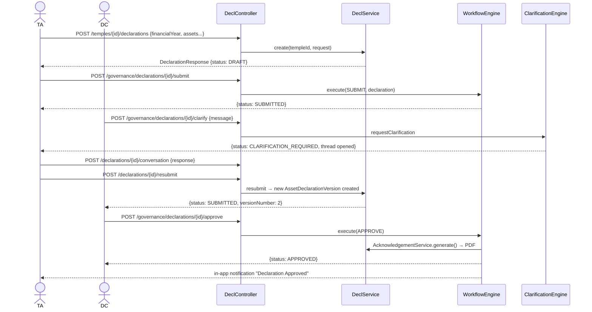

# Temple Registry Management System (TRM)
# Project Workflow & Architecture Document

> **Document Type:** Official Technical Architecture Guide  
> **Audience:** New Developers · Technical Leads · Architects · QA Teams · Product Owners · Government Stakeholders · Future Maintainers  
> **Source:** Derived exclusively from codebase analysis (no assumptions)  
> **Date Generated:** June 2026  

---

## Table of Contents

1. [Executive Summary](#1-executive-summary)
2. [High-Level System Architecture](#2-high-level-system-architecture)
3. [Application Startup Flow](#3-application-startup-flow)
4. [User Role Architecture](#4-user-role-architecture)
5. [Complete Module Breakdown](#5-complete-module-breakdown)
6. [End-to-End Business Workflows](#6-end-to-end-business-workflows)
7. [Database Architecture](#7-database-architecture)
8. [API Architecture](#8-api-architecture)
9. [Authentication & Authorization Flow](#9-authentication--authorization-flow)
10. [Frontend Workflow](#10-frontend-workflow)
11. [Backend Request Lifecycle](#11-backend-request-lifecycle)
12. [Module Dependency Map](#12-module-dependency-map)
13. [Notification Flow](#13-notification-flow)
14. [File & Document Management Flow](#14-file--document-management-flow)
15. [Reporting & Analytics Flow](#15-reporting--analytics-flow)
16. [Security Architecture](#16-security-architecture)
17. [Complete System Sequence Diagrams](#17-complete-system-sequence-diagrams)
18. [Application Flow: Day 1 to Day N](#18-application-flow-day-1-to-day-n)
19. [Technical Debt & Improvement Opportunities](#19-technical-debt--improvement-opportunities)
20. [Architect's Summary](#20-architects-summary)

---

## 1. EXECUTIVE SUMMARY

### Project Overview

The **Temple Registry Management System (TRM)** is a government-grade digital platform for the registration, governance, and regulatory oversight of Hindu temples within a state's jurisdiction. It replaces manual paper-based processes with a structured, role-gated, audit-complete digital workflow.

### Purpose of the System

TRM enables:
- **Systematic registration** of temples with district-level classification
- **Governance workflows** where Temple Authorities submit trust registrations, asset declarations, and profile updates for District Collector (DC) approval
- **Audit and compliance** functions for government auditors and state-level viewers
- **Administrative oversight** by a Super Admin who manages users, geographic data, and system configuration

### Business Goals

1. Create a single source of truth for all registered temples in a state
2. Enforce a government-approved staging → approval workflow for all data mutations
3. Prevent unauthorized data changes via role-based access control
4. Generate auditable trails for every data event, workflow transition, and login
5. Support district-scoped data isolation (each DC sees only their jurisdiction)
6. Enable compliance reporting, data export (CSV/PDF), and dashboard analytics

### Target Users

| Role | Persona |
|---|---|
| `SUPER_ADMIN` | System administrator — manages users, geo data, and system configuration |
| `DISTRICT_COLLECTOR` | Government officer who reviews, approves, or rejects temple submissions |
| `DC_STAFF` | Supporting staff to the District Collector (limited write access) |
| `TEMPLE_AUTHORITY` | Temple management representative who submits and manages temple data |
| `AUDITOR` | Independent compliance officer — read-only plus can raise observations |
| `VIEWER` | State government official — read-only statewide access |

### Major Capabilities

- Temple registration and profile management with staged approval
- Trust registration with board member management
- Asset declaration (immovable + movable) per financial year
- Employee and contractor management
- Document upload and retrieval (local filesystem storage)
- In-app notification system with email (optional) via Thymeleaf templates
- Governance workflow engine (DRAFT → SUBMITTED → APPROVED / REJECTED / SENT_BACK)
- Physical verification ordering and tracking
- Compliance reporting, audit trail, and data export (CSV/PDF)
- Notice board for district or system-wide announcements
- Access control with policy-based data visibility per role

---

## 2. HIGH-LEVEL SYSTEM ARCHITECTURE

### Component Diagram

```
┌─────────────────────────────────────────────────────────────────────┐
│                         CLIENT LAYER                                │
│  Browser (React 18 + TypeScript + Vite)                             │
│  Shadcn UI · Redux Toolkit · RTK Query · Zod · React Router v6     │
└──────────────────────────────┬──────────────────────────────────────┘
                               │ HTTPS / REST (JSON)
                               │ JWT in httpOnly cookie (access_token)
                               │ refresh_token in httpOnly cookie
                               ▼
┌─────────────────────────────────────────────────────────────────────┐
│                        API GATEWAY LAYER                            │
│  Spring Boot 3.4.4 · Java 21 · Port 8080                            │
│  CorsConfig (allows localhost:5173/5174)                            │
│  JwtAuthenticationFilter (OncePerRequestFilter)                     │
│  GlobalExceptionHandler (@RestControllerAdvice)                     │
└──────────────────────────────┬──────────────────────────────────────┘
                               │
                               ▼
┌─────────────────────────────────────────────────────────────────────┐
│                       CONTROLLER LAYER                              │
│  @RestController beans — 30+ controllers grouped by domain          │
│  Validation: @Valid on all request bodies                           │
│  No business logic. No try-catch.                                   │
└──────────────────────────────┬──────────────────────────────────────┘
                               │
                               ▼
┌─────────────────────────────────────────────────────────────────────┐
│                        SERVICE LAYER                                │
│  Interface + Impl pattern for every service                         │
│  @PreAuthorize on all write methods                                 │
│  @Transactional on writes; @Transactional(readOnly=true) on reads   │
│  Business logic, domain validation, workflow orchestration          │
└──────────────────────────────┬──────────────────────────────────────┘
                               │
                               ▼
┌─────────────────────────────────────────────────────────────────────┐
│                      REPOSITORY LAYER                               │
│  Spring Data JPA repositories                                       │
│  @EntityGraph / JOIN FETCH to prevent N+1 queries                  │
│  Custom JPQL queries for complex filtering                          │
└──────────────────────────────┬──────────────────────────────────────┘
                               │
                               ▼
┌─────────────────────────────────────────────────────────────────────┐
│                        DATABASE LAYER                               │
│  MySQL (hosted: TiDB Cloud — ap-southeast-1)                        │
│  Flyway migrations V1–V107 (schema management)                     │
│  HikariCP connection pool (max 8 connections)                       │
└─────────────────────────────────────────────────────────────────────┘
```

### Layer Diagram (Request Flow)

```
User Request
     │
     ▼
Frontend (React/RTK Query)
     │ REST JSON
     ▼
JwtAuthenticationFilter ← validates RS256 JWT from cookie or Bearer header
     │
     ▼
@RestController (e.g., DcTempleController, DeclarationController)
     │ @Valid, ResponseEntity
     ▼
@Service (e.g., DcTempleProfileServiceImpl, GovernanceWorkflowServiceImpl)
     │ @PreAuthorize, @Transactional
     ▼
@Repository (e.g., TempleRepository, DeclarationRepository)
     │ JPA/JPQL
     ▼
MySQL (TiDB Cloud)
     │
     ▼ (return path)
ApiResponse<T> / PaginatedResponse<T>
     │
     ▼
Frontend (Redux slice / RTK Query cache updated)
     │
     ▼
React Component re-renders
```

### External Integrations

| Integration | Status | Details |
|---|---|---|
| **TiDB Cloud (MySQL)** | Active | Primary database hosted on AWS ap-southeast-1 via TiDB Cloud |
| **AWS S3** | Removed | File storage replaced by `LocalFileStorageServiceImpl` |
| **SMTP (Gmail)** | Optional | JavaMailSender + Thymeleaf; `spring.mail.enabled=false` by default |
| **Swagger/OpenAPI** | Active | Available at `/swagger-ui.html` and `/v3/api-docs` |
| **Spring Actuator** | Active | `/actuator/health`, `/actuator/info` are public endpoints |

---

## 3. APPLICATION STARTUP FLOW

### Backend Startup Sequence



### Frontend Startup Sequence

```
index.html loads
     ↓
main.tsx → ReactDOM.createRoot()
     ↓
App.tsx → Redux <Provider store={store}>
     ↓
AppRouter (createBrowserRouter)
     ↓
ErrorBoundary wraps entire app
     ↓
PrivateRoute checks Redux auth state
     ↓
  ├── No token → redirect to /login
  └── Token present → AppShell loads
         ↓
      Role-based route rendering (RoleRoute)
         ↓
      Lazy-loaded page component renders
         ↓
      RTK Query hooks fire API calls
         ↓
      Loading/Error/Data states handled per component
```

---

## 4. USER ROLE ARCHITECTURE

Defined in `com.templeregistry.entity.auth.UserRole` and `com.templeregistry.security.RoleConstants`.

### Role Matrix

| Role | Assigned To | District Scoped? | Write Access | Approval Authority |
|---|---|---|---|---|
| `SUPER_ADMIN` | System Administrator | No (all districts) | Full | Can approve all |
| `DISTRICT_COLLECTOR` | DC Office | Yes (own district) | Governance actions | Approve/Reject/Send-Back |
| `DC_STAFF` | DC Support Staff | Yes (own district) | Limited (read + mark notifications) | None |
| `TEMPLE_AUTHORITY` | Temple Representative | Yes (own temple) | Own temple data only | None — submitter only |
| `AUDITOR` | Compliance Officer | No (all districts) | Read-only + raise observations | None |
| `VIEWER` | State Government Official | No (all districts) | Read-only | None |

### Detailed Role Descriptions

#### SUPER_ADMIN
- **Purpose:** Platform administrator and super-user
- **Permissions:** `ADMIN_ONLY` guard (`hasRole('SUPER_ADMIN')`)
- **Accessible Modules:** All modules including user management, geo management, system config, notification rules, and governance
- **Restricted Modules:** None
- **Key Capabilities:**
  - Create/update/deactivate users of all roles
  - Assign districts to DC users
  - Manage geographic hierarchy (State → City → District → Taluk → Hobli)
  - Configure notification rules
  - View audit logs
  - Access all DC, Auditor, and Viewer pages
  - Manage temple governance directly

#### DISTRICT_COLLECTOR
- **Purpose:** Government approving authority for a specific district
- **Permissions:** `CAN_ACT_DC` = `hasAnyRole('SUPER_ADMIN', 'DISTRICT_COLLECTOR')`
- **Accessible Modules:** DC Dashboard, Temple Search/Profile, Declarations, Trust workflow, Notices, Export, Workflow Dashboard
- **District Scoping:** JWT `districtId` claim restricts all data queries to the assigned district via `JurisdictionGuard`
- **Key Capabilities:**
  - Approve/Reject/Send-Back trust registrations
  - Approve/Reject/Clarify asset declarations
  - Approve/Reject temple profile updates
  - Order and record physical verification visits
  - Export temple and declaration data (CSV/PDF)
  - Publish/manage notices

#### DC_STAFF
- **Purpose:** Supporting staff to the DC — read-heavy role
- **Permissions:** `CAN_WRITE_DC` = `hasAnyRole('SUPER_ADMIN', 'DISTRICT_COLLECTOR', 'DC_STAFF')`
- **Accessible Modules:** Same DC pages as DISTRICT_COLLECTOR but cannot approve/reject
- **Restrictions:** Cannot perform governance actions (approve/reject/send-back)

#### TEMPLE_AUTHORITY
- **Purpose:** Temple management representative managing a single assigned temple
- **Permissions:** `CAN_SUBMIT` = `hasAnyRole('SUPER_ADMIN', 'TEMPLE_AUTHORITY')`
- **Accessible Modules:** TA Dashboard, Temple Profile, Trust, Employees, Contractors, Documents, Declarations, Notifications
- **Temple Scoping:** JWT `templeId` claim restricts all data to the assigned temple via `OwnershipGuard`
- **Key Capabilities:**
  - Edit temple profile (staged → submitted for DC review)
  - Create and submit trust registrations
  - Add board members and financial records
  - Manage employees and contractors
  - Upload documents
  - Create and submit asset declarations (annual)
  - Respond to DC clarification requests

#### AUDITOR
- **Purpose:** Read-only compliance officer who can raise observations
- **Permissions:** `AUDITOR_ONLY` = `hasRole('AUDITOR')`; `CAN_RAISE_OBSERVATION` = `hasAnyRole('AUDITOR', 'SUPER_ADMIN')`
- **Accessible Modules:** Auditor Dashboard, Temple Search/Profile, Declarations, Observations, Compliance Reports, Audit Trail
- **Important Exception:** Auditors have ONE write permission — raising observations. All other actions are read-only.

#### VIEWER
- **Purpose:** State-level government official — statewide read access
- **Permissions:** `CAN_READ_ALL` = `hasAnyRole('SUPER_ADMIN', 'DISTRICT_COLLECTOR', 'DC_STAFF', 'AUDITOR', 'VIEWER')`
- **Accessible Modules:** Viewer Dashboard, Temple Search/Profile, Declarations, Compliance Reports, Audit Trail, Export
- **Restrictions:** No write access whatsoever; no district restriction

---

## 5. COMPLETE MODULE BREAKDOWN

### 5.1 Authentication Module

**Package:** `com.templeregistry.controller.auth`, `com.templeregistry.service.auth`, `com.templeregistry.service.impl.auth`

#### Purpose
Handles all authentication including login, MFA, JWT issuance, token refresh, logout, and password reset.

#### Controllers
- `AuthController` — `GET/POST /api/v1/auth/**`
- `RegistrationController` — `POST /api/v1/auth/register` (ADMIN_ONLY, hidden from Swagger)

#### Services
- `AuthService` / `AuthServiceImpl` — login, verifyMfa, refresh, logout, password reset
- `JwtService` / `JwtServiceImpl` — RS256 JWT sign and verify using `jwt-private.pem` / `jwt-public.pem`
- `MfaService` / `MfaServiceImpl` — TOTP and SMS MFA
- `UserProfileService` / `UserProfileServiceImpl` — `GET /api/v1/auth/me`

#### Entities / Tables
- `User` → `users` table
- `RefreshToken` → `refresh_tokens` table
- `MfaRecoveryCode` → `mfa_recovery_codes` table

#### Security Features
- BCrypt password encoding (`BCryptPasswordEncoder`)
- Account lockout: 5 failed attempts → 30-minute lock (`lockedUntil`)
- Refresh token rotation (7-day expiry, stored as SHA-256 hash)
- Access token stored in `SameSite=Strict; HttpOnly; Secure` cookie (`access_token`, 2h expiry)
- Refresh token stored in `SameSite=Strict; HttpOnly; Secure` cookie (`refresh_token`, 7d expiry)
- MFA: TOTP (Google Authenticator) or SMS OTP

#### APIs
| Method | Path | Description |
|---|---|---|
| POST | `/api/v1/auth/login` | Username/password login → tokens or MFA challenge |
| POST | `/api/v1/auth/mfa-verify` | Complete MFA step → set auth cookies |
| POST | `/api/v1/auth/refresh` | Rotate refresh token → new auth cookies |
| POST | `/api/v1/auth/logout` | Revoke refresh token, clear cookies |
| GET | `/api/v1/auth/me` | Get current user profile + effective permissions |
| POST | `/api/v1/auth/forgot-password` | Send password reset email |
| POST | `/api/v1/auth/reset-password` | Complete password reset via token |
| POST | `/api/v1/auth/register` | Create TA account (ADMIN_ONLY) |

---

### 5.2 Geo (Geographic Hierarchy) Module

**Package:** `com.templeregistry.controller.geo`, `com.templeregistry.service.geo`

#### Purpose
Manages the 5-level geographic hierarchy used to scope all district-related data.

#### Hierarchy
```
State
  └── City
        └── District
              └── Taluk
                    └── Hobli
```

#### Entities / Tables
- `State` → `states`
- `City` → `cities`
- `District` → `districts`
- `Taluk` → `taluks`
- `Hobli` → `hoblis`

#### APIs (all public — no auth required)
| Method | Path | Description |
|---|---|---|
| GET | `/api/v1/geo/states` | List all states |
| GET | `/api/v1/geo/states/{id}/cities` | Cities within a state |
| GET | `/api/v1/geo/cities/{id}/districts` | Districts within a city |
| GET | `/api/v1/geo/districts/{id}/taluks` | Taluks within a district |
| GET | `/api/v1/geo/taluks/{id}/hoblis` | Hoblis within a taluk |
| GET | `/api/v1/geo/districts` | All districts (flat list, sorted by name) |

---

### 5.3 Temple Module

**Package:** `com.templeregistry.controller.temple`, `com.templeregistry.service.temple`

#### Purpose
Core temple entity management — CRUD, photo management, public search.

#### Controllers
- `TempleController` — base temple endpoints

#### Services
- `TempleService` / `TempleServiceImpl` — CRUD, photo upload/serve, grade management
- `TempleSearchSummaryService` / `TempleSearchSummaryServiceImpl` — denormalized search index management
- `TempleProfileStagingService` / `TempleProfileStagingServiceImpl` — staging profile lifecycle

#### Entities / Tables
- `Temple` → `temples` (main temple table)
- `TemplePhoto` → `temple_photos`
- `TempleProfileStaging` → `temple_profile_staging` (pending edits awaiting DC approval)
- `TempleSearchSummary` → `temple_search_summary` (denormalized read table for fast search)

#### Key Fields in `Temple`
- `registrationNumber` (unique, format: `KA-TMP-{UUID8}`)
- `grade` (ENUM: A, B, C — nullable)
- `primaryDeity`
- `tradition` (ENUM: `ReligiousTradition`)
- `districtId`, `talukId`, `hobliId`, `cityId` (geo linkage)
- `latitude`, `longitude`, `placeId`, `formattedAddress` (GPS)
- `status` (ENUM: `TempleStatus` — ACTIVE, INACTIVE, SUSPENDED, ARCHIVED)
- `@Version lockVersion` (optimistic locking)

#### Public APIs (no auth)
| Method | Path | Description |
|---|---|---|
| GET | `/api/v1/temples` | Public paginated temple search |
| GET | `/api/v1/temples/{id}/profile-photo/serve` | Serve profile photo |
| GET | `/api/v1/temples/{id}/photos/{photoId}/serve` | Serve specific photo |

#### Protected APIs
| Method | Path | Auth | Description |
|---|---|---|---|
| GET | `/api/v1/temples/{id}` | Authenticated | Get temple detail |
| PUT | `/api/v1/temples/{id}` | `CAN_SUBMIT` | Update temple |
| DELETE | `/api/v1/temples/{id}` | `ADMIN_ONLY` | Soft-delete temple |
| POST | `/api/v1/temples/{id}/photos` | `CAN_SUBMIT` | Upload photo |
| DELETE | `/api/v1/temples/{id}/photos/{photoId}` | Authenticated + ownership | Delete photo |

---

### 5.4 Temple Profile Module (Staging Workflow)

**Package:** `com.templeregistry.controller.dc.DcProfileController`, `com.templeregistry.service.temple.TempleProfileStagingService`

#### Purpose
Implements the staged edit workflow for temple profile data. Temple Authority creates a `DRAFT`, edits it, submits for DC review, and DC approves/rejects.

#### Status Lifecycle
```
DRAFT → PENDING_REVIEW (displayed as SUBMITTED in API) → APPROVED → SUPERSEDED (on next approval)
                                                        → REJECTED  → new DRAFT (version+1)
```

#### Tables
- `temple_profile_staging` — staging record with all editable profile fields
- `temple_profile_current` — the current approved profile snapshot
- `temple_profile_history` — historical approved versions (bank account number AES-encrypted)

#### Services
- `TempleProfileStagingServiceImpl` — create draft, submit, promote to temple
- `TempleProfileWorkflowServiceImpl` — DC approve/reject
- `DcTempleProfileServiceImpl` — DC full profile aggregation

#### Related Controllers (TA side)
- `TaDashboardController` — profile status endpoint

#### Related Controllers (DC side)
- `DcProfileController` — approve/reject profile
- `DcTempleController` — get pending staging, get full profile

---

### 5.5 Trust Module

**Package:** `com.templeregistry.controller.trust.TrustController`, `com.templeregistry.service.trust`

#### Purpose
Manages trust registrations, board members, financials, and board meetings for each temple.

#### Entities / Tables
- `Trust` → `trusts` (trust registration; bank account AES-encrypted; `@Version lockVersion`)
- `BoardMember` → `board_members`
- `TrustFinancial` → `trust_financials`
- `BoardMeeting` → `board_meetings`

#### Workflow
Trust follows the governance workflow: `DRAFT → SUBMITTED → APPROVED / SENT_BACK / REJECTED`  
Submission goes through `GovernanceWorkflowController` and `GovernanceWorkflowServiceImpl`.

#### APIs (all under `/api/v1/`)
| Method | Path | Auth | Description |
|---|---|---|---|
| GET | `/temples/{templeId}/trusts` | `CAN_READ_ALL or TA` | List trusts |
| POST | `/temples/{templeId}/trusts` | `CAN_SUBMIT` | Create trust |
| GET | `/trusts/{id}` | `CAN_READ_ALL or TA` | Get trust detail |
| PUT | `/trusts/{id}` | `CAN_SUBMIT` | Update trust |
| GET | `/trusts/{trustId}/board-members` | `CAN_READ_ALL or TA` | List board members |
| POST | `/trusts/{trustId}/board-members` | `CAN_SUBMIT` | Add board member |
| GET | `/trusts/{trustId}/financials` | `CAN_READ_ALL or TA` | List financials |
| POST | `/trusts/{trustId}/financials` | `CAN_SUBMIT` | Add financial year data |
| POST | `/governance/trusts/{trustId}/submit` | `CAN_SUBMIT` | Submit trust for DC |
| POST | `/governance/trusts/{trustId}/approve` | `CAN_ACT_DC` | Approve trust |
| POST | `/governance/trusts/{trustId}/send-back` | `CAN_ACT_DC` | Send back with reason |
| POST | `/governance/trusts/{trustId}/reject` | `CAN_ACT_DC` | Reject trust (terminal) |

---

### 5.6 Asset Declaration Module

**Package:** `com.templeregistry.controller.declaration`, `com.templeregistry.service.declaration`

#### Purpose
Annual asset declaration (immovable + movable assets, financials) for each temple per financial year. Follows the same governance approval workflow.

#### Entities / Tables
- `AssetDeclaration` → `asset_declarations` (`@Version lockVersion`, `versionNumber` for resubmission)
- `AssetDeclarationVersion` → `asset_declaration_versions` (historical versions on reject/resubmit)
- `DeclarationClarification` → `declaration_clarifications` (DC ↔ TA conversation)

#### Asset Fields
- **Immovable:** `agriculturalLandAcres/Value`, `buildingsSqft/Value`, `leasedPropertiesCount/Value`, `otherLandValue`
- **Movable:** `goldGrams`, `silverGrams`, `idolsCount`, `cashOnHandValue`, `fixedDepositsValue`, `otherInvestmentsValue`
- **Financial:** `annualIncome`, `annualExpenditure`, `donationsReceived`, `govGrantsReceived`

#### Workflow
Same governance workflow. DC can additionally request **clarification** (CLARIFICATION_REQUIRED state), to which the TA must respond before resubmitting.

#### Controllers
- `DeclarationController` — base CRUD
- `ConversationController` — clarification thread management
- `DcDeclarationController` — DC-side list and detail view

---

### 5.7 Employee Module

**Package:** `com.templeregistry.controller.employee.EmployeeController`, `com.templeregistry.service.employee`

#### Purpose
Manages temple staff (priests, admin staff, volunteers). **No DC approval workflow** — Temple Authority manages directly.

#### Entities / Tables
- `Employee` → `employees`

#### Key Fields
- `employeeType` (ENUM: `EmployeeType`)
- `status` (ENUM: `EmployeeStatus` — ACTIVE, INACTIVE, TERMINATED)
- `designations`, `salary`, `joiningDate`

#### APIs
| Method | Path | Auth | Description |
|---|---|---|---|
| GET | `/api/v1/temples/{templeId}/employees` | `CAN_READ_ALL or TA` | List employees |
| POST | `/api/v1/temples/{templeId}/employees` | `CAN_SUBMIT` | Create employee |
| GET | `/api/v1/employees/{id}` | `CAN_READ_ALL or TA` | Get employee detail |
| PUT | `/api/v1/employees/{id}` | `CAN_SUBMIT` | Update employee |
| DELETE | `/api/v1/employees/{id}` | `CAN_SUBMIT` | Soft-delete employee |

---

### 5.8 Contractor Module

**Package:** `com.templeregistry.controller.contractor.ContractorController`, `com.templeregistry.service.contractor`

#### Purpose
Manages external service providers hired by the temple. **No DC approval workflow.**

#### Entities / Tables
- `Contractor` → `contractors`

#### Key Fields
- `serviceType` (ENUM: `ServiceType`, stored via `ServiceTypeConverter`)
- `paymentStatus` (ENUM: `PaymentStatus`, stored via `PaymentStatusConverter`)
- `contractValue`, `contractStartDate`, `contractEndDate`

---

### 5.9 Document Module

**Package:** `com.templeregistry.controller.document.DocumentController`, `com.templeregistry.service.document`

#### Purpose
Upload, store, and retrieve supporting documents (PDFs, images) linked to any entity (temple, trust, declaration, etc.).

#### Entities / Tables
- `Document` → `documents`
- `DocumentAccessLog` → `document_access_logs`

#### Storage
Local filesystem via `LocalFileStorageServiceImpl`. Base directory configured as `./uploads`. **AWS S3 integration has been removed.**

#### Security
- File type restriction: PDF, JPG, PNG (max 5 MB)
- Access control enforced at service layer
- Download/preview endpoints log access to `DocumentAccessLog`

#### APIs
| Method | Path | Auth | Description |
|---|---|---|---|
| POST | `/api/v1/documents/upload` | `CAN_SUBMIT` | Upload file |
| GET | `/api/v1/documents/{id}` | `CAN_READ_ALL or TA` | Get document metadata |
| GET | `/api/v1/documents/{id}/url` | `CAN_READ_ALL or TA` | Get 15-min presigned URL |
| GET | `/api/v1/documents/{id}/download` | `CAN_READ_ALL or TA` | Download file |
| GET | `/api/v1/documents/{id}/preview` | `CAN_READ_ALL or TA` | Preview in browser |
| GET | `/api/v1/documents/download` | `CAN_READ_ALL or TA` | Download by storage key |

---

### 5.10 Governance Workflow Module

**Package:** `com.templeregistry.controller.governance`, `com.templeregistry.service.governance`

#### Purpose
**Single source of truth** for all workflow transitions across Trust, Declaration, and Temple Profile. Implements the state machine for the approval lifecycle.

#### Controllers
- `GovernanceWorkflowController` — all submit/approve/reject/send-back/clarify endpoints
- `GovernanceV2Controller` — extended governance actions (physical verification, send-back with reason)
- `WorkflowController` — workflow instance status queries
- `WorkflowHistoryController` — workflow transition history
- `ActionContextResolver` — resolves action context for a given entity

#### Key Service: `GovernanceWorkflowServiceImpl`
Handles: `submitTrust`, `approveTrust`, `sendBackTrust`, `rejectTrust`, `submitDeclaration`, `withdrawDeclaration`, `approveDeclaration`, `rejectDeclaration`, `clarifyDeclaration`, `orderPhysicalVerification`, `recordPhysicalVerification`

#### Workflow Engine
- `WorkflowEngine` — state machine executor
- `WorkflowEngineAdaptor` — adapts domain calls to engine format
- `WorkflowInstance` → `workflow_instances` table — single source of truth for workflow state
- `WorkflowTransition` → `workflow_transitions` table — audit trail of every state change

#### Optimistic Locking
Every workflow action requires the caller to supply `expectedVersion`. Stale version → `OptimisticLockException` → HTTP 409 Conflict.

---

### 5.11 Notification Module

**Package:** `com.templeregistry.controller.notification`, `com.templeregistry.service.notification`

#### Purpose
In-app notification inbox plus optional email delivery. Notifications are triggered by workflow events.

#### Controllers
- `NotificationController` — CRUD for in-app notifications
- `NotificationPreferenceController` — user notification preferences
- `NotificationSseController` — Server-Sent Events (SSE) for real-time push

#### Services
- `NotificationServiceImpl` — `@Async` notification dispatch
- `EmailServiceImpl` — Thymeleaf-based HTML email dispatch
- `NotificationEventPublisher` — publishes domain events to notification router
- `NotificationRouter` — routes events to recipients based on `notification_rules` table

#### Entities / Tables
- `InAppNotification` → `in_app_notifications`
- `NotificationRule` → `notification_rules` (declarative routing rules loaded at startup)
- `NotificationEvent` → `notification_events` (delivery record)
- `NotificationPreference` → `notification_preferences`
- `EmailDeliveryLog` → `email_delivery_logs`
- `EmailOutbox` → `email_outbox`
- `NotificationOutbox` → `notification_outbox`

#### SSE Endpoint
`GET /api/v1/notifications/stream?token={jwt}` — query-parameter JWT only allowed for SSE endpoints (browser EventSource cannot set Authorization headers).

---

### 5.12 Admin Module

**Package:** `com.templeregistry.controller.admin`, `com.templeregistry.service.admin`

#### Purpose
Super Admin management of users, geographic data, system configuration, and temple governance.

#### Controllers
- `AdminController` — user CRUD
- `AdminTempleController` — admin-level temple management
- `SystemConfigController` — system configuration key-value store
- `AccessControlController` — access control policy management

#### Services
- `AdminServiceImpl` — user creation with optional temple auto-creation
- `TempleGovernanceServiceImpl` — admin-level temple governance actions

#### User Creation Logic (`AdminServiceImpl.createUser`)
- Case 1 (`createTemple=true`): Auto-creates a minimal Temple (grade=C) in the same transaction, links `user.templeId`
- Case 2 (`createTemple=false`, `existingTempleId` provided): Links user to existing (non-ARCHIVED) temple

---

### 5.13 DC Module (District Collector Portal)

**Package:** `com.templeregistry.controller.dc`, `com.templeregistry.service.dc`

#### Purpose
All operations from the District Collector's perspective — dashboard, temple search, declaration review, workflow management, export.

#### Controllers
- `DcDashboardController` — metrics and KPIs for district
- `DcTempleController` — district-scoped temple search and profile
- `DcDeclarationController` — declaration list and detail view for DC
- `DcProfileController` — temple profile approval
- `DcBoardMemberController` — board member verification
- `DcExportController` — export temples/declarations as CSV or PDF
- `DcEmployeeController` — DC view of temple employees
- `DcNotificationController` — DC notification management
- `DcWorkflowDashboardController` — cross-module pending items dashboard
- `DcContextController` — resolve current user's DC context

#### Dashboard Metrics (`DcDashboardServiceImpl`)
Reads from `temple_search_summary` table (denormalized):
- `totalTemples` — count in district
- `pendingDeclarations` — sum of SUBMITTED declarations
- `overdueDeclarations` — declarations flagged as overdue
- `pendingProfileReviews` — pending staging records
- `templesWithoutApprovedDeclaration` — compliance gap

#### District Scoping
`JurisdictionGuard.enforceDistrictId()` ensures DC users can only query their assigned district. `SUPER_ADMIN` bypasses this (sees all districts).

---

### 5.14 TA Module (Temple Authority Portal)

**Package:** `com.templeregistry.controller.ta.TaDashboardController`, `com.templeregistry.service.ta`

#### Purpose
Temple Authority's dashboard, profile status, activity feed.

#### Controllers
- `TaDashboardController` — TA dashboard, profile status, activity summary

#### Services
- `TaDashboardServiceImpl` — reads `WorkflowInstance` for profile status, computes activity summary

---

### 5.15 Audit Module

**Package:** `com.templeregistry.service.audit`

#### Purpose
Append-only audit trail for all data mutations and authentication events. **Never extended by BaseEntity — immutable once written.**

#### Entities / Tables
- `AuditDataEvent` → `audit_data_events` (CREATE/UPDATE/DELETE mutations)
- `AuditAuthEvent` → `audit_auth_events` (login, logout, MFA, lockout)
- `AuditExportEvent` → `audit_export_events` (data export operations)
- `GovernanceActionHistory` → `governance_action_history` (approve/reject/send-back records)

#### Controller
- `AuditorController` — audit trail queries for AUDITOR and SUPER_ADMIN

---

### 5.16 Observation Module

**Package:** `com.templeregistry.controller.observation.ObservationController`

#### Purpose
Auditor compliance observations. Auditors raise observations; Admin assigns and closes them.

#### Lifecycle
```
OPEN → ASSIGNED → UNDER_REVIEW → CLOSED
```

#### Entities / Tables
- `Observation` → `observations`

#### Key Fields
- `severity` (ENUM: `ObservationSeverity` — LOW, MEDIUM, HIGH, CRITICAL)
- `status` (ENUM: `ObservationStatus` — OPEN, ASSIGNED, UNDER_REVIEW, CLOSED)
- `entityType` — what the observation is about (TEMPLE, DECLARATION, TRUST, etc.)
- `raisedByUserId`

---

### 5.17 Notice Module

**Package:** `com.templeregistry.controller.notice.NoticeController`

#### Purpose
Official notice board for publishing government notices to temple authorities or district-wide.

#### Entities / Tables
- `Notice` → `notices` (`@Version` for optimistic locking)
- `NoticeAttachment` → `notice_attachments`
- `NoticeRead` → `notice_reads` (tracks which users have read each notice)

#### Scopes
- `DISTRICT` — visible only to temples in the specified district
- `ALL` — system-wide notice (published by SUPER_ADMIN)

---

### 5.18 Export Module

**Package:** `com.templeregistry.controller.dc.DcExportController`, `com.templeregistry.service.dc.DcExportService`

#### Purpose
Exports temple lists and declaration lists as CSV or PDF for district-level reporting.

#### Behavior
- **Sync (< 500 rows):** Returns file immediately (HTTP 200)
- **Async (≥ 500 rows):** Kicks off background job, returns `ExportJobRecord` ID (HTTP 202), client polls for completion
- **Idempotency:** `Idempotency-Key` header prevents duplicate export jobs
- **Max rows:** 5,000 per export

#### Entities / Tables
- `ExportJobRecord` → `export_job_records`

---

### 5.19 Timeline Module

**Package:** `com.templeregistry.controller.TempleTimelineController`

#### Purpose
Provides a chronological event timeline for a specific temple aggregating workflow transitions, document uploads, and governance actions.

---

### 5.20 Access Control Module

**Package:** `com.templeregistry.controller.admin.AccessControlController`, `com.templeregistry.service.accesscontrol`

#### Purpose
Policy-based data visibility control. Defines which roles can see which data based on `DacvmTabPagePolicy` entries (from migrations V10, V11, V12).

#### Tables
- `dacvm_tab_page_policies` — tab/page-level visibility rules
- Evaluated by `PolicyEvaluationService`

---

### 5.21 Viewer Module

**Package:** `com.templeregistry.controller.viewer.ViewerDashboardController`

#### Purpose
Read-only statewide dashboard for state government officials.

---

## 6. END-TO-END BUSINESS WORKFLOWS

### 6.1 Temple Registration Workflow



### 6.2 Trust Registration Workflow



### 6.3 Asset Declaration Workflow



### 6.4 Login and Authentication Workflow

```
User enters username + password
           ↓
POST /api/v1/auth/login
           ↓
AuthServiceImpl.login()
      ├── Check account not locked (lockedUntil)
      ├── BCrypt.matches(password, passwordHash)
      ├── On failure: increment failedLoginCount, lock if ≥ 5
      ├── On success: reset failedLoginCount, set lastLoginAt
      └── MFA enabled? → return MfaChallengeResponse (mfaType, challengeToken)
               │
     No MFA ───┤
               ↓
      JwtService.generateAccessToken(user) → RS256 JWT (2h)
      JwtService.generateRefreshToken(user) → opaque token (7d), stored hashed
           ↓
      Set HttpOnly cookies: access_token + refresh_token
           ↓
      Frontend receives AuthTokenResponse
      Stores accessToken in Redux state (volatile)
      refresh_token stays in HttpOnly cookie only
           ↓
      GET /api/v1/auth/me → UserProfileResponse + EffectivePermissionsResponse
```

### 6.5 Compliance Observation Workflow

```
AUDITOR raises observation: POST /api/v1/observations
      ↓
Observation.status = OPEN
      ↓
SUPER_ADMIN assigns: POST /api/v1/observations/{id}/assign
      ↓
Observation.status = ASSIGNED
      ↓
SUPER_ADMIN marks under review: status = UNDER_REVIEW
      ↓
Resolution documented
      ↓
SUPER_ADMIN closes: POST /api/v1/observations/{id}/close
      ↓
Observation.status = CLOSED (terminal)
```

### 6.6 Data Export Workflow

```
DC/ADMIN initiates export: POST /api/v1/dc/export/temples (or /declarations)
      ├── Idempotency-Key header checked (deduplication)
      ├── JurisdictionGuard scopes districtId
      ├── Row count < 500?
      │    ├── YES: Generate file synchronously (CSV or PDF via ExportReportTemplate)
      │    │        Return file bytes directly HTTP 200
      │    └── NO:  Create ExportJobRecord → status=PENDING
      │             Start async job → status=IN_PROGRESS → COMPLETED/FAILED
      │             Return 202 Accepted with jobId
      │             Client polls: GET /api/v1/dc/export/jobs/{id}
      │             On COMPLETED: GET /api/v1/dc/export/download/{jobId}
      └── AuditService records export event in audit_export_events
```

### 6.7 Notice Publication Workflow

```
DC/ADMIN creates notice: POST /api/v1/notices
      ├── scope = DISTRICT → district_id required
      └── scope = ALL → no district filter

Notice published with status = PUBLISHED

Temple Authority sees notice in DcNoticesPage / dashboard
      ↓
TA reads notice: POST /api/v1/notices/{id}/mark-read
      ↓
NoticeRead record created (userId, noticeId, readAt)
```

---

## 7. DATABASE ARCHITECTURE

### 7.1 Entity Relationship Overview

```
states (1)
  └── (n) cities (1)
             └── (n) districts (1)
                          └── (n) taluks (1)
                                       └── (n) hoblis

users (n) ──────────────────── districts (1)  [users.district_id FK → districts.id]
users (n) ──────────────────── temples (1)   [users.temple_id FK → temples.id, ON DELETE SET NULL]
users (n) ──────────────────── cities (1)    [users.city_id FK → cities.id]

temples (1)
  ├── (n) temple_photos
  ├── (n) temple_profile_staging
  ├── (1) temple_profile_current
  ├── (n) temple_profile_history
  ├── (1) temple_search_summary          ← denormalized read model
  ├── (n) trusts (1)
  │          ├── (n) board_members
  │          ├── (n) trust_financials
  │          └── (n) board_meetings
  ├── (n) asset_declarations (1)
  │          ├── (n) asset_declaration_versions
  │          └── (n) declaration_clarifications
  ├── (n) employees
  ├── (n) contractors
  ├── (n) documents
  └── (n) observations

workflow_instances (1) ──── (n) workflow_transitions
  (linked via entity_type + entity_id — no FK constraint)

in_app_notifications → users
notification_rules (standalone config table)
notification_preferences → users

notices (1) ├── (n) notice_attachments
             └── (n) notice_reads → users

audit_data_events (append-only)
audit_auth_events (append-only)
audit_export_events (append-only)
governance_action_history (append-only)

dacvm_tab_page_policies (access control config)
idempotency_records (export dedup)
export_job_records (async export tracking)
```

### 7.2 Key Table Descriptions

| Table | Purpose | PK | Important Constraints |
|---|---|---|---|
| `users` | All user accounts | `id` (BIGINT AUTO) | UNIQUE on `username`, UNIQUE on `email`; `is_deleted` soft-delete |
| `temples` | Core temple registry | `id` | UNIQUE on `registration_number`; `@Version version`; `is_deleted` |
| `temple_profile_staging` | Pending profile edits | `id` | Index on `(temple_id, status)`; `is_deleted` |
| `temple_profile_current` | Active approved profile | `id` | One record per temple |
| `temple_search_summary` | Denormalized search index | `id` | UNIQUE on `temple_id`; rebuilt post-commit |
| `trusts` | Trust registrations | `id` | `@Version lock_version`; PAN + bank account AES-encrypted |
| `asset_declarations` | Annual asset declarations | `id` | `@Version lock_version`; UNIQUE on `(temple_id, financial_year)` |
| `workflow_instances` | Workflow state machine | `id` | UNIQUE on `(entity_type, entity_id)`; `@Version lock_version` |
| `workflow_transitions` | Workflow change history | `id` | Append-only |
| `audit_data_events` | Data mutation audit log | `id` | No BaseEntity, no soft-delete — immutable |
| `audit_auth_events` | Auth event log | `id` | No BaseEntity, immutable |
| `notification_rules` | Notification routing config | `id` | Loaded at startup, cached |
| `dacvm_tab_page_policies` | Access control rules | `id` | Loaded from V10/V11/V12 migrations |

### 7.3 Soft Delete Pattern

Every entity extending `BaseEntity` uses:
```
@SQLRestriction("is_deleted = false")   // automatically filters all queries
@SQLDelete(sql = "UPDATE ... SET is_deleted = true WHERE id = ?")  // overrides DELETE
```
This means **no data is ever physically deleted** from the database. All "deletes" are logical.

### 7.4 Audit Fields

Every `BaseEntity` has:
- `created_at` (auto-set on `@PrePersist`)
- `updated_at` (auto-set on `@PreUpdate`)
- `created_by` (populated by Spring JPA Auditing via `AuditingEntityListener`)
- `updated_by` (populated by Spring JPA Auditing via `AuditingEntityListener`)

---

## 8. API ARCHITECTURE

### 8.1 API Base Path and Response Format

**Base path:** `/api/v1/`

**Success response:**
```json
{
  "success": true,
  "message": "string",
  "data": {},
  "timestamp": "2026-06-01T10:00:00.000Z",
  "requestId": "uuid"
}
```

**Error response:**
```json
{
  "success": false,
  "message": "string",
  "errorCode": "ENTITY_NOT_FOUND",
  "errors": [],
  "timestamp": "2026-06-01T10:00:00.000Z",
  "requestId": "uuid"
}
```

**Paginated response (wraps inside `data`):**
```json
{
  "content": [],
  "page": 0,
  "size": 10,
  "totalElements": 100,
  "totalPages": 10,
  "last": false
}
```

### 8.2 API Groups by Module

#### Authentication APIs (`/api/v1/auth/`)
| Method | Path | Auth | Purpose |
|---|---|---|---|
| POST | `/login` | Public | Username/password authentication |
| POST | `/mfa-verify` | Public | Complete MFA challenge |
| POST | `/refresh` | Cookie | Rotate access+refresh tokens |
| POST | `/logout` | Cookie | Revoke session |
| GET | `/me` | JWT | Get current user + permissions |
| POST | `/forgot-password` | Public | Send reset email |
| POST | `/reset-password` | Public | Reset via token |
| POST | `/register` | ADMIN_ONLY | Create TA account |

#### Geo APIs (`/api/v1/geo/`) — All Public
| Method | Path | Purpose |
|---|---|---|
| GET | `/states` | All states |
| GET | `/states/{id}/cities` | Cities in state |
| GET | `/cities/{id}/districts` | Districts in city |
| GET | `/districts/{id}/taluks` | Taluks in district |
| GET | `/taluks/{id}/hoblis` | Hoblis in taluk |
| GET | `/districts` | All districts flat |

#### Temple APIs (`/api/v1/temples/`)
| Method | Path | Auth | Purpose |
|---|---|---|---|
| GET | `/` | Public | Public temple search (paginated) |
| GET | `/{id}` | JWT | Temple detail |
| PUT | `/{id}` | `CAN_SUBMIT` | Update temple |
| DELETE | `/{id}` | `ADMIN_ONLY` | Soft-delete |
| POST | `/{id}/photos` | `CAN_SUBMIT` | Upload photo |
| GET | `/{id}/profile-photo/serve` | Public | Serve profile photo |
| GET | `/{id}/photos/{photoId}/serve` | Public | Serve gallery photo |
| DELETE | `/{id}/photos/{photoId}` | JWT + ownership | Delete photo |
| GET | `/{id}/declarations` | JWT | List declarations |
| POST | `/{id}/declarations` | `CAN_SUBMIT` | Create declaration |
| GET | `/{id}/trusts` | `CAN_READ_ALL or TA` | List trusts |
| POST | `/{id}/trusts` | `CAN_SUBMIT` | Create trust |
| GET | `/{id}/employees` | `CAN_READ_ALL or TA` | List employees |
| POST | `/{id}/employees` | `CAN_SUBMIT` | Create employee |
| GET | `/{id}/contractors` | `CAN_READ_ALL or TA` | List contractors |

#### DC APIs (`/api/v1/dc/`)
| Method | Path | Auth | Purpose |
|---|---|---|---|
| GET | `/dashboard` | `CAN_READ_ALL` | DC dashboard metrics |
| GET | `/temples` | `CAN_READ_TEMPLES` | District-scoped temple search |
| GET | `/temples/{id}` | `CAN_READ_TEMPLES` | Full temple profile aggregate |
| GET | `/temples/{id}/profile/pending` | `CAN_READ_TEMPLES` | Pending profile staging |
| POST | `/temples/{id}/profile/verify` | `CAN_ACT_DC` | Verify temple profile |
| POST | `/declarations/{id}/approve` | `CAN_ACT_DC` | Approve declaration |
| POST | `/declarations/{id}/reject` | `CAN_ACT_DC` | Reject declaration |
| POST | `/export/temples` | `CAN_READ_ALL` | Export temples CSV/PDF |
| POST | `/export/declarations` | `CAN_READ_ALL` | Export declarations |
| GET | `/workflow-dashboard` | `CAN_READ_ALL` | Pending items by module |
| GET | `/activity` | `CAN_READ_ALL` | Recent activity feed |

#### Governance APIs (`/api/v1/governance/`)
| Method | Path | Auth | Purpose |
|---|---|---|---|
| POST | `/trusts/{id}/submit` | `CAN_SUBMIT` | Submit trust |
| POST | `/trusts/{id}/approve` | `CAN_ACT_DC` | Approve trust |
| POST | `/trusts/{id}/send-back` | `CAN_ACT_DC` | Send back trust |
| POST | `/trusts/{id}/reject` | `CAN_ACT_DC` | Reject trust |
| POST | `/declarations/{id}/submit` | `CAN_SUBMIT` | Submit declaration |
| POST | `/declarations/{id}/withdraw` | `CAN_SUBMIT` | Withdraw declaration |
| POST | `/declarations/{id}/approve` | `CAN_ACT_DC` | Approve declaration |
| POST | `/declarations/{id}/reject` | `CAN_ACT_DC` | Reject declaration |
| POST | `/declarations/{id}/clarify` | `CAN_ACT_DC` | Request clarification |
| POST | `/declarations/{id}/order-physical-verification` | `CAN_ACT_DC` | Order site visit |
| PUT | `/declarations/{id}/update-physical-verification` | `CAN_ACT_DC` | Record site visit result |

#### Admin APIs (`/api/v1/admin/`)
| Method | Path | Auth | Purpose |
|---|---|---|---|
| GET | `/users` | `ADMIN_ONLY` | List users (paginated) |
| POST | `/users` | `ADMIN_ONLY` | Create user |
| PUT | `/users/{id}` | `ADMIN_ONLY` | Update user |
| DELETE | `/users/{id}` | `ADMIN_ONLY` | Deactivate user |
| GET | `/audit-logs` | `ADMIN_ONLY` | Query audit logs |
| GET | `/temples/search` | `ADMIN_ONLY` | Search temples for assignment |
| GET | `/system-config` | `ADMIN_ONLY` | List system configs |
| PUT | `/system-config/{key}` | `ADMIN_ONLY` | Update config value |

#### Notification APIs (`/api/v1/notifications/`)
| Method | Path | Auth | Purpose |
|---|---|---|---|
| GET | `/` | JWT | List notifications (paginated) |
| POST | `/{id}/read` | JWT | Mark as read |
| POST | `/read-all` | JWT | Mark all as read |
| POST | `/{id}/acknowledge` | JWT | Acknowledge notification |
| DELETE | `/{id}` | JWT | Delete notification |
| DELETE | `/clear-all` | JWT | Clear all notifications |
| GET | `/stream` | JWT (query param) | SSE stream for real-time push |

---

## 9. AUTHENTICATION & AUTHORIZATION FLOW

### 9.1 JWT Architecture

**Algorithm:** RS256 (asymmetric — private key signs, public key verifies)  
**Key storage:** `classpath:keys/jwt-private.pem` (git-ignored), `classpath:keys/jwt-public.pem`  
**Access token expiry:** 2 hours (configurable: `app.jwt.access-token-expiry-ms`)  
**Refresh token expiry:** 7 days  

**JWT Claims structure:**
```json
{
  "sub": "username",
  "userId": 123,
  "role": "DISTRICT_COLLECTOR",
  "districtId": 45,
  "templeId": null,
  "accessType": "STANDARD",
  "iat": ...,
  "exp": ...
}
```

### 9.2 Authentication Sequence



### 9.3 Per-Request Authorization Flow



### 9.4 Guard Classes

| Guard | Class | Purpose |
|---|---|---|
| JWT Filter | `JwtAuthenticationFilter` | Validates token on every request |
| Jurisdiction | `JurisdictionGuard` | Enforces district-scoped access for DC roles |
| Ownership | `OwnershipGuard` | Ensures TA only accesses their own temple |
| Token Revocation | `TokenRevocationGuard` | Checks if refresh token has been revoked |
| Policy Enforcement | `PolicyEnforcementAspect` | AOP-based tab/page visibility enforcement |
| DACVM | `DacvmGuard` | Dynamic access control visibility matrix |

---

## 10. FRONTEND WORKFLOW

### 10.1 Frontend Technology Stack

- **Framework:** React 18 + TypeScript (Vite build)
- **State Management:** Redux Toolkit + RTK Query
- **UI Components:** Shadcn UI exclusively (no MUI, Chakra, etc.)
- **Routing:** React Router v6 (`createBrowserRouter`)
- **Validation:** Zod schemas
- **API Calls:** RTK Query exclusively (no Axios in components)
- **Auth Token:** `accessToken` in Redux state (volatile); `refresh_token` in httpOnly cookie only

### 10.2 Application Initialization

**Source:** `frontend/src/main.tsx` → `main.appinit.tsx` → `app/store.ts` + `routes/index.tsx`

```
main.tsx
  └── Redux <Provider store={store}>
        └── AppRouter (createBrowserRouter)
              └── ErrorBoundary
                    └── RouterProvider
```

**Redux Store (`store.ts`)** registers these RTK Query API slices:
`authApi`, `geoApi`, `trustApi`, `employeeApi`, `contractorApi`, `declarationApi`, `documentApi`, `notificationApi`, `exportApi`, `adminApi`, `dcApi`, `governanceApi`, `workflowApi`, `governanceV2Api`, `templeApi`, `auditorApi`, `viewerApi`, `timelineApi`, `accessControlApi`, `noticeApi`

**Global middleware:** `rtkQueryErrorLogger` — catches all RTK Query rejected actions, logs 401/403/4xx/5xx centrally.

### 10.3 Routing Architecture

**Source:** `frontend/src/routes/index.tsx`

```
/ → redirect to /login
* → redirect to /login

/login                          LoginPage (public)
/search                         PublicTempleSearchPage (public)
/unauthorized                   403 page (public)

Protected (PrivateRoute)
  └── AppShell
        ├── DC / DC_STAFF / SUPER_ADMIN routes
        │     /dc                          DcDashboardPage
        │     /dc/temples                  DcTempleSearchPage
        │     /dc/temples/:id              DcTempleProfilePage
        │     /dc/notices                  DcNoticesPage
        │     /dc/declarations             DeclarationListPage
        │     /dc/declarations/:id         DcDeclarationDetailPage
        │     /dc/export                   DcExportPage
        │     /dc/workflow-dashboard       DcWorkflowDashboardPage
        │     /dc/activity                 DcActivityPage
        │
        ├── TEMPLE_AUTHORITY routes
        │     /ta                          TaDashboardPage
        │     /ta/temple                   TaTemplePage
        │     /ta/temple/edit              TaTempleEditPage
        │     /ta/temple/review            TaTempleReviewPage
        │     /ta/trust                    TaTrustPage
        │     /ta/employees                TaEmployeesPage
        │     /ta/employees/:id            EmployeeDetailPage
        │     /ta/contractors              TaContractorsPage
        │     /ta/contractors/new          ContractorFormPage
        │     /ta/contractors/:id/edit     ContractorFormPage
        │     /ta/contractors/:id          ContractorDetailPage
        │     /ta/documents                TaDocumentsPage
        │     /ta/declarations             TaDeclarationListPage
        │     /ta/declarations/new         TaDeclarationCreatePage
        │     /ta/declarations/:id         TaDeclarationDetailPage
        │     /ta/profile-status           TaProfileStatusPage
        │     /ta/activity                 TaActivityPage
        │     /ta/temples/search           TaTempleSearchPage (read-only cross-temple)
        │     /ta/temples/:id              TaTempleDetailPage
        │
        ├── SUPER_ADMIN routes
        │     /admin                       AdminDashboardPage
        │     /admin/users                 UserManagementPage
        │     /admin/audit                 AuditLogPage
        │     /admin/geo                   GeoManagementPage
        │     /admin/tools                 AdminToolsPage
        │     /admin/system-config         SystemConfigPage
        │     /admin/notification-rules    NotificationRulesPage
        │     /admin/governance            TempleGovernancePage
        │     /admin/temples/:id/edit      SaTempleEditPage
        │     /admin/temples/:id/trust     SaTempleTrustPage
        │     /admin/temples/:id/employees SaTempleEmployeesPage
        │     /admin/temples/:id/contractors SaTempleContractorsPage
        │     /admin/temples/:id/documents SaTempleDocumentsPage
        │     /admin/temples/:id/declarations SaTempleDeclarationsPage
        │     /admin/access-control        AccessControlPage
        │     /admin/notices               AdminNoticesPage
        │
        ├── AUDITOR / SUPER_ADMIN routes
        │     /auditor                     AuditorDashboardPage
        │     /auditor/temples             DcTempleSearchPage (read-only)
        │     /auditor/temples/:id         DcTempleProfilePage (read-only)
        │     /auditor/declarations        DeclarationListPage (read-only)
        │     /auditor/observations        ObservationsPage
        │     /auditor/observations/:id    ObservationDetailPage
        │     /auditor/compliance          ComplianceReportPage
        │     /auditor/audit-trail         AuditTrailPage
        │
        ├── VIEWER routes
        │     /viewer                      ViewerDashboardPage
        │     /viewer/temples              DcTempleSearchPage (read-only)
        │     /viewer/declarations         DeclarationListPage (read-only)
        │     /viewer/compliance           ComplianceReportPage
        │     /viewer/export               DcExportPage (read-only)
        │
        └── All authenticated users
              /notifications               NotificationInboxPage
              /notifications/preferences   NotificationPreferencesPage
```

### 10.4 Frontend Auth Guard

**`PrivateRoute.tsx`** — checks Redux `auth.accessToken`. If absent, redirects to `/login`.  
**`RoleRoute.tsx`** — checks Redux `auth.user.role` against `allowedRoles`. If not allowed, redirects to `/unauthorized`.

### 10.5 RTK Query Pattern

All API calls follow this pattern:

```
Page Component
  └── calls custom hook (e.g., useTempleProfile)
        └── hook calls RTK Query endpoint (e.g., templeApi.useGetTempleQuery)
              └── baseQueryWithReauth
                    ├── adds credentials: 'include' (sends cookies)
                    ├── on 401: calls POST /auth/refresh
                    ├── on refresh success: retries original request
                    └── on refresh failure: dispatches logout action
```

Every data-displaying component handles:
1. `isLoading` — shows spinner
2. `isError` — shows error message
3. `data` — renders content

---

## 11. BACKEND REQUEST LIFECYCLE

### Full Request Processing Walkthrough

**Example: DC approves a trust**  
`POST /api/v1/governance/trusts/42/approve`

```
1. Browser sends HTTP POST with access_token cookie

2. JwtAuthenticationFilter.doFilterInternal()
   ├── Reads access_token cookie
   ├── ScopeHelper.parse(token)
   │     └── Jwts.parser().verifyWith(RSAPublicKey).parseSignedClaims()
   │     └── Returns Claims{userId=5, role="DISTRICT_COLLECTOR", districtId=12}
   └── SecurityContextHolder.setAuthentication(UsernamePasswordAuthenticationToken)

3. Request reaches GovernanceWorkflowController.approveTrust(@PathVariable Long trustId=42)
   ├── @PreAuthorize(CAN_ACT_DC) evaluated by Spring AOP BEFORE method executes
   │     └── hasAnyRole('SUPER_ADMIN', 'DISTRICT_COLLECTOR') → true ✓
   └── Delegates to governanceWorkflowService.approveTrust(42)

4. GovernanceWorkflowServiceImpl.approveTrust(42)
   ├── @PreAuthorize(CAN_ACT_DC) evaluated again at service layer ← defense in depth
   ├── @Transactional starts transaction
   ├── trustRepository.findById(42).orElseThrow(EntityNotFoundException)
   ├── JurisdictionGuard: trust.districtId must match claims.districtId OR role=SUPER_ADMIN
   ├── WorkflowEngine.execute(APPROVE, workflowInstance)
   │     ├── Validates current status = SUBMITTED (else IllegalStatusTransitionException)
   │     └── Updates WorkflowInstance.status = APPROVED, increments lockVersion
   ├── WorkflowTransition record saved (append-only)
   ├── Trust.status updated to APPROVED
   ├── GovernanceAuditService.recordAction(actor, APPROVE, TRUST, 42)
   ├── NotificationEventPublisher.publish(TRUST_APPROVED event)
   │     └── @Async NotificationServiceImpl.notify(taUserId, "Trust Approved", ...)
   └── @Transactional commits

5. Method returns void

6. GovernanceWorkflowController builds ResponseEntity:
   ResponseEntity.ok(ApiResponse.success("Trust approved."))

7. GlobalExceptionHandler NOT invoked (no exception)

8. Jackson serializes ApiResponse<Void> to JSON

9. Response sent to browser:
   HTTP 200 {"success":true,"message":"Trust approved.","timestamp":"...","requestId":"..."}

10. RTK Query cache invalidation: governanceApi.invalidateTags(['Trust', 'WorkflowStatus'])

11. React component re-renders with updated data
```

### Exception Handling Paths

| Exception Class | HTTP Status | Error Code | Notes |
|---|---|---|---|
| `EntityNotFoundException` | 404 | Custom per entity | Standard not found |
| `DistrictScopeViolationException` | **404** (NOT 403) | None | Returns generic "not found" to prevent info leakage + random timing delay |
| `IllegalStatusTransitionException` | 409 | `ILLEGAL_STATUS_TRANSITION` | Invalid workflow state |
| `InvalidStateTransitionException` | 409 | `INVALID_STATE_TRANSITION` | State machine violation |
| `DuplicateResourceException` | 409 | Custom | Unique constraint |
| `JurisdictionAccessDeniedException` | 403 | `ACCESS_DENIED` | Cross-district access |
| `AccountLockedException` | 423 | `ACCOUNT_LOCKED` | Brute force protection |
| `OptimisticLockingFailureException` | 409 | `OPTIMISTIC_LOCK` | Concurrent edit conflict |
| `MethodArgumentNotValidException` | 400 | `VALIDATION_ERROR` | Bean validation failure |
| `MaxUploadSizeExceededException` | 413 | `FILE_TOO_LARGE` | Upload size limit |
| `AccessDeniedException` | 403 | `ACCESS_DENIED` | Spring Security |

---

## 12. MODULE DEPENDENCY MAP

```
TempleRegistryApplication
├── SecurityConfig ──────────────── JwtAuthenticationFilter
│                                         └── ScopeHelper (RSA key)
│
├── Auth Module
│     └── JwtService, AuthService, MfaService, UserProfileService
│           └── UserRepository, RefreshTokenRepository
│           └── EmailService (notification)
│
├── Geo Module ─────────────────────────── (no dependencies — pure data)
│
├── Temple Module
│     ├── TempleService
│     │     └── TempleRepository, TemplePhotoRepository
│     ├── TempleProfileStagingService
│     │     └── TempleProfileStagingRepository, WorkflowEngineAdaptor
│     └── TempleSearchSummaryService
│           └── TempleSearchSummaryRepository ← rebuilt post-commit
│
├── Governance Module (depends on ALL domain modules)
│     └── GovernanceWorkflowService
│           ├── TrustRepository
│           ├── DeclarationRepository
│           ├── WorkflowEngine → WorkflowInstanceRepository, WorkflowTransitionRepository
│           ├── AuditService
│           ├── NotificationEventPublisher → NotificationService
│           ├── JurisdictionGuard
│           └── OwnershipGuard
│
├── DC Module (aggregates from all domain modules)
│     └── DcDashboardService → TempleSearchSummaryRepository
│     └── DcTempleProfileService → Temple, Trust, Declaration, Employee, Contractor repos
│     └── DcExportService → TempleRepository, DeclarationRepository
│
├── Trust Module
│     └── TrustService → TrustRepository, GovernanceWorkflowService
│
├── Declaration Module
│     └── DeclarationService → DeclarationRepository, ClarificationEngine, AcknowledgementService
│
├── Employee Module ──────────── EmployeeRepository
│
├── Contractor Module ─────────── ContractorRepository
│
├── Document Module
│     └── DocumentService → DocumentRepository, FileStorageService (local FS)
│
├── Notification Module
│     └── NotificationService (async) → InAppNotificationRepository
│     └── EmailService (async) → JavaMailSender, Thymeleaf
│     └── NotificationRouter → NotificationRuleRepository (cached)
│
├── Audit Module
│     └── AuditService → AuditDataEventRepository, AuditAuthEventRepository
│
├── Admin Module
│     └── AdminService → UserRepository, TempleRepository, TempleSearchSummaryService
│
└── Observation Module
      └── ObservationService → ObservationRepository
```

---

## 13. NOTIFICATION FLOW

### Architecture

```
Domain Event (e.g., Trust Submitted)
      ↓
NotificationEventPublisher.publish(event)
      ↓
NotificationRouter.route(event)
      ├── Queries notification_rules WHERE event_type=X AND entity_type=Y AND action=Z
      │   (Rules loaded from DB once at startup, cached in CacheConfig)
      ├── For each matching rule:
      │     ├── Resolve recipient userId (TA, DC, ADMIN)
      │     ├── channel = IN_APP → NotificationServiceImpl.notify() → @Async → in_app_notifications
      │     └── channel = EMAIL / BOTH → EmailServiceImpl.send() → @Async → JavaMailSender
      └── NotificationEvent record saved (status: SENT or FAILED)
```

### In-App Notification

- `InAppNotification` entity → `in_app_notifications` table
- `NotificationEvent` entity → `notification_events` table (delivery log)
- SSE push: `NotificationSseController` broadcasts to connected clients via `GET /api/v1/notifications/stream`
- Real-time push uses query-parameter JWT (SSE cannot set Authorization headers): `/stream?token={jwt}` (only allowed for `/stream` path)

### Email Notification

- `EmailServiceImpl` uses Thymeleaf templates from `classpath:/templates/email/`
- Controlled by `spring.mail.enabled=false` (disabled by default)
- Email delivery logged to `email_delivery_logs` table
- Failed attempts logged; does NOT throw to caller (silent fail)

### Notification Triggers

| Trigger Event | Recipients |
|---|---|
| Trust submitted by TA | DC of temple's district |
| Trust approved | Temple Authority |
| Trust sent back / rejected | Temple Authority |
| Declaration submitted | DC |
| Declaration approved / rejected | Temple Authority |
| Clarification requested | Temple Authority |
| Clarification responded | DC |
| Profile staging submitted | DC |
| Profile approved / rejected | Temple Authority |
| New notice published | TA (district) or all users |

---

## 14. FILE & DOCUMENT MANAGEMENT FLOW

### Upload Flow

```
Frontend: POST /api/v1/documents/upload (multipart/form-data)
  ├── ownerType (e.g., "TEMPLE", "TRUST", "DECLARATION")
  ├── ownerId (entity primary key)
  ├── referenceId (optional sub-reference)
  ├── label (optional display label)
  └── file (MultipartFile)

DocumentController → DocumentServiceImpl
  ├── Validate file type (PDF/JPG/PNG only)
  ├── Validate file size (max 5 MB, configured in application.yml)
  ├── LocalFileStorageServiceImpl.store(file)
  │     └── Writes to ./uploads/{ownerType}/{ownerId}/{uuid}-{filename}
  ├── Save Document entity to `documents` table
  │     └── Fields: storageKey, originalFilename, mimeType, ownerType, ownerId, referenceId, label
  └── Return DocumentResponse (id, storageKey, filename, mimeType, uploadedAt)
```

### Download/Preview Flow

```
Frontend: GET /api/v1/documents/{id}/download
  → DocumentServiceImpl.download(id)
       ├── DocumentAccessLog entry saved (actor, action, timestamp)
       ├── LocalFileStorageServiceImpl.load(storageKey)
       └── Returns Resource as octet-stream (or inline for preview)
```

### Security

- Upload requires `CAN_SUBMIT` (`TEMPLE_AUTHORITY` or `SUPER_ADMIN`)
- All reads require `CAN_READ_ALL` or `TEMPLE_AUTHORITY`
- Access control enforced at service layer (not just controller)
- `DocumentAccessLog` provides complete download audit trail

---

## 15. REPORTING & ANALYTICS FLOW

### 15.1 DC Dashboard Metrics

**Source:** `DcDashboardServiceImpl` → `TempleSearchSummaryRepository`

Queries against the denormalized `temple_search_summary` table (not the normalized tables) for performance:

| Metric | Source Query |
|---|---|
| `totalTemples` | `countByDistrict(districtId)` |
| `pendingDeclarations` | `sumPendingDeclarationsByDistrict(districtId)` |
| `overdueDeclarations` | `sumOverdueDeclarationsByDistrict(districtId)` |
| `pendingProfileReviews` | `sumPendingProfileReviewByDistrict(districtId)` |
| `templesWithoutApprovedDeclaration` | `countWithoutApprovedDeclarationByDistrict(districtId)` |
| `gradeDistribution` | `countByGradeForDistrict(districtId)` |
| `talukDistribution` | `countByTalukForDistrict(districtId)` (top 12) |

`SUPER_ADMIN` passes `districtId=null` to get statewide aggregates.

### 15.2 Search Summary Refresh

The `temple_search_summary` table is the denormalized read model for all temple search and dashboard queries. It is refreshed:

1. **Post-commit** (canonical): `TempleSearchSummaryService.scheduleRefresh(templeId)` registers a `TransactionSynchronization.afterCommit()` callback — fires after the transaction commits, not within it.
2. **Direct** (non-transactional callers only): `TempleSearchSummaryService.refresh(templeId)` — used by scheduled `rebuildAll` job.
3. **Scheduled full rebuild**: A cron job calls `TempleSearchSummaryService.rebuildAll()` nightly.

### 15.3 Export Reports

**PDF Export:** Uses `ExportReportTemplate` (custom PDF builder) with sections for title, district label, generated-by, and tabular data rows.  
**CSV Export:** Uses OpenCSV `CSVWriter` to stream rows.  
**Max 5,000 rows per export.** Async for ≥500 rows.

### 15.4 Compliance Reports

`DcComplianceServiceImpl` aggregates:
- Declaration compliance rates by district/grade
- Overdue declarations
- Temples with missing declarations for current financial year

`AuditorController` provides:
- Compliance summary by temple
- Observation counts by severity
- Audit trail search and pagination

---

## 16. SECURITY ARCHITECTURE

### 16.1 Authentication Security

| Control | Implementation |
|---|---|
| Password hashing | BCrypt (`BCryptPasswordEncoder`) |
| Brute force protection | 5 failed attempts → 30-minute account lock (`lockedUntil` in DB) |
| JWT algorithm | RS256 (asymmetric; private key never leaves backend) |
| Access token storage | `HttpOnly; SameSite=Strict; Secure` cookie only |
| Refresh token storage | `HttpOnly; SameSite=Strict; Secure` cookie + SHA-256 hash in DB |
| Token revocation | `TokenRevocationGuard` checks revoked token hashes |
| MFA | TOTP (HMAC-based, Google Authenticator compatible) or SMS OTP |

### 16.2 Authorization Security

| Control | Implementation |
|---|---|
| Role-based access | `@PreAuthorize` on every service method using `RoleConstants` |
| Deny by default | `anyRequest().authenticated()` + explicit `@PreAuthorize` on all writes |
| District isolation | `JurisdictionGuard.enforceDistrictId()` on all DC-scoped queries |
| Temple isolation | `OwnershipGuard.assertOwnsTemple()` for TEMPLE_AUTHORITY |
| Defense in depth | `@PreAuthorize` at BOTH controller class level AND service method level |
| Policy-based | `PolicyEnforcementAspect` (AOP) enforces `dacvm_tab_page_policies` |

### 16.3 Data Security

| Control | Implementation |
|---|---|
| AES encryption | `AesEncryptionConverter` on `Trust.bankAccountNumber`, `Trust.trustPANNumber`, `TempleProfileHistory.bankAccountNumberEncrypted` |
| Soft delete | All entities use `@SQLRestriction("is_deleted = false")` — no data physically deleted |
| SQL injection | JPA/JPQL parameterized queries; no native SQL concatenation |
| Info leakage prevention | `DistrictScopeViolationException` returns generic 404 (not 403) with random timing delay |
| No secrets in logs | `@Slf4j` used carefully; no sensitive fields logged |

### 16.4 API Security

| Control | Implementation |
|---|---|
| CSRF | Disabled (stateless JWT — no session cookies for state mutations) |
| CORS | `CorsConfig` restricts to `http://localhost:5173` (dev); production origins via `app.cors.allowed-origins` |
| Session | `SessionCreationPolicy.STATELESS` — no server-side sessions |
| Auth header | Supports both `Authorization: Bearer {token}` and `access_token` cookie |
| Rate limiting | **Not implemented** — identified as a gap |
| Content security | File upload: type restriction + max 5 MB |

### 16.5 Audit Trail

Every system action is logged:
- **Data mutations:** `audit_data_events` (actor, action, entity, timestamp)
- **Auth events:** `audit_auth_events` (user, event type, IP, outcome)
- **Export events:** `audit_export_events` (actor, format, row count)
- **Governance actions:** `governance_action_history` (DC decisions with reasons)
- **Document access:** `document_access_logs`

---

## 17. COMPLETE SYSTEM SEQUENCE DIAGRAMS

### 17.1 Login Flow



### 17.2 Trust Submission and Approval



### 17.3 Temple Profile Update and Approval



### 17.4 Asset Declaration Lifecycle



---

## 18. APPLICATION FLOW: DAY 1 TO DAY N

### Phase 1: System Initialization (Day 1)

```
1. Backend deployed → Spring Boot starts → Flyway applies V1__initial_schema.sql
2. V2__master_seed_data.sql seeds:
   - Karnataka state
   - All districts and geo hierarchy
   - Default SUPER_ADMIN user (admin / admin123)
   - Default notification rules
   - Default access control policies (V10, V11, V12)
3. Frontend deployed → served from Vite build
4. SUPER_ADMIN logs in → sets up districts, geo data
5. SUPER_ADMIN changes default password
```

### Phase 2: User Onboarding (Day 2-7)

```
6. SUPER_ADMIN creates DISTRICT_COLLECTOR users
   → Each DC assigned to a specific districtId
7. SUPER_ADMIN creates TEMPLE_AUTHORITY users
   → Case 1: Auto-creates minimal Temple (grade=C, regNo=KA-TMP-{UUID8})
   → Case 2: Links to existing Temple
8. Each TA logs in → lands on TaDashboardPage
   → Dashboard shows: Profile incomplete, No declarations, No trust
```

### Phase 3: Temple Profile Setup (Week 2)

```
9. TA navigates to TaTempleEditPage
   → Fills profile: contact details, bank info, photos, description
   → Clicks "Submit for Review"
10. DC receives notification
    → Reviews staging in DcTempleProfilePage → OverviewTab shows pending staging
    → DC approves with remarks → temple_profile_current updated
11. Temple is now fully registered and visible in DC search
```

### Phase 4: Trust Registration (Month 1)

```
12. TA creates Trust registration (TaTrustPage)
    → Adds board members with roles and tenure
    → Adds financial year data
    → Submits trust for DC approval
13. DC reviews trust details including board composition
    → DC approves (or sends back for corrections)
14. Approved trust visible in DC full temple profile view
```

### Phase 5: Annual Operations (Year 1+)

```
15. ANNUAL CYCLE (each financial year):
    a. TA creates AssetDeclaration for the new financial year
    b. Fills all immovable + movable + financial values
    c. Submits for DC approval
    d. DC reviews, possibly requests clarification
    e. TA responds and resubmits
    f. DC approves → PDF acknowledgement generated
    g. TempleSearchSummary updated: declaration status = APPROVED

16. ONGOING OPERATIONS:
    - TA manages employees (add/update/terminate)
    - TA manages contractors (add contracts, mark payments)
    - TA uploads documents (land deeds, audit reports, etc.)
    - DC publishes notices for district-wide announcements
    - AUDITOR reviews compliance → raises observations
    - SUPER_ADMIN assigns observations → ADMIN closes them
    - SUPER_ADMIN exports reports for state government
    - VIEWER reviews statewide dashboard and exports
```

### Phase 6: Compliance and Audit (Ongoing)

```
17. AuditorDashboardPage shows:
    - Total temples under audit
    - Open/assigned/closed observations
    - Compliance rate by district
18. AUDITOR raises Observation → OPEN
19. SUPER_ADMIN assigns to responsible party → ASSIGNED
20. Issue resolved → SUPER_ADMIN closes → CLOSED
21. AuditTrailPage: full audit log searchable by actor, entity, date range
```

---

## 19. TECHNICAL DEBT & IMPROVEMENT OPPORTUNITIES

### 19.1 Identified Gaps

| Area | Issue | Impact |
|---|---|---|
| **Rate Limiting** | No API rate limiting implemented (no Spring Cloud Gateway, no Bucket4j) | HIGH — brute force risk on auth endpoints |
| **Refresh Token Rotation** | Refresh tokens are stored hashed in DB, but token binding (device fingerprinting) is not implemented | MEDIUM |
| **File Storage** | AWS S3 removed; using local filesystem (`./uploads`). No redundancy, no CDN, not cloud-ready | HIGH for production |
| **`ddl-auto=update`** | Hibernate DDL auto-update in production is risky; should be `validate` + Flyway only | HIGH |
| **Email disabled by default** | `spring.mail.enabled=false` — notifications only work in-app; email requires manual SMTP config | MEDIUM |
| **District scope join** | `TempleSearchSummaryRepository` uses custom JPQL aggregates; complex multi-district queries may be slow at scale | MEDIUM |
| **SUPER_ADMIN districtId=null** | Super Admin bypass of district scoping is a single `if` check — not cleanly abstracted | LOW |
| **No API versioning migration** | All APIs are v1; any breaking change requires v2 duplication per the contract | LOW (by design) |
| **SSE token in query param** | JWT in URL for SSE `/stream` endpoint appears in access logs and browser history | MEDIUM |

### 19.2 Code Quality Observations

| Observation | Location | Recommendation |
|---|---|---|
| `@Deprecated(forRemoval=true)` endpoint | `DeclarationController.submit()` | Remove in next major version |
| `AwsConfig.java` is empty class | `config/AwsConfig.java` | Delete the file |
| `GovernanceWorkflowServiceImpl` imports 50+ classes | Service has grown very large | Consider splitting into `TrustWorkflowService` and `DeclarationWorkflowService` |
| `TempleSearchSummaryService.refresh()` vs `scheduleRefresh()` | Two similar methods easy to confuse | Enforce via code review — documented in repo memory |
| `DcTempleController` re-declares `@PreAuthorize(CAN_READ_TEMPLES)` on every method | Controller class already has it | Clean up redundant annotations |

### 19.3 Missing Features (Explicitly Not Implemented)

| Feature | Status |
|---|---|
| Multi-factor auth via SMS (mfaPhone) | Entity field exists but `MfaServiceImpl` may not fully implement SMS gateway |
| Aadhaar verification (`aadhaarVerified` field) | Field exists, `AadhaarService` interface present, but implementation unknown |
| `TempleProfileHistory` full retrieval endpoint | History is written but no public list endpoint found |
| Push notifications (FCM/APNs) | Only SSE and in-app implemented |
| SAML/OAuth2 SSO | Only username/password + MFA |

---

## 20. ARCHITECT'S SUMMARY

### Current Architecture Assessment

The Temple Registry Management System demonstrates a well-structured, production-grade government application with clear separation of concerns across all layers.

### Strengths

| Strength | Evidence |
|---|---|
| **Clean layered architecture** | Controllers never contain business logic; services never contain HTTP concerns |
| **Comprehensive audit trail** | Every mutation, auth event, export, and governance action is logged immutably |
| **Robust workflow engine** | `WorkflowInstance` + `WorkflowTransition` + optimistic locking gives a reliable state machine |
| **Defense in depth** | `@PreAuthorize` at both controller AND service layer; jurisdiction + ownership guards |
| **Soft delete everywhere** | Zero data loss; full historical record via `is_deleted` flag |
| **Denormalized search model** | `temple_search_summary` prevents expensive real-time joins for dashboard queries |
| **Flyway-managed schema** | All migrations versioned V1–V107; no ad-hoc schema changes |
| **Consistent API contract** | `ApiResponse<T>` and `PaginatedResponse<T>` used uniformly |
| **Frontend auth security** | JWT in HttpOnly cookie (not localStorage); refresh token never in JavaScript |
| **RTK Query centralization** | All API calls via RTK Query; no ad-hoc Axios calls in components |

### Weaknesses

| Weakness | Severity |
|---|---|
| No API rate limiting | HIGH |
| Local filesystem for documents (not cloud-ready) | HIGH |
| `ddl-auto=update` in application.yml | HIGH |
| Large `GovernanceWorkflowServiceImpl` (1000+ lines estimated) | MEDIUM |
| SSE token in URL query parameter | MEDIUM |
| Email notifications disabled by default | MEDIUM |

### Scalability Readiness

| Dimension | Assessment |
|---|---|
| **Horizontal scaling** | Requires session sharing (already stateless JWT ✓) but local file storage prevents multi-instance deployment |
| **Database scaling** | TiDB Cloud (MySQL-compatible) provides horizontal scaling; HikariCP pool max 8 is conservative |
| **Async processing** | `@EnableAsync` + `TaskExecutor` handles notifications and export jobs asynchronously |
| **Caching** | Notification rules cached; `TempleSearchSummary` is a read replica; `CacheConfig` present but usage is limited |
| **Export performance** | Async jobs for large exports (≥500 rows); 5,000 row limit prevents runaway queries |

### Production Readiness Score

| Category | Score (1–10) | Notes |
|---|---|---|
| Security | 7/10 | Strong auth/authz; missing rate limiting and S3-level file security |
| Data Integrity | 9/10 | Flyway, soft-delete, optimistic locking, audit trail are excellent |
| Observability | 7/10 | Audit tables present; structured logging (Logback); no APM (Prometheus/Grafana) |
| Fault Tolerance | 6/10 | `@Async` + `REQUIRES_NEW` for notifications; no circuit breaker; local FS is SPOF |
| API Design | 8/10 | RESTful, versioned, consistent response format; slight controller inconsistencies |
| Code Quality | 7/10 | Good patterns; some large classes; deprecated endpoint pending removal |
| Test Coverage | 8/10 | 535 backend tests, 8+ frontend tests passing |
| Deployment Readiness | 6/10 | Dockerfile present; local FS not cloud-ready; `ddl-auto=update` is risky |

**Overall Production Readiness: 7/10**

The system is functionally complete and architecturally sound for a government pilot deployment. Before full production rollout, the top three items to address are:
1. Replace local filesystem with cloud object storage (S3/GCS/Azure Blob)
2. Change `ddl-auto` from `update` to `validate`
3. Implement API rate limiting on auth endpoints

---

*This document was generated by analyzing the complete source code of the Temple Registry Management System. All class names, package names, API paths, and workflow descriptions are derived directly from the codebase.*

*Source Evidence: `TempleRegistryApplication.java`, `SecurityConfig.java`, `ScopeHelper.java`, `JwtAuthenticationFilter.java`, `RoleConstants.java`, all Controller classes under `com.templeregistry.controller`, all Service/Impl classes under `com.templeregistry.service.impl`, all Entity classes under `com.templeregistry.entity`, Flyway migration `V1__initial_schema.sql`, `application.yml`, `frontend/src/routes/index.tsx`, `frontend/src/app/store.ts`*
