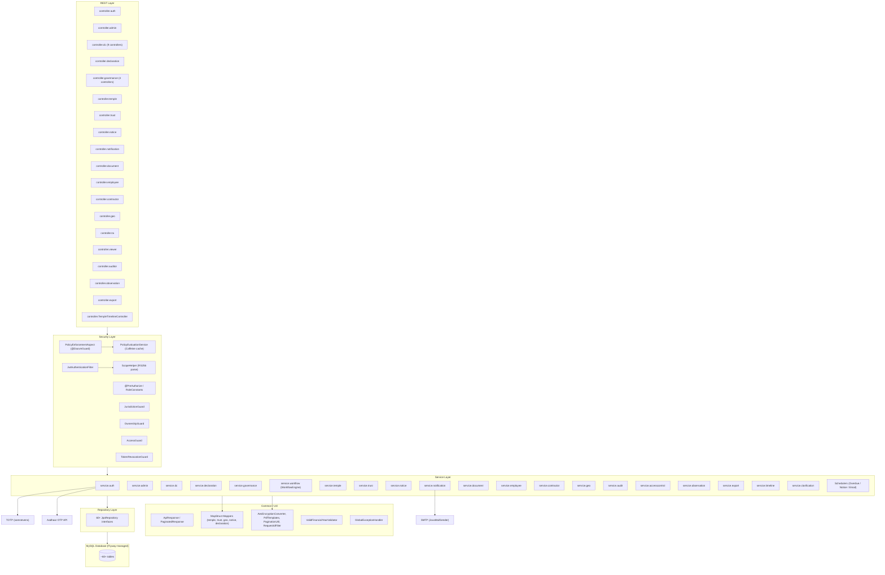
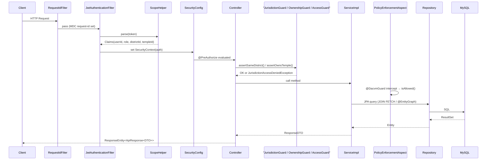
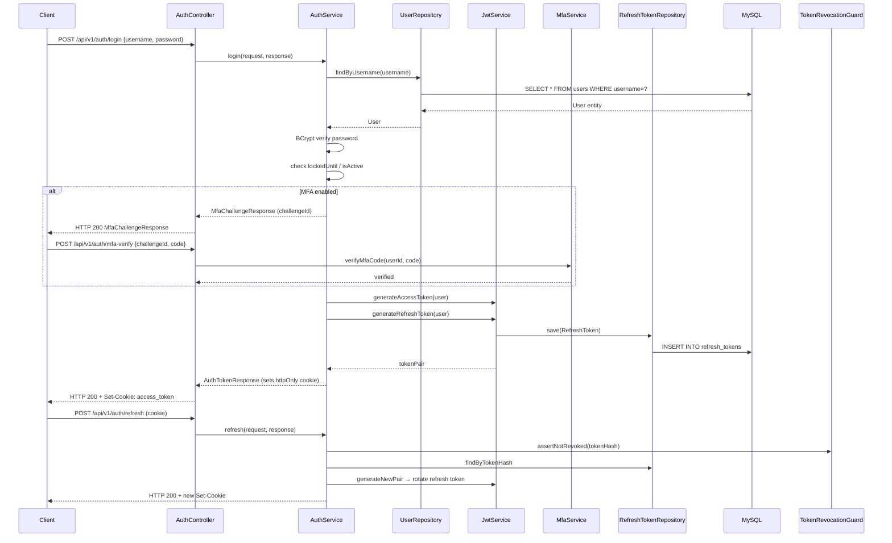
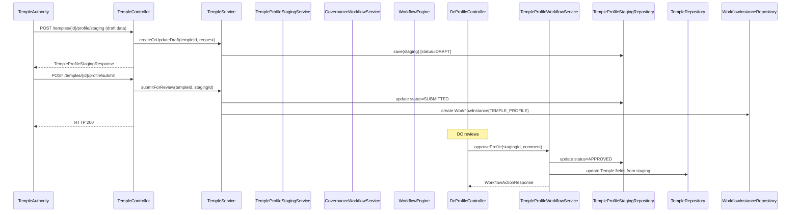
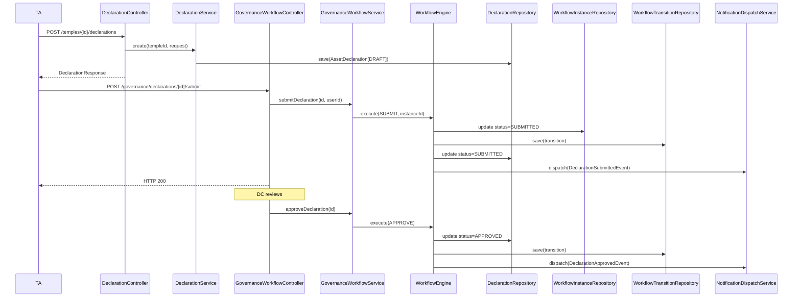
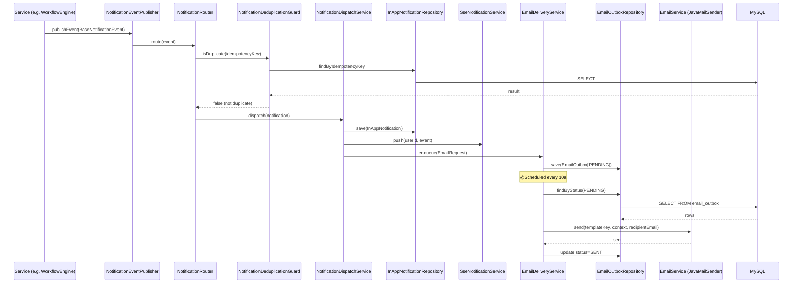

---

## 1. Architecture Summary

The Temple Registry backend is a **monolithic Spring Boot 3.x REST API** built on Java 21. It follows a strict layered pattern: **Controller → Service (Interface + Impl) → Repository → Database (MySQL)**. The system manages Karnataka's temple registration, governance workflows, asset declarations, trust management, and compliance — with a multi-role RBAC model enforced at both route-level (`@PreAuthorize`) and service-layer (custom guards + AOP). JWT (RS256) authentication is stateless; tokens are delivered via `httpOnly` cookie or `Authorization` header. All schema changes are Flyway-managed. Local filesystem is used for file storage; SMTP via Spring Mail for email.

---

## 2. Package Structure Overview

| Package | Responsibility |
|---|---|
| `com.templeregistry` | Application entry point |
| `common` | `ApiResponse`, `PaginatedResponse` wrappers |
| `config` | Spring configuration beans (Security, Async, Cache, CORS, JPA Audit, OpenAPI, TOTP) |
| `controller` | REST endpoint layer — 38 controllers across 14 sub-packages |
| `dto.request` | Inbound request bodies (Create*, Update*, Action*) |
| `dto.response` | Outbound response payloads grouped by domain |
| `entity` | JPA entities grouped by domain (auth, temple, trust, declaration, workflow, etc.) |
| `event` | Spring application events for domain notifications (board, contractor, declaration, etc.) |
| `exception` | Custom exception hierarchy + `GlobalExceptionHandler` |
| `mapper` | MapStruct mappers (declaration, geo, notice, temple, trust) |
| `repository` | Spring Data JPA repositories, one per aggregate |
| `security` | JWT filter, guards (Jurisdiction, Ownership, Access, DACVM), `ScopeHelper`, AOP aspect |
| `service` | Business logic interfaces + impls, schedulers, workflow engine |
| `util` | Encryption converter, PDF generators, pagination helper, request-ID filter |
| `validation` | Custom JSR-303 annotation (`@ValidFinancialYear`) + validator |

---

## 3. Backend Inventory

### Controllers

| Class | Package | Purpose |
|---|---|---|
| `TempleTimelineController` | `controller` | Temple event timeline — `GET /api/v1/timeline/temples/{id}` |
| `AccessControlController` | `controller.admin` | DACVM policy CRUD + audit log + field-mask management |
| `AdminController` | `controller.admin` | User management, audit events, statewide dashboard, governance history, notification rules |
| `AdminTempleController` | `controller.admin` | Admin temple lifecycle (suspend/reactivate/freeze/archive) |
| `SystemConfigController` | `controller.admin` | System config key-value CRUD |
| `AuditorController` | `controller.auditor` | Compliance report, entity audit trail |
| `AuthController` | `controller.auth` | Login, MFA verify, refresh, logout, `/me`, password reset |
| `RegistrationController` | `controller.auth` | `@Deprecated` — admin-only create-account (hidden in OpenAPI) |
| `ContractorController` | `controller.contractor` | Temple contractor CRUD |
| `DcBoardMemberController` | `controller.dc` | DC approve/reject board members |
| `DcComplianceController` | `controller.dc` | DC temple verify/flag |
| `DcContextController` | `controller.dc` | DC `/me` context (district + user info) |
| `DcDashboardController` | `controller.dc` | DC dashboard summary |
| `DcDeclarationController` | `controller.dc` | DC declaration list/detail |
| `DcEmployeeController` | `controller.dc` | DC employee read |
| `DcExportController` | `controller.dc` | DC export jobs (temples/declarations), download |
| `DcNotificationController` | `controller.dc` | DC in-app notification list/mark-read |
| `DcProfileController` | `controller.dc` | DC approve/reject temple profile staging |
| `DcTempleController` | `controller.dc` | DC temple search, full profile, verify/flag/unflag |
| `ConversationController` | `controller.declaration` | Declaration clarification conversation thread |
| `DeclarationController` | `controller.declaration` | Declaration CRUD, submit, resubmit, clarification response, acknowledgement, diff, versions, audit |
| `DocumentController` | `controller.document` | Document upload/download/preview/delete |
| `EmployeeController` | `controller.employee` | Temple employee CRUD |
| `ExportController` | `controller.export` | Export temples/declarations, evidence pack |
| `GeoController` | `controller.geo` | States/cities/districts/taluks/hoblis CRUD |
| `GovernanceV2Controller` | `controller.governance` | V2 workflow-envelope read for declaration/trust/staging |
| `GovernanceWorkflowController` | `controller.governance` | V1 governance actions — submit/approve/reject/clarify for trusts and declarations |
| `WorkflowController` | `controller.governance` | V2 workflow engine — action execution, clarification, history, dashboard, SSE |
| `WorkflowHistoryController` | `controller.governance` | V2 workflow history, summary, entity versions |
| `NoticeController` | `controller.notice` | Notice CRUD, status change, attachment upload/download |
| `NotificationController` | `controller.notification` | In-app notification list/read/acknowledge/delete |
| `NotificationPreferenceController` | `controller.notification` | User notification preferences |
| `NotificationSseController` | `controller.notification` | SSE stream for real-time notifications |
| `ObservationController` | `controller.observation` | Compliance observation CRUD, assign, close |
| `TaDashboardController` | `controller.ta` | TA dashboard, temple, profile CRUD, document register |
| `TempleController` | `controller.temple` | Temple search, create, photos, profile staging workflow |
| `TrustController` | `controller.trust` | Trust CRUD, board members, financials, board meetings/minutes |
| `ViewerDashboardController` | `controller.viewer` | Viewer dashboard summary |

---

### Services (Interfaces + Impls)

| Interface | Impl | Package | Purpose |
|---|---|---|---|
| `AccessControlAuditService` | `AccessControlAuditServiceImpl` | `service.accesscontrol` / `service.impl.accesscontrol` | DACVM policy audit log writes |
| `PolicyEvaluationService` | `PolicyEvaluationServiceImpl` | `service.accesscontrol` / `service.impl.accesscontrol` | DACVM policy evaluation with Caffeine cache |
| `PolicyManagementService` | `PolicyManagementServiceImpl` | `service.accesscontrol` / `service.impl.accesscontrol` | DACVM policy CRUD |
| `AdminDashboardService` | `AdminDashboardServiceImpl` | `service.admin` / `service.impl.admin` | Statewide admin statistics |
| `AdminService` | `AdminServiceImpl` | `service.admin` / `service.impl.admin` | User & temple admin operations |
| `SystemConfigService` | `SystemConfigServiceImpl` | `service.admin` / `service.impl.admin` | System config key-value |
| `AuditService` | `AuditServiceImpl` | `service.audit` / `service.impl.audit` | Fire-and-forget audit event writes (`@Async`) |
| `DeclarationAuditLogService` | `DeclarationAuditLogServiceImpl` | `service.audit` / `service.impl.audit` | Declaration-specific audit log |
| `GovernanceAuditService` | `GovernanceAuditServiceImpl` | `service.audit` / `service.impl.GovernanceAuditServiceImpl` | Governance action history writes |
| `AuditorService` | `AuditorServiceImpl` | `service.auditor` / `service.impl.auditor` | Compliance reports and audit trail |
| `AadhaarService` | `AadhaarServiceImpl` | `service.auth` / `service.impl.auth` | Aadhaar OTP verification integration |
| `AuthService` | `AuthServiceImpl` | `service.auth` / `service.impl.auth` | Login, MFA verify, refresh, logout, password reset |
| `JwtService` | `JwtServiceImpl` | `service.auth` / `service.impl.auth` | RS256 JWT sign, verify, revoke |
| `MfaService` | `MfaServiceImpl` | `service.auth` / `service.impl.auth` | TOTP setup, verify, recovery codes |
| `RegistrationService` | `RegistrationServiceImpl` | `service.auth` / `service.impl.auth` | Account creation |
| `UserProfileService` | `UserProfileServiceImpl` | `service.auth` / `service.impl.auth` | User profile read |
| `ClarificationEngine` | `ClarificationEngineImpl` | `service.clarification` / `service.clarification.impl` | Clarification thread lifecycle |
| `ContractorService` | `ContractorServiceImpl` | `service.contractor` / `service.impl.contractor` | Contractor CRUD with ownership checks |
| `DcComplianceService` | `DcComplianceServiceImpl` | `service.dc` / `service.impl.DcComplianceServiceImpl` | DC temple compliance actions |
| `DcDashboardService` | `DcDashboardServiceImpl` | `service.dc` / `service.impl.dc` | DC dashboard aggregation |
| `DcExportService` | `DcExportServiceImpl` | `service.dc` / `service.impl.dc` | Async export job processing |
| `DcTempleProfileService` | `DcTempleProfileServiceImpl` | `service.dc` / `service.impl.dc` | DC temple profile reads/history |
| `DcTempleSearchService` | `DcTempleSearchServiceImpl` | `service.dc` / `service.impl.dc` | DC temple search with jurisdiction |
| `DcTempleVerificationService` | `DcTempleVerificationServiceImpl` | `service.dc` / `service.impl.dc` | DC temple verify/flag/unflag |
| `DeclarationWorkflowService` | `DeclarationWorkflowServiceImpl` | `service.dc` / `service.impl.dc` | Declaration workflow actions (DC role) |
| `NotificationEventPublisher` (dc) | `NotificationEventPublisherImpl` | `service.dc` / `service.impl.dc` | Publishes domain events from DC module |
| `NotificationQueryService` | `NotificationQueryServiceImpl` | `service.dc` / `service.impl.dc` | DC notification list/count/mark-read |
| `TempleProfileWorkflowService` | `TempleProfileWorkflowServiceImpl` | `service.dc` / `service.impl.dc` | Temple profile staging approve/reject |
| `AcknowledgementService` | `AcknowledgementServiceImpl` | `service.declaration` / `service.impl.declaration` | Acknowledgement number generation and PDF |
| `ConversationService` | `ConversationServiceImpl` | `service.declaration` / `service.impl.ConversationServiceImpl` | Clarification conversation thread reads |
| `DeclarationService` | `DeclarationServiceImpl` | `service.declaration` / `service.impl.declaration` | Declaration CRUD, submit, clarification, diff, version |
| `SnapshotService` | `SnapshotServiceImpl` | `service.declaration` / `service.impl.declaration` | Declaration snapshot JSON generation |
| `DocumentService` | `DocumentServiceImpl` | `service.document` / `service.impl.document` | Document upload/download/preview/delete |
| `FileStorageService` | `LocalFileStorageServiceImpl` | `service.document` / `service.impl.document` | Local filesystem file I/O |
| `EmployeeService` | `EmployeeServiceImpl` | `service.employee` / `service.impl.employee` | Temple employee CRUD |
| `ExportService` | `ExportServiceImpl` | `service.export` / `service.impl.export` | CSV/PDF export generation |
| `GeoService` | `GeoServiceImpl` | `service.geo` / `service.impl.geo` | Geo hierarchy CRUD (state/city/district/taluk/hobli) |
| `GovernanceWorkflowService` | `GovernanceWorkflowServiceImpl` | `service.governance` / `service.impl.governance` | V1 governance workflow (trust + declaration) |
| `GovernanceStatusResolver` | `GovernanceStatusResolverImpl` | `service.governance` / `service.governance.impl` | Resolve composite governance status |
| `WorkflowHistoryService` | `WorkflowHistoryServiceImpl` | `service.governance` / `service.impl.governance` | Workflow history, summary, entity versions |
| `NoticeService` | `NoticeServiceImpl` | `service.notice` / `service.impl.notice` | Notice CRUD, status, attachments |
| `EmailService` | `EmailServiceImpl` | `service.notification` / `service.impl.notification` | Spring Mail SMTP send |
| `NotificationDispatchService` | `NotificationDispatchServiceImpl` | `service.notification` / `service.impl.notification` | Dispatch notifications (in-app + email) |
| `NotificationPreferenceService` | `NotificationPreferenceServiceImpl` | `service.notification` / `service.impl.notification` | User notification preferences |
| `NotificationRuleService` | `NotificationRuleServiceImpl` | `service.notification.impl` | Notification routing rules |
| `ObservationService` | `ObservationServiceImpl` | `service.observation` / `service.impl.observation` | Compliance observation CRUD |
| `TaDashboardService` | `TaDashboardServiceImpl` | `service.ta` / `service.impl.ta` | TA dashboard aggregation |
| `TempleProfileStagingService` | `TempleProfileStagingServiceImpl` | `service.temple` / `service.impl.temple` | Temple profile staging CRUD |
| `TempleSearchSummaryService` | `TempleSearchSummaryServiceImpl` | `service.temple` / `service.impl.temple` | Search summary rebuild/refresh |
| `TempleService` | `TempleServiceImpl` | `service.temple` / `service.impl.temple` | Temple CRUD, photos, lifecycle |
| `TempleTimelineService` | `TempleTimelineServiceImpl` | `service.timeline` / `service.timeline.impl` | Temple timeline event reads |
| `TrustService` | `TrustServiceImpl` | `service.trust` / `service.impl.trust` | Trust CRUD, board members, financials, meetings |
| `TrustValidationService` | `TrustValidationServiceImpl` | `service.trust` / `service.impl.trust` | Trust financial year duplicate validation |
| `FinancialYearValidationService` | `FinancialYearValidationServiceImpl` | `service.validation` / `service.impl.validation` | Financial year format validation |
| `ViewerDashboardService` | `ViewerDashboardServiceImpl` | `service.viewer` / `service.impl.viewer` | Viewer dashboard aggregation |
| `WorkflowEngine` | `WorkflowEngineImpl` | `service.workflow` / `service.workflow.impl` | Core workflow state machine (V2) |

**Non-interface services / standalone beans:**

| Class | Package | Purpose |
|---|---|---|
| `OverdueScheduler` | `service.declaration` | `@Scheduled` — flags overdue declarations daily at 01:00 UTC |
| `OverdueWorkflowScheduler` | `service.workflow` | `@Scheduled` — workflow overdue flagging (20:30 UTC) and deadline checks (03:30 UTC) |
| `NoticeExpiryScheduler` | `service.notice` | `@Scheduled` — expires published notices |
| `EmailRetryScheduler` | `service.notification` | `@Scheduled` — retries failed email delivery from outbox |
| `EmailDeliveryService` | `service.notification.impl` | DB-backed email outbox processor (`@Scheduled` every 10s/5min) |
| `EmailStartupValidator` | `service.notification` | `ApplicationListener` — validates SMTP config at startup |
| `EmailTemplateResolver` | `service.notification` | Resolves email template strings by key |
| `NotificationDeduplicationGuard` | `service.notification.impl` | Prevents duplicate in-app notifications via idempotency key |
| `NotificationRouter` | `service.notification.impl` | Routes notification events to email + in-app channels |
| `NotificationHelper` | `service.notification` | Helper to build notification payloads |
| `NotificationRecipientResolver` | `service.notification` | Resolves recipient user IDs from workflow context |
| `SseNotificationService` | `service.notification.impl` | Server-Sent Events emitter for real-time in-app notifications |
| `StateTransitionValidator` | `service.declaration` | Validates legal declaration status transitions |
| `TransitionRuleRegistry` | `service.workflow` | Registers all workflow transition rules |
| `GovernanceEditGuard` | `service.governance` | Guards edit access on approved governance entities |
| `TempleVisibilityPolicy` | `service.governance` | Determines temple visibility per role |
| `GovernanceAuditService` (impl only) | `service.impl.GovernanceAuditServiceImpl` | Governance action history persistence |
| `AsyncExportBean` | `service.impl.dc` | `@Async` export task executor bean |
| `TrustDataRepairService` | `service.impl.trust` | Data repair utility for trust records |
| `TimelineEventMapper` | `service.timeline` | Maps domain events to timeline entries |
| `GovernanceDomainEventTimelineListener` | `event.timeline` | `@EventListener` — converts domain events to timeline entries |

---

### Repositories

| Interface | Entity | Package |
|---|---|---|
| `AccessControlAuditLogRepository` | `AccessControlAuditLog` | `repository.accesscontrol` |
| `AccessControlFieldMaskRepository` | `AccessControlFieldMask` | `repository.accesscontrol` |
| `AccessControlPolicyRepository` | `AccessControlPolicy` | `repository.accesscontrol` |
| `AuditAuthEventRepository` | `AuditAuthEvent` | `repository.audit` |
| `AuditDataEventRepository` | `AuditDataEvent` | `repository.audit` |
| `AuditExportEventRepository` | `AuditExportEvent` | `repository.audit` |
| `GovernanceActionRepository` | `GovernanceActionHistory` | `repository.audit` |
| `MfaRecoveryCodeRepository` | `MfaRecoveryCode` | `repository.auth` |
| `RefreshTokenRepository` | `RefreshToken` | `repository.auth` |
| `UserRepository` | `User` | `repository.auth` |
| `ClarificationThreadRepository` | `ClarificationThread` | `repository.clarification` |
| `SystemConfigRepository` | `SystemConfig` | `repository.config` |
| `ContractorRepository` | `Contractor` | `repository.contractor` |
| `AcknowledgementSequenceRepository` | `AcknowledgementSequence` | `repository.dc` |
| `DcIdempotencyRecordRepository` | `IdempotencyRecord` (dc) | `repository.dc` |
| `DeclImmovAgriLandRepository` | `DeclImmovAgriLand` | `repository.dc` |
| `DeclImmovBuildingRepository` | `DeclImmovBuilding` | `repository.dc` |
| `DeclImmovLeasedRepository` | `DeclImmovLeased` | `repository.dc` |
| `DeclImmovOtherRepository` | `DeclImmovOther` | `repository.dc` |
| `DeclMovArtifactRepository` | `DeclMovArtifact` | `repository.dc` |
| `DeclMovEquipmentRepository` | `DeclMovEquipment` | `repository.dc` |
| `DeclMovFinancialRepository` | `DeclMovFinancial` | `repository.dc` |
| `DeclMovPreciousMetalRepository` | `DeclMovPreciousMetal` | `repository.dc` |
| `DeclMovVehicleRepository` | `DeclMovVehicle` | `repository.dc` |
| `ExportJobRecordRepository` | `ExportJobRecord` | `repository.dc` |
| `RateRequestLogRepository` | `RateRequestLog` | `repository.dc` |
| `TempleProfileCurrentRepository` | `TempleProfileCurrent` | `repository.dc` |
| `TempleProfileHistoryRepository` | `TempleProfileHistory` | `repository.dc` |
| `AssetDeclarationVersionRepository` | `AssetDeclarationVersion` | `repository.declaration` |
| `DeclarationClarificationRepository` | `DeclarationClarification` | `repository.declaration` |
| `DeclarationRepository` | `AssetDeclaration` | `repository.declaration` |
| `DocumentAccessLogRepository` | `DocumentAccessLog` | `repository.document` |
| `DocumentRepository` | `Document` | `repository.document` |
| `EmployeeRepository` | `Employee` | `repository.employee` |
| `CityRepository` | `City` | `repository.geo` |
| `DistrictRepository` | `District` | `repository.geo` |
| `HobliRepository` | `Hobli` | `repository.geo` |
| `StateRepository` | `State` | `repository.geo` |
| `TalukRepository` | `Taluk` | `repository.geo` |
| `PhysicalVerificationHistoryRepository` | `PhysicalVerificationHistory` | `repository.governance` |
| `NoticeAttachmentRepository` | `NoticeAttachment` | `repository.notice` |
| `NoticeReadRepository` | `NoticeRead` | `repository.notice` |
| `NoticeRepository` | `Notice` | `repository.notice` |
| `EmailDeliveryLogRepository` | `EmailDeliveryLog` | `repository.notification` |
| `EmailOutboxRepository` | `EmailOutbox` | `repository.notification` |
| `InAppNotificationRepository` | `InAppNotification` | `repository.notification` |
| `NotificationEventRepository` | `NotificationEvent` | `repository.notification` |
| `NotificationOutboxRepository` | `NotificationOutbox` | `repository.notification` |
| `NotificationPreferenceRepository` | `NotificationPreference` | `repository.notification` |
| `NotificationRuleRepository` | `NotificationRule` | `repository.notification` |
| `ObservationRepository` | `Observation` | `repository.observation` |
| `TemplePhotoRepository` | `TemplePhoto` | `repository.temple` |
| `TempleProfileStagingRepository` | `TempleProfileStaging` | `repository.temple` |
| `TempleRepository` | `Temple` | `repository.temple` |
| `TempleSearchSummaryRepository` | `TempleSearchSummary` | `repository.temple` |
| `TempleTimelineEventRepository` | `TempleTimelineEvent` | `repository.timeline` |
| `BoardMeetingRepository` | `BoardMeeting` | `repository.trust` |
| `BoardMemberRepository` | `BoardMember` | `repository.trust` |
| `TrustFinancialRepository` | `TrustFinancial` | `repository.trust` |
| `TrustRepository` | `Trust` | `repository.trust` |
| `EntityVersionRepository` | `EntityVersion` | `repository.versioning` |
| `IdempotencyRecordRepository` | `IdempotencyRecord` (workflow) | `repository.workflow` |
| `WorkflowInstanceRepository` | `WorkflowInstance` | `repository.workflow` |
| `WorkflowTransitionRepository` | `WorkflowTransition` | `repository.workflow` |

---

### Entities

| Class | Table | Extends BaseEntity |
|---|---|---|
| `BaseEntity` | *(mapped superclass)* | — |
| `User` | `users` | Yes |
| `RefreshToken` | `refresh_tokens` | No |
| `MfaRecoveryCode` | *(not read)* | Unknown |
| `Temple` | `temples` | Yes |
| `TemplePhoto` | `temple_photos` | Yes |
| `TempleProfileStaging` | `temple_profile_staging` | Yes |
| `TempleSearchSummary` | *(read-only projection)* | Unknown |
| `Trust` | `trusts` | Yes |
| `BoardMember` | `board_members` | Yes |
| `TrustFinancial` | `trust_financials` | Yes |
| `BoardMeeting` | `board_meetings` | Yes |
| `AssetDeclaration` | `asset_declarations` | Yes |
| `AssetDeclarationVersion` | `asset_declaration_versions` | Yes |
| `DeclarationClarification` | `declaration_clarifications` | No |
| `Document` | `documents` | Yes |
| `DocumentAccessLog` | *(not read)* | Unknown |
| `Employee` | `employees` | Yes |
| `Contractor` | `contractors` | Yes |
| `WorkflowInstance` | `workflow_instances` | Yes |
| `WorkflowTransition` | `workflow_transitions` | Yes |
| `ClarificationThread` | `clarification_threads` | Yes |
| `ClarificationMessage` | *(via @OneToMany)* | Unknown |
| `ClarificationAttachment` | *(via @OneToMany)* | Unknown |
| `EntityVersion` | `entity_versions` | Yes |
| `InAppNotification` | `in_app_notifications` | No |
| `EmailOutbox` | `email_outbox` | No |
| `EmailDeliveryLog` | `email_delivery_log` | No |
| `NotificationEvent` | *(not read)* | Unknown |
| `NotificationOutbox` | *(not read)* | Unknown |
| `NotificationPreference` | *(not read)* | Unknown |
| `NotificationRule` | *(not read)* | Unknown |
| `Notice` | `notices` | Yes |
| `NoticeAttachment` | *(via @OneToMany on Notice)* | Unknown |
| `NoticeRead` | *(not read)* | Unknown |
| `Observation` | `observations` | Yes |
| `PhysicalVerificationHistory` | `physical_verification_history` | No |
| `TempleTimelineEvent` | *(not read)* | Unknown |
| `TempleProfileCurrent` | `temple_profile_current` | No |
| `TempleProfileHistory` | *(not read)* | Unknown |
| `AuditDataEvent` | `audit_data_events` | No |
| `AuditAuthEvent` | *(not read)* | Unknown |
| `AuditExportEvent` | *(not read)* | Unknown |
| `GovernanceActionHistory` | *(not read)* | Unknown |
| `AccessControlPolicy` | *(not read)* | Unknown |
| `AccessControlFieldMask` | *(not read)* | Unknown |
| `AccessControlAuditLog` | *(not read)* | Unknown |
| `SystemConfig` | *(not read)* | Unknown |
| `State`, `City`, `District`, `Taluk`, `Hobli` | geo tables | Unknown |
| `DeclImmovAgriLand`, `DeclImmovBuilding`, `DeclImmovLeased`, `DeclImmovOther` | immovable asset tables | Unknown |
| `DeclMovArtifact`, `DeclMovEquipment`, `DeclMovFinancial`, `DeclMovPreciousMetal`, `DeclMovVehicle` | movable asset tables | Unknown |
| `ExportJobRecord`, `RateRequestLog`, `IdempotencyRecord` (dc + workflow), `AcknowledgementSequence` | operational tables | Unknown |

---

### Security Components

| Class | Type | Purpose |
|---|---|---|
| `JwtAuthenticationFilter` | `OncePerRequestFilter` / `@Component` | Extracts JWT from Bearer header, `httpOnly` cookie, or (SSE only) query param; populates `SecurityContext` |
| `ScopeHelper` | `@Component` | RS256 JWT parse using RSA public key; returns typed `Claims` record (userId, role, districtId, templeId, accessType) |
| `UserDetailsServiceImpl` | `@Service` / `UserDetailsService` | DB-backed user load by username; used by `DaoAuthenticationProvider` |
| `AccessGuard` | `@Component` | Denies `TEMPLE_AUTHORITY` users with `accessType=VIEW` on write paths |
| `JurisdictionGuard` | `@Component` | Enforces district-scope for `DISTRICT_COLLECTOR` and `DC_STAFF`; returns HTTP 404 on mismatch |
| `OwnershipGuard` | `@Component` | Enforces temple ownership for `TEMPLE_AUTHORITY` role |
| `TokenRevocationGuard` | `@Component` | Verifies refresh token is not revoked/expired before issuing new token pair |
| `PolicyEnforcementAspect` | `@Aspect` / `@Component` | AOP `@Around` — evaluates `@DacvmGuard` annotations by calling `PolicyEvaluationService`; fail-closed |
| `DacvmGuard` | `@interface` (annotation) | Method-level annotation triggering `PolicyEnforcementAspect` |
| `RoleConstants` | Constants class | SpEL expressions for `@PreAuthorize` (e.g. `CAN_ACT_DC`, `CAN_SUBMIT`, `ADMIN_ONLY`) |

---

### Configurations

| Class | Annotation | Purpose |
|---|---|---|
| `SecurityConfig` | `@Configuration`, `@EnableWebSecurity`, `@EnableMethodSecurity` | `SecurityFilterChain` — stateless JWT, public paths, 401 entry point, `JwtAuthenticationFilter` before `UsernamePasswordAuthenticationFilter` |
| `AsyncConfig` | `@Configuration` | Two `ThreadPoolTaskExecutor` beans: `taskExecutor` (4/10/100) and `exportExecutor` (2/5/10 + `AbortPolicy`) |
| `CacheConfig` | `@Configuration`, `@EnableCaching` | Caffeine in-process cache (`dacvmPolicies`): 5-min TTL, max 10k entries |
| `CorsConfig` | `@Configuration`, `WebMvcConfigurer` | `CorsConfigurationSource` bean for `/api/**`; reads `app.cors.allowed-origins` |
| `JpaAuditConfig` | `@Configuration`, `@EnableJpaAuditing` | `AuditorAware<Long>` — extracts `userId` from `ScopeHelper.Claims` or returns `0L` for system ops |
| `OpenApiConfig` | `@Configuration` | Springdoc OpenAPI bean with bearer JWT security scheme |
| `TotpConfig` | `@Configuration` | TOTP beans: `TimeProvider`, `CodeGenerator`, `CodeVerifier`, `SecretGenerator` |
| `AwsConfig` | class (no Spring annotations) | Intentionally emptied — AWS removed; local file storage used |

---

### Exception Handlers

| Class | Package | Purpose |
|---|---|---|
| `GlobalExceptionHandler` | `exception` | Single `@RestControllerAdvice`; maps all custom exceptions to structured `ApiResponse` error format |

Custom exception classes (all in `exception` package): `AadhaarVerificationException`, `AccountLockedException`, `AcknowledgementNotAvailableException`, `AcknowledgementNumberConflictException`, `ClarificationLimitExceededException`, `DeclarationAlreadyExistsException`, `DeclarationImmutableException`, `DistrictScopeViolationException`, `DuplicateResourceException`, `EntityNotFoundException`, `ExportQueueFullException`, `FileValidationException`, `IllegalStatusTransitionException`, `ImmutableResourceException`, `InvalidStateTransitionException`, `JurisdictionAccessDeniedException`, `MfaVerificationException`, `RateLimitExceededException`, `WorkflowException`.

---

### Validators

| Class | Package | Purpose |
|---|---|---|
| `ValidFinancialYear` | `validation` | Custom JSR-303 constraint annotation (`@ValidFinancialYear`) |
| `ValidFinancialYearValidator` | `validation` | `ConstraintValidator` impl — validates `YYYY-YY` financial year format |
| `StateTransitionValidator` | `service.declaration` | Service-layer validator — asserts legal declaration status transitions |
| `StatusTransitionValidator` | `util` | Utility validator for generic status transitions |
| `StatusTransitionValidatorCompat` | `util` | Compatibility shim for status transition validation |

---

### Email Components

| Class | Package | Purpose |
|---|---|---|
| `EmailService` / `EmailServiceImpl` | `service.notification` / `service.impl.notification` | Spring `JavaMailSender` SMTP send |
| `EmailDeliveryService` | `service.notification.impl` | DB outbox polling (`@Scheduled` every 10s/5min); exponential back-off retry (6 attempts) |
| `EmailRetryScheduler` | `service.notification` | Scheduled retry of failed `EmailDeliveryLog` entries |
| `EmailStartupValidator` | `service.notification` | Validates SMTP config at startup via `ApplicationListener` |
| `EmailTemplateResolver` | `service.notification` | Resolves email template content by key |
| `EmailOutboxRepository` | `repository.notification` | Persists/queries `email_outbox` table |
| `EmailDeliveryLogRepository` | `repository.notification` | Persists/queries `email_delivery_log` table |

---

### File Components

| Class | Package | Purpose |
|---|---|---|
| `FileStorageService` | `service.document` | Interface for file storage |
| `LocalFileStorageServiceImpl` | `service.impl.document` | Local filesystem implementation (reads `app.storage.base-dir`) |
| `AesEncryptionConverter` | `util` | JPA `AttributeConverter` — AES encrypt/decrypt sensitive fields at persistence |
| `AcknowledgementTemplate` | `util.pdf` | PDF template for declaration acknowledgement documents |
| `ExportReportTemplate` | `util.pdf` | PDF template for export reports |
| `PdfDesignSystem` | `util.pdf` | PDF styling/design constants |

---

### Scheduler Components

| Class | Method | Schedule | Purpose |
|---|---|---|---|
| `OverdueScheduler` | `flagOverdueDeclarations()` | `cron="0 0 1 * * *"` UTC | Mark submitted declarations overdue daily |
| `OverdueWorkflowScheduler` | `flagOverdueInstances()` | `cron="0 30 20 * * *"` UTC | Flag workflow instances past deadline |
| `OverdueWorkflowScheduler` | `checkDeadlines()` | `cron="0 30 3 * * *"` UTC | Deadline check and notification trigger |
| `NoticeExpiryScheduler` | `expireNotices()` | *(not read — class exists)* | Expire published notices past expiry date |
| `EmailRetryScheduler` | `retryFailedEmails()` | `fixedDelay=300000` (5 min) | Retry `FAILED` email outbox records |
| `EmailDeliveryService` | `processQueue()` | `@Scheduled` every 10s | Process `PENDING` outbox rows via SMTP |
| `EmailDeliveryService` | `processRetries()` | `@Scheduled` every 5 min | Retry `FAILED` rows with exponential back-off |

---

### External Integrations

| Integration | Class | Package | Notes |
|---|---|---|---|
| SMTP (Spring Mail) | `EmailService` / `EmailServiceImpl` | `service.notification` | Configured via `spring.mail.*` properties; `JavaMailSender` |
| TOTP (samstevens/totp) | `TotpConfig`, `MfaService`/`MfaServiceImpl` | `config`, `service.auth` | Third-party TOTP library; `@Configuration` beans |
| Aadhaar OTP | `AadhaarService` / `AadhaarServiceImpl` | `service.auth` | Aadhaar verification integration (code exists; external provider details not in provided source) |

> **AWS**: `AwsConfig.java` is intentionally empty with a comment confirming AWS was removed. No S3 or AWS SDK references found in active code. Excluded.

---

## 4. Mermaid Diagrams

### Diagram 1: Package Architecture



---

### Diagram 2: Request Flow (Generic)



---

### Diagram 3: Security Architecture

```mermaid
flowchart TD
    REQ[HTTP Request] --> RIF[RequestIdFilter\nsets MDC X-Request-ID]
    RIF --> JAF[JwtAuthenticationFilter\nextract token: header / cookie / SSE-query]
    JAF --> SH[ScopeHelper\nRS256 parse public key]
    SH -->|Claims| SC[SecurityContextHolder]
    JAF -->|no token| SC2[SecurityContext = anonymous]

    SC --> SPRING_SEC[Spring Security\nfilterChain]
    SPRING_SEC -->|PUBLIC_PATHS| PERMIT[Permit All]
    SPRING_SEC -->|OTHER| AUTH_CHECK{Authenticated?}
    AUTH_CHECK -->|No| HTTP401[HTTP 401]
    AUTH_CHECK -->|Yes| PREAUTH[@PreAuthorize\nhasRole / hasAnyRole]
    PREAUTH -->|Denied| HTTP403[HTTP 403]
    PREAUTH -->|Granted| CTRL[Controller Method]

    CTRL --> AG[AccessGuard\nassertCanEdit()\nTA VIEW-only block]
    CTRL --> JG[JurisdictionGuard\nassertDistrictScope()\nDC/DC_STAFF district check]
    CTRL --> OG[OwnershipGuard\nassertOwnsTemple()\nTA ownership check]

    AG -->|Denied| ADE[AccessDeniedException]
    JG -->|Mismatch| DSV[DistrictScopeViolationException\nHTTP 404]
    OG -->|Denied| JAD2[JurisdictionAccessDeniedException]

    CTRL --> SVC[Service Method]
    SVC --> AOP[PolicyEnforcementAspect\n@DacvmGuard AOP intercept]
    AOP --> PES[PolicyEvaluationService\nCaffeine cache lookup]
    PES -->|DENY| ADE2[AccessDeniedException\nHTTP 403]
    PES -->|ALLOW| SVC2[Proceed with method]

    subgraph "Refresh Flow"
        RTOKEN[Refresh Token Request] --> TRG[TokenRevocationGuard\nassertNotRevoked()]
        TRG -->|Revoked / Expired| SECEX[SecurityException]
        TRG -->|Valid| JWTSERV[JwtService\nRS256 sign new pair]
    end

    subgraph "Roles"
        R1[SUPER_ADMIN]
        R2[DISTRICT_COLLECTOR]
        R3[DC_STAFF]
        R4[TEMPLE_AUTHORITY]
        R5[AUDITOR]
        R6[VIEWER]
    end
```

---

### Diagram 4: Domain Model

```mermaid
classDiagram
    class BaseEntity {
        +Long id
        +boolean deleted
        +LocalDateTime createdAt
        +LocalDateTime updatedAt
        +Long createdBy
        +Long updatedBy
    }

    class User {
        +String username
        +String email
        +String passwordHash
        +UserRole role
        +Long districtId
        +Long templeId
        +MfaType mfaType
        +UserAccessType accessType
        +boolean isActive
        +LocalDateTime lockedUntil
    }

    class RefreshToken {
        +Long id
        +String tokenHash
        +LocalDateTime expiresAt
        +LocalDateTime revokedAt
    }

    class Temple {
        +String registrationNumber
        +String name
        +TempleGrade grade
        +String primaryDeity
        +Long districtId
        +Long hobliId
        +TempleStatus status
        +VerificationStatus verificationStatus
        +Long version
    }

    class TemplePhoto {
        +String filePath
        +boolean isPrimary
        +byte[] imageData
    }

    class TempleProfileStaging {
        +Long templeId
        +TempleProfileStagingStatus status
        +Integer versionNumber
        +String reviewComment
    }

    class Hobli {
        +String name
    }

    class Taluk {
        +String name
    }

    class District {
        +String name
    }

    class Trust {
        +Long templeId
        +String trustName
        +TrustType trustType
        +TrustStatus status
        +Long lockVersion
    }

    class BoardMember {
        +Long trustId
        +String fullName
        +boolean isVerifiedByDc
        +Long lockVersion
    }

    class TrustFinancial {
        +Long trustId
        +String financialYear
        +BigDecimal annualIncome
    }

    class BoardMeeting {
        +Long trustId
        +LocalDate meetingDate
        +Long minutesDocumentId
    }

    class AssetDeclaration {
        +Long templeId
        +Long districtId
        +String financialYear
        +DeclarationStatus status
        +Long lockVersion
        +PhysicalVerificationStatus physicalVerificationStatus
    }

    class AssetDeclarationVersion {
        +Long declarationId
        +int versionNumber
        +String snapshotJson
    }

    class DeclarationClarification {
        +Long declarationId
        +ClarificationDirection direction
        +String message
    }

    class Document {
        +String ownerType
        +Long ownerId
        +String s3Key
        +String mimeType
    }

    class Employee {
        +Long templeId
        +String fullName
        +EmployeeType employeeType
        +EmployeeStatus status
    }

    class Contractor {
        +Long templeId
        +String companyName
        +ServiceType serviceType
    }

    class WorkflowInstance {
        +WorkflowEntityType entityType
        +Long entityId
        +WorkflowStatus status
        +Long templeId
        +Long districtId
        +Long lockVersion
    }

    class WorkflowTransition {
        +WorkflowStatus fromStatus
        +WorkflowStatus toStatus
        +WorkflowAction action
        +Long actorId
        +Instant performedAt
    }

    class ClarificationThread {
        +int roundNumber
        +ClarificationStatus status
        +Long requestedBy
    }

    class ClarificationMessage {
        +String message
        +ClarificationMessageDirection direction
    }

    class EntityVersion {
        +int versionNumber
        +String snapshotJson
        +EntityVersionStatus status
    }

    class Notice {
        +String title
        +NoticeScope scope
        +Long districtId
        +NoticeStatus status
        +Long version
    }

    class NoticeAttachment {
        +String filePath
    }

    class InAppNotification {
        +Long userId
        +String title
        +boolean isRead
        +String idempotencyKey
    }

    class EmailOutbox {
        +String recipientEmail
        +String templateKey
        +String status
        +int retryCount
    }

    class Observation {
        +Long templeId
        +ObservationSeverity severity
        +ObservationStatus status
    }

    class PhysicalVerificationHistory {
        +Long declarationId
        +PhysicalVerificationStatus previousStatus
        +PhysicalVerificationStatus newStatus
    }

    class TempleProfileCurrent {
        +Long templeId
        +LocalDateTime publishedAt
    }

    BaseEntity <|-- User
    BaseEntity <|-- Temple
    BaseEntity <|-- TemplePhoto
    BaseEntity <|-- TempleProfileStaging
    BaseEntity <|-- Trust
    BaseEntity <|-- BoardMember
    BaseEntity <|-- TrustFinancial
    BaseEntity <|-- BoardMeeting
    BaseEntity <|-- AssetDeclaration
    BaseEntity <|-- AssetDeclarationVersion
    BaseEntity <|-- Document
    BaseEntity <|-- Employee
    BaseEntity <|-- Contractor
    BaseEntity <|-- WorkflowInstance
    BaseEntity <|-- WorkflowTransition
    BaseEntity <|-- ClarificationThread
    BaseEntity <|-- EntityVersion
    BaseEntity <|-- Notice
    BaseEntity <|-- Observation

    RefreshToken "many" --> "1" User : user (@ManyToOne LAZY)
    TemplePhoto "many" --> "1" Temple : temple (@ManyToOne LAZY)
    Temple "many" --> "0..1" Hobli : hobli (@ManyToOne LAZY, insertable=false)
    Hobli "many" --> "1" Taluk : taluk
    Taluk "many" --> "1" District : district
    WorkflowTransition "many" --> "1" WorkflowInstance : workflowInstance (@ManyToOne LAZY)
    ClarificationThread "many" --> "1" WorkflowInstance : workflowInstance (@ManyToOne LAZY)
    ClarificationThread "1" *-- "many" ClarificationMessage : messages (@OneToMany, cascade=ALL)
    EntityVersion "many" --> "1" WorkflowInstance : workflowInstance (@ManyToOne LAZY)
    Notice "1" *-- "many" NoticeAttachment : attachments (@OneToMany, cascade=ALL)
```



---

### Diagram 5: Service Dependency Graph

```mermaid
flowchart TD
    subgraph AUTH
        AuthCtrl[AuthController] --> AuthSvc[AuthService]
        AuthCtrl --> UserProfileSvc[UserProfileService]
        AuthCtrl --> PolicyEvalSvc[PolicyEvaluationService]
        AuthSvc --> UserRepo[UserRepository]
        AuthSvc --> RefreshTokenRepo[RefreshTokenRepository]
        AuthSvc --> JwtSvc[JwtService]
        AuthSvc --> MfaSvc[MfaService]
        MfaSvc --> MfaRecoveryRepo[MfaRecoveryCodeRepository]
    end

    subgraph TEMPLE
        TempleCtrl[TempleController] --> TempleSvc[TempleService]
        TempleCtrl --> StagingSvc[TempleProfileStagingService]
        TempleSvc --> TempleRepo[TempleRepository]
        TempleSvc --> TemplePhotoRepo[TemplePhotoRepository]
        TempleSvc --> FileStore[FileStorageService]
        StagingSvc --> StagingRepo[TempleProfileStagingRepository]
    end

    subgraph DECLARATION
        DeclCtrl[DeclarationController] --> DeclSvc[DeclarationService]
        DeclCtrl --> GovWfSvc[GovernanceWorkflowService]
        DeclSvc --> DeclRepo[DeclarationRepository]
        DeclSvc --> DeclVersionRepo[AssetDeclarationVersionRepository]
        DeclSvc --> AckSvc[AcknowledgementService]
        DeclSvc --> SnapshotSvc[SnapshotService]
    end

    subgraph WORKFLOW
        WfCtrl[WorkflowController] --> WfEngine[WorkflowEngine]
        WfCtrl --> ClariEngine[ClarificationEngine]
        WfCtrl --> SseNotif[SseNotificationService]
        WfEngine --> WfInstanceRepo[WorkflowInstanceRepository]
        WfEngine --> WfTransitionRepo[WorkflowTransitionRepository]
        ClariEngine --> ClariThreadRepo[ClarificationThreadRepository]
        GovWfSvc --> WfEngine
    end

    subgraph TRUST
        TrustCtrl[TrustController] --> TrustSvc[TrustService]
        TrustSvc --> TrustRepo[TrustRepository]
        TrustSvc --> BoardMemberRepo[BoardMemberRepository]
        TrustSvc --> TrustFinancialRepo[TrustFinancialRepository]
        TrustSvc --> BoardMeetingRepo[BoardMeetingRepository]
    end

    subgraph DC
        DcDashCtrl[DcDashboardController] --> DcDashSvc[DcDashboardService]
        DcTemplCtrl[DcTempleController] --> DcSearchSvc[DcTempleSearchService]
        DcTemplCtrl --> DcProfileSvc[DcTempleProfileService]
        DcTemplCtrl --> DcVerifSvc[DcTempleVerificationService]
        DcSearchSvc --> TempleRepo
        DcVerifSvc --> TempleRepo
    end

    subgraph NOTIFICATION
        NotifCtrl[NotificationController] --> NotifSvc[NotificationService]
        NotifSvc --> InAppRepo[InAppNotificationRepository]
        SseNotif --> InAppRepo
        EmailDelivSvc[EmailDeliveryService] --> EmailOutboxRepo[EmailOutboxRepository]
        EmailDelivSvc --> EmailSvc[EmailService]
        NotifDispSvc[NotificationDispatchService] --> EmailDelivSvc
        NotifDispSvc --> InAppRepo
    end

    subgraph ADMIN
        AdminCtrl[AdminController] --> AdminSvc[AdminService]
        AdminCtrl --> DeclSvc
        AdminCtrl --> GovernanceAuditSvc[GovernanceAuditService]
        AdminCtrl --> NotifRuleSvc[NotificationRuleService]
        AdminCtrl --> AdminDashSvc[AdminDashboardService]
        AdminCtrl --> AuditDataRepo[AuditDataEventRepository]
        AdminCtrl --> AuditAuthRepo[AuditAuthEventRepository]
        AdminCtrl --> UserRepo
        AdminCtrl --> TempleRepo
        AccessCtrl[AccessControlController] --> PolicyMgmtSvc[PolicyManagementService]
        AccessCtrl --> AuditLogRepo[AccessControlAuditLogRepository]
    end

    subgraph DOCUMENT
        DocCtrl[DocumentController] --> DocSvc[DocumentService]
        DocSvc --> DocRepo[DocumentRepository]
        DocSvc --> FileStore
    end

    subgraph GEO
        GeoCtrl[GeoController] --> GeoSvc[GeoService]
        GeoSvc --> StateRepo[StateRepository]
        GeoSvc --> CityRepo[CityRepository]
        GeoSvc --> DistrictRepo[DistrictRepository]
        GeoSvc --> TalukRepo[TalukRepository]
        GeoSvc --> HobliRepo[HobliRepository]
    end
```



---

### Diagram 6: Database ER Diagram

```mermaid
erDiagram
    users {
        BIGINT id PK
        VARCHAR username UK
        VARCHAR email UK
        VARCHAR password_hash
        VARCHAR role
        BIGINT district_id
        BIGINT temple_id
        VARCHAR access_type
    }

    refresh_tokens {
        BIGINT id PK
        BIGINT user_id FK
        VARCHAR token_hash UK
        DATETIME expires_at
        DATETIME revoked_at
    }

    temples {
        BIGINT id PK
        VARCHAR registration_number UK
        VARCHAR name
        BIGINT hobli_id FK
        BIGINT district_id
        VARCHAR grade
        VARCHAR status
        VARCHAR verification_status
        BIGINT version
    }

    hoblis {
        BIGINT id PK
        BIGINT taluk_id FK
        VARCHAR name
    }

    taluks {
        BIGINT id PK
        BIGINT district_id FK
        VARCHAR name
    }

    districts {
        BIGINT id PK
        VARCHAR name
    }

    temple_photos {
        BIGINT id PK
        BIGINT temple_id FK
        VARCHAR file_path
        BOOLEAN is_primary
    }

    temple_profile_staging {
        BIGINT id PK
        BIGINT temple_id
        VARCHAR status
        INT version_number
        TEXT review_comment
    }

    temple_profile_current {
        BIGINT id PK
        BIGINT temple_id UK
        DATETIME published_at
    }

    trusts {
        BIGINT id PK
        BIGINT temple_id
        VARCHAR trust_name
        VARCHAR trust_type
        VARCHAR status
        BIGINT lock_version
    }

    board_members {
        BIGINT id PK
        BIGINT trust_id
        VARCHAR full_name
        BOOLEAN is_verified_by_dc
    }

    trust_financials {
        BIGINT id PK
        BIGINT trust_id
        VARCHAR financial_year
        DECIMAL annual_income
    }

    board_meetings {
        BIGINT id PK
        BIGINT trust_id
        DATE meeting_date
        BIGINT minutes_document_id
    }

    asset_declarations {
        BIGINT id PK
        BIGINT temple_id
        BIGINT district_id
        VARCHAR financial_year
        VARCHAR status
        BIGINT lock_version
        VARCHAR physical_verification_status
    }

    asset_declaration_versions {
        BIGINT id PK
        BIGINT declaration_id
        INT version_number
        JSON snapshot_json
    }

    declaration_clarifications {
        BIGINT id PK
        BIGINT declaration_id
        VARCHAR direction
        TEXT message
    }

    documents {
        BIGINT id PK
        VARCHAR owner_type
        BIGINT owner_id
        VARCHAR s3_key
        VARCHAR mime_type
    }

    employees {
        BIGINT id PK
        BIGINT temple_id
        VARCHAR full_name
        VARCHAR employee_type
        VARCHAR status
    }

    contractors {
        BIGINT id PK
        BIGINT temple_id
        VARCHAR company_name
        VARCHAR service_type
    }

    workflow_instances {
        BIGINT id PK
        VARCHAR entity_type
        BIGINT entity_id
        VARCHAR status
        BIGINT temple_id
        BIGINT district_id
        BIGINT lock_version
    }

    workflow_transitions {
        BIGINT id PK
        BIGINT workflow_instance_id FK
        VARCHAR from_status
        VARCHAR to_status
        VARCHAR action
        BIGINT actor_id
        INSTANT performed_at
    }

    clarification_threads {
        BIGINT id PK
        BIGINT workflow_instance_id FK
        INT round_number
        VARCHAR status
    }

    entity_versions {
        BIGINT id PK
        BIGINT workflow_instance_id FK
        INT version_number
        JSON snapshot_json
        VARCHAR status
    }

    in_app_notifications {
        BIGINT id PK
        BIGINT user_id
        TEXT body
        BOOLEAN is_read
        VARCHAR idempotency_key UK
    }

    email_outbox {
        BIGINT id PK
        VARCHAR recipient_email
        VARCHAR template_key
        VARCHAR status
        INT retry_count
    }

    notices {
        BIGINT id PK
        BIGINT district_id
        VARCHAR scope
        VARCHAR status
        BIGINT version
    }

    observations {
        BIGINT id PK
        BIGINT temple_id
        VARCHAR severity
        VARCHAR status
    }

    physical_verification_history {
        BIGINT id PK
        BIGINT declaration_id
        VARCHAR previous_status
        VARCHAR new_status
    }

    users ||--o{ refresh_tokens : "has"
    temples ||--o{ temple_photos : "has"
    temples }o--|| hoblis : "located in"
    hoblis }o--|| taluks : "belongs to"
    taluks }o--|| districts : "belongs to"
    trusts ||--o{ board_members : "has"
    trusts ||--o{ trust_financials : "has"
    trusts ||--o{ board_meetings : "has"
    asset_declarations ||--o{ asset_declaration_versions : "versioned by"
    asset_declarations ||--o{ declaration_clarifications : "has"
    asset_declarations ||--o{ physical_verification_history : "has"
    workflow_instances ||--o{ workflow_transitions : "has"
    workflow_instances ||--o{ clarification_threads : "has"
    workflow_instances ||--o{ entity_versions : "has"
```



---

### Diagram 7: Auth Feature Flow



---

### Diagram 8: Temple Profile Workflow



---

### Diagram 9: Declaration Workflow



---

### Diagram 10: Notification Pipeline



---

## Component Traceability Table

| Component | File Path | Type | Purpose |
|---|---|---|---|
| `TempleRegistryApplication` | `src/main/java/.../TempleRegistryApplication.java` | `@SpringBootApplication` | Entry point |
| `GlobalExceptionHandler` | `exception/GlobalExceptionHandler.java` | `@RestControllerAdvice` | Centralized error handler |
| `JwtAuthenticationFilter` | `security/JwtAuthenticationFilter.java` | `OncePerRequestFilter` | JWT token extraction and SecurityContext population |
| `ScopeHelper` | `security/ScopeHelper.java` | `@Component` | RS256 JWT parse; typed `Claims` record |
| `SecurityConfig` | `config/SecurityConfig.java` | `@Configuration` | Spring Security filter chain |
| `PolicyEnforcementAspect` | `security/PolicyEnforcementAspect.java` | `@Aspect` | AOP DACVM policy enforcement |
| `JurisdictionGuard` | `security/JurisdictionGuard.java` | `@Component` | DC district-scope enforcement |
| `OwnershipGuard` | `security/OwnershipGuard.java` | `@Component` | TA temple ownership enforcement |
| `AccessGuard` | `security/AccessGuard.java` | `@Component` | TA VIEW-only access block |
| `TokenRevocationGuard` | `security/TokenRevocationGuard.java` | `@Component` | Refresh token revocation check |
| `CacheConfig` | `config/CacheConfig.java` | `@Configuration` | Caffeine DACVM policy cache |
| `AsyncConfig` | `config/AsyncConfig.java` | `@Configuration` | `taskExecutor` + `exportExecutor` thread pools |
| `TotpConfig` | `config/TotpConfig.java` | `@Configuration` | TOTP beans (CodeVerifier, SecretGenerator) |
| `JpaAuditConfig` | `config/JpaAuditConfig.java` | `@Configuration` | `AuditorAware<Long>` JPA audit |
| `CorsConfig` | `config/CorsConfig.java` | `@Configuration` | CORS for `/api/**` |
| `OpenApiConfig` | `config/OpenApiConfig.java` | `@Configuration` | Springdoc OpenAPI with JWT scheme |
| `WorkflowEngineImpl` | `service/workflow/impl/WorkflowEngineImpl.java` | `@Service` | Core V2 state machine |
| `OverdueScheduler` | `service/declaration/OverdueScheduler.java` | `@Component` + `@Scheduled` | Daily declaration overdue flagging |
| `OverdueWorkflowScheduler` | `service/workflow/OverdueWorkflowScheduler.java` | `@Component` + `@Scheduled` | Workflow deadline checks |
| `EmailDeliveryService` | `service/notification/impl/EmailDeliveryService.java` | `@Service` + `@Scheduled` | DB outbox email processor |
| `LocalFileStorageServiceImpl` | `service/impl/document/LocalFileStorageServiceImpl.java` | `@Service` | Local filesystem I/O |
| `AesEncryptionConverter` | `util/AesEncryptionConverter.java` | `AttributeConverter` | AES field-level encryption |
| `ValidFinancialYearValidator` | `validation/ValidFinancialYearValidator.java` | `ConstraintValidator` | Financial year format validation |
| `RequestIdFilter` | `util/RequestIdFilter.java` | Servlet `Filter` | Sets MDC `X-Request-ID` |

--- 

Completed: *Generate architecture output* (4/4)

The analysis above is derived **exclusively** from source files found in `src/main/java/com/templeregistry`. Every component, dependency, annotation, and relationship is traced to a concrete `.java` file.

**Limitations explicitly noted (per the rules):**

- Entities marked "Unknown" for BaseEntity inheritance were not provided in the analysis scope — their file content was not read. The pattern is consistent for everything else.
- `AwsConfig.java` is intentionally empty (AWS removed) — excluded from active architecture.
- `TempleSearchSummary` appears to be a read-only projection entity; full field structure not read but repository exists.
- `ClarificationMessage` and `ClarificationAttachment` are mapped via `@OneToMany` on `ClarificationThread` — entity files themselves were not fully read; relationships are inferred from the owning side annotation only.
- Aadhaar OTP external provider URL/contract is not visible in `AadhaarServiceImpl` from the provided scan — implementation exists but external endpoint details cannot be confirmed from source.