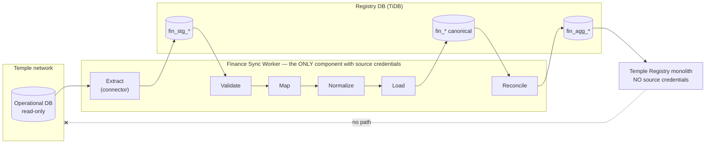
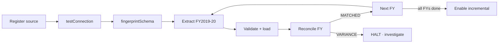
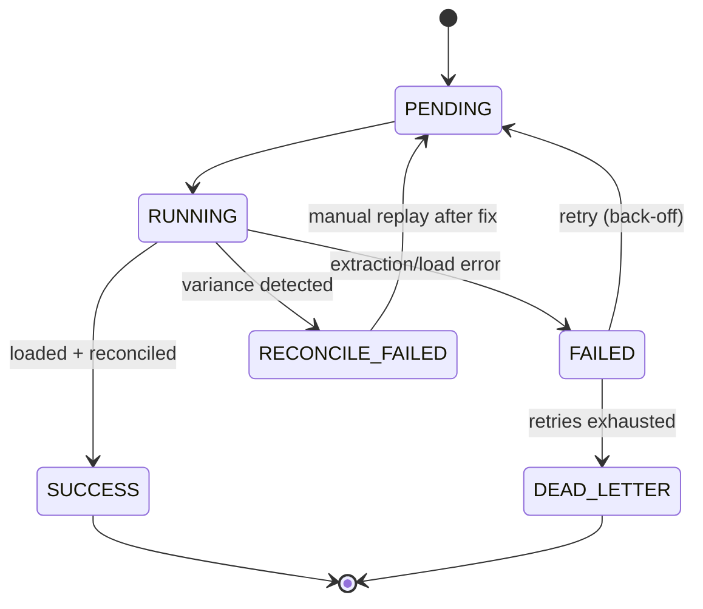

# Finance Data Integration

**Status:** DRAFT — design only. No connector, job or configuration implemented.
**Date:** 2026-09-16
**Parent:** [MULTI_TEMPLE_FINANCE_ARCHITECTURE.md](MULTI_TEMPLE_FINANCE_ARCHITECTURE.md)

---

## 1. Integration Boundary



**The boundary rule.** Source table names, column names and business quirks exist only inside `EX` (and, as raw JSON, inside `ST`). From `NO` onward, only canonical vocabulary.

---

## 2. The Connector Contract

```java
public interface TempleFinanceConnector {
    SourceSystemType     supports();
    ConnectionResult     testConnection(SourceSystemConfig cfg);
    Set<FinanceCapability> describeCapabilities();
    SchemaFingerprint    fingerprintSchema(SourceSystemConfig cfg);

    Stream<RawRow> extract(FinanceCapability capability,
                           ExtractionContext ctx,
                           SyncWindow window);

    Map<ReconMetric, BigDecimal> sourceTotals(FinanceCapability capability,
                                              SyncWindow window);
}
```

Design notes, each earned from the Kollur analysis:

- **`Stream<RawRow>`, not `List`.** Kollur's historical load is 22 M rows; nothing may be materialised in memory.
- **`describeCapabilities()` is a declaration of honesty.** `KollurFinanceConnector` returns `REVENUE`, `SEVA`, `DONATION`, `PRASADAM_SALE`, `CANCELLATION`, `PRECIOUS_METAL_COUNT`, `PRECIOUS_METAL_WEIGHT`, `NIRANTARA_SUBSCRIPTION`, `NIRANTARA_PAYMENT`, `NIRANTARA_SCHEDULE` — and deliberately **omits** `EXPENSE`, `NIRANTARA_EXECUTION`, `PRECIOUS_METAL_VALUE`, `GRANT`, `WORKS`. A capability a connector does not return can never be reported as zero.
- **`sourceTotals()` is separate from `extract()`.** Reconciliation must compare against the source's own arithmetic, computed by the source engine — not against a re-sum of what we copied, which would only prove we can add up our own mistakes.
- **`fingerprintSchema()`** guards against silent source schema change (risk R9): a mismatch fails the batch closed rather than loading wrong data.

---

## 3. Connector Types

| Type | Direction | Network need | Temple IT burden | Use when |
|---|---|---|---|---|
| `PULL_JDBC` | Central → temple | Inbound path to temple DB | Low — provide a read-only login | Controlled connectivity exists (**Kollur**) |
| `PUSH_AGENT` | Temple → central | Outbound HTTPS only | Medium — run/update an agent | No inbound access permitted |
| `SOURCE_API` | Central → temple | Outbound HTTPS to temple | High — build/maintain an API | Temple already exposes one |
| `FILE_DROP` | Temple → central | File transfer | Low — scheduled export | Minimal IT capability |

All four converge on the same staging tables; layers above are identical. This is what lets a low-capability temple be onboarded without a second architecture.

**`PUSH_AGENT` matters more than it first appears.** Across a hundred government temples, permitting an inbound database connection from a central platform will frequently be refused on policy grounds regardless of technical feasibility. An agent that only makes outbound HTTPS calls is often the only deployable option, and designing for it now costs far less than retrofitting it at temple twenty.

---

## 4. Extraction Strategy

### 4.1 Kollur revenue — the specifics

Encapsulated entirely within `KollurFinanceConnector`:

```sql
-- CONCEPTUAL. Illustrates connector-internal logic only.
-- Not executed anywhere in this phase.
SELECT  CONVERT(date, d.ReceiptDate)            AS txn_date,
        d.SevaCode                              AS source_service_code,
        s.ssv_Name_English, s.ssv_Name, n.ssn_Type AS source_bucket,
        d.COUNTERNO                             AS counter_ref,
        COUNT_BIG(*)                            AS txn_count,
        SUM(d.Amount)                           AS gross_amount,
        SUM(CASE WHEN d.BillCancled=1 THEN 1 ELSE 0 END)        AS cancelled_count,
        SUM(CASE WHEN d.BillCancled=1 THEN d.Amount ELSE 0 END) AS cancelled_amount,
        SUM(CASE WHEN ISNULL(d.CardNo,'')<>'' OR ISNULL(d.BankName,'')<>''
                 THEN 1 ELSE 0 END)             AS digital_count
FROM   <union of the 7 revenue tables>  d
JOIN   seva_seva      s ON s.ssv_code = d.SevaCode
LEFT JOIN seva_sannidhi n ON n.ssn_code = s.ssv_sannidhi
WHERE  d.Deleteflag  = 0
  AND  d.TempleCode  = 43
  AND  d.ReceiptDate >= '2015-01-01'     -- guards invalid legacy dates
  AND  d.ReceiptDate <= @windowTo
GROUP BY CONVERT(date, d.ReceiptDate), d.SevaCode,
         s.ssv_Name_English, s.ssv_Name, n.ssn_Type, d.COUNTERNO;
```

Four rules the connector must enforce, each traceable to a measured finding:

1. **Union exactly seven tables** — `DailySevaNew` + the six `DailySevaNew<FY>` archives.
2. **Never include `DailySevaNewOld`** — it is a byte-exact duplicate of all six archives (16,982,270 rows both ways). Including it doubles all history. This belongs in a named constant with a comment, and in a regression test.
3. **Never use `DailySevaNewDetails`** for money — 41 % short and internally inconsistent.
4. **Aggregate in the source engine**, not in the worker. `GROUP BY` at the source turns 22 M rows on the wire into 121 k.

Cancellations are aggregated here *and* extracted at full detail separately into `fin_cancellation` (465 rows total).

### 4.2 Other Kollur capabilities

| Capability | Source | Notes |
|---|---|---|
| `PRECIOUS_METAL_*` | `HKanikeItems` ⋈ `HItemMaster` | `ssg_Itemslno` 2→GOLD, 1→SILVER; `Qty` is grams; `Rate`/`Amount` ignored (zero after FY2015-16) → `value_basis = NOT_RECORDED` |
| `NIRANTARA_SUBSCRIPTION` | `seva_sevakartaDetails` ⋈ `seva_sevakarta` | `status = UNKNOWN` — source columns are constant and carry no information |
| `NIRANTARA_PAYMENT` | `seva_sevakartaPayment` | Ends FY2023-24; connector reports actual coverage, never pads with zeros |
| `NIRANTARA_SCHEDULE` | `seva_List`, `seva_List_Fridaypooja` | `seva_Prepared` → `schedule_generated`, **never** an execution signal |
| `NIRANTARA_EXECUTION` | — | **Not implemented.** Capability not declared |
| In-kind / asset realisation | `SareeDonation`, `SareeAuction` | Kept as distinct categories; **never summed together** — auction proceeds are the realised value of the same sarees |

### 4.3 Load protection

Kollur has three non-PK indexes across ~50 M rows and **no date index on any archive**. Therefore:

- Historical extraction runs **off-peak**, chunked **one financial year at a time**, each chunk checkpointed so a failure at year six does not restart at year one.
- Incremental extraction touches **only the live table**, using the indexed `ModifiedDate` (`inx_Modifieddate`).
- Archives are **immutable in practice**; after one confirming checksum pass they are skipped entirely on incremental runs. This is what keeps the nightly job cheap.
- Connection is read-only, statement-timeout bounded, and fetch-size tuned for streaming.
- UTF-8 enforced (`sendStringParametersAsUnicode` / equivalent) or Kannada arrives as `?`.

---

## 5. Validation

Runs on staging, before mapping. Rejected rows are marked, counted and reported — never silently dropped, never coerced.

| Rule | Action | Kollur relevance |
|---|---|---|
| Date within `[2015-01-01, today+1]` | REJECT | 1955, 1969, 2004 dates exist |
| Amount not null, ≥ 0 | REJECT | None found, but cheap insurance |
| FY consistent with date | REJECT | `FN_TRANSACTION` has 2004 dates in a FY2025-26 row |
| Service code resolvable | MAP to `UNMAPPED`, warn | New seva codes will appear |
| Currency = INR | REJECT | |
| Duplicate `source_record_ref` in batch | REJECT | |
| Row count vs `sourceTotals` count | FAIL BATCH | Detects partial reads |
| Schema fingerprint matches | FAIL BATCH | Detects source DDL change |

A rejection rate above a configured threshold fails the batch rather than loading a partially-valid picture.

---

## 6. Mapping and Normalization

Configuration-driven via `fin_mapping_rule` ([ADR-004](adr/ADR-004-adapter-vs-config-mapping.md)).

| Mapping | Kollur source → canonical |
|---|---|
| `REVENUE_CATEGORY` | `sannidhi DS`→`SEVA`; `SS`→`SPECIAL_SEVA`; `KN`→`DONATION`; `PS`→`PRASADAM_SALE`; code `430`→`HUNDI_DONATION`; code `75`→`ENTRY_FEE` |
| `SERVICE` | 164 `ssv_code` → canonical `service_code` |
| `METAL_TYPE` | `ItemSlNo 2`→`GOLD`; `1`→`SILVER` |
| `PAYMENT_MODE` | card/bank present→`CARD`/`BANK`; else→**`UNRECORDED`** with `confidence=INFERRED` |
| `FINANCIAL_YEAR` | `20252026`→`2025-26` |

Two mappings encode findings that would otherwise be lost. `HUNDI_DONATION` and `ENTRY_FEE` are broken out of `SEVA` because 13 hundi rows worth ₹13.40 Cr would otherwise dominate a "top sevas" chart as though they were purchased rituals. And `UNRECORDED` is used rather than `CASH` because a blank card field means "no card number was typed", not "the devotee paid cash" — the distinction is the difference between a measurement and an assumption.

**Unmapped values** become `UNMAPPED`, are counted, and raise a warning — they are an operational signal, not a silent loss.

---

## 7. Loading and Idempotency

Upsert keyed on `uk_frf_grain (temple_id, transaction_date, service_id, category_id, payment_mode, counter_ref)`.

Consequences: re-running a batch is safe; a partial failure can be replayed; a corrected source row overwrites rather than duplicating. Every load is wrapped in a batch whose `status` gates the aggregate rebuild.

**Watermark advances only on `SUCCESS`.** A batch that loads but fails reconciliation leaves the watermark where it was, so the next run re-reads the same window rather than skipping past a problem.

---

## 8. Synchronization Strategy

### 8.1 Initial historical load



Per-FY reconciliation before proceeding is a hard gate. Discovering at FY2024-25 that the FY2019-20 extraction was wrong is far more expensive than stopping at FY2019-20.

### 8.2 Incremental

| Aspect | Kollur |
|---|---|
| Watermark column | `ModifiedDate` (indexed) |
| Safety re-scan | Last 7 days by `ReceiptDate`, to catch back-dated entries |
| Restatement window | Current FY + previous FY recomputed each run |
| Frozen periods | Closed FYs skipped after a confirming checksum |
| Frequency | Nightly, staggered per temple |

Late-arriving rows, cancellations applied after the fact, and source corrections are all handled by the restatement window plus idempotent upsert — no special-case logic.

### 8.3 Deletes

Soft-delete flags are extracted as data. Hard deletes cannot be detected by a watermark, so a **periodic full-period checksum** (row count + sum per FY) detects divergence and triggers a targeted backfill. Monthly for closed years is sufficient given how rarely this occurs.

---

## 9. Error Handling

State machine deliberately mirrors `email_outbox`:



| Failure | Handling |
|---|---|
| Source unreachable | Retry with back-off; temple marked `STALE`; **other temples unaffected** |
| Timeout | Retry with smaller chunk |
| Schema fingerprint mismatch | **Fail closed** — never load against an unknown schema |
| Validation threshold exceeded | Fail batch; rejected rows retained for inspection |
| Reconciliation variance | `RECONCILE_FAILED`; **aggregates not replaced**; alert |
| Retries exhausted | `DEAD_LETTER`; alert, mirroring `EmailRetryScheduler.monitorDeadLetterQueue()` |

**Failure isolation is structural**: one batch per temple per capability, no cross-temple transaction, connector exceptions caught at the connector boundary. Kollur failing tells Temple B nothing.

---

## 10. Reprocessing

Because staging is immutable and retained, a mapping bug is fixed by **replaying from staging** without re-contacting the source. Replay is a `REPLAY` batch, fully audited, and idempotent by the same upsert key. This is the main practical reason to retain staging at all.

---

## 11. Security

| Control | Design |
|---|---|
| Credential location | **Sync worker only.** The monolith has none |
| Privilege | Read-only login scoped to required tables |
| Storage | Env/mounted secrets per deployment; **never** `application.yml` |
| Reference | `fin_source_system.credential_ref` holds an alias, never a secret |
| Transport | TLS enforced |
| Push agents | Per-temple API key or mTLS, scoped to one `source_system_id` |
| Rotation | Per source, no monolith redeploy |
| Blast radius | A compromised worker exposes read-only finance data, not registry write access |

**Prerequisite.** `application.yml` currently contains a committed fallback database username and password, and there is no secrets manager (AWS support was removed). Temple credentials must not be added to that arrangement — credential handling needs to be settled (Q5) before the first connector is written.

---

## 12. Monitoring

| Metric | Alert |
|---|---|
| Batch status by temple | `DEAD_LETTER` → error |
| Reconciliation variance | Any → error (aggregates withheld) |
| Staleness vs per-temple threshold | Breach → warn |
| Duration vs rolling baseline | Anomaly → warn |
| Rejected-row rate | Above threshold → warn |
| Unmapped values | Any new → warn |
| Source reachability | Probe failure → warn |

Implemented as a `@Scheduled` monitor emitting structured logs, following the existing `EmailRetryScheduler` precedent rather than introducing new observability infrastructure.

---

## 13. Deployment

Same repository, same build, same artifact; **different Spring profile and different network zone** ([ADR-010](adr/ADR-010-monolith-vs-sync-service.md)).

```
java -jar temple-registry.jar --spring.profiles.active=prod          # monolith: no source credentials
java -jar temple-registry.jar --spring.profiles.active=sync-worker   # worker: source credentials, temple network access
```

Under `sync-worker` the web layer is disabled and connectors plus schedulers are active; under `prod` the reverse. One artifact, one pipeline, two runtime identities — the security boundary without the microservice tax.

Scaling: one worker suffices well past Stage 2. If the sync window is eventually exceeded, workers partition by temple; batches are already independent, so this needs no design change.

---

## 14. Temple B Illustration

To show nothing above the connector is Kollur-shaped. Hypothetical Temple B: PostgreSQL, `payments(id, paid_on, service_id, amount_paise, mode, status)`, `services(id, name)`, **has** expenses, **no** Nirantara.

| Concern | Temple B |
|---|---|
| Connector | `TempleBFinanceConnector`, `PULL_JDBC`, PostgreSQL |
| Capabilities | `REVENUE`, `SEVA`, `PAYMENT_MODE`, `EXPENSE` declared; Nirantara and precious metals **not** declared |
| Grain | `GROUP BY paid_on, service_id, mode` — same canonical grain |
| Unit conversion | `amount_paise / 100` in normalization |
| Payment mode | `mode` is a real column → `confidence = RECORDED` (Kollur is `INFERRED`) |
| Expenses | Populates `fin_expense_fact`; Temple B's expenditure panel renders, Kollur's does not |
| Nirantara | Capability absent → API returns `NOT_APPLICABLE`, widget hidden |

Changed: one connector class, one `fin_source_system` row, capability rows, mapping rows, one schedule entry.
Unchanged: canonical model, aggregation, report services, API contract, dashboard, and every byte of Kollur configuration.
