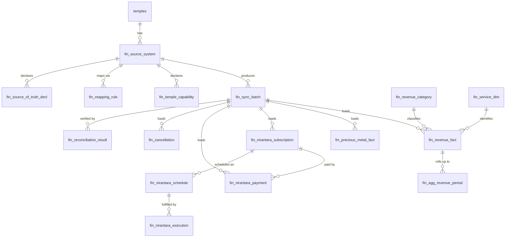

# Finance Canonical Data Model

**Status:** DRAFT — design only. No migration, entity or table created.
**Date:** 2026-09-16
**Parent:** [MULTI_TEMPLE_FINANCE_ARCHITECTURE.md](MULTI_TEMPLE_FINANCE_ARCHITECTURE.md)

All tables use the `fin_` prefix. All follow existing registry conventions: `is_deleted TINYINT(1)`, `created_at DATETIME(6)`, `updated_at DATETIME(6)`, `created_by BIGINT`, `updated_by BIGINT`, `ENGINE=InnoDB DEFAULT CHARSET=utf8mb4 COLLATE=utf8mb4_unicode_ci`, constraint prefixes `uk_` / `idx_` / `fk_`.

---

## 1. Design Principles

1. **No source vocabulary.** No `SevaCode`, `ssv_code`, `Finyear` integer, `BillCancled` or any table name from a source system appears above the staging layer.
2. **Provenance on every fact.** `temple_id`, `source_system_id`, `sync_batch_id`, `source_record_ref`.
3. **Daily grain by default** ([ADR-003](adr/ADR-003-canonical-grain.md)) — measured 184× reduction on Kollur.
4. **Availability is data.** Queryable, not a UI string.
5. **Semantics preserved.** A prasadam sale is not a seva; a booking is not an execution.
6. **Nullable amounts.** A null amount plus an availability status is how "not available" is represented. There is no sentinel zero.

---

## 2. Entity Overview



### Entities and why each exists

| # | Entity | Type | Purpose | Build now? |
|---:|---|---|---|:--:|
| 1 | `fin_source_system` | Config | Which system feeds which temple; the missing 300001↔43 link | **YES** |
| 2 | `fin_temple_capability` | Config | What each temple can answer, with coverage | **YES** |
| 3 | `fin_source_of_truth_decl` | Config | Explicit, versioned authoritative-field declaration | **YES** |
| 4 | `fin_mapping_rule` | Config | Source value → canonical value | **YES** |
| 5 | `fin_sync_batch` | Operational | Audit spine for every extraction | **YES** |
| 6 | `fin_stg_*` | Staging | Immutable raw landing | **YES** |
| 7 | `fin_revenue_category` | Dimension | Canonical income taxonomy | **YES** |
| 8 | `fin_service_dim` | Dimension | Canonical seva/service identity | **YES** |
| 9 | `fin_revenue_fact` | **Fact** | Daily-grain revenue — the core table | **YES** |
| 10 | `fin_cancellation` | Fact | Full-detail cancellations (few rows) | **YES** |
| 11 | `fin_precious_metal_fact` | Fact | Gold/silver counts and weights | **YES** |
| 12 | `fin_nirantara_subscription` | Fact | Perpetual-seva bookings | **YES** |
| 13 | `fin_nirantara_payment` | Fact | Payments against subscriptions | **YES** |
| 14 | `fin_nirantara_schedule` | Fact | Scheduled occurrences | **YES** |
| 15 | `fin_nirantara_execution` | Fact | Actual performance — **empty for Kollur by design** | **YES** (table), no rows |
| 16 | `fin_reconciliation_result` | Operational | Per-batch integrity record | **YES** |
| 17 | `fin_agg_revenue_period` | Aggregate | Report-shaped rollup | **YES** |
| 18 | `fin_agg_revenue_service` | Aggregate | Seva revenue split | **YES** |
| 19 | `fin_expense_fact` | Fact | Expenditure | **DEFER** — no source (Q1) |
| 20 | `fin_grant`, `fin_grant_utilisation`, `fin_work_project` | Fact | DC funds and works | **DEFER** — no source (Q3) |
| 21 | `fin_agg_district_*` | Aggregate | District rollups | **DEFER** to Stage 3 |
| 22 | `fin_devotee_*` | Dimension | Devotee identity | **NEVER** — free text, no key, privacy |

Building #15 with zero rows is deliberate: a table that exists and is empty, backed by capability `NOT_AVAILABLE`, is a structural statement that execution is unknown. It also means the day Kollur starts recording fulfilment, no schema change is needed.

---

## 3. Configuration & Metadata

### 3.1 `fin_source_system`

Resolves the identity gap: the `300001 ↔ 43` mapping exists nowhere today.

| Column | Type | Notes |
|---|---|---|
| `id` | BIGINT PK AI | |
| `temple_id` | BIGINT **FK → temples.id** | `300001` |
| `system_code` | VARCHAR(50) | `KOLSOHAM` |
| `system_name` | VARCHAR(200) | |
| `source_technology` | VARCHAR(30) | `SQL_SERVER` \| `MYSQL` \| `POSTGRESQL` \| `FILE` \| `API` |
| `connector_type` | VARCHAR(30) | `PULL_JDBC` \| `PUSH_AGENT` \| `SOURCE_API` \| `FILE_DROP` |
| `connector_bean` | VARCHAR(150) | `kollurFinanceConnector` |
| `source_temple_code` | VARCHAR(50) | **`43`** |
| `source_database_name` | VARCHAR(100) | `KOLSOHAM_LOCAL` (documentation, not a connection string) |
| `credential_ref` | VARCHAR(200) | Key/alias — **never a credential** |
| `sync_schedule_cron` | VARCHAR(50) | |
| `sync_enabled` | TINYINT(1) | Kill switch |
| `staleness_threshold_hours` | INT | Per-temple; drives `FRESH`/`STALE` |
| `schema_fingerprint` | VARCHAR(64) | Detects source schema drift (R9) |
| `timezone` | VARCHAR(50) | `Asia/Kolkata` |
| *audit columns* | | |

`uk_fss_temple_system (temple_id, system_code)`, `idx_fss_enabled (sync_enabled)`.

A temple may have more than one source system (e.g. POS plus an accounting package), which is why this is not a column on `temples`.

### 3.2 `fin_temple_capability`

| Column | Type | Notes |
|---|---|---|
| `id` | BIGINT PK AI | |
| `temple_id` | BIGINT FK | |
| `source_system_id` | BIGINT FK | |
| `capability` | VARCHAR(50) | See enum below |
| `availability` | VARCHAR(30) | `AVAILABLE` \| `PARTIALLY_AVAILABLE` \| `NOT_AVAILABLE` \| `NOT_APPLICABLE` |
| `availability_reason` | TEXT | **Shown to the user verbatim** |
| `coverage_from` / `coverage_to` | DATE | Per capability — Kollur's differ by stream |
| `known_gaps_json` | JSON | e.g. gold/silver FY2021-22, FY2022-23 |
| `last_reviewed_at` | DATETIME(6) | |

`uk_ftc_temple_capability (temple_id, capability)`.

**Capability enum:** `REVENUE`, `SEVA`, `DONATION`, `PRASADAM_SALE`, `PAYMENT_MODE`, `CANCELLATION`, `PRECIOUS_METAL_COUNT`, `PRECIOUS_METAL_WEIGHT`, `PRECIOUS_METAL_VALUE`, `NIRANTARA_SUBSCRIPTION`, `NIRANTARA_PAYMENT`, `NIRANTARA_SCHEDULE`, `NIRANTARA_EXECUTION`, `EXPENSE`, `EXPENSE_CATEGORY`, `GRANT`, `GRANT_UTILISATION`, `WORKS`, `IN_KIND_DONATION`.

**Kollur's seed rows** (the architecture's honesty made data):

| Capability | Availability | Reason |
|---|---|---|
| `REVENUE`, `SEVA`, `DONATION`, `PRASADAM_SALE` | `AVAILABLE` | — |
| `CANCELLATION` | `AVAILABLE` | — |
| `PRECIOUS_METAL_COUNT` / `_WEIGHT` | `AVAILABLE` | Weight recorded per item in grams |
| `PRECIOUS_METAL_VALUE` | `NOT_AVAILABLE` | "The source records no valuation or purity for donated gold and silver." |
| `NIRANTARA_SUBSCRIPTION` | `AVAILABLE` | — |
| `NIRANTARA_PAYMENT` | `PARTIALLY_AVAILABLE` | "Payments are recorded only up to FY2023-24." |
| `NIRANTARA_SCHEDULE` | `AVAILABLE` | — |
| `NIRANTARA_EXECUTION` | `NOT_AVAILABLE` | "The source records scheduled sevas but never records performance. Booking data alone cannot prove execution." |
| `PAYMENT_MODE` | `PARTIALLY_AVAILABLE` | "No payment-mode field exists; cash is inferred from the absence of card details." |
| `EXPENSE`, `EXPENSE_CATEGORY`, `GRANT`, `GRANT_UTILISATION`, `WORKS` | `NOT_AVAILABLE` | "The source system does not record expenditure." |

### 3.3 `fin_source_of_truth_decl`

Makes the `DailySevaNew.Amount` vs `DailySevaNewDetails.TotalAmount` decision an explicit, reviewable, versioned artefact rather than a line of code ([ADR-008](adr/ADR-008-source-of-truth-declaration.md)).

| Column | Type | Notes |
|---|---|---|
| `id` | BIGINT PK AI | |
| `source_system_id` | BIGINT FK | |
| `metric` | VARCHAR(50) | `REVENUE_AMOUNT` |
| `version` | INT | Incremented, never overwritten |
| `source_object` | VARCHAR(200) | `DailySevaNew` |
| `source_field` | VARCHAR(100) | `Amount` |
| `filter_predicate` | TEXT | `BillCancled=0 AND Deleteflag=0 AND ReceiptDate>='2015-01-01'` |
| `rejected_alternatives_json` | JSON | The rejected candidates **and why** |
| `rationale` | TEXT | |
| `approved_by` / `approved_at` | BIGINT / DATETIME(6) | |
| `effective_from` / `effective_to` | DATE | |

Kollur `REVENUE_AMOUNT` v1 `rejected_alternatives_json`:

```json
[
  {"object":"DailySevaNewDetails","field":"TotalAmount","measured":537753226,
   "reason":"41% below header total; internally inconsistent with Amount×Qty"},
  {"object":"DailySevaNewDetails","field":"Amount*Qty","measured":563107228,
   "reason":"Does not match the table's own TotalAmount"},
  {"object":"DailySevaNewOld","field":"Amount",
   "reason":"Exact duplicate of six FY archives — inclusion doubles all history"}
]
```

### 3.4 `fin_mapping_rule`

| Column | Type | Notes |
|---|---|---|
| `id` | BIGINT PK AI | |
| `source_system_id` | BIGINT FK | |
| `mapping_type` | VARCHAR(40) | `REVENUE_CATEGORY` \| `SERVICE` \| `PAYMENT_MODE` \| `STATUS` \| `FINANCIAL_YEAR` \| `METAL_TYPE` |
| `source_value` | VARCHAR(200) | `430`, `KN`, `2` |
| `source_label` | VARCHAR(400) | `HUNDIALS`, `ಬಂಗಾರ` |
| `canonical_value` | VARCHAR(100) | `HUNDI_DONATION`, `DONATION`, `GOLD` |
| `is_active` | TINYINT(1) | |
| `notes` | TEXT | |

`uk_fmr_source_type_value (source_system_id, mapping_type, source_value)`.

Unmapped source values do **not** silently default. They are routed to an `UNMAPPED` canonical value, counted, and surfaced as a warning — so a new seva code added at the temple shows up as an operational signal rather than quietly disappearing from a revenue total.

### 3.5 `fin_sync_batch`

The audit spine. Shape deliberately mirrors `email_outbox`.

| Column | Type | Notes |
|---|---|---|
| `id` | BIGINT PK AI | |
| `batch_ref` | VARCHAR(64) | UUID, externally quotable |
| `temple_id`, `source_system_id` | BIGINT FK | |
| `capability` | VARCHAR(50) | One batch per capability |
| `sync_type` | VARCHAR(20) | `HISTORICAL` \| `INCREMENTAL` \| `BACKFILL` \| `REPLAY` |
| `status` | VARCHAR(30) | `PENDING`→`RUNNING`→`SUCCESS` \| `FAILED` \| `RECONCILE_FAILED` \| `DEAD_LETTER` |
| `window_from` / `window_to` | DATETIME(6) | Extraction window |
| `watermark_before` / `watermark_after` | VARCHAR(100) | Advanced only on success |
| `rows_extracted` / `rows_rejected` / `rows_loaded` | BIGINT | |
| `retry_count` / `max_retries` / `next_retry_at` | INT / INT / DATETIME(6) | Exponential back-off |
| `last_failure_reason` | TEXT | |
| `schema_fingerprint` | VARCHAR(64) | Compared to `fin_source_system` |
| `started_at` / `finished_at` / `duration_ms` | | |
| `triggered_by` | VARCHAR(50) | `SCHEDULER` \| `MANUAL` \| `ONBOARDING` |

`idx_fsb_temple_status (temple_id, status)`, `idx_fsb_retry (status, next_retry_at)`.

Retained indefinitely — small, and it is the evidence base for any published figure.

---

## 4. Staging

Immutable landing. One table per capability; columns deliberately loose (raw strings) so extraction never fails on a bad value — validation happens in normalization.

`fin_stg_revenue` carries: `id`, `sync_batch_id`, `source_system_id`, `raw_json JSON`, `source_record_ref`, `extracted_at`, `validation_status` (`PENDING`/`VALID`/`REJECTED`), `rejection_reason`.

Storing `raw_json` rather than typed columns means a source schema change lands in staging and is caught by validation, instead of breaking extraction. Retention 30–90 days (Q7), enabling replay without re-contacting the source.

---

## 5. Dimensions

### 5.1 `fin_revenue_category`

Canonical, **platform-wide** taxonomy — not Kollur's.

| `category_code` | Meaning | Kollur source |
|---|---|---|
| `SEVA` | Ritual service performed for a devotee | `sannidhi` = `DS` |
| `SPECIAL_SEVA` | High-value / occasional ritual | `sannidhi` = `SS` |
| `DONATION` | Voluntary offering | `sannidhi` = `KN` |
| `HUNDI_DONATION` | Donation-box collection | `SevaCode 430` |
| `PRASADAM_SALE` | Retail sale of prasadam | `sannidhi` = `PS` |
| `ENTRY_FEE` | Darshan/entry | `SevaCode 75` |
| `IN_KIND_DONATION` | Non-cash | `SareeDonation` |
| `ASSET_REALISATION` | Proceeds from donated assets | `SareeAuction` |
| `RENT_LEASE`, `HALL_BOOKING`, `OTHER_INCOME` | | (empty for Kollur) |

This taxonomy is the answer to *"do not simply call every transaction a Seva"*. Kollur's Laddu, Cloth Bag, Panchakajjaya, Theertha Bottle and Maha Prasada — ₹27.7 Cr in FY2025-26 — map to `PRASADAM_SALE`, not `SEVA`. Hundi's ₹13.40 Cr maps to `HUNDI_DONATION`, not `SEVA`, because 13 "bookings" averaging ₹1.03 Cr are collection events, not purchased rituals.

### 5.2 `fin_service_dim`

Canonical service identity, scoped per temple (service catalogs are genuinely temple-specific).

`id`, `temple_id`, `service_code` (canonical, stable), `service_name_en`, `service_name_local` (**nvarchar-equivalent for Kannada**), `category_id` FK, `rate_card_amount` (nullable — list price, **never revenue**), `is_active`, `source_record_ref`.

`uk_fsd_temple_service (temple_id, service_code)`.

`rate_card_amount` is stored but explicitly not a revenue source — it is Kollur's `ssv_amount`, the list price, which diverges legitimately from what was charged.

---

## 6. Facts

### 6.1 `fin_revenue_fact` — the core table

**Grain: one row per (temple, date, service, category, payment-mode indicator, counter).** Measured: 22,348,125 Kollur rows → 121,242.

| Column | Type | Notes |
|---|---|---|
| `id` | BIGINT PK AI | |
| `temple_id` | BIGINT FK | **Isolation key** |
| `source_system_id`, `sync_batch_id` | BIGINT FK | Provenance |
| `transaction_date` | DATE | **The canonical date** |
| `financial_year` | VARCHAR(10) | `2025-26` — canonical string, never `20252026` |
| `service_id` | BIGINT FK nullable | |
| `category_id` | BIGINT FK | |
| `payment_mode` | VARCHAR(30) | `CASH`, `CARD`, `UPI`, `BANK`, **`UNRECORDED`** |
| `payment_mode_confidence` | VARCHAR(20) | `RECORDED` \| `INFERRED` — Kollur is `INFERRED` |
| `counter_ref` | VARCHAR(50) nullable | |
| `operator_ref` | VARCHAR(50) nullable | Pseudonymous |
| `transaction_count` | BIGINT | Receipts in this group |
| `gross_amount` | DECIMAL(18,2) | |
| `cancelled_count` | BIGINT | |
| `cancelled_amount` | DECIMAL(18,2) | |
| `net_amount` | DECIMAL(18,2) | `gross − cancelled`, materialised |
| `quantity` | DECIMAL(18,3) nullable | Items, where meaningful |
| `currency` | CHAR(3) | `INR` |
| `source_record_ref` | VARCHAR(200) | e.g. `DailySevaNew\|2025-04-01\|83\|1` |
| `source_of_truth_version` | INT | |

`uk_frf_grain (temple_id, source_system_id, transaction_date, service_id, category_id, payment_mode, counter_ref, operator_ref)` — this is what makes loading idempotent. The three nullable members are enforced through generated `IFNULL` stand-in columns (FIN-D-018). `source_system_id` joined the key in **V118 (FIN-052A)**; before that, two sources reporting one temple's day overwrote each other (FIN-D-067). `operator_ref` was always in the key and was missing from this line.
Indexes: `(temple_id, financial_year)`, `(temple_id, transaction_date)`, `(temple_id, category_id, financial_year)`, `(sync_batch_id)`.

Note what is **absent**: devotee name, address, mobile, email, receipt number. None is needed by any catalogued report, and excluding them keeps personal data out of the central platform entirely.

### 6.2 `fin_cancellation`

Cancellations are few (465 rows across Kollur's entire history) and carry audit significance, so they are kept at full detail rather than aggregated: `temple_id`, `cancelled_date`, `original_transaction_date`, `service_id`, `amount`, `cancelled_by_ref`, `reason`, `source_record_ref`.

### 6.3 `fin_precious_metal_fact`

**Grain: one row per (temple, date, metal type).**

`temple_id`, `donation_date`, `financial_year`, `metal_type` (`GOLD` \| `SILVER` \| `MIXED` \| `UNKNOWN`), `item_count`, `total_weight_grams DECIMAL(18,3)` **nullable**, `purity_grade VARCHAR(50)` **nullable**, `assessed_value DECIMAL(18,2)` **nullable**, `value_basis VARCHAR(30)`, `source_record_ref`.

`value_basis` enum: `APPRAISED`, `DONOR_DECLARED`, `AUCTION_REALISED`, **`NOT_RECORDED`**.

Three nullable columns and `value_basis` together are the structural guarantee that the 15 g and ₹12,000 assumptions cannot return. For Kollur, `total_weight_grams` is populated (real grams), `purity_grade` and `assessed_value` are `NULL`, and `value_basis` is `NOT_RECORDED`. Any UI receiving `NULL` renders the reason.

Kollur mapping: `HItemMaster.ItemSlNo = 2` (ಬಂಗಾರ) → `GOLD`; `= 1` (ಬೆಳ್ಳಿ) → `SILVER`, via `fin_mapping_rule` of type `METAL_TYPE`.

### 6.4 Nirantara — four separate entities

The lifecycle separation is enforced by having four tables, not one with status columns ([ADR-009](adr/ADR-009-nirantara-lifecycle-separation.md)). You cannot accidentally report execution from a subscription row because execution lives in a different table that is empty.

**`fin_nirantara_subscription`** — `temple_id`, `subscription_ref`, `subscriber_ref` (pseudonymous), `service_id`, `booking_date`, `period_from`, `period_to` (nullable), `recurrence_type`, `recurrence_detail_json`, `corpus_amount` **nullable** (Kollur: `FDAMOUNT` positive on zero rows → `NULL`), `subscription_status` (`ACTIVE`/`CLOSED`/`CANCELLED`/**`UNKNOWN`**), `status_confidence` (`RECORDED`/`ASSUMED`), `source_record_ref`.

Kollur loads `subscription_status = UNKNOWN`, `status_confidence = ASSUMED` — because `ACTIVE=1` and `SEVACLOSED=0` on all 6,659 rows means the column carries no information, and recording it as `ACTIVE` would assert something the source does not know.

**`fin_nirantara_payment`** — `subscription_id` FK, `payment_date`, `financial_year`, `amount`, `payment_mode`, `source_record_ref`. Kollur: rows to FY2023-24 only; capability `PARTIALLY_AVAILABLE` carries the bound.

**`fin_nirantara_schedule`** — `subscription_id` FK, `scheduled_date`, `schedule_generated` BOOLEAN, `schedule_source_ref`. Kollur's `seva_Prepared` maps **here**, named `schedule_generated`, because it is set on 17,808 future-dated rows and therefore means "row generated", not "ritual performed".

**`fin_nirantara_execution`** — `schedule_id` FK, `executed_date`, `execution_status` (`PERFORMED`/`MISSED`/`DEFERRED`), `recorded_by_ref`, `evidence_ref`. **Zero rows for Kollur, by design.**

### 6.5 Deferred facts

`fin_expense_fact`, `fin_expense_category`, `fin_grant`, `fin_grant_utilisation`, `fin_work_project` — designed in outline, **not built**, pending Q1 and Q3. Building empty expense tables now would invite someone to populate them with the PDF-derived figures the current dashboard uses, which is exactly the failure mode this architecture exists to prevent.

---

## 7. Aggregates

Rebuilt deterministically from facts; publishable only after reconciliation passes ([ADR-011](adr/ADR-011-reporting-aggregation.md)).

**`fin_agg_revenue_period`** — **BUILT in V119 (FIN-070), applied and verified on MySQL 8.0.** Grain:
`uk_farp_grain (temple_id, source_system_id, period_type, period_key, category_id, payment_mode)`,
every column `NOT NULL`.

Columns: `temple_id`, `source_system_id`, `period_type` (`FINANCIAL_YEAR` \| `MONTH` — the
`PeriodType` enum spelling), `period_key` (`2025-26`, `2025-04`), `category_id`, `payment_mode`,
`financial_year`, `period_start`, `period_end`, `fact_count`, `transaction_count` nullable,
`facts_with_unknown_count`, `gross_amount` nullable, `facts_with_unknown_gross`, `cancelled_count`
nullable, `cancelled_amount` nullable, `quantity` nullable, `currency`, `net_amount` **generated**,
`payment_mode_inferred_facts`, `reconciliation_status`, `reconciliation_inherited`, `calc_version`,
`computed_at`, `created_at`, `updated_at`.

Four differences from what this section described before it was built, all recorded in FIN-D-068:
`source_system_id` is in the grain (aggregates are never summed across sources, because the gate
decides per source); `category_id` is `NOT NULL` and there is **no** "null = all" total row, because
MySQL and TiDB do not constrain a NULL in a unique index and every run would insert another total —
totals are a `SUM` at read time; there is no `availability` column, because
`uk_ftc_temple_capability` is per temple and cannot describe a per-source row (limitation 67, decision
D9); and `DAY` is not built, because no catalogued report reads one.

**`fin_agg_revenue_service`** — **NOT BUILT, and BLOCKED** (FIN-071): no canonical fact has ever carried a `service_id`, so this table has no input until a service-resolution step exists (FIN-D-069, limitation 73). Two columns below are also withdrawn: `rate_card_amount` is one join away on `fin_service_dim` and would go stale if copied, and `avg_transaction_amount` is one division at read time. Planned shape: `temple_id`, `source_system_id`,
`financial_year`, `service_id`, `category_id`, `booking_count`, `gross_amount`, `cancelled_amount`,
`net_amount`, `avg_transaction_amount`, `rate_card_amount`. `pct_of_total` is deliberately dropped —
a stored percentage goes stale the moment any sibling row changes, and it is one division at read
time.

Availability is resolved by the reporting layer rather than carried on the row (FIN-D-068); a period with no data has no row at all, which stays distinguishable from a period with zero revenue.

---

## 8. Reconciliation

**`fin_reconciliation_result`** — `sync_batch_id` FK, `temple_id`, `capability`, `period_key`, `source_total DECIMAL(18,2)`, `canonical_total DECIMAL(18,2)`, `variance DECIMAL(18,2)`, `variance_pct`, `tolerance`, `status` (`MATCHED`/`WITHIN_TOLERANCE`/`VARIANCE_DETECTED`/`FAILED`/`NOT_RECONCILABLE`), `diagnosis`, `investigated_by`, `resolved_at`.

Detail in [FINANCE_RECONCILIATION.md](FINANCE_RECONCILIATION.md).

---

## 9. Kollur Volume Projection

| Table | Kollur (8 FYs) | 100 temples |
|---|---:|---:|
| `fin_revenue_fact` | **121,242** | ~12 M |
| `fin_precious_metal_fact` | ~600 | ~60 k |
| `fin_nirantara_subscription` | 6,659 | ~670 k |
| `fin_nirantara_payment` | 5,219 | ~520 k |
| `fin_nirantara_schedule` | ~333 k | ~33 M |
| `fin_cancellation` | 465 | ~47 k |
| `fin_agg_*` | ~3 k | ~300 k |
| **Total** | **~470 k** | **~47 M** |

Comfortable for TiDB without partitioning. `fin_nirantara_schedule` is the largest contributor at scale; if it becomes a problem it can be aggregated to monthly counts, since no catalogued report needs individual scheduled dates.

---

## 10. Model Validation Against Requirements

| Requirement | Satisfied by |
|---|---|
| No source vocabulary above staging | §1.1; `source_record_ref` is opaque |
| Temple isolation | `temple_id` on every fact; `uk_` includes it |
| Lineage | `sync_batch_id` + `source_system_id` + `source_record_ref` + `source_of_truth_version` |
| Missing ≠ zero | Nullable amounts + `fin_temple_capability` + `value_basis` |
| Booking ≠ payment ≠ execution | Four separate Nirantara tables; execution empty |
| Source-of-truth explicit | `fin_source_of_truth_decl` with rejected alternatives |
| Heterogeneous sources | `fin_source_system` + `fin_mapping_rule` |
| Per-temple capability | `fin_temple_capability` with coverage and gaps |
| Semantic honesty | `fin_revenue_category` separates prasadam/hundi/entry from seva |
| Volume | 184× measured reduction |
| Privacy | No devotee identity stored centrally |
