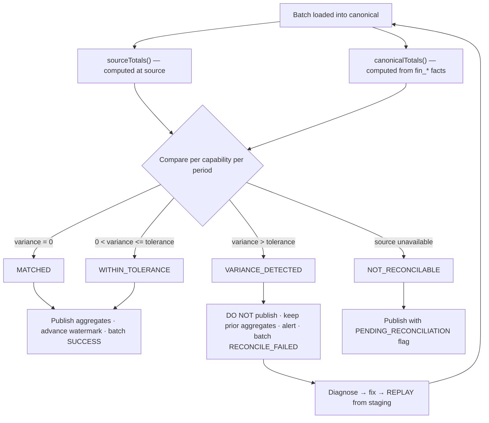

# Finance Reconciliation Framework

**Status:** DRAFT — design only.
**Date:** 2026-09-16
**Parent:** [MULTI_TEMPLE_FINANCE_ARCHITECTURE.md](MULTI_TEMPLE_FINANCE_ARCHITECTURE.md)

---

## 1. Why Reconciliation Is Load-Bearing Here

The dashboard shows figures a Deputy Commissioner may act on. Those figures are copies of numbers that live in a temple's operational database, produced by a pipeline of extraction, validation, mapping and aggregation. Every stage can be wrong.

Kollur supplies concrete, measured examples of how wrong:

| Trap | Effect if undetected |
|---|---|
| Including `DailySevaNewOld` | **Doubles all history** — 16,982,270 phantom rows |
| Using `DailySevaNewDetails.TotalAmount` | Understates revenue by **41 %** |
| Missing an archive table in the union | Silently drops a whole financial year |
| Counting cancellations as revenue | Overstates by the cancelled amount |
| Timezone shift on `ReceiptDate` | Misallocates a day across a year boundary |

Every one of these produces a plausible-looking number. None is detectable by inspecting the dashboard. Reconciliation is the only mechanism that catches them, which is why it **gates publication** rather than merely reporting after the fact.

---

## 2. Principle

> Compare a total computed **by the source engine** against the same total computed **from canonical data**, for the same period, on every batch. Publish aggregates only when they agree.

The first half matters. Reconciling against a re-sum of rows we already extracted proves only that we can add up our own copy. `TempleFinanceConnector.sourceTotals()` therefore issues an independent aggregate query to the source, so the comparison is genuinely between two systems.

---

## 3. Flow

The branch that matters is **G**. A variance leaves the previous good aggregates in place and marks the temple stale. The dashboard then shows *slightly old, correct* figures rather than *fresh, wrong* ones — which is the right default for government financial reporting.

---

## 4. Tolerances

| Capability | Default tolerance | Rationale |
|---|---|---|
| `REVENUE` | **₹0.00** | Revenue arithmetic should be exact; both sides sum the same authoritative field |
| `CANCELLATION` | ₹0.00 | Small, exact |
| `NIRANTARA_PAYMENT` | ₹0.00 | Small volume |
| `PRECIOUS_METAL_WEIGHT` | 0.001 g | Decimal rounding at `DECIMAL(18,3)` |
| `PRECIOUS_METAL_COUNT` | 0 | Integer |
| Row counts (all) | 0 | Exact |

Configurable per temple per capability in `fin_source_system`, but the default is exact. A tolerance is a deliberate, recorded decision, not a convenience.

---

## 5. Reconciliation Points

| Level | When | Compares |
|---|---|---|
| **Row count** | Every batch | Source rows vs staging rows |
| **Period total** | Every batch | Source `SUM` vs canonical `SUM`, per FY and per month |
| **Category total** | Every batch | Per `fin_revenue_category` |
| **Service total** | Weekly | Per service — catches mapping drift |
| **Full-history checksum** | Monthly | All FYs — catches hard deletes and silent source corrections |
| **Cross-stream sanity** | Monthly | Canonical revenue vs `trust_financials.annual_income` — **advisory only** |

The last is worth stating carefully. `trust_financials.annual_income` is a self-declared figure on a different basis from computed receipt revenue; they are not expected to match. A large divergence is a **signal worth a DC officer's attention**, not a reconciliation failure, and the framework reports it as advisory rather than blocking.

---

## 6. Kollur Baseline

These are the measured control totals the first historical load must reproduce exactly. They come from the prior analysis phase and are the acceptance criteria for Phase 3.

| FY | Receipts | Net revenue (`BillCancled=0`) |
|---|---:|---:|
| 2019-20 | 2,530,931 | ₹51.94 Cr |
| 2020-21 | 1,450,433 | ₹28.15 Cr |
| 2021-22 | 1,712,111 | ₹36.59 Cr |
| 2022-23 | 3,602,455 | ₹76.32 Cr |
| 2023-24 | 3,877,205 | ₹82.59 Cr |
| 2024-25 | 3,809,011 | ₹83.42 Cr |
| 2025-26 | 3,950,072 | ₹90.62 Cr |
| 2026-27 (to 26 Jul) | 1,415,755 | ₹38.61 Cr |
| **Total** | **22,348,125** *(gross incl. cancelled)* | |

Supporting checks:

| Check | Expected |
|---|---|
| Canonical `fin_revenue_fact` rows, all FYs | **121,242** |
| FY2025-26 canonical rows | **18,922** |
| FY2025-26 gross incl. cancelled | ₹90,62,77,206 |
| FY2025-26 cancelled | 22 receipts / ₹1,14,270 |
| Gold total weight | 325.516 kg over 1,895 items |
| Silver total weight | 539.250 kg over 316 items |
| Nirantara subscriptions | 6,659 |
| Nirantara execution rows | **0** |

**A doubling of any FY total is the `DailySevaNewOld` bug (R1).** That specific failure mode should have a named test.

---

## 7. Diagnosis

When `VARIANCE_DETECTED`, the reconciler classifies before a human looks:

| Category | Signature | Typical cause |
|---|---|---|
| `MISSING_RECORDS` | Canonical < source, counts differ | Chunk failed; archive table omitted |
| `DUPLICATE_RECORDS` | Canonical ≈ 2× source | **`DailySevaNewOld` included** |
| `TRANSFORMATION_ERROR` | Counts match, amounts differ | Wrong source field; unit error |
| `LATE_DATA` | Source > canonical, recent period only | Rows added after extraction |
| `SOURCE_CORRECTION` | Closed period changed | Temple edited history |
| `CANCELLATION_UPDATE` | Net differs, gross matches | Cancellation applied post-extraction |
| `SYNC_FAILURE` | Batch incomplete | Timeout, connectivity |
| `DATA_QUALITY_REJECTION` | Canonical < source by rejected count | Validation rejections |
| `MAPPING_GAP` | Category totals differ, overall matches | New unmapped source value |
| `UNKNOWN` | None of the above | Manual investigation |

Each writes `diagnosis` on `fin_reconciliation_result` with supporting counts, so the on-call engineer starts with a hypothesis rather than a spreadsheet.

---

## 8. Statuses

| Status | Aggregates published? | Freshness shown | Action |
|---|:--:|---|---|
| `MATCHED` | ✅ | `FRESH` | None |
| `WITHIN_TOLERANCE` | ✅ | `FRESH` | Logged |
| `VARIANCE_DETECTED` | ❌ | `STALE` + under review | Investigate, fix, replay |
| `FAILED` | ❌ | `STALE` | Retry / escalate |
| `NOT_RECONCILABLE` | ✅ with flag | `FRESH` + `PENDING_RECONCILIATION` | Reconcile when source returns |
| `PENDING` | ❌ | previous state | In progress |

---

## 9. Manual Review and Resolution

`VARIANCE_DETECTED` raises an alert carrying temple, capability, period, both totals, variance, percentage and diagnosis.

Resolution path: reproduce against the source → identify cause → fix connector, mapping or validation → **replay from staging** (no source re-contact needed) → re-reconcile → record `investigated_by`, `resolved_at` and resolution notes on `fin_reconciliation_result`.

If the source itself was corrected (a legitimate temple-side edit to a closed period), the resolution is to accept the new total and record the restatement — with the prior value preserved in the reconciliation history, because a changed historical figure in a government report needs an explanation attached to it.

---

## 10. Audit Trail

`fin_reconciliation_result` is append-only and retained indefinitely. Together with `fin_sync_batch` it answers, for any figure ever displayed: which batch produced it, from which source system and window, how many rows were extracted, rejected and loaded, which source-of-truth version applied, whether it reconciled, against what source total, and who investigated any variance.

That chain is what makes a number on the DC dashboard defensible months later — which, in a government context, is the point of the whole exercise.

---

## 11. Exposure

- `GET /api/v1/dc/temples/{templeId}/finance/sync-status` — latest batch and reconciliation per capability.
- Every finance response carries a `reconciliation` block (§31 of the architecture).
- A DC-facing indicator distinguishes **reconciled** from **pending** from **under review**, so the officer can see the difference between a verified figure and a provisional one without reading a runbook.
