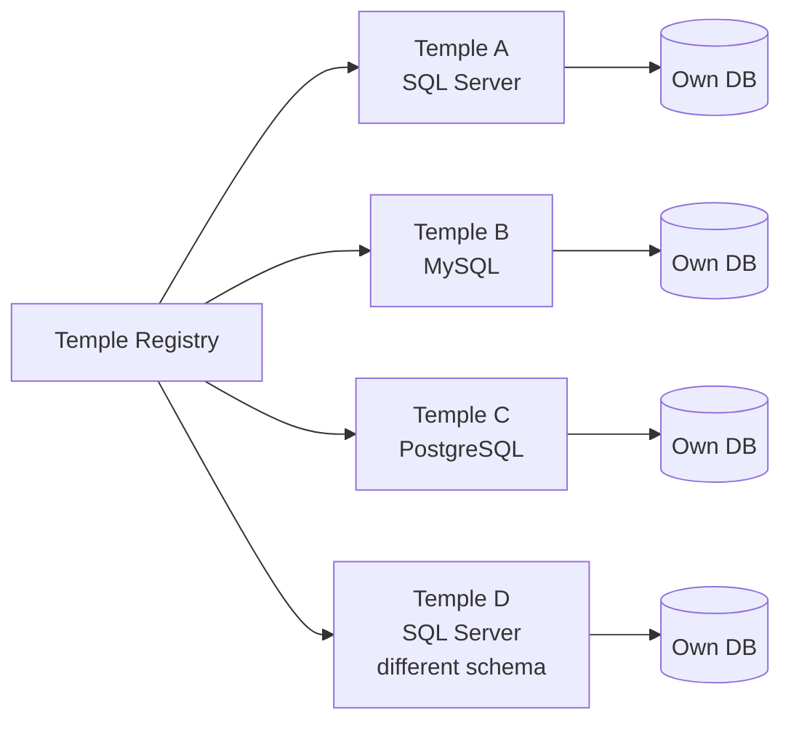
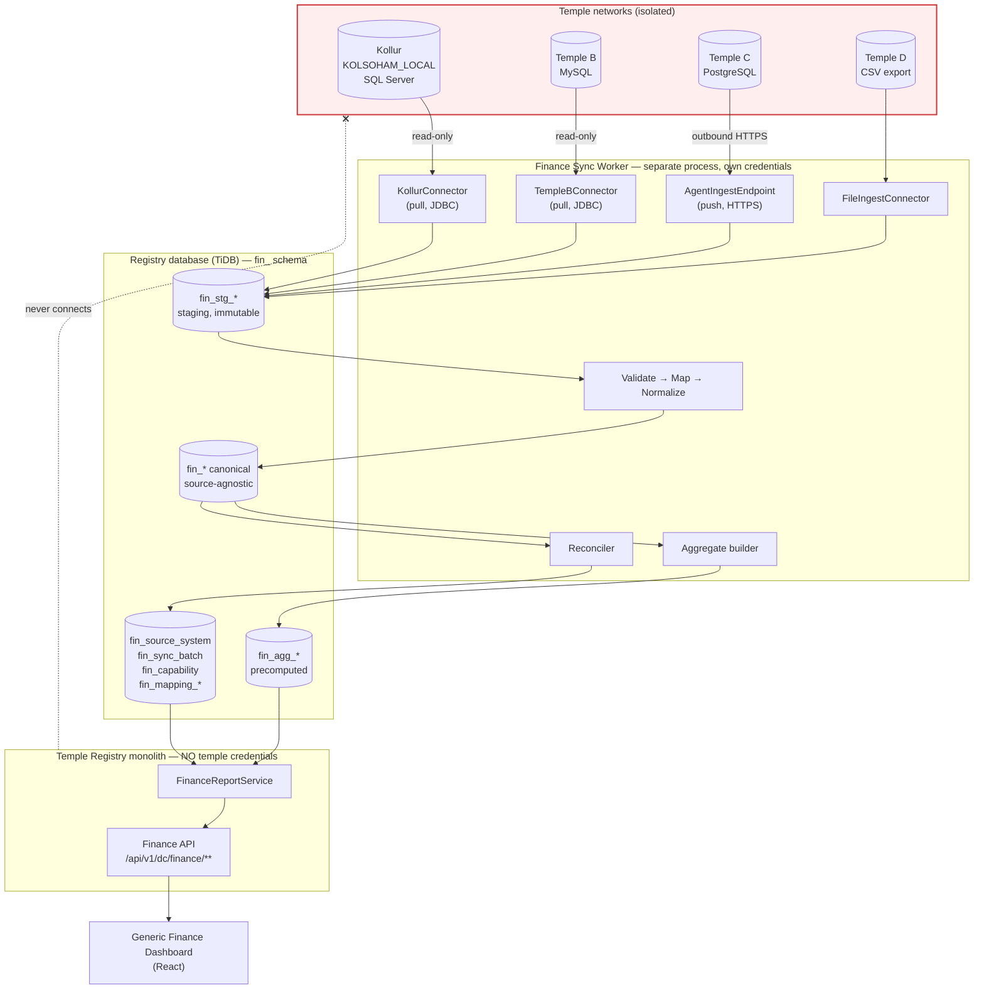
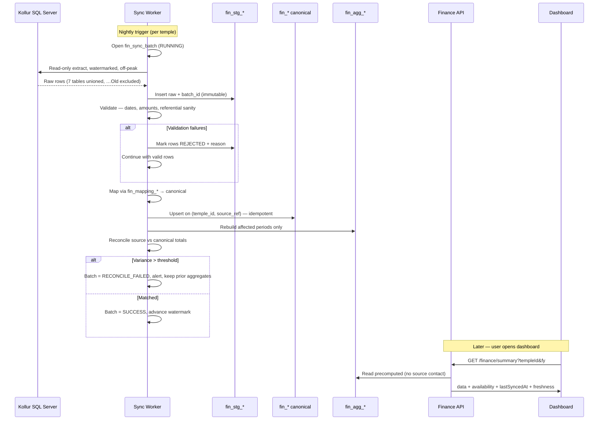
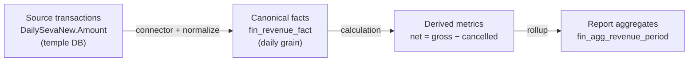
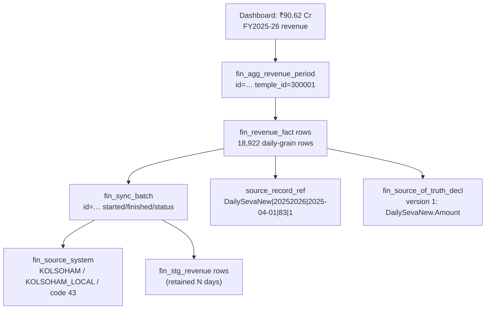
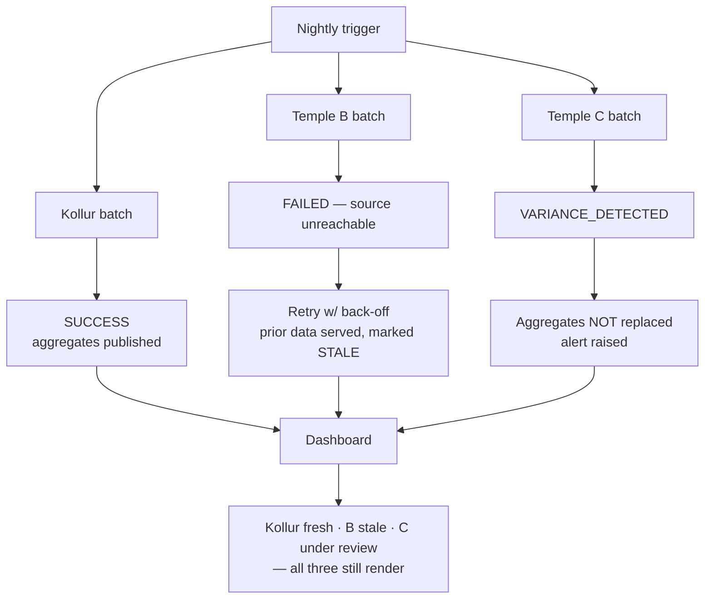
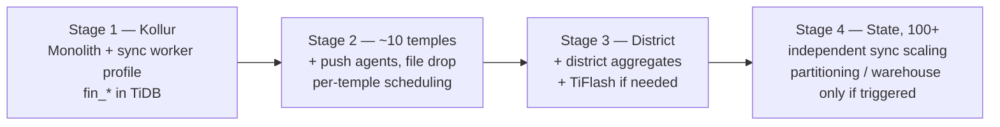

# Multi-Temple Finance Reporting Platform — Architecture

**Status:** DRAFT — for architecture review. Nothing implemented.
**Date:** 2026-09-16
**Scope:** Architecture analysis, design and implementation plan only. No production code, migration, entity, API, frontend or deployment change has been made.

**Related documents**
- [FINANCE_DATA_MODEL.md](FINANCE_DATA_MODEL.md) — canonical entities
- [FINANCE_DATA_INTEGRATION.md](FINANCE_DATA_INTEGRATION.md) — connectors, sync, error handling
- [FINANCE_RECONCILIATION.md](FINANCE_RECONCILIATION.md) — reconciliation framework
- [FINANCE_REPORT_CATALOG.md](FINANCE_REPORT_CATALOG.md) — report-by-report specification
- [TEMPLE_FINANCE_ONBOARDING.md](TEMPLE_FINANCE_ONBOARDING.md) — onboarding runbook
- [adr/](adr/) — 11 architectural decision records
- [KOLLUR_FINANCE_DATA_ANALYSIS.md](KOLLUR_FINANCE_DATA_ANALYSIS.md) — source data analysis (prior phase)
- [../database/KOLSOHAM_DATABASE_ANALYSIS.md](../database/KOLSOHAM_DATABASE_ANALYSIS.md) — source schema analysis (prior phase)

---

## 1. Executive Summary

We are not building a Kollur finance dashboard. We are building a **Temple Finance Reporting Platform** for which Kollur is the first onboarded source system.

Three findings from inspecting the existing system shaped this design more than anything else.

**First — the registry database is TiDB Cloud, not plain MySQL.** `application.yml` points at `gateway01.ap-southeast-1.prod.aws.tidbcloud.com:4000`. TiDB is a horizontally-scalable, MySQL-compatible HTAP engine with an optional columnar replica (TiFlash). This removes the usual "we will need a data warehouse by temple 20" pressure and is the single strongest argument for keeping the reporting store inside the existing database rather than standing up separate analytics infrastructure. See [ADR-002](adr/ADR-002-central-reporting-store.md).

**Second — the volume problem is far smaller than it looks.** Kollur holds 22,348,125 raw receipt rows across eight financial years. Aggregated to the grain every report in the catalog actually needs — date × seva × counter — those 22.3 M rows collapse to **121,242 rows**. That is a **184× reduction**, measured, not estimated. Eight years of one of Karnataka's busiest temples fits in about 121 k rows; a hundred comparable temples fit in roughly 12 M. That is an unremarkable table for TiDB. This measurement is what makes a pragmatic architecture possible and is the basis of [ADR-003](adr/ADR-003-canonical-grain.md).

**Third — the codebase already contains most of the patterns this work needs.** `email_outbox` is a full outbox with a `PENDING → SENT | FAILED → DEAD_LETTER` state machine, `retry_count`, `max_retries`, `next_retry_at` exponential back-off and `last_failure_reason`. `workflow_instances` / `workflow_transitions` give a status-plus-transition-log precedent. `entity_versions` stores immutable `snapshot_json` with `diff_json`. `AsyncConfig` already defines a bounded executor with `AbortPolicy`. `@EnableScheduling` is on. We should reuse these shapes rather than invent new ones.

### The recommended architecture in one paragraph

A **connector-based batch integration** extracts from each temple's operational database into **staging tables**, normalizes into a **canonical finance model** stored in the existing TiDB registry database under a `fin_` prefix, and precomputes **aggregate tables** that the Finance APIs read. The Finance domain — APIs, report services, dashboard — lives inside the existing modular monolith. The **extraction runs in a separately deployed sync worker built from the same codebase and repository, activated by a Spring profile**. That single deployment split is what makes the hard constraint real: the Temple Registry runtime process never holds a temple database credential and never opens a connection to a temple network, while we still avoid the cost of a genuine microservice. Connectors support both **pull** (central reaches the temple DB over a controlled channel) and **push** (a temple-side agent sends extracts outbound over HTTPS), because a platform that must onboard a hundred temples of wildly varying IT maturity cannot assume inbound network access to any of them. See [ADR-001](adr/ADR-001-no-runtime-source-access.md) and [ADR-010](adr/ADR-010-monolith-vs-sync-service.md).

### What this buys us

| Requirement | How it is met |
|---|---|
| Registry never queries temple DBs at runtime | Extraction is a different process with different credentials, different network zone ([ADR-001](adr/ADR-001-no-runtime-source-access.md)) |
| Same dashboard for all temples | Dashboard reads canonical APIs; no temple-specific branch anywhere in the frontend (§31) |
| Heterogeneous databases and schemas | Per-temple connector implementations behind one `TempleFinanceConnector` port ([ADR-004](adr/ADR-004-adapter-vs-config-mapping.md)) |
| Missing data never shown as zero | `DataAvailability` enum carried from canonical model through API to UI ([ADR-007](adr/ADR-007-data-availability-model.md)) |
| Large volumes | 184× grain reduction, measured (§38) |
| Traceability | `fin_sync_batch` + `source_record_ref` + immutable staging (§21) |
| Per-temple failure isolation | Per-temple batches, per-temple status, one temple's failure invisible to others (§27) |

### What we are explicitly not building on day one

No Kafka, no Debezium/CDC, no separate analytics database, no data warehouse, no microservice mesh, no per-temple API contract imposed on temples. Each is analysed in §11 and each is deferred with a stated trigger condition in §37.

---

## 2. Business Context

The Temple Registry & Management Portal is a Karnataka government platform through which the Deputy Commissioner's office oversees temple administration. Temples submit declarations, asset registers, trust financials and governance records; DC staff verify, flag and approve them.

Finance is different from everything else in the portal. Every other module's data is **authored inside the registry** — a Temple Authority fills a form, a DC officer approves it. Financial transaction data is **authored in the temple's own operational system**, typically a counter-side POS that issues seva receipts all day. The registry does not and should not own that data; it needs a faithful, auditable, periodically-refreshed *reflection* of it.

That distinction is the reason this module needs an integration architecture at all, and the reason the design centres on provenance and reconciliation rather than on CRUD.

---

## 3. Current State

### 3.1 Backend

| Aspect | Finding |
|---|---|
| Framework | Spring Boot, Java, Maven (`backend/pom.xml`) |
| Structure | **Layered, not feature-modular** — top-level `controller/`, `service/`, `repository/`, `entity/`, `dto/`, with domain sub-packages beneath each (`controller/dc/`, `service/impl/dc/`, …) |
| Size | 109 entities, 65 repositories, 155 service classes, 39 controllers, 188 DTOs, 48 event classes |
| Database | **TiDB Cloud** (MySQL wire-compatible), HikariCP, `maximum-pool-size: 8` |
| Migrations | Flyway, 22 migrations (`V1`…`V109`), `validate-on-migrate: false`, `repair-on-migrate: true` |
| JPA | `ddl-auto: update` **alongside** Flyway — see §41 risk |
| Async | `AsyncConfig` — `taskExecutor` (4/10/100) and `exportExecutor` (2/5/10, `AbortPolicy` → HTTP 503) |
| Scheduling | `@EnableScheduling`; existing schedulers for overdue declarations, overdue workflows, notice expiry, email retry/DLQ monitoring |
| Caching | Caffeine (`CacheConfig`), 5-minute TTL, 10 k entries, documented as Redis-swap-compatible |
| Security | JWT, TOTP MFA, refresh tokens, `@PreAuthorize(RoleConstants.*)` |
| Roles | `SUPER_ADMIN`, `DISTRICT_COLLECTOR`, `DC_STAFF`, `TEMPLE_AUTHORITY`, `AUDITOR`, `VIEWER` |
| Field-level access | DACVM policy engine — `access_control_policies`, `access_control_field_masks`, target keys |
| API convention | `/api/v1/dc/...`, `/api/v1/ta/...` with `@RequestMapping` at class level |
| Audit | `audit_auth_events`, `audit_data_events`, `audit_export_events`, `document_access_logs` |
| Outbox | `email_outbox` — `PENDING → SENT \| FAILED → DEAD_LETTER`, exponential back-off, DLQ monitor |
| Async jobs | `export_job_records` (job id, actor, expiry) + `AsyncExportBean` |
| Idempotency | `idempotency_records`, `workflow_idempotency_records` |
| Integration patterns | **None.** No outbound integration, no second datasource, no HTTP client to an external system |
| Secrets | Env vars with **hard-coded defaults in `application.yml`** — see §29 |
| Object storage | None — AWS config removed, local filesystem (`app.storage.base-dir`) |

**Conventions to follow.** Every table carries `is_deleted`, `created_at DATETIME(6)`, `updated_at DATETIME(6)`, `created_by BIGINT`, `updated_by BIGINT`; optimistic locking via `lock_version`; constraint naming `uk_` / `idx_` / `fk_`; `ENGINE=InnoDB DEFAULT CHARSET=utf8mb4 COLLATE=utf8mb4_unicode_ci`.

### 3.2 Registry database — what exists for finance

**Almost nothing.** There is no donation, seva, booking, payment, transaction, receipt, revenue or expense table. The single financial structure is `trust_financials`:

```
trust_financials(id, trust_id FK→trusts.id, financial_year VARCHAR(10),
                 annual_income DECIMAL(18,2), annual_expenditure DECIMAL(18,2),
                 submitted_at, document_id, is_deleted, + audit columns)
```

Two self-declared scalars per year. Uniqueness per trust per financial year was added in `V9`. It is the only expenditure figure available anywhere in the platform, and it already feeds a DC overview KPI card.

Tables whose names suggest finance but are not transactional: `decl_mov_financial` (declared financial *assets*), `decl_mov_precious_metal` (declared *holdings*), `contractors` and `employees` (registries with no amounts).

`decl_mov_precious_metal` is worth noting as a modelling precedent — it already uses `weight_grams DECIMAL(10,3)`, `purity VARCHAR(50)`, `estimated_value DECIMAL(15,2)`, which is close to the canonical precious-metal shape we need.

### 3.3 Frontend

React + TypeScript + Vite. Feature-sliced: `frontend/src/features/<domain>/{<domain>Api.ts, <domain>Hooks.ts, <domain>Types.ts, pages/, components/}`. The DC feature already follows this exactly (`dcApi.ts`, `dcHooks.ts`, `dcTypes.ts`).

---

## 4. Current Kollur Dashboard

| Aspect | Finding |
|---|---|
| Implementation | **Static HTML in an `<iframe>`** |
| File | `frontend/public/dc/temple-300001-dashboard.html` (597 lines) |
| Embedded at | `DcTempleProfilePage.tsx:588`, tab `finance` |
| Constant | `FINANCE_DASHBOARD_SRC = '/dc/temple-300001-dashboard.html'` (line 115) |
| Temple gate | `.filter((tab) => tab.v !== 'finance' \|\| id === FINANCE_DASHBOARD_TEMPLE_ID)` |
| Access control | `TARGET_KEYS.TAB_DC_TEMPLE_FINANCE` = `tab.dc.temple.finance` |
| Charts | Chart.js 4.4.1 from CDN |
| **Backend API** | **None** |
| **Data** | One hard-coded `const TEMPLE = {…}` object at line 194 |
| Filters | **None** — no date range, no FY selector, no sort, no pagination, no export |

The file is candid about itself at line 186: *"All values below are hard-coded - nothing here reads from the application's backend or database."* A banner tells the user the figures are "a sample of realistic data, not confirmed actuals."

**Twelve widgets, all static.** Their status against real Kollur data (established in the prior analysis phase):

| # | Widget | Real data? |
|---:|---|---|
| 1 | Total money collected (8 FYs) | **YES** |
| 2 | Money collected month-on-month | **YES** — and the file's claim that the system reports by FY only is wrong |
| 3 | Paid in cash (gauge) | **YES**, but inferred from absent card data, not a payment-mode field |
| 4 | DC approved funds used (gauge) | **NO** |
| 5 | Where the money comes from (donut) | **YES** |
| 6 | Where the money goes: expenditures | **NO** — transcribed from a Kannada PDF |
| 7 | DC Approved Funds approved vs spent | **NO** |
| 8 | Ongoing Works | **NO** |
| 9 | Gold & silver — item counts | **YES** |
| 10 | Gold & silver — estimated value | **NO** — ₹12,000/item is an invented constant |
| 11 | Gold & silver — estimated weight | **YES, and better** — the 15 g/item assumption is unnecessary; real per-item grams exist |
| 12 | Special / high-value sevas | **YES**, and can be enriched with real booking counts |

Two required reports do not exist yet: **Seva Revenue Split** and **Nirantara Seva Tracking**.

**Incorrect assumptions encoded in the current dashboard**, all of which the target architecture must not inherit:

1. *"the temple's system only logs item counts"* for gold/silver — false; `HKanikeItems.Qty` is real weight in grams and `ssg_Itemslno` separates gold from silver.
2. *"the temple's system reports revenue by financial year only, never by month"* — false; `ReceiptDate` is a real date.
3. `ASSUMED_VALUE_PER_ITEM_RS = 12000` — an invented valuation presented as a chart.
4. The FY2026-27 revenue figure was overwritten with an unrelated ₹84.01 Cr register total from a PDF so two panels would agree.

---

## 5. Current Kollur Data Source

Full detail in [KOLLUR_FINANCE_DATA_ANALYSIS.md](KOLLUR_FINANCE_DATA_ANALYSIS.md). The architecturally significant points:

| Fact | Consequence for architecture |
|---|---|
| `DailySevaNew` + 6 FY archives, 22.3 M rows | Connector must union 7 physical tables; volume drives grain decision (§38) |
| `DailySevaNewOld` duplicates all 6 archives exactly | Connector must **exclude** it explicitly; a single mistake doubles all history |
| Live table holds **two** FYs at once | Never assume one FY per table |
| `DailySevaNew.Amount` is authoritative; `DailySevaNewDetails.TotalAmount` is 41 % short and internally inconsistent | Source-of-truth must be an explicit, reviewable, version-controlled declaration (§32, [ADR-008](adr/ADR-008-source-of-truth-declaration.md)) |
| No expenditure data anywhere; `FN_TRANSACTION` holds saree-auction postings only (₹2.32 Cr vs ₹90.62 Cr income) | Expense capability = `NOT_AVAILABLE` for Kollur; the model must express that |
| Nirantara execution flags all zero; attendance table empty; `NoOfSevaIssue` zero | Booking / payment / execution must be **separate canonical concepts** ([ADR-009](adr/ADR-009-nirantara-lifecycle-separation.md)) |
| `seva_Prepared = 1` on 17,808 **future-dated** rows | Proves the flag means "schedule generated", not "performed" — a trap the model must prevent re-entering |
| Zero FKs, zero unique constraints, zero check constraints; 3 non-PK indexes over 50 M rows | Extraction must be defensive and off-peak; no date index on any archive |
| Invalid dates (1955, 1969, 2004 in a 2025 FY row) | Validation stage is mandatory, not optional |
| Kannada in `nvarchar` under a Latin collation | Connection must be UTF-8; canonical model needs a local-name column |
| Source is ~7 weeks stale (latest 2026-07-26) | Freshness must be surfaced, and near-real-time sync is pointless here |

---

## 6. Future Business Requirement

The same dashboard must eventually serve every temple in the registry. Temples will differ in database technology (SQL Server, MySQL, PostgreSQL, possibly file exports), schema, table and column naming, business process, data availability, historical coverage and data quality.



Reporting must work at four scopes: single temple, selected temples, district, state.

---

## 7. Architectural Constraints

| # | Constraint | Source | Type |
|---:|---|---|---|
| C1 | **Temple Registry must never directly query a temple database at runtime** | Stated requirement | **Hard** |
| C2 | Temple operational databases remain isolated source systems | Stated requirement | **Hard** |
| C3 | Missing data must never be rendered as zero | Stated requirement | **Hard** |
| C4 | Booking ≠ payment ≠ execution | Stated requirement | **Hard** |
| C5 | No temple-specific logic in the frontend | Stated requirement | **Hard** |
| C6 | No source table names above the integration boundary | Stated requirement | **Hard** |
| C7 | Adding a temple must not require dashboard changes | Stated requirement | **Hard** |
| C8 | Kollur source database must not be modified | Stated requirement | **Hard** |
| C9 | Do not reflexively introduce microservices | Stated requirement | Strong preference |
| C10 | Compatible with the existing modular monolith | Stated requirement | Strong preference |
| C11 | Government-grade auditability and traceability | Domain | Strong |
| C12 | Must not over-engineer for day one | Stated requirement | Strong preference |

C1 deserves a note on interpretation. Read narrowly it says "the request thread must not open a JDBC connection to a temple DB". Read properly it says "the Temple Registry runtime must not be coupled to, credentialed for, or capable of reaching temple operational databases." We design to the second reading — which is precisely why extraction moves to a separate process (§16, [ADR-001](adr/ADR-001-no-runtime-source-access.md)). A `@Scheduled` ETL job inside the monolith would satisfy the narrow reading and violate the real one, because that JVM would still hold every temple's credentials.

---

## 8. Problem Statement

> Build a central finance reporting platform serving a single generic dashboard across many temples whose operational databases differ in technology, schema and data availability — without the Temple Registry runtime ever connecting to those databases, without presenting absent data as zero, and without requiring dashboard or API changes when a temple is added.

---

## 9. Goals

**G1** Make the Kollur dashboard dynamic from real data, replacing every hard-coded value that has a real source and removing every widget that does not.
**G2** One generic dashboard and one generic API surface for all temples.
**G3** Canonical model independent of any source schema.
**G4** No runtime coupling between registry and temple databases.
**G5** Explicit data availability — `AVAILABLE`, `PARTIALLY_AVAILABLE`, `NOT_AVAILABLE`, `NOT_APPLICABLE`, never a silent zero.
**G6** Full lineage from a displayed figure back to source system, table, batch and extraction time.
**G7** Automated reconciliation between source totals and central totals.
**G8** Per-temple failure isolation.
**G9** Visible data freshness.
**G10** Onboarding a temple is configuration plus one connector, never a dashboard change.
**G11** Scale to 100+ temples without re-architecture.
**G12** Stay inside the modular monolith except where a constraint forces otherwise.

## 10. Non-goals

**N1** Real-time or streaming finance data — the source is already weeks stale.
**N2** Writing to temple databases, ever.
**N3** Replacing temple operational systems.
**N4** A general-purpose BI tool — this is a fixed report catalog.
**N5** Building an expense module in this phase (no source data exists; see §39).
**N6** Devotee-level analytics — `PersonName` is free text with no key.
**N7** Imposing an API contract on temples as a precondition for onboarding.
**N8** Full data-warehouse infrastructure on day one.

---

## 11. Architecture Options

### Option A — Direct runtime database access

Registry backend opens a JDBC connection to each temple DB per request.

Rejected outright: **violates hard constraint C1**. Independently it would also fail on performance (no date index on any Kollur archive — every multi-year query is a multi-gigabyte scan), on availability (temple DB down ⇒ dashboard down), on security (registry JVM holds every temple credential), and on network reality (requires the registry to reach 100 temple networks inbound).

### Option B — Scheduled batch ETL

Periodic extract → transform → load into a central store.

Strong fit. Simple, auditable, mature, restartable, and freshness requirements are weak. Weakness: a naive implementation puts extraction inside the monolith, which breaches C1's real intent; and it assumes the central side can reach the source.

### Option C — Centralized ingestion service

A dedicated service owning all connectors, credentials and scheduling.

Correct boundary. Concern is deployment cost — a second artifact, pipeline and runbook for one temple. Resolved by **same codebase, separate profile** (§16, [ADR-010](adr/ADR-010-monolith-vs-sync-service.md)).

### Option D — Temple-side connector / agent

A small agent runs inside the temple network, extracts locally, pushes outbound over HTTPS.

The only option that works when the temple will not permit inbound access — which will be the common case across 100 government temples. Requires the temple to run and update software, and shifts operational burden onto sites with limited IT capability. Best as a **complement** to C, not a replacement.

### Option E — Source-system APIs

Ask each temple to expose a finance API.

Cleanest contract, worst feasibility. Kollur's system is a legacy POS with 129 stored procedures, no API layer, and a vendor relationship the registry does not control. Cannot be a precondition for onboarding. Keep as an *optional* connector type for temples that already have one.

### Option F — CDC / Change Data Capture

Debezium or SQL Server CDC streaming changes.

Best freshness and lowest steady-state load. But it requires enabling CDC on the source (**violates C8** for Kollur), Kafka or equivalent, and per-technology CDC expertise. Massive over-engineering for a source that updates in daily batches and is already seven weeks behind. Revisit only if a temple genuinely needs intraday data.

### Option G — Database replication

Replicate temple DBs centrally, report off the replicas.

Moves the heterogeneity problem rather than solving it — we would still need per-schema normalization, and now we also operate N replicas of N technologies. Also concentrates full copies of temple operational data (including devotee names, mobile numbers, email addresses) centrally, which is a data-protection liability far beyond what reporting needs.

### Option H — File-based exchange

Temple exports CSV/Excel on a schedule; platform ingests.

Lowest technical barrier and sometimes the only politically feasible route. But manual steps, no schema guarantees, weak provenance, easy to double-submit or skip a period. Valuable as a **fallback connector type** for low-capability temples, not as the primary mechanism.

### Option I — Hybrid

Pluggable connector types (pull JDBC, push agent, API, file) behind one contract, feeding a common staging → normalize → aggregate pipeline, executed by a dedicated sync process.

**Recommended.** It is the only option that accommodates the real spread of temple IT capability without forcing a different architecture per temple.

---

## 12. Option Comparison

Scale: ●●● strong · ●● adequate · ● weak · ✖ disqualifying

| Criterion | A Direct | B Batch ETL | C Ingest svc | D Agent | E Source API | F CDC | G Replication | H File | **I Hybrid** |
|---|:--:|:--:|:--:|:--:|:--:|:--:|:--:|:--:|:--:|
| Satisfies C1 | ✖ | ●● | ●●● | ●●● | ●●● | ●●● | ●●● | ●●● | **●●●** |
| Network isolation | ✖ | ●● | ●●● | ●●● | ●● | ● | ● | ●●● | **●●●** |
| Security | ✖ | ●● | ●●● | ●●● | ●●● | ● | ● | ●● | **●●●** |
| Performance (report) | ✖ | ●●● | ●●● | ●●● | ●●● | ●●● | ●● | ●●● | **●●●** |
| Scalability to 100+ | ✖ | ●● | ●●● | ●●● | ●● | ●● | ● | ● | **●●●** |
| Reliability | ● | ●●● | ●●● | ●● | ●● | ●● | ●● | ● | **●●●** |
| Cost | ●●● | ●●● | ●● | ●● | ● | ● | ✖ | ●●● | **●●** |
| Operational complexity | ●●● | ●●● | ●● | ● | ●● | ● | ✖ | ●● | **●●** |
| DB heterogeneity | ● | ●● | ●●● | ●●● | ●●● | ● | ● | ●●● | **●●●** |
| Data freshness | ●●● | ●● | ●● | ●● | ●●● | ●●● | ●●● | ● | **●●** |
| Historical backfill | ● | ●●● | ●●● | ●●● | ● | ✖ | ●●● | ●● | **●●●** |
| Error handling | ● | ●●● | ●●● | ●● | ●● | ● | ● | ● | **●●●** |
| Data ownership clarity | ● | ●● | ●●● | ●●● | ●●● | ●● | ● | ●● | **●●●** |
| Maintainability | ● | ●●● | ●●● | ● | ●● | ● | ● | ●● | **●●●** |
| Temple IT capability needed | ●●● | ●●● | ●●● | ● | ✖ | ✖ | ● | ●● | **●●●** |
| Govt deployment fit | ✖ | ●● | ●●● | ●● | ● | ● | ✖ | ●●● | **●●●** |
| Disaster recovery | ● | ●●● | ●●● | ●● | ● | ●● | ●● | ●● | **●●●** |
| Auditability | ● | ●●● | ●●● | ●●● | ●● | ●● | ● | ●● | **●●●** |
| Implementation complexity | ●●● | ●●● | ●● | ● | ● | ✖ | ✖ | ●●● | **●●** |
| Kollur (C8: no source change) | ●●● | ●●● | ●●● | ●●● | ✖ | ✖ | ●● | ●●● | **●●●** |

**A, F and G are eliminated.** A breaches C1. F breaches C8 for Kollur and is disproportionate. G multiplies operational burden and centralises personal data we do not need.

**E and H survive only as connector types**, not architectures.

**B + C + D, combined as I**, is the recommendation.

---

## 13. Recommended Architecture

**Connector-based batch integration into a canonical finance model held in the existing TiDB registry database, with extraction executed by a separately-deployed sync worker built from the same codebase.**

Seven layers, each with one responsibility and a firm boundary:

| # | Layer | Responsibility | Lives in | Knows source schemas? |
|---:|---|---|---|:--:|
| 1 | **Source systems** | Temple operational DBs. Read-only, never modified | Temple network | — |
| 2 | **Connector** | Extract raw rows; the only code that knows `DailySevaNew` exists | **Sync worker** | **YES** |
| 3 | **Staging** | Immutable landing of extracted rows with batch id | Registry DB (`fin_stg_*`) | Partially |
| 4 | **Normalization** | Validate, map, transform to canonical | **Sync worker** | Mapping tables only |
| 5 | **Canonical** | Source-agnostic finance facts | Registry DB (`fin_*`) | **NO** |
| 6 | **Aggregation** | Precomputed report-shaped rollups | Registry DB (`fin_agg_*`) | **NO** |
| 7 | **API + UI** | Generic finance endpoints and dashboard | **Monolith** + React | **NO** |

The boundary that matters most is between 4 and 5. Above it, nothing may reference a source table name, a `SevaCode`, a `Finyear` integer, or the existence of Kollur.

### Why this over the alternatives

1. **It is the only shape that satisfies C1 honestly.** Separating the extraction process is what makes "the registry cannot reach temple DBs" a deployment fact rather than a coding convention.
2. **The measured grain reduction removes the scaling objection.** 184× (§1, §38) means the canonical store fits comfortably in the existing database well past 100 temples.
3. **TiDB is already a distributed HTAP engine.** Adding a warehouse now would duplicate capability we are paying for.
4. **It reuses proven local patterns** — outbox/DLQ, bounded executors, scheduled jobs, Flyway, DACVM.
5. **It degrades gracefully per temple.** Connector type is per-temple configuration; a low-capability temple gets file ingestion without changing anything above layer 4.
6. **It defers cost.** No Kafka, no warehouse, no second database on day one — each with a stated trigger to revisit (§37).

---

## 14. Target Architecture Diagram



The dashed crossed edge is the hard constraint expressed structurally: there is no path from the monolith to any temple network.

---

## 15. Detailed Data Flow



Two properties matter. **Aggregates are only replaced after reconciliation passes** — a bad batch leaves the previous good numbers in place rather than publishing corrupted ones. And **the read path never touches staging or source** — it reads `fin_agg_*` plus metadata only.

---

## 16. Integration Architecture

### 16.1 The connector port

One interface, implemented per source system, living entirely inside the sync worker:

```
TempleFinanceConnector
  ├─ supports() : SourceSystemType
  ├─ testConnection(config) : ConnectionResult
  ├─ describeCapabilities() : Set<FinanceCapability>
  ├─ extractRevenue(ctx, window)         : Stream<RawRevenueRow>
  ├─ extractPreciousMetal(ctx, window)   : Stream<RawMetalRow>
  ├─ extractNirantara(ctx, window)       : Stream<RawNirantaraRow>
  ├─ extractExpense(ctx, window)         : Stream<RawExpenseRow>   // may be unsupported
  └─ sourceTotals(ctx, window)           : Map<Metric, BigDecimal> // for reconciliation
```

`describeCapabilities()` is how a connector declares honestly what its source can answer. `KollurConnector` returns `REVENUE`, `SEVA`, `DONATION`, `PRECIOUS_METAL_WEIGHT`, `NIRANTARA_SUBSCRIPTION`, `NIRANTARA_PAYMENT_PARTIAL` — and does **not** return `EXPENSE`, `NIRANTARA_EXECUTION`, `PRECIOUS_METAL_VALUE`, `GRANT` or `WORKS`. Absence of a capability is what makes the API return `NOT_AVAILABLE` instead of zero (§22).

`sourceTotals()` exists purely so reconciliation can compare against the source's own arithmetic rather than against our copy of it (§26).

### 16.2 Connector types

| Type | Direction | When to use | Kollur |
|---|---|---|:--:|
| `PULL_JDBC` | Central → temple | Temple permits a controlled read-only connection | **✔** |
| `PUSH_AGENT` | Temple → central | No inbound access; temple can run a small agent | |
| `SOURCE_API` | Central → temple | Temple already exposes a finance API | |
| `FILE_DROP` | Temple → central | Low capability; scheduled CSV/Excel | |

All four land in the same staging tables and share layers 4–7 unchanged.

### 16.3 Where the boundary sits

Inside the connector: `DailySevaNew`, `seva_seva`, `HKanikeItems`, `SevaCode`, `Finyear`, `BillCancled`, `MultiRecpNo`, the union of seven archive tables, the exclusion of `DailySevaNewOld`.

Above it: `RevenueTransaction`, `RevenueCategory`, `PreciousMetalDonation`, `NirantaraSubscription` — and nothing else.

---

## 17. Canonical Data Architecture

Full specification in [FINANCE_DATA_MODEL.md](FINANCE_DATA_MODEL.md). Principles:

1. **No source vocabulary above the boundary.** No `SevaCode`, no `ssv_code`, no `Finyear` integer.
2. **Every fact carries temple identity and provenance** — `temple_id`, `source_system_id`, `source_record_ref`, `sync_batch_id`.
3. **Canonical grain is daily aggregate, not per-receipt** ([ADR-003](adr/ADR-003-canonical-grain.md)) — measured 184× reduction, preserves every dimension the catalog needs.
4. **Availability is data, not presentation** — `fin_temple_capability` is queryable.
5. **Semantics are preserved, not flattened** — a Kollur "Laddu" sale is `PRASADAM_SALE`, not `SEVA`, because calling it a seva would misreport ₹27.7 Cr.
6. **Booking, payment and execution are separate entities** ([ADR-009](adr/ADR-009-nirantara-lifecycle-separation.md)).

---

## 18. Reporting Architecture

Four distinct layers, never mixed:



Reports read **D**, with **B** available for drill-down. Report services contain no SQL against source systems and no knowledge of how a temple records anything.

---

## 19. Multi-Temple Architecture

Scope is a query parameter, never a different code path:

| Scope | Resolution | Aggregation |
|---|---|---|
| Single temple | `temple_id` | Direct read of `fin_agg_*` |
| Selected temples | `templeIds[]` | Sum across rows |
| District | `temples.district_id` → temple set | Sum across rows |
| State | all temples | Sum across rows, or `fin_agg_district_*` at scale |

Because aggregates are already computed per temple per period, multi-temple reporting is a `SUM … GROUP BY` over a small table. **No source database is contacted for any scope**, including "all temples".

Multi-temple rollups must carry **coverage metadata**: how many temples in scope have data for this metric, how many are `NOT_AVAILABLE`, how many are stale. A district revenue total covering 4 of 11 temples must say so, otherwise it silently understates by a factor of nearly three.

---

## 20. Temple Isolation

Canonical identity is **`temples.id`** (Temple Registry ID, e.g. `300001`). It is the only identity in canonical and aggregate tables.

| Identifier | Owner | Role | Kollur |
|---|---|---|---|
| `temples.id` | Registry | **Canonical key everywhere** | `300001` |
| `temples.temple_code` | Registry | Human-facing | `KA-TMP-29D0887C` |
| `fin_source_system.id` | Platform | Which integration | e.g. `1` |
| `source_temple_code` | Source | Discriminator inside source | `43` |

The `300001 ↔ 43` mapping currently exists **nowhere** — not in either database, not in configuration. It is implicit in whoever writes the first query. Making it explicit in `fin_source_system` is a prerequisite for onboarding a second temple.

Isolation rules: every `fin_*` table carries `temple_id`; every query filters on it; connector credentials are scoped to one source system; a batch belongs to exactly one temple.

---

## 21. Data Lineage

Requirement: answer *"where did this number come from?"* for any displayed figure.



Every canonical row carries `sync_batch_id`, `source_system_id`, `source_record_ref` (a stable string identifying the source grouping), `extracted_at` and `source_of_truth_version`.

Practical retention: staging kept 30–90 days (configurable) for forensic replay; `fin_sync_batch` kept indefinitely — it is small and is the audit spine. Lineage responses are exposed through a metadata endpoint (§28), not embedded in every figure.

---

## 22. Data Quality

A single enum, defined once, carried from the canonical model through the API to the UI ([ADR-007](adr/ADR-007-data-availability-model.md)):

| Value | Meaning | Kollur example |
|---|---|---|
| `AVAILABLE` | Complete and reconciled | Revenue, seva split, gold/silver weight |
| `PARTIALLY_AVAILABLE` | Present but with a stated limitation | Nirantara payments (ends FY2023-24); auction GST (FY2023-24+) |
| `NOT_AVAILABLE` | Source cannot provide it | Expenses, Nirantara execution, gold/silver value, grants, works |
| `NOT_APPLICABLE` | Concept does not exist for this temple | Payment status (counter sale — receipt *is* payment) |
| `STALE` | Last successful sync older than the temple's threshold | — |
| `SYNC_FAILED` | Most recent attempt failed; prior data shown | — |
| `INVALID` | Present but failed validation; withheld | — |
| `PENDING_RECONCILIATION` | Loaded, not yet reconciled | — |

Each carries a human-readable `reason` for the UI. For Nirantara execution the reason is the finding itself: *"The source system records scheduled sevas but never records performance. Booking data alone cannot prove execution."*

Kollur's capability matrix at onboarding:

| Capability | Status |
|---|---|
| `REVENUE` / `SEVA` / `DONATION` | `AVAILABLE` |
| `PRECIOUS_METAL_WEIGHT` | `AVAILABLE` |
| `PRECIOUS_METAL_VALUE` | `NOT_AVAILABLE` |
| `NIRANTARA_SUBSCRIPTION` | `AVAILABLE` |
| `NIRANTARA_PAYMENT` | `PARTIALLY_AVAILABLE` (to FY2023-24) |
| `NIRANTARA_EXECUTION` | `NOT_AVAILABLE` |
| `EXPENSE` / `GRANT` / `WORKS` | `NOT_AVAILABLE` |
| `PAYMENT_MODE` | `PARTIALLY_AVAILABLE` (inferred) |

### The zero rule

`0` and `NOT_AVAILABLE` are different types, not different values. Enforced structurally: **amount fields in API responses are nullable, and every metric ships beside its availability**. A metric that is not `AVAILABLE` or `PARTIALLY_AVAILABLE` returns `null`, never `0`. A UI component receiving `null` renders the reason, never a chart. Three places where this bites in practice: Kollur expenses (`NOT_AVAILABLE`, not ₹0), Nirantara payments after FY2023-24 (`PARTIALLY_AVAILABLE` with the year bound, not ₹0), and gold/silver in FY2021-22 and FY2022-23 (a gap in the series, not a zero bar).

---

## 23. Synchronization

Detail in [FINANCE_DATA_INTEGRATION.md](FINANCE_DATA_INTEGRATION.md). Summary:

| Aspect | Approach |
|---|---|
| Initial load | One-off full historical extract per capability, chunked by financial year |
| Incremental | Watermark on the source's most reliable change column |
| Kollur watermark | `ModifiedDate` (indexed — `inx_Modifieddate`), with `ReceiptDate` as a bounded safety re-scan |
| Frequency | Nightly, per temple, staggered, configurable |
| Idempotency | Upsert on `(temple_id, capability, source_record_ref)` |
| Restatement | Current + previous FY recomputed each run (late entries, cancellations); closed years frozen after a confirming pass |
| Cancellations | Extracted as a first-class field, never a delete |
| Deletes | Soft-delete flags extracted; hard deletes detected by periodic full-period checksum |
| Retry | Exponential back-off, mirroring `email_outbox` |
| Failure | Batch `FAILED` → retry → `DEAD_LETTER` after `max_retries` |
| Reprocessing | Replay from staging without re-contacting the source |

Sync strategy is **per temple**, stored in `fin_source_system`, because one strategy will not fit every source.

---

## 24. Historical Data

Kollur coverage differs by stream — seva revenue from FY2019-20, saree from FY2016-17, gold/silver from FY2015-16 with real gaps at FY2021-22 and FY2022-23, Nirantara payments ending FY2023-24. Two consequences:

- `fin_temple_capability` stores `coverage_from` / `coverage_to` **per capability**, and the API refuses to imply data outside it. A date filter offering FY2017-18 seva revenue must return `NOT_AVAILABLE`, not an empty chart that reads as zero.
- Gaps inside a covered range render as **gaps**, not zeros.

Historical load is chunked by FY with per-chunk checkpointing so a failure at year six does not restart from year one.

---

## 25. Incremental Data

Kollur specifics that generalise into requirements:

- **Seven physical tables** must be unioned; `DailySevaNewOld` must be excluded. The connector owns this; nothing above it knows.
- **The live table holds two FYs** — the FY2025-26 archive cut has not happened. Never key logic on "one FY per table".
- **No date index on any archive.** Historical extraction is chunked and off-peak; incremental extraction uses the indexed `ModifiedDate` on the live table only.
- **Archives are immutable in practice** — after a confirming pass, skip them entirely on incremental runs. This is what keeps the nightly job cheap.

---

## 26. Reconciliation

Detail in [FINANCE_RECONCILIATION.md](FINANCE_RECONCILIATION.md). Every batch compares source-computed totals against canonical totals per capability per period:

```
Source (via connector.sourceTotals)  ₹90,61,62,936
Canonical (fin_revenue_fact)         ₹90,61,62,936
Variance                             ₹0  → MATCHED
```

Statuses: `MATCHED`, `WITHIN_TOLERANCE`, `VARIANCE_DETECTED`, `FAILED`, `NOT_RECONCILABLE`. Tolerance is configurable per capability, default ₹0 for revenue — this is government financial reporting and revenue arithmetic should be exact.

**`VARIANCE_DETECTED` blocks aggregate publication.** The previous good aggregates remain visible and the temple is flagged stale rather than wrong. Diagnostic categories: missing records, duplicates, transformation error, late data, source correction, cancellation update, sync failure, data-quality rejection.

---

## 27. Failure Handling



Isolation rules: one batch per temple per capability; a failure affects only that temple's freshness; the dashboard always renders from the last good aggregates with explicit status; no shared transaction spans temples; connector faults are caught at the connector boundary and recorded, never propagated.

---

## 28. Stale Data

Because the dashboard reads synchronized data it must never imply real-time. Every response carries `lastSyncedAt`, `lastSyncAttemptAt`, `sourceDataThrough`, `freshness` and `coverage`.

The distinction between `lastSyncedAt` and `sourceDataThrough` matters here more than usual: Kollur's data ends **2026-07-26** regardless of how recently we synced. A dashboard that says "synced 2 hours ago" while showing figures that stop seven weeks earlier is misleading. Both dates are surfaced.

`FRESH` / `STALE` / `VERY_STALE` thresholds are per-temple configuration, since a temple syncing weekly is not stale at 48 hours.

---

## 29. Security

| Concern | Design |
|---|---|
| Source credentials | Held **only** by the sync worker. The monolith has none — the deployment split is the control |
| Least privilege | Read-only source login, scoped to the required tables |
| Storage | Env vars / mounted secrets per deployment; **never** in `application.yml` |
| Network | Sync worker in a zone permitted to reach temple sources; monolith is not |
| Push agents | Per-temple API key/mTLS, scoped to one `source_system_id` |
| Rotation | Per-source rotation without redeploying the monolith |
| Encryption | TLS in transit; existing AES-GCM helpers for any sensitive field at rest |
| Authorization | Existing roles + DACVM; extend `tab.dc.temple.finance` with per-report keys |
| Temple isolation | Every query filters `temple_id`; DC scope enforced by district as elsewhere |
| Audit | Reuse `audit_data_events` / `audit_export_events` |
| PII minimisation | **Daily-grain canonical carries no devotee names, addresses, mobiles or emails** — a direct benefit of [ADR-003](adr/ADR-003-canonical-grain.md) |

**Two existing issues to flag, both out of scope here but both relevant.** `application.yml` contains a hard-coded fallback database username and password committed to the repository; and there is no secrets manager (AWS support was removed). Adding temple credentials to that arrangement would compound the problem — so credential handling for the sync worker should be settled before the first connector is written.

---

## 30. API Architecture

Aligned with the existing `/api/v1/dc/...` convention and `@PreAuthorize(RoleConstants.*)`.

| Endpoint | Purpose |
|---|---|
| `GET /api/v1/dc/temples/{templeId}/finance/summary` | KPI header |
| `GET …/finance/revenue` | Trend — `groupBy=FY\|MONTH\|DAY` |
| `GET …/finance/revenue/by-category` | Category split |
| `GET …/finance/revenue/by-seva` | Seva revenue split |
| `GET …/finance/precious-metals` | Counts and weights |
| `GET …/finance/nirantara` | Subscriptions, payments, execution status |
| `GET …/finance/expenses` | Present, returns `NOT_AVAILABLE` for Kollur |
| `GET …/finance/capabilities` | What this temple can answer |
| `GET …/finance/sync-status` | Freshness, last batch, reconciliation |
| `GET …/finance/lineage?metric=&period=` | Provenance for one figure |
| `GET /api/v1/dc/finance/revenue?templeIds=&districtId=&scope=` | Multi-temple / district / state |
| `GET /api/v1/dc/finance/reports` | Report catalog metadata |
| `POST /api/v1/dc/finance/export` | Export, reusing `export_job_records` |

Deliberately: **no `/finance/kollur/...`, no temple-specific endpoint, ever.** An endpoint for a capability a temple lacks still exists and returns a structured `NOT_AVAILABLE` — that is how the dashboard stays generic.

---

## 31. API Response Design

Every finance response is an envelope carrying data *and* its trustworthiness:

```jsonc
{
  "templeId": 300001,
  "templeCode": "KA-TMP-29D0887C",
  "financialYear": "2025-26",
  "metric": "TOTAL_REVENUE",
  "availability": "AVAILABLE",
  "availabilityReason": null,
  "data": { "grossAmount": 906162936.00, "currency": "INR" },
  "sync": {
    "lastSyncedAt": "2026-09-16T02:14:00Z",
    "sourceDataThrough": "2026-07-26",
    "freshness": "FRESH"
  },
  "reconciliation": { "status": "MATCHED", "variance": 0 },
  "coverage": { "from": "2019-04-01", "to": "2026-07-26" },
  "warnings": [],
  "sourceOfTruth": { "declarationVersion": 1, "lineageRef": "…" }
}
```

A `NOT_AVAILABLE` response has the **same shape** with `data: null` — so the UI needs one handling path, and a zero can never be manufactured by a missing branch:

```jsonc
{
  "templeId": 300001, "metric": "TOTAL_EXPENDITURE",
  "availability": "NOT_AVAILABLE",
  "availabilityReason": "The source system does not record expenditure transactions.",
  "data": null,
  "warnings": [{ "code": "NO_EXPENSE_SOURCE", "message": "…" }]
}
```

---

## 32. Frontend Architecture

New feature slice `frontend/src/features/finance/` following the existing convention (`financeApi.ts`, `financeHooks.ts`, `financeTypes.ts`, `pages/`, `components/`).

Rules:

1. **No temple-specific branching.** No `if (templeId === 300001)`. The `FINANCE_DASHBOARD_TEMPLE_ID` gate is deleted when the generic dashboard ships.
2. **No source vocabulary.** The word `DailySevaNew` must not appear in the frontend.
3. **Availability-driven rendering.** Every widget takes `availability` and renders data, a reason, or a stale badge. A component that cannot render a chart shows why.
4. **Capability-driven layout.** Widgets are chosen from `GET …/finance/capabilities`, so the expenditure panel simply does not render for Kollur rather than rendering zeros.
5. **Generic components** — `<KpiCard>`, `<TrendChart>`, `<CategoryBreakdown>`, `<DataTable>`, `<AvailabilityNotice>`, `<FreshnessBadge>` — parameterised, never temple-aware.
6. **Filters are first-class**: temple, FY, date range, category, scope. None exist today.

Migration: build the generic dashboard behind a flag → verify parity against the static file → delete `temple-300001-dashboard.html` and the temple gate.

---

## 33. Performance

| Concern | Approach |
|---|---|
| Source extraction | Off-peak, chunked by FY, streamed; archives skipped once confirmed |
| No source date index | Accepted — historical load is one-off; incremental uses indexed `ModifiedDate` |
| Canonical volume | **184× grain reduction, measured**: 22,348,125 → 121,242 rows for Kollur's full history |
| 100-temple projection | ~12 M canonical rows — unremarkable for TiDB |
| Report reads | Always from `fin_agg_*`; never a scan of canonical facts |
| Indexing | `(temple_id, financial_year)`, `(temple_id, period_start)`, `(temple_id, category_id)` |
| Partitioning | Not needed at projected volume; revisit per §37 |
| Columnar | TiFlash replica available on the existing engine if analytical scans grow |
| Pagination | Required on seva split (164 rows for Kollur) and all transaction-level drill-downs |
| Export | Async via existing `export_job_records` + `exportExecutor` |

The dashboard never scans millions of rows because those rows are never in the read path.

---

## 34. Caching

| Layer | Cache | TTL | Rationale |
|---|---|---|---|
| Report aggregates | **None** | — | Already precomputed; caching a table read adds staleness risk for no gain |
| Capability matrix | Caffeine | 5 min | Small, hot, changes rarely — mirrors `CacheConfig` |
| Report catalog metadata | Caffeine | 30 min | Static |
| Sync status | **None** | — | Freshness must never itself be stale |
| Multi-temple/state rollups | Caffeine | 5–15 min | Genuinely expensive at scale |

Deliberately not cached: anything that would let a *stale* figure outlive a *corrected* one. Financial figures are already served from precomputed tables; adding a cache layer on top would mean a reconciliation-triggered correction takes effect minutes later than it should, which is the wrong trade in a government reporting context.

---

## 35. Audit

Reuse existing infrastructure. `audit_data_events` for finance reads; `audit_export_events` for exports; new `fin_sync_batch` as the integration audit spine; `fin_reconciliation_result` as the financial-integrity record. Every batch records who/what triggered it, the window, row counts in and out, rejections, timings, and reconciliation outcome. Retained indefinitely — it is small and it is the evidence base for any future audit of a published figure.

---

## 36. Monitoring

| Signal | Alert |
|---|---|
| Batch failed | After `max_retries` → `DEAD_LETTER`, mirroring `EmailRetryScheduler`'s DLQ monitor |
| Reconciliation variance | Immediate — aggregates withheld |
| Staleness breach | Per-temple threshold exceeded |
| Extraction duration anomaly | vs. rolling baseline |
| Rejected-row rate | Above threshold |
| Source unreachable | Connectivity probe |

Implementation follows the existing precedent: a `@Scheduled` monitor logging structured `WARN`/`ERROR`, exactly as `EmailRetryScheduler.monitorDeadLetterQueue()` does today.

---

## 37. Deployment & Scalability Evolution



| Stage | Change | Trigger |
|---|---|---|
| 1 → 2 | Additional connector types; per-temple schedules | Second temple onboards |
| 2 → 3 | `fin_agg_district_*`; TiFlash replica | District reporting, or analytical latency |
| 3 → 4 | Sync worker scaled horizontally by temple partition | Sync window exceeded |
| Any | **Separate reporting DB / warehouse** | Canonical > ~500 M rows, or reporting load degrades OLTP — *not expected before ~100 temples* |
| Any | **CDC / streaming** | A temple genuinely needs intraday finance data |
| Any | **Message broker** | Sync orchestration outgrows scheduled jobs |

Each deferral has a named trigger so the decision is revisited on evidence, not on instinct.

---

## 38. Performance Evidence

The grain decision is the load-bearing one, so it is measured rather than asserted:

| Measurement | Value |
|---|---|
| Kollur raw receipt rows, all 8 FYs | **22,348,125** |
| Distinct (date × seva × counter) | **121,242** |
| **Reduction** | **184×** |
| FY2025-26 alone | 3,950,094 → **18,922** |
| Projected 100 comparable temples | ~12 M canonical rows |

Dimensions preserved at this grain: date (day/month/FY), seva, category/bucket, counter, cashier, payment-mode indicator, cancellation counts and amounts. Every report in [FINANCE_REPORT_CATALOG.md](FINANCE_REPORT_CATALOG.md) is satisfiable from it.

What is lost: individual receipt numbers and devotee identity. No catalogued report needs either — and not storing devotee names, addresses and mobile numbers centrally is a privacy benefit, not merely an acceptable loss. Cancellations, being few (465 rows across the entire history), are stored at full detail in a separate table so cancellation drill-down remains possible.

---

## 39. Kollur Implementation Strategy

Kollur onboards as **source system #1** using the generic path — no special-casing anywhere.

| Step | Action |
|---|---|
| 1 | Register `fin_source_system`: `KOLSOHAM`, `SQL_SERVER`, `PULL_JDBC`, `temple_id=300001`, `source_temple_code=43` |
| 2 | Declare capabilities per §22 — including the four `NOT_AVAILABLE` ones |
| 3 | Declare source-of-truth: `DailySevaNew.Amount`; explicitly record why `DailySevaNewDetails` is rejected |
| 4 | Seed mappings: 164 sevas → canonical categories; `sannidhi` → `SEVA` / `DONATION` / `PRASADAM_SALE` / `SPECIAL_SEVA` |
| 5 | Implement `KollurFinanceConnector` — union 7 tables, **exclude `DailySevaNewOld`**, date guards, UTF-8 |
| 6 | Historical load FY2019-20 → FY2026-27, chunked by year |
| 7 | Reconcile against the control totals in [KOLLUR_FINANCE_DATA_ANALYSIS.md](KOLLUR_FINANCE_DATA_ANALYSIS.md) §1 |
| 8 | Enable nightly incremental on `ModifiedDate` |
| 9 | Build aggregates; enable reports |
| 10 | Generic dashboard behind a flag; verify; delete the static file and the temple gate |

**Widget disposition:**

| Current widget | Outcome |
|---|---|
| Total collected, monthly, cash share, income donut, gold/silver counts, special sevas | **Dynamic from real data** |
| Gold/silver weight | **Dynamic and corrected** — real grams, gold/silver split, assumption removed |
| Seva Revenue Split, Nirantara bookings | **New, real** |
| Gold/silver value | **Removed** — replaced by `NOT_AVAILABLE` with reason |
| Expenditure panel, DC Approved Funds, Ongoing Works | **Replaced** by `NOT_AVAILABLE` notices; revisit when §17.2 of the data analysis is decided |
| Nirantara execution | **Never shown** as a figure; shown as an explicit limitation |

---

## 40. Future Temple Strategy

Proven in detail in [TEMPLE_FINANCE_ONBOARDING.md](TEMPLE_FINANCE_ONBOARDING.md) against a hypothetical Temple B (PostgreSQL, entirely different schema, *has* expenses, *no* Nirantara).

What changes for Temple B: one `fin_source_system` row, one capability set, mapping rows, one connector class, one schedule entry.
What does **not** change: canonical model, aggregation, report services, API contract, dashboard, Kollur's configuration or data.

Temple B's expenditure panel renders — for Temple B only — because its capability set includes `EXPENSE`. Kollur's does not. Neither temple's configuration references the other. That is the test of genericity, and the architecture passes it without conditional code.

---

## 41. Risks

| # | Risk | Impact | Likelihood | Mitigation |
|---:|---|---|---|---|
| R1 | `DailySevaNewOld` included in a union | **Doubles all history** | Medium | Explicit exclusion in connector; reconciliation catches it; regression test |
| R2 | Detail-table amounts used for revenue | Understates 41 % | Medium | Source-of-truth declaration ([ADR-008](adr/ADR-008-source-of-truth-declaration.md)); code review gate |
| R3 | Missing data rendered as 0 | **Misleads a DC officer** | Medium | Nullable amounts + mandatory availability; UI contract test |
| R4 | Extraction load harms temple operations | Operational complaint | Medium | Off-peak, chunked, throttled, read-only |
| R5 | Nirantara execution inferred from `seva_Prepared` | **Fabricated fulfilment** | Medium | Separate entities; capability `NOT_AVAILABLE`; documented in three places |
| R6 | Credential sprawl | Security incident | Medium | Credentials only in sync worker; resolve `application.yml` defaults first |
| R7 | `ddl-auto: update` with Flyway | Schema drift | **High** (already occurred — `V108` fixes drift) | Do not rely on JPA DDL for `fin_*`; recommend disabling `ddl-auto` |
| R8 | Second temple reveals a wrong canonical abstraction | Rework | Medium | Design Temple B on paper now (§40) before freezing the model |
| R9 | Source schema changes silently | Sync breaks or corrupts | Medium | Schema fingerprint per batch; fail closed |
| R10 | Kollur source is already 7 weeks stale | Dashboard looks wrong | **High** | Surface `sourceDataThrough` prominently; investigate with the temple |
| R11 | Aggregates drift from canonical | Wrong figures | Low | Rebuild deterministically; periodic full recompute |
| R12 | Sync worker deployment deferred "for now" | C1 quietly violated | **Medium** | Treat the profile split as Phase 1 scope, not a later optimisation |

R7 and R12 deserve emphasis. R7 is not hypothetical — migration `V108__add_physical_verification_columns.sql` and the commit "Fix schema drift" show it has already bitten. R12 is the likeliest way this architecture degrades in practice: it is tempting to run the ETL inside the monolith "just for Kollur", and that single shortcut converts the hard constraint into a comment.

---

## 42. Open Questions

| # | Question | Blocks | Owner |
|---:|---|---|---|
| Q1 | Expenditure approach — declared-only, structured annual register, or none? | 5 widgets, expense model | Business + DC |
| Q2 | Is Nirantara execution capture in scope? | Whether fulfilment is ever reportable | Business + temple |
| Q3 | Will DC Approved Funds be captured in the registry? | 2 widgets; a new module | DC office |
| Q4 | Network path to Kollur — VPN, tunnel, or agent? | Connector type, deployment | Infrastructure |
| Q5 | Where do source credentials live given no secrets manager? | Security design | Security + infra |
| Q6 | Why is Kollur data 7 weeks stale — is the source live? | Freshness expectations | Temple |
| Q7 | Retention for staging? | Storage, forensics | Data governance |
| Q8 | Per-report DACVM keys, or one finance key? | Access control | Security |
| Q9 | Is a Nirantara payment gap after FY2023-24 a recording change or a system change? | Availability semantics | Temple |
| Q10 | Sync worker deployment target? | Phase 1 | Infrastructure |

---

## 43. ADR Summary

| ADR | Decision |
|---|---|
| [ADR-001](adr/ADR-001-no-runtime-source-access.md) | No runtime source access; extraction in a separately deployed sync worker |
| [ADR-002](adr/ADR-002-central-reporting-store.md) | Canonical store in the existing TiDB registry DB under `fin_`, not a separate warehouse |
| [ADR-003](adr/ADR-003-canonical-grain.md) | Canonical grain is daily aggregate, not per-receipt (184× measured) |
| [ADR-004](adr/ADR-004-adapter-vs-config-mapping.md) | Code connectors for extraction, configuration for value mapping |
| [ADR-005](adr/ADR-005-batch-vs-realtime.md) | Scheduled batch, not CDC or streaming |
| [ADR-006](adr/ADR-006-incremental-sync.md) | Watermark incremental with bounded restatement |
| [ADR-007](adr/ADR-007-data-availability-model.md) | Availability is first-class data; amounts nullable; never zero |
| [ADR-008](adr/ADR-008-source-of-truth-declaration.md) | Source-of-truth is explicit, versioned, reviewable configuration |
| [ADR-009](adr/ADR-009-nirantara-lifecycle-separation.md) | Booking, payment, schedule and execution are separate entities |
| [ADR-010](adr/ADR-010-monolith-vs-sync-service.md) | Finance domain stays in the monolith; only ingestion is a separate deployment of the same codebase |
| [ADR-011](adr/ADR-011-reporting-aggregation.md) | Precomputed aggregates published only after reconciliation passes |

---

## 44. Implementation Phases

**Phase 0 — Decisions (blocking).** Resolve Q1, Q2, Q4, Q5, Q10. Confirm the sync worker deployment target. Agree the `ddl-auto` / Flyway position (R7). *Deliverable: signed-off answers. No code.*

**Phase 1 — Foundation.** Flyway migrations for `fin_*`. Register Kollur as source system #1. Capability matrix, source-of-truth declaration, mapping seed. Sync worker profile and deployment. Read-only Kollur credentials. Connectivity test only.

**Phase 2 — Kollur connector.** `KollurFinanceConnector` — revenue, precious metal, Nirantara. Staging. Validation. Normalization. Unit tests against the control totals in the data analysis.

**Phase 3 — Historical load + reconciliation.** Chunked FY2019-20 → FY2026-27. Reconcile every year. Investigate any variance before proceeding. *Gate: every FY reconciles before Phase 4.*

**Phase 4 — Aggregates + APIs.** Aggregate builders. Finance APIs with the full envelope (§31). Capability, sync-status and lineage endpoints. DACVM keys.

**Phase 5 — Generic dashboard.** `features/finance/`. Generic components. Availability-driven rendering. Filters. Parity check against the static file. Delete `temple-300001-dashboard.html` and `FINANCE_DASHBOARD_TEMPLE_ID`.

**Phase 6 — Incremental sync + operations.** Nightly per-temple scheduling. Retry/DLQ. Monitoring and alerts. Freshness surfacing. Runbook.

**Phase 7 — Multi-temple proof.** Onboard Temple B (or a synthetic second source) and verify: no dashboard change, no API change, no Kollur change. *This is the real acceptance test of the architecture.*

**Phase 8 — Export, district/state rollups, hardening.**

---

## 45. Final Constraint Check

| # | Requirement | Met | Where |
|---:|---|:--:|---|
| 1 | Kollur dashboard can become dynamic | ✅ | §39 |
| 2 | Same dashboard supports all temples | ✅ | §32, §40 |
| 3 | Kollur is only the first temple | ✅ | §39 |
| 4 | Future temples can have separate DBs | ✅ | §16 |
| 5 | Different DB technologies | ✅ | §16.2 |
| 6 | Completely different schemas | ✅ | [ADR-004](adr/ADR-004-adapter-vs-config-mapping.md) |
| 7 | **Registry never queries temple DBs at runtime** | ✅ | §14, [ADR-001](adr/ADR-001-no-runtime-source-access.md) |
| 8 | Temple DBs remain isolated | ✅ | §14 |
| 9 | Controlled integration mechanism | ✅ | §16 |
| 10 | Normalized canonical model | ✅ | §17 |
| 11 | Reporting against central data | ✅ | §18 |
| 12 | Single-temple reports | ✅ | §19 |
| 13 | Multi-temple reports | ✅ | §19 |
| 14 | District reports | ✅ | §19 |
| 15 | State reports | ✅ | §19, §37 |
| 16 | Source logic isolated | ✅ | §16.3 |
| 17 | Adding a temple needs no dashboard change | ✅ | §40 |
| 18 | Missing data represented correctly | ✅ | §22 |
| 19 | **Missing data never zero** | ✅ | §22, [ADR-007](adr/ADR-007-data-availability-model.md) |
| 20 | Nirantara booking/payment/execution separated | ✅ | [ADR-009](adr/ADR-009-nirantara-lifecycle-separation.md) |
| 21 | Source-of-truth explicit | ✅ | [ADR-008](adr/ADR-008-source-of-truth-declaration.md) |
| 22 | Lineage supported | ✅ | §21 |
| 23 | Reconciliation supported | ✅ | §26 |
| 24 | Sync failures isolated per temple | ✅ | §27 |
| 25 | Stale data identifiable | ✅ | §28 |
| 26 | Security boundaries defined | ✅ | §29 |
| 27 | Large volumes supported | ✅ | §38 |
| 28 | Compatible with modular monolith | ✅ | [ADR-010](adr/ADR-010-monolith-vs-sync-service.md) |
| 29 | No unnecessary microservices | ✅ | One extra *profile* of the same artifact |
| 30 | Kollur first without compromising scale | ✅ | §37, §44 |
