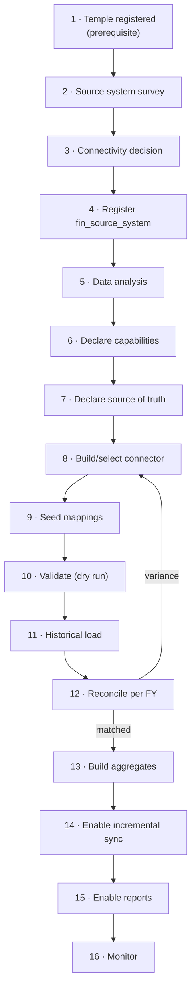
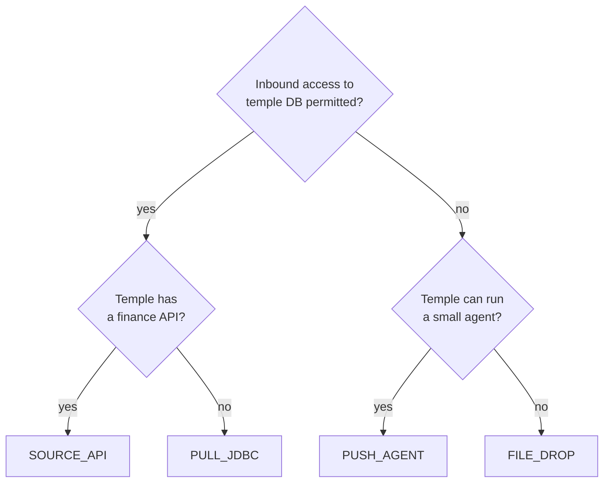

# Temple Finance Onboarding

**Status:** DRAFT — process design only. No temple onboarded.
**Date:** 2026-09-16
**Parent:** [MULTI_TEMPLE_FINANCE_ARCHITECTURE.md](MULTI_TEMPLE_FINANCE_ARCHITECTURE.md)

This document defines how a temple is connected to the finance platform. Kollur is the reference implementation; Temple B (§4) is a deliberately dissimilar second case used to prove the architecture is generic rather than Kollur-shaped.

---

## 1. Onboarding Pipeline



| Step | Nature | Who |
|---:|---|---|
| 1 | Existing registry process | Registry |
| 2 | **Manual survey** | Integration + temple IT |
| 3 | **Manual decision** | Infrastructure + temple |
| 4 | **Configuration** | Platform admin |
| 5 | **Manual analysis** — the intellectually heavy step | Data analyst |
| 6 | **Configuration**, informed by 5 | Analyst + business |
| 7 | **Configuration + review gate** | Analyst + business sign-off |
| 8 | **Code** (or reuse a generic connector) | Engineering |
| 9 | **Configuration**, partly assisted | Analyst |
| 10 | Automated | Platform |
| 11 | Automated | Platform |
| 12 | Automated + **manual gate on variance** | Platform + analyst |
| 13–14 | Automated | Platform |
| 15 | Configuration | Platform admin |
| 16 | Automated | Platform |

**Only step 8 is normally code**, and only when no existing connector fits. Steps 5 and 7 are where the real effort sits — understanding what a source actually means is not automatable, and pretending otherwise is how a platform ends up reporting `DailySevaNewDetails.TotalAmount` and understating revenue by 41 %.

---

## 2. Step Detail

### Step 2 — Source system survey

Record: database technology and version; network topology and whether inbound access is permitted; who owns and supports the system; vendor relationship; schema documentation (usually none); update cadence; data volume; whether the source can tolerate read load.

Kollur answers: SQL Server 2025; TempleCode 43 in `KOLSOHAM_LOCAL`; 167 tables; 22.3 M transaction rows; **zero foreign keys, zero unique constraints, three non-PK indexes**; latest data 2026-07-26.

### Step 3 — Connectivity decision



Kollur: **`PULL_JDBC`** (subject to Q4 — the network path is not yet confirmed).

Across a hundred government temples, expect `PUSH_AGENT` and `FILE_DROP` to be common: a refusal to permit inbound database connections is frequently a policy position rather than a technical one, and no amount of engineering changes it.

### Step 5 — Data analysis

The step that cannot be skipped or automated. For each capability establish: which table is authoritative; which amount column is authoritative **and why the alternatives are not**; the correct date column; the correct status filters; historical coverage and gaps; data quality defects; and duplicate or double-count traps.

Kollur's output is [KOLLUR_FINANCE_DATA_ANALYSIS.md](KOLLUR_FINANCE_DATA_ANALYSIS.md). The findings that would have caused wrong reporting if skipped:

- `DailySevaNewOld` duplicates all six archives — **inclusion doubles all history**.
- `DailySevaNewDetails.TotalAmount` is **41 % short** and inconsistent with its own `Amount × Qty`.
- All Nirantara execution flags are unset; `seva_Prepared = 1` on **17,808 future-dated rows**.
- `HKanikeItems.Qty` is **real weight in grams** — the dashboard's 15 g assumption was unnecessary.
- Invalid dates: 1955, 1969, 2004-in-a-2025-FY-row.

**Deliverable: a written data analysis, reviewed before step 6.** This is a gate, not a formality.

### Step 6 — Declare capabilities

One `fin_temple_capability` row per capability, each with availability, a **user-facing reason**, coverage dates and known gaps. A capability that is `NOT_AVAILABLE` here can never be reported as zero downstream — this row is the mechanism.

### Step 7 — Declare source of truth

One `fin_source_of_truth_decl` row per metric, recording the chosen object and field, the filter predicate, **the rejected alternatives and why**, and a business sign-off.

For Kollur `REVENUE_AMOUNT`: chosen `DailySevaNew.Amount`; rejected `DailySevaNewDetails.TotalAmount` (₹53.78 Cr vs ₹90.62 Cr), `Amount × Qty` (₹56.31 Cr, disagrees with the table's own column), and `DailySevaNewOld` (exact duplicate).

Making this a reviewed artefact rather than a line of code is what stops a future engineer from "fixing" revenue by switching to the detail table because it looked more granular.

### Step 8 — Connector

Implement `TempleFinanceConnector` if no existing one fits. Must: declare only genuinely supported capabilities; aggregate **at the source** to canonical grain; encapsulate every source quirk; implement `sourceTotals()` independently for reconciliation; stream, never materialise.

Estimated effort for a source of Kollur's complexity: **3–5 engineer-days**. A well-structured source with a clean schema: 1–2 days. A generic `JdbcTableConnector` driven by configuration will cover simple sources without new code.

### Step 9 — Mappings

Seed `fin_mapping_rule`: service codes, category mapping, payment modes, metal types, financial-year format. Kollur: 164 services, 4 `sannidhi` buckets → 6 categories (with `HUNDI_DONATION` and `ENTRY_FEE` broken out), 2 metal types.

Unmapped values route to `UNMAPPED` and raise a warning — never a silent default.

### Steps 10–12 — Dry run, historical load, reconciliation

Dry run extracts a single period and reports row counts, rejections and unmapped values without loading. Historical load runs FY by FY with checkpoints. **Each FY must reconcile before the next begins.** Kollur's acceptance totals are in [FINANCE_RECONCILIATION.md](FINANCE_RECONCILIATION.md) §6.

### Steps 13–16 — Aggregates, sync, reports, monitoring

Aggregates rebuilt deterministically and published only on reconciliation success. Incremental sync enabled with a per-temple schedule and watermark. Reports enabled by capability — the dashboard composes itself from `GET …/finance/capabilities`, so **no dashboard change is made**. Monitoring registers the temple for staleness, variance and DLQ alerts.

---

## 3. Kollur — Reference Implementation

| Item | Value |
|---|---|
| Temple | Kollur Sri Mookambika Devi Temple |
| `temples.id` | **300001** |
| `temple_code` | KA-TMP-29D0887C |
| Source system | `KOLSOHAM`, SQL Server, `KOLSOHAM_LOCAL` |
| `source_temple_code` | **43** |
| Connector type | `PULL_JDBC` |
| Connector bean | `kollurFinanceConnector` |
| Watermark | `ModifiedDate` (indexed) |
| Schedule | Nightly, off-peak |
| Coverage | Revenue FY2019-20→; metals FY2015-16→; Nirantara payments FY2017-18→FY2023-24 |

**Capabilities:** `REVENUE`, `SEVA`, `DONATION`, `PRASADAM_SALE`, `CANCELLATION`, `PRECIOUS_METAL_COUNT`, `PRECIOUS_METAL_WEIGHT`, `NIRANTARA_SUBSCRIPTION`, `NIRANTARA_SCHEDULE` = `AVAILABLE`; `NIRANTARA_PAYMENT`, `PAYMENT_MODE` = `PARTIALLY_AVAILABLE`; `PRECIOUS_METAL_VALUE`, `NIRANTARA_EXECUTION`, `EXPENSE`, `EXPENSE_CATEGORY`, `GRANT`, `GRANT_UTILISATION`, `WORKS` = `NOT_AVAILABLE`.

**Resulting dashboard:** 14 reports live, 3 partial with stated bounds, 11 rendering explicit `NOT_AVAILABLE` notices. No zeros standing in for absent data; no assumed constants; no fabricated execution percentage.

---

## 4. Temple B — Genericity Proof

A deliberately dissimilar second temple. If onboarding it requires touching the dashboard, the API, the canonical model or Kollur, the architecture has failed.

**Hypothetical Temple B — Sri Ranganatha Temple, Mandya**

| Attribute | Value |
|---|---|
| `temples.id` | 300042 |
| Database | **PostgreSQL 15** |
| Schema | Modern, normalised, real foreign keys |
| Network | **No inbound access** → `PUSH_AGENT` |
| Amounts | Stored in **paise** (integer) |
| Payment mode | **Real column** — recorded, not inferred |
| Expenses | **Present** — a real accounts-payable module |
| Nirantara | **Does not exist** as a concept |
| Precious metals | Not tracked |
| Coverage | FY2022-23 onward only |

Schema sketch:

```sql
services(id, name, name_kn, category, list_price_paise, active)
payments(id, paid_on TIMESTAMPTZ, service_id FK, amount_paise BIGINT,
         mode VARCHAR, status VARCHAR, receipt_no, counter_id, voided BOOLEAN)
expenses(id, spent_on DATE, head_id FK, vendor_id FK, amount_paise, voucher_no)
expense_heads(id, name, parent_id)
```

### 4.1 Onboarding Temple B

| Step | Temple B |
|---|---|
| 3 | `PUSH_AGENT` — agent runs inside the temple, posts outbound HTTPS |
| 4 | `fin_source_system`: `SRT_MANDYA`, `POSTGRESQL`, `PUSH_AGENT`, `temple_id=300042` |
| 5 | Analysis: `payments.amount_paise` authoritative; `voided=true` excluded; `paid_on` is the date; coverage FY2022-23+; expenses genuinely present |
| 6 | Declares `REVENUE`, `SEVA`, `PAYMENT_MODE`, `CANCELLATION`, `EXPENSE`, `EXPENSE_CATEGORY` = `AVAILABLE`. Does **not** declare Nirantara or precious metals |
| 7 | Source of truth: `payments.amount_paise` where `voided=false AND status='SUCCESS'` |
| 8 | `TempleBFinanceConnector` — PostgreSQL, `GROUP BY paid_on, service_id, mode` |
| 9 | Mappings: service ids; `category` → canonical categories; `mode` values → `CASH`/`CARD`/`UPI`; expense heads → canonical expense categories |
| 11–12 | Historical load FY2022-23 → present; reconcile per FY |
| 15 | Reports enabled by capability |

### 4.2 What changed vs what did not

| Changed | Not changed |
|---|---|
| One connector class | Canonical data model |
| One `fin_source_system` row | Aggregation logic |
| ~6 capability rows | Report services |
| Mapping rows | API contract |
| One schedule entry | **Dashboard — zero changes** |
| | **Kollur config and data — untouched** |

### 4.3 Where the model earns its keep

| Difference | Handled by |
|---|---|
| PostgreSQL vs SQL Server | Connector only; nothing above knows |
| Paise vs rupees | Normalization; canonical is always rupees `DECIMAL(18,2)` |
| Recorded vs inferred payment mode | `payment_mode_confidence` — same widget, honest for both |
| **Temple B has expenses, Kollur does not** | `fin_temple_capability` — B's expense panel renders, Kollur's shows `NOT_AVAILABLE`. **No conditional code** |
| **Kollur has Nirantara, B does not** | Capability absent → `NOT_APPLICABLE`, widget hidden |
| Different coverage (FY2019-20 vs FY2022-23) | `coverage_from` per capability |
| Push vs pull | Connector type; identical staging and downstream |

The expense row is the sharpest test. Two temples, opposite capabilities, one dashboard, no branching — because the dashboard composes itself from the capability matrix rather than from knowledge of either temple.

### 4.4 District reporting with both

A DC requesting Udupi + Mandya revenue gets a `SUM` over `fin_agg_revenue_period` for the temples in scope. **No source database is contacted.** The response carries coverage metadata: revenue available for both; expenditure available for Temple B only, `NOT_AVAILABLE` for Kollur — so a district expenditure figure is explicitly labelled as covering 1 of 2 temples rather than silently understating.

---

## 5. Effort Estimate

| Step | Simple source | Complex source (Kollur-like) |
|---|---|---|
| 2 Survey | 0.5 d | 1 d |
| 3 Connectivity | 0.5 d | 1–5 d (network approvals) |
| 5 **Data analysis** | 2 d | **5–10 d** |
| 6–7 Capability + source of truth | 0.5 d | 1 d |
| 8 Connector | 1–2 d | 3–5 d |
| 9 Mappings | 0.5 d | 1–2 d |
| 10–12 Load + reconcile | 1 d | 2–3 d |
| 13–16 Enable + monitor | 0.5 d | 1 d |
| **Total** | **~7 days** | **~15–25 days** |

Data analysis dominates, and should. Compressing it is how a platform ends up double-counting history or reporting a 41 %-short revenue figure that nobody notices for a year.

---

## 6. Checklist

**Before load:** temple registered · survey complete · connectivity agreed and tested · read-only credentials issued and stored outside the repository · `fin_source_system` registered · **data analysis written and reviewed** · capabilities declared with reasons · **source of truth declared and signed off** · connector implemented and unit-tested · mappings seeded · dry run clean.

**Before enabling reports:** every FY reconciled · aggregates built · sample figures verified against the source by hand · availability notices reviewed for accuracy · freshness thresholds set · monitoring registered.

**After go-live:** first week of nightly syncs monitored · reconciliation stable · unmapped values reviewed · DC users briefed on availability and freshness semantics · **verify no dashboard, API or canonical-model change was required** (the acceptance test of the architecture).
